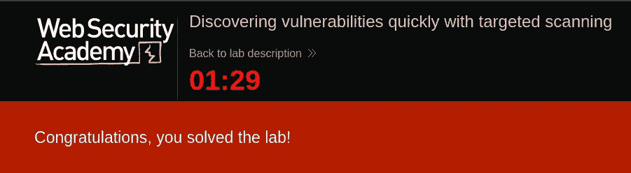
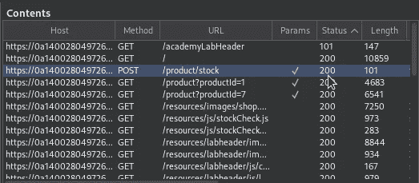
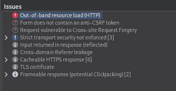
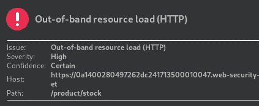
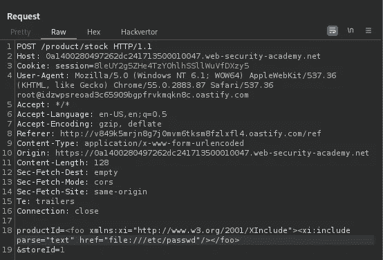
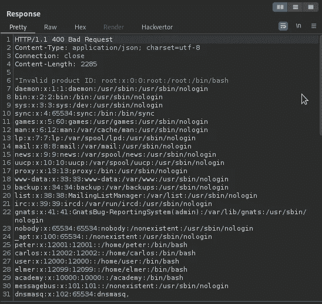

# 通过定向扫描快速发现漏洞— Portswigger

> 原文：<https://infosecwriteups.com/discovering-vulnerabilities-quickly-with-targeted-scanning-portswigger-b8c102f5c3ba?source=collection_archive---------1----------------------->

## 本实验包含一个漏洞，可让您从服务器读取任意文件。要解决该实验，请在 10 分钟内检索/etc/passwd 的内容|方法

[](https://portswigger.net/web-security/essential-skills/using-burp-scanner-during-manual-testing/lab-discovering-vulnerabilities-quickly-with-targeted-scanning) [## 实验室:通过定向扫描快速发现漏洞|网络安全学院

### 练习利用现实目标上的漏洞。记录你从学徒到专家的进步。看哪里…

portswigger.net](https://portswigger.net/web-security/essential-skills/using-burp-scanner-during-manual-testing/lab-discovering-vulnerabilities-quickly-with-targeted-scanning) 

## 让我们开始吧——你必须在 10 分钟内解决实验室的问题

访问实验室，打开代理，关闭 Burpsuite 中的拦截

现在请注意 Proxy 选项卡中 HTTP 历史的内容列表，您可以看到有一个请求`/product/stock`，其中参数`ProductID`是要测试的端点。



右键点击`/product/stock` →进行主动扫描
尝试将参数更改为不同的值


扫描仪在`/product/stock`上发现带外资源负载



可以诱导应用程序检索任意外部 URL 的内容，并在其自己的响应中返回这些内容。

*   将请求发送到中继器
*   在`ProductID`参数中添加以下有效载荷

```
<foo xmlns:xi="http://www.w3.org/2001/XInclude"><xi:include parse="text" href="file:///etc/passwd"/></foo>
```



发送请求，现在您可以查看`/etc/passwd`



请随时通过 LinkedIn[提出问题，并为我买一杯咖啡: )](https://www.linkedin.com/in/karthikeyan-nagaraj)

[](https://buymeacoffee.com/cyberw1ng)

感谢您的阅读！！

狩猎快乐~

```
Author: Karthikeyan Nagaraj ~ Cyberw1ng
```