# 磁盘映像和数据恢复

> 原文：<https://infosecwriteups.com/disk-imaging-and-data-recovery-cd68118e64b4?source=collection_archive---------2----------------------->

## 数字取证调查

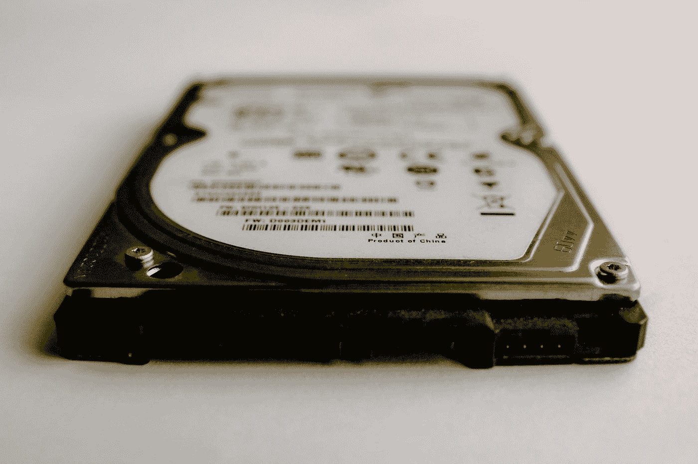

照片由[格伦·凯莉](https://unsplash.com/@glencarrie?utm_source=medium&utm_medium=referral)在 [Unsplash](https://unsplash.com?utm_source=medium&utm_medium=referral) 上拍摄

# Linux 文件系统

在本文中，我们将特别关注从 Linux 中的**硬件设备**恢复数据**。**

在我们开始之前，我们需要了解一些缩写。

**在 Linux 文件系统中，下面的意思是:**

`**/dev**` - **设备，**代表**硬件设备**。这是所有设备文件所在的位置。

`**/dev/sda**` -主硬盘(主)文件系统

`**/dev/sdb**` -辅助硬盘文件系统*等等……*

`**/dev/sda1**` -代表系统中第一个 SCSI 磁盘驱动器的第一个分区。

`**/dev/sda2**` -代表系统中第一个 SCSI 磁盘驱动器的第二个分区*，依此类推……*

`**/dev/sdb1**` -代表您系统中辅助磁盘驱动器的第一个分区*，依此类推……*

***注:*** *以下示例场景摘自 hackthebox“Mirai 未来组合”机器。*

# 方案

对于此磁盘映像和数据恢复，u 盘中的数据被意外删除，需要重新获取。

该设备仍然与其 Linux 主机相连。如果您看到**文件系统** `**/dev/sdb**` 的存在，您就会猜到这一点，它表示当前正在使用辅助硬盘。如果 u 盘被移除，那么`**/dev/sdb**`将从主机上消失。

> 当 u 盘连接到 linux 主机时，设备的物理目录将是`**/dev/sdb**`，因为它是一个辅助硬盘
> 
> **或**
> 
> 它将创建一个分区磁盘，即/dev/sdb1、/dev/sdb2 等，具体取决于连接到该主机的外部设备数量。
> 
> 设备**挂载点** *又名* **逻辑节点**将位于`**/media/<someUSB>**` 或`**/mnt/**` **文件夹。**

## 设备物理和逻辑位置

要检查 USB 的物理和逻辑位置，只需运行`df -h`

`df` -列出磁盘/分区使用统计

`-h` -d 以人类可读的格式显示文件大小。即字节、MB、GB 等。

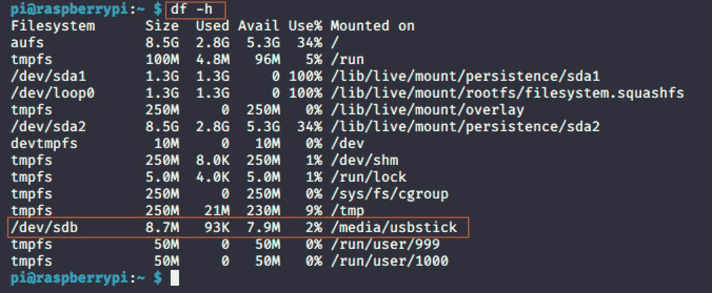

## 装载和卸载

> 假设您想要在其他地方手动创建一个挂载点，您可以通过运行:`sudo mount /dev/sdb /mnt/folderName`来实现

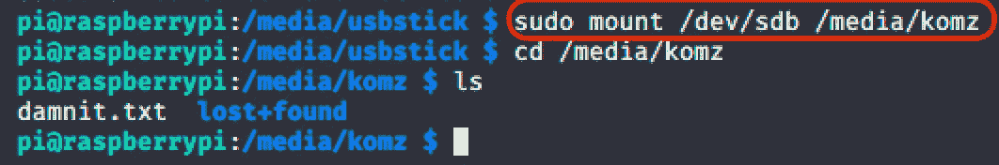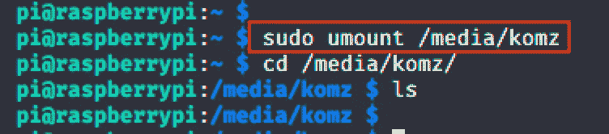

> `umount`命令可用于**卸载**设备文件。

# 数据检索方法

在这个场景中，我们可以看到逻辑路径是在文件夹 **/media/usbstick** 中为这个 USB 自动创建的

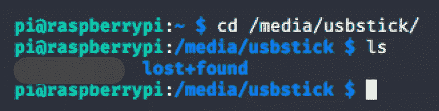

最初，您会希望首先通过基本方法恢复丢失的数据。

## **丢失+找到的文件夹**

顾名思义，这个文件夹可能包含损坏文件的恢复位。但是，在这个场景中，这个文件夹是空的。

## 字符串搜索

在 linux 中运行`strings`命令将显示在`**/dev/sdb**`连接的物理设备中丢失的数据。

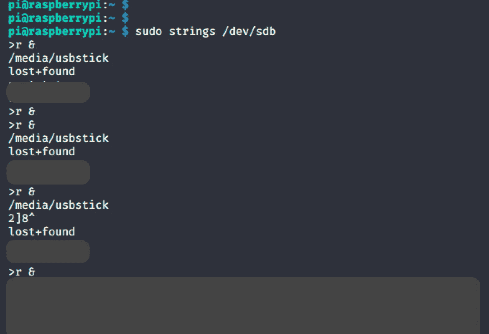

# **************** * *磁盘映像* * * * * * * * * * * * * * * *

要创建丢失内容的精确副本，使用以下命令将创建设备(USBstick)的映像，并将其保存到 Pi 的主目录。

`sudo dcfldd if=/dev/sdb of=/home/pi/myusb.dd​`

*以下摘录摘自* `*man dcfldd*`

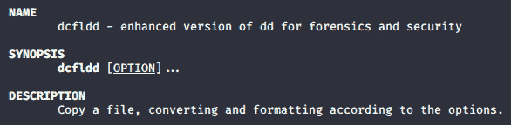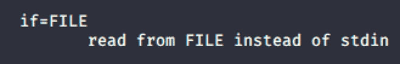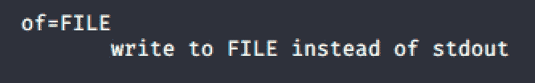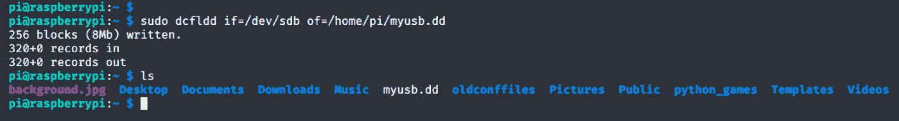

## 文件传输

使用下面的命令， **usb.dd** 文件可以安全地复制到我的本地机器上。

`sudo scp pi@10.10.10.48:/home/pi/usb.dd .`

`scp` - OpenSSH 安全文件复制

## 充当故障检修员

出于某种原因，我无法将 **usb.dd** 文件传输到我的本地机器上。

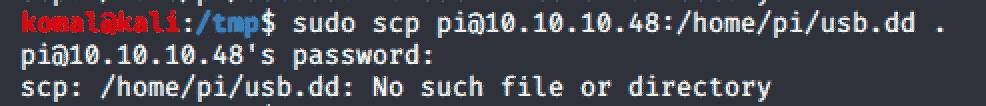

所以我将 **usb.dd** 重命名为 **usb.txt** ，然后使用`scp`命令将文件安全地复制到我本地机器的工作目录中。

最后，将文件重新命名为 **usb.dd**

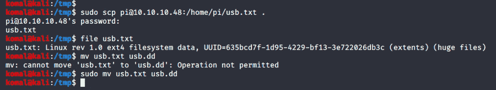

# ****************数据恢复**************

命令`testdisk`用于扫描和修复磁盘分区。使用此命令，您可以从目录中查看已删除的 USB 文件。

*注意:红色的* ***root.txt*** *是被删除的文件。文件大小为 0，但之前对其运行 strings 命令时，确实显示了此文件内容。*

除了对图像运行`strings`之外，您还可以使用像 nano、vim 这样的文本编辑器来显示数据。

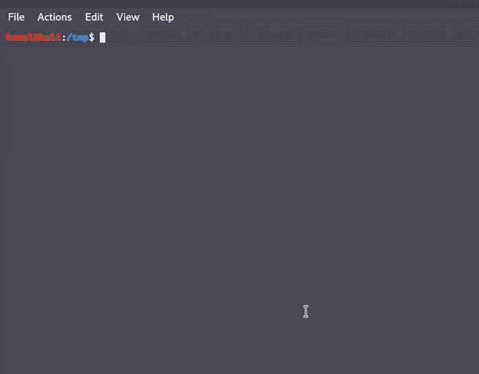

# 参考

*   [https://en.wikipedia.org/wiki/Disk_image](https://en.wikipedia.org/wiki/Disk_image)
*   [https://www.whatisfileextension.com/dd/](https://www.whatisfileextension.com/dd/)
*   [https://help . Ubuntu . com/lts/installation-guide/arm HF/APCs 04 . html](https://help.ubuntu.com/lts/installation-guide/armhf/apcs04.html)
*   [https://www . how togeek . com/184659/beginner-geek-hard-disk-partitions-explained/](https://www.howtogeek.com/184659/beginner-geek-hard-disk-partitions-explained/)
*   [https://linux.die.net/man/1/scp](https://linux.die.net/man/1/scp)