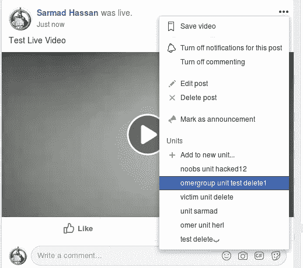
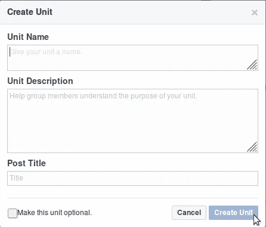
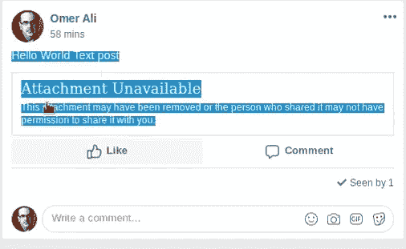
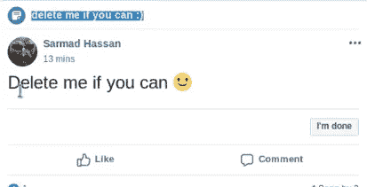
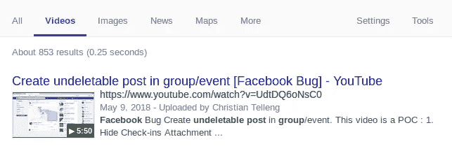
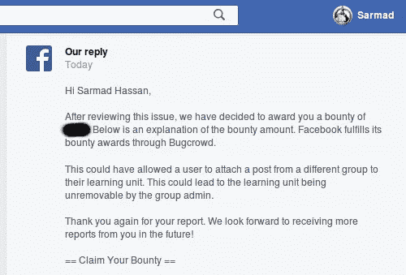

# 脸书组中扭曲和不可删除的帖子

> 原文：<https://infosecwriteups.com/distorted-and-undeletable-posts-in-facebook-group-9424e15f5551?source=collection_archive---------0----------------------->

Sup 伙计们，今天我想和大家分享一个有趣的 bug，是我通过他们的 [**BugBounty 程序**](https://www.facebook.com/whitehat/dashboard) 在 facebook 群中发现的，那就开始吧:)

在**6 月 18 日**的一天，我试图在 **facebook 组**中测试**直播视频**选项，因为我以前从未测试过，所以我在我的**测试组**(攻击者组)中创建了直播视频，我花了一些时间玩这个选项，寻找一些可能会引导我找到有效 bug 的东西，但不幸的是，我在里面什么也没找到:(

所以我想通过点击**三个点**来删除**我的现场视频**帖子，我看到了这个:

单位选项将出现在发布选项中，如果您在组中启用了单位

如上图所示，有一个名为**单位的选项。**

**什么是单元:**单元功能，允许您利用小组作为在线课程内容的平台，或者简单地按主题组织您的帖子，有关更多详细信息，请查看此 [**链接**](https://www.facebook.com/marismith/posts/-newsflash-another-new-facebook-feature-you-can-add-units-to-facebook-groups-cur/10154506210385009/) 。

**注意:只有组管理员可以在单元中创建、编辑、删除或添加帖子。**

我对自己说，我记得我以前已经测试过那个选项(单位选项)，但我没有发现任何有趣的东西，但当我再次看到它时，我对自己说，让我们再试一次，因为我从未在这个地方测试过，所以我单击**“添加到新单位”**，我看到了这个:

当你创建一个新的单元时，这个窗口会弹出，填写详细信息并创建一个新的

我随机填写了详细信息，并用 **Burpsuite** 拦截了请求，请求如下:

> POST/groups/learning/create _ with _ POST/？**组标识=** 【我的测试组标识】& **帖子标识=** 【我的帖子标识】& dpr=1 HTTP/1.1
> 
> jazoest =[number]& FB _ dtsg =[anti _ csrft]&**单元名称=** bla & **单元描述=** bla & **帖子标题=** bla

当我看到上面的请求时，两件事引起了我的注意， **group_id=** 和 **post_id=**

**我问了自己两个问题:**

1-如果我将我的 **group_id** 值更改为另一个组 id(受害者组)会发生什么，是否可以创建新的单位并将我的帖子(视频直播帖子)添加到另一个组(受害者组)中。

2-如果我将我的 **post_id** 值更改为另一个组(受害者组)的其他帖子 id 会发生什么，是否可以将其他组(受害者组)的帖子添加到我的测试组(攻击者组)中我的单位。

好吧让我们来看看:)，所以我把 **group_id** 的值改成了另一个组(受害者组)，但是没用:(

# 扭曲帖子:

好的。让我们尝试用另一个组(Victim_group)的另一个帖子 id 来更改 **post_id** 值，响应如下:

> HTTP/1.1 200 OK
> 
> for(；；);{"__ar":1，" payload":null，" jsmods ":{ " require ":[[" server redirect "，" redirectPageTo "，[]，[" \/groups \/[**attack _ group _ id**]\/learning _ content \/？filter = filter number&post =**【victim _ post _ id】**，false，false]]}，" js":["IO8eo "，" EizOb"]，" bootloadable":{}，" resource _ map ":{ " IO8eo ":{ " type ":" js "，" src ":" https:\/\/static . xx . fbcdn . net \/rsrc . PHP \/v3 ioay 4 \/yo \/l \/en _ US \/rcr

当我看到上面的回应时，我直接切换到受害者小组帐户，我检查了帖子，我看到了以下内容:

当攻击者从受害者组添加“仅文本发布”到他的单位时，附件不可用出现

正如你在上面看到的，我能够扭曲**受害者组**中的帖子**(仅文本帖子)**，并使其看起来像上面的丑陋形式。

# 不可删除的帖子:

我试图再次重现该 bug，并将其应用于**另一个受害者组(noobs 组)**，只是为了确保该 bug 在所有类型的组中都有效，因此我从我的组**获得请求作为攻击** r，并将 **post_id** 值替换为受害者组**【noobs 组】**的 **post_id，知道(该帖子是我的，但在受害者组中，我不是管理员)， 回复给我 200 o.k，一切都很顺利，但是当我查看我在**受害者组(noobs 组)**的帖子时，我看到了这个:**

删除我，如果你能的话，这是攻击单位的标题，它出现在受害者组的帖子上面

正如你在上面看到的，**我看到我的单位名称**出现在我在受害者组的帖子中，嗯，这很奇怪，当我在第一个受害者组测试这个 bug 时，我看到了**、**，但当我在另一个受害者组 **(noobs 组)**、**再次测试时，我能够将我单位的名称放在任何帖子的上方，并使帖子不能被其所有者和组管理员删除**，这真的很奇怪，对吧！！！！

Wtf 是怎么回事！！玩了一点，想通了，下面是 bug 影响的结论:

# **这个 bug 有两个影响:**

1-如果帖子的所有者不是攻击者组中的成员，攻击者只能对受害者组中任何成员(管理员、版主、普通用户)的文本帖子**进行篡改。**

2-攻击者可以发布任何帖子(照片、视频、事件..等等)受害者群组**中的任何成员(管理员、版主、普通用户)**不可删除**也可以将他的单位标题放在 vicim 帖子上面，**只需邀请他的群组(攻击者群组)中帖子的所有者即可。

# **巧合**

在我把窃听器提交给脸书证券交易委员会后。团队，我记得我以前在 facebook 上读到过**无法删除的帖子**，所以我在谷歌上搜索，我看到了这个:

其他 bug 猎人已经在 2018 年 5 月 9 日在我之前发现了这个 bug

当我看到那个视频**时，它是同一个 bug，但是来自不同的端点**，同时我对 wtf 感到震惊！！！我说，如果他在 youtube 上披露了漏洞，这意味着漏洞已被修复，但为了确保我们找到这位研究人员并与他联系，所以我找到了他的 facebook 账户**，我与他谈论了漏洞，我告诉他漏洞仍在工作，他告诉我漏洞已被修复**，facebook 已经为此奖励了他**，**我还通知了脸书证券交易委员会。团队讲述了整个故事。****

**我只想感谢[**Richard Telleng**](https://www.facebook.com/richard.telleng)**(在我之前发现漏洞的研究员)他的诚实和礼貌，你真是一个伟大的家伙，非常感谢你的巨大支持，我真的很感谢我的兄弟。****

******时间线:**
六月。2018 年 18 月—初步报告
6 月。2018 年 7 月 20 日——报道审判
。2018 年 31 日— Bug 修复
7 月。2018 年 8 月 31 日—修复确认
2018 年 8 月 2 日—奖励****

********

****我要感谢**脸书安全团队**的赏金。****

******PoC 视频:******

******武道:******

****1-试着从不同的方面检查你正在测试的选项，有可能你会从中发现一些有趣的东西。****

****2-如果你面临着和我一样的情况，试着联系另一个研究员，问他这个 bug 是否已经修复，并且对他说实话。****

****3-对安全团队也要诚实，只是为了确保每件事都很清楚。****

****谢谢你****

****[萨马德·哈桑](https://www.facebook.com/JubaBaghdad.iq) ( [朱巴巴格达](https://twitter.com/JubaBaghdad))****