# 深入汇编程序

> 原文：<https://infosecwriteups.com/dive-into-assembler-ad96321df6fe?source=collection_archive---------5----------------------->

## 您将学习算术运算，并从 sckratch 创建一个游戏

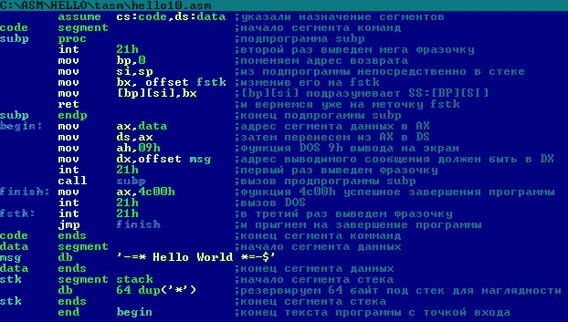

vk.com

读完这篇文章，你将学会如何使用算术和逻辑指令，以及移位指令。在这个过程中，您将学习如何创建子例程。最后你会写一个简单的玩具“猜数字”。

# 编写助手例程

我们现在要写的所有程序都有一个重复的动作:在屏幕上显示结果。为了不每次都重新编写这个动作的代码，让我们为它写一个子程序。
什么是子程序？这是一段完成一些小任务的代码。子程序通常通过调用指令来访问。所有子程序都以 ret(返回)指令结束。现在，这就是你需要知道的关于子程序的全部内容。当然，从好的方面来说，当你使用子程序时，你需要了解更多的东西，特别是，什么是堆栈指针，以及当访问子程序时它是如何变化的。但是现在，作为当前课程的一部分，让我们同意，如果你需要在屏幕上画一个字母，只需将这个指令插入到你的代码中。

*调用 display_letter* 子程序实现如下。保存到 *library.asm* 文件。

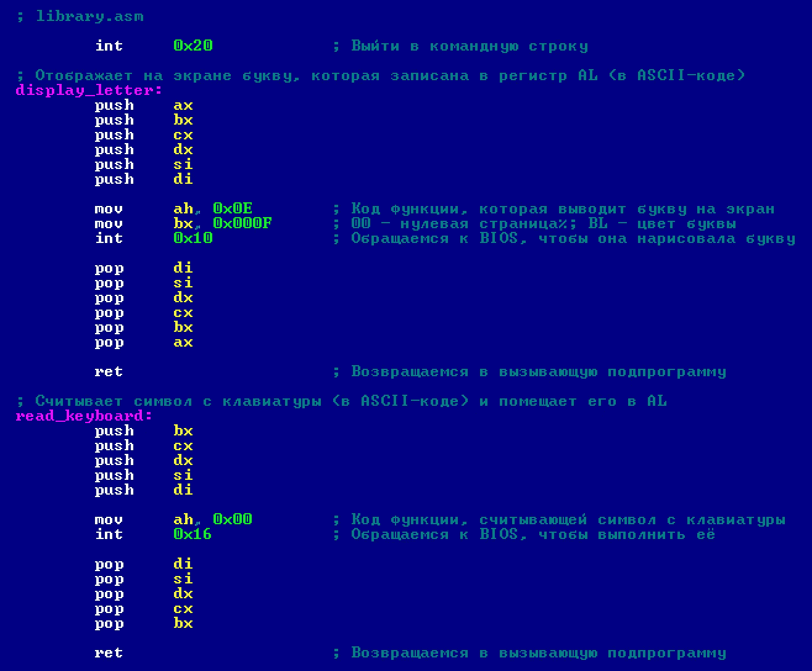

重要！

在我们编写的所有程序的末尾，您将需要粘贴 library.asm 中的代码。它指向哪里？所有的程序都会以命令行的退出来结束，它们会有子程序把一个字符打印到屏幕上(从 AL 寄存器)和从键盘上读取一个字符(结果放在 AL 寄存器中)。

# Учимся складывать и вычитать

让我们使用 *AL* 寄存器和常量作为加法指令的参数。

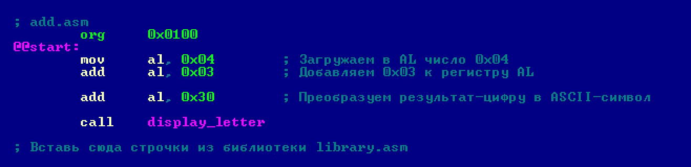

这个程序显示数字 7。因为 4 + 3 = 7。

让我们将 AL 寄存器和常数作为减法指令的参数。

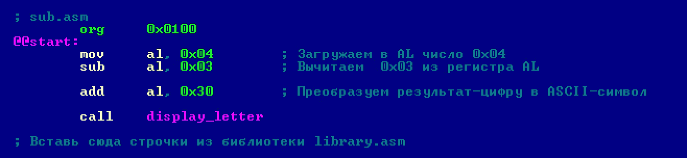

这个程序显示数字 1。因为 4–3 = 1。

# 掌握乘法

乘法指令可以处理字节(8 位数)和字(16 位数)。被乘的始终是 **AL / AX** 寄存器。该因子可以是一个寄存器(any)，也可以是内存中的一个变量。
只要记住，如果你的乘数在 **AL** 中，那么乘数必须是 8 位，如果在 **AX** 中，那么乘数必须是 16 位。乘法的结果要么在 **AX** 中结束(当我们将两个 8 位数字相乘时)，要么在 DX: AX 中结束(当我们将两个 16 位数字相乘时)。
在下面的例子中，我们使用了两个 8 位寄存器 **AL** (乘法器)和 **CL** (乘法器)。结果进入 16 位 **AX** 寄存器。

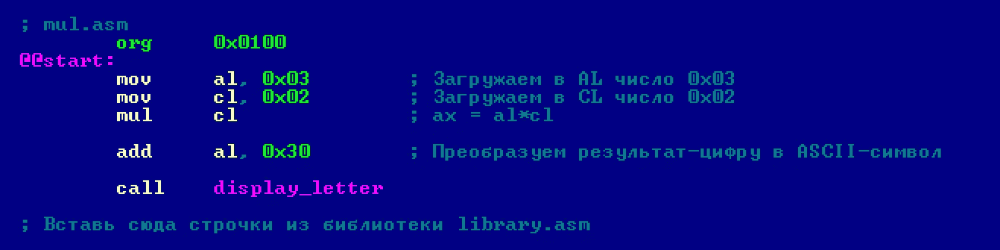

这个程序显示数字 6。因为 3 × 2 = 6。要将两个 16 位数字相乘，将乘数放在 AX，将乘数放在 CX。然后，将 mul cl 改为 mul cx。
注意，mul 语句对无符号整数进行操作。如果需要将带符号的数相乘，请使用 imul。

# 了解分工

除法指令可以处理字(16 位数)和双字(32 位数)。被除数总是 AX 寄存器或 DX: AX。除数可以是寄存器(any)，也可以是内存中的变量。

只要记住，如果你的被除数在 AX 中，那么除数必须是 8 位，如果在 DX: AX 中，它必须是 16 位。

当你把一个 16 位的数除以一个 8 位的数时，结果归 AL，余数归 AH。如果你把一个 32 位的数除以一个 16 位的数，结果归 AX，其余的归 DX。

在下面的例子中，我们使用 16 位和 8 位寄存器。结果归 AL，其余归 AH。

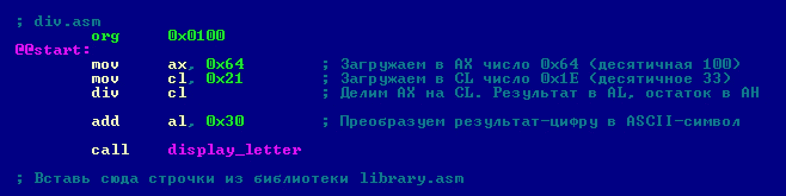

这个程序显示数字 3。因为 100/33 = 3。如果您想知道余数是多少，请在编写 div 指令的那一行之后添加这一行。

小心！除法指令会破坏你的程序。如果除以零，那么将会出现系统错误，程序将会飞到命令行。
注意 div 语句对无符号整数进行操作。如果您需要拆分有符号的数字，请使用 idiv。

# 逻辑和算术移位、循环移位

移位指令(高级语言中的操作符<< and >)是处理器最原始的指令。它们比大多数其他指令都快。因此，如果计算的某些部分可以在它们上面实现——特别是如果它允许您避免乘法和除法的指令——请随意使用它们。

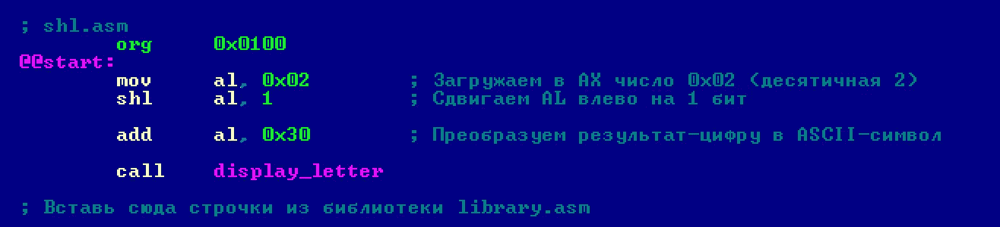

现在我将解释 shift 指令是如何工作的。假设 AL 寄存器的值是一个二进制数。shl 指令只是将二进制 1 的每一位向左移位，并向右加一个 0。并且从左边被抢占的位落入 CF(进位标志；携带旗帜)。

shr 指令以类似的方式工作，只是它将寄存器位向右移动，而不是向左移动。
还有 sar 指令，它的工作方式几乎和 shr 一样，但不像 shr，它不是逻辑移位，而是算术移位。这是什么意思？当 sar 将二进制数向右移动一位时，它不会添加零，而是复制移动前的位。有时可以为零，但不总是如此。

如此巧妙的替代通常的右移有什么用？sar 允许你移动带符号的数字。Shr 也可以移动它们，但是在寄存器中，这将导致垃圾。

您可能已经知道，所有移位指令的第二个参数表示寄存器位应该移位的位数。注意:如果你用数字表示这个金额，那么它只能是一个。如果您想一次移位若干位，请使用 CL 寄存器。

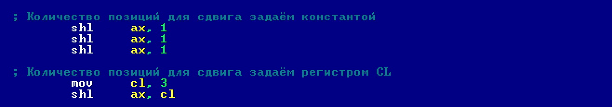

还有循环移位的指令:ror、rcr、rol 和 rcl。他们的特点是什么？从一端滑出的比特出现在另一端。循环向右移位由 ror 指令执行，循环向左移位由 rol 指令执行。rcr / rcl 的功能与 ror / rol 相同，只是它们使用了一个额外的位，参见 CF。增加的位取自 CF，而扩展的位则进入 CF。

# 信息

**Shl** (逻辑左移)有一个同义词——**sal**。这两条指令完全相同——在某种程度上，它们是用相同的机器代码生成的。

# 三条逻辑指令加一条无用指令

8088 上有三种逻辑指令:与、或和异或。

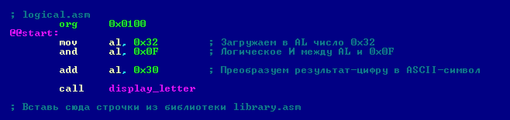

and 语句相当于 C 和 JavaScript 中的&运算符；或用于|运算符，xor 用于^运算符。
还有一个 not 指令，它只有一个参数。它反转指定寄存器的所有位。(not al 相当于 C 和 JavaScript 中的~运算符)。

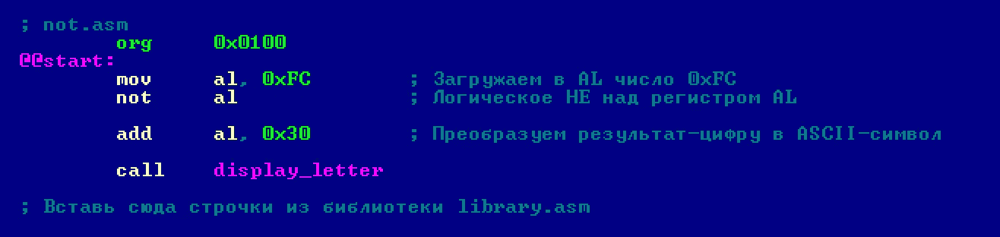

此外，8088 有一个 neg 指令，它与 not 非常相似，但它不是一个逻辑反转，而是一个算术反转:它改变一个给定数字的符号。

在汇编程序中也有一条指令什么也不做。您可以将它插入到程序中的任何地方，它不会以任何方式影响执行流程。当然，除了程序运行的稍微慢一点。这是 nop 指令。你可以尝试一下。将它插入 org 指令后的任意位置，您将看到您的程序如何恰好增长一个字节(这是 No OPeration 指令的大小)，但它将工作不变。

# 增量和减量指令介绍

递增和递减指令允许您将寄存器值或内存中的变量值递增或递减 1。这些指令适用于字节(8 位)和字(16 位)。

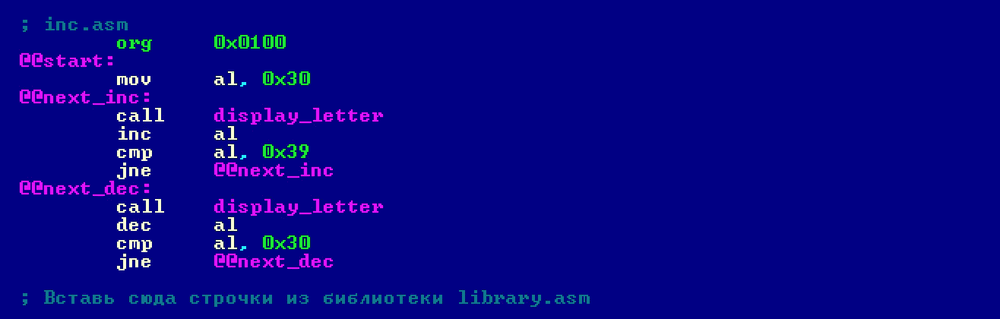

我们到了:
1。将数字零的 ASCII 码装入 AL，即 0x30
2。在屏幕上显示号码；
3。给 AL 加一；
4。重复步骤 2–3，直到 AL 为 0x39
5。显示当前符号，所有操作都和之前一样，但顺序相反；
6。从 AL 中减去 1；
7。我们展示发生了什么；
8。重复直到 AL 为 0x30。

结果，程序在屏幕上显示下面一行: **012345678987654321。**

这个程序为你提供了另一个新的指令——CMP(比较)。它的工作方式与减法指令相同，但有一个显著的区别:cmp 不改变寄存器值。它只改变标志寄存器位。

通常，cmp 与诸如 je(如果相等则跳转)、jne(如果不相等则跳转)等条件跳转指令结合使用。

好了，现在你已经知道了足够的汇编指令来编写一个简单的猜数字游戏。

它将如何工作？游戏开始后，电脑猜测一个数字，屏幕上显示一个问号，等待玩家的回答。如果玩家输入的数字与电脑猜测的数字不同，游戏会再次显示一个问号。当玩家最终猜出数字时，程序会将其打印在屏幕上，并添加一个表情符号(冒号和右括号)。下面是实现所描述思想的汇编代码。

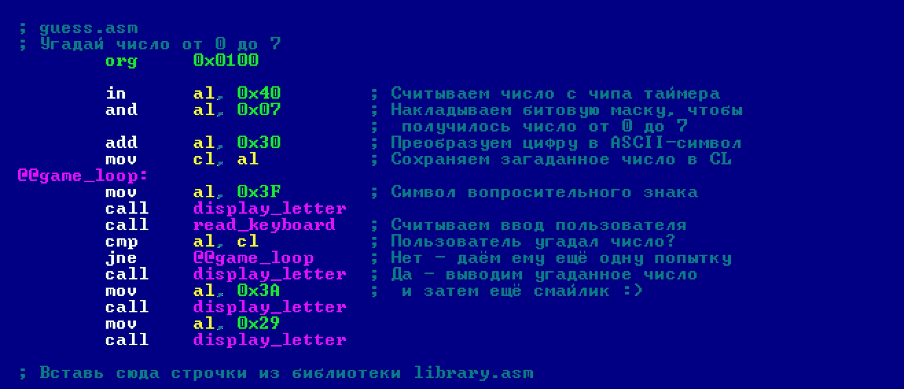

电脑是怎么猜出数字的？它从端口 0x40 读取一个伪随机数。这个端口连接到一个定时器芯片。计时器不间断地倒计时处理器周期。当从其端口读取一个值时，每次都会获得一个范围从 0x00 到 0xFF 的伪随机数。这就是全部的秘密。现在是一个小小的组织时刻。直到现在，当你和我需要一个字母时，我们用 ASCII 十六进制代码设置它。但是 NASM 编译器有一个很好的特性:你可以输入任何字符，用撇号括起来，NASM 会把它转换成 ASCII 码。
让我们用这个 NASM 特性重写我们的游戏。

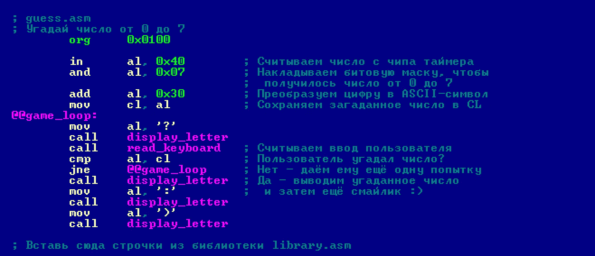

同意，这使得源代码可读性更好。Выводы

恭喜你，你已经向学习汇编语言迈出了一小步！现在你可以在上面制作小玩具。你我做的那个只要 70 字节。

# 说明和运算符

如果你懂 C、Java 或 JavaScript，那么这里有一个小表格，是你今天掌握的汇编指令和这些语言的操作符之间的对应关系。

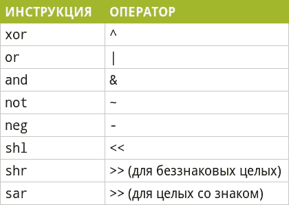