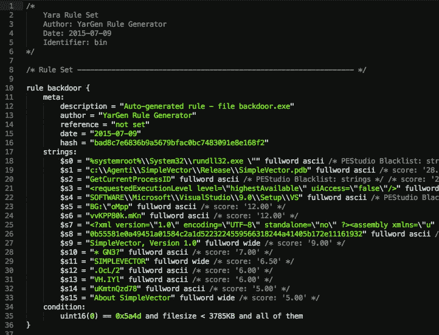
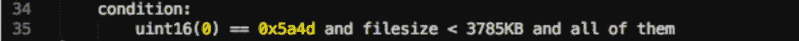

# 潜入亚尔根

> 原文：<https://infosecwriteups.com/diving-into-yargen-9e8c00e18b65?source=collection_archive---------0----------------------->

## 使用雅根和 YARA 自动检测恶意软件


在 [Unsplash](https://unsplash.com?utm_source=medium&utm_medium=referral) 上由 [Taskin Ashiq](https://unsplash.com/@taskinhoo?utm_source=medium&utm_medium=referral) 拍摄的照片

上次，我们讨论了如何使用 YARA 检测恶意软件，以及如何在线查找 YARA 规则:

[](https://medium.com/bugbountywriteup/intro-to-malware-detection-using-yara-eacab8373cf4) [## 使用 YARA 检测恶意软件简介

### 开始使用 YARA 检测恶意软件所需的一切

medium.com](https://medium.com/bugbountywriteup/intro-to-malware-detection-using-yara-eacab8373cf4) 

但是如果你找不到网上发布的符合你需求的 YARA 规则，你就需要自己写规则了！

# 雅根简介

YarGen 是一个生成 YARA 规则的工具。它能够生成给定恶意软件文件的 YARA 规则。它通过识别在恶意软件文件中发现的字符串来生成 YARA 规则，同时也删除在非恶意文件中出现的已知字符串。YarGen 包括一个字符串和操作码的大型数据库，已知这些字符串和操作码也会出现在非恶意文件中。

您可以在 Github 上找到 YarGen:

[](https://github.com/Neo23x0/yarGen) [## Neo23x0/yarGen

### __ ______ ______/ ____/__ ____ / / / / __ `/ ___/ / __/ _ \/ __ \ / /_/ / /_/ / / / /_/ / __/ / / / \__, /\__,_/_/…

github.com](https://github.com/Neo23x0/yarGen) 

## 安装 YarGen

首先，在 Github 页面的[发布区](https://github.com/Neo23x0/yarGen/releases)下载 YarGen 的最新版本，并解压文件。源代码以 zip 文件或 tarball 的形式提供。

接下来，确保您已经安装了所有的依赖项。您可以运行以下命令:

```
sudo pip install pefile cd
sudo pip install scandir lxml naiveBayesClassifier
```

最后，将 **cd** 放入 YarGen 目录，并运行以下命令下载内置数据库。数据库被保存到**中。/dbs** 子目录。

```
python yarGen.py —-update
```

## 运行 YarGen

YarGen 有许多规则生成选项。要查看命令行参数，您可以运行:

```
python yarGen.py —-help
```

要使用包含的数据库来生成规则，只需运行以下命令:

```
python yarGen.py -m PATH_TO_MALWARE_DIRECTORY
```

此命令将扫描 PATH_TO_MALWARE_DIRECTORY 下的恶意软件文件并为其创建规则。一个名为 **yargen_rules.yar** 的文件将被创建在当前目录中，包含生成的规则。

## 简单规则与超级规则

YarGen 规则可以是简单规则，也可以是超级规则。

如果使用多个样本文件，YarGen 将尝试识别样本之间的相似性，并将识别出的字符串组合成一个“超级规则”。

超级规则可以通过规则的**元**部分中的一行来标识:

```
super_rule = 1
```

将多个规则组合成一个超级规则的过程不会删除为每个文件生成的简单规则。这意味着简单规则和超级规则之间会有规则字符串的重叠。要删除超级规则包含的简单规则，可以在 YarGen 命令中使用 **nosimple** 标志:

```
python yarGen.py -m PATH_TO_MALWARE_DIRECTORY --nosimple
```

您还可以通过使用标志 **nosuper** 来禁止超级规则的创建:

```
python yarGen.py -m PATH_TO_MALWARE_DIRECTORY --nosuper
```

## 规则创建标志

除了 **nosimple** 和 **nosuper** 之外，还有很多其他的标志可以用来定制 YarGen 的行为！具体来说，让我们看看将影响 YarGen 如何创建和输出规则的标志。

以下是来自 YarGen 帮助页面的所有内容:

```
Rule Creation:
  -m M                  Path to scan for malware
  -y min-size           Minimum string length to consider (default=8)
  -z min-score          Minimum score to consider (default=0)
  -x high-scoring       Score required to set string as 'highly specific
                        string' (default: 30)
  -w superrule-overlap  Minimum number of strings that overlap to create a
                        super rule (default: 5)
  -s max-size           Maximum length to consider (default=128)
  -rc maxstrings        Maximum number of strings per rule (default=20,
                        intelligent filtering will be applied)
  --excludegood         Force the exclude all goodware stringsRule Output:
  -o output_rule_file   Output rule file
  -e output_dir_strings
                        Output directory for string exports
  -a author             Author Name
  -r ref                Reference (can be string or text file)
  -l lic                License
  -p prefix             Prefix for the rule description
  -b identifier         Text file from which the identifier is read (default:
                        last folder name in the full path, e.g. "myRAT" if -m
                        points to /mnt/mal/myRAT)
  --score               Show the string scores as comments in the rules
  --strings             Show the string scores as comments in the rules
  --nosimple            Skip simple rule creation for files included in super
                        rules
  --nomagic             Don't include the magic header condition statement
  --nofilesize          Don't include the filesize condition statement
  -fm FM                Multiplier for the maximum 'filesize' condition value
                        (default: 3)
  --globalrule          Create global rules (improved rule set speed)
  --nosuper             Don't try to create super rules that match against
                        various files
```

具体说一下 **— excludegood，— score，-rc 和-z** 。

YarGen 根据每个字符串指示恶意软件文件的能力，给每个字符串一个“**分**”。字符串的得分越高，包含该字符串的文件是恶意软件文件的可能性就越大。

YarGen 也没有完全从规则中删除 goodware 字符串，而是以非常低的分数包含它们。 **— excludegood** 标志强制 YarGen 排除在 YarGen 数据库中找到的所有 goodware 字符串。

默认情况下，YarGen 不会在结果规则文件中包含每个字符串的这些“分数”。要查看每个字符串是如何评分的，可以使用 **— score** 标志将分数作为注释输出到规则文件中。

**-rc** (maxstrings)标志指定每个规则中包含的最大字符串数。默认数量是 20。这意味着每个规则将包括多达 20 个最高得分的字符串。

而 **-z** (min-score)标志确定一个字符串为了被包括在规则中所需要的最小分数。

# 解码输出:yargen_rules.yar

现在我们已经使用 YarGen 生成了一些 YARA 规则，让我们深入这些规则并学习如何阅读它们！

通过 YarGen 生成的每个 YARA 规则由三部分组成:**元、字符串和条件**。



图片取自 https://github.com/Neo23x0/yarGen 的[YarGen 文档。](https://github.com/Neo23x0/yarGen)

## 元部分

规则的“元”部分包含规则的描述、作者、引用、日期和散列。您可以通过**-一个**标志来指定规则的作者:

```
python yarGen.py -m PATH_TO_MALWARE_DIRECTORY -a "Vickie Li"
```

您可以通过 **-r** 标志指定规则的引用文件或网页:

```
python yarGen.py -m PATH_TO_MALWARE_DIRECTORY -r "[https://github.com/Neo23x0/yarGen](https://github.com/Neo23x0/yarGen)"
```

## 弦乐部分

规则的“字符串”部分指定了用于识别特定恶意软件的字符串。YarGen 根据这些规则成为恶意软件指标的可能性对它们进行分类。这些字符串分为三类，分别用 **$s、$x 和$z** 标记。

以 **$s** 开头的字符串(“高度特定字符串”)是非常特定的字符串，不会出现在合法软件中。这些字符串可能包括恶意服务器地址、黑客工具和恶意软件的名称、黑客工具输出以及常见字符串中的输入错误。例如，有时恶意软件文件会包含拼写错误的单词，如“Micorsoft”或“Monnitor ”,当它试图伪装成合法软件时。

以 **$x** 开头的字符串(“特定字符串”)很可能是恶意软件文件的指示器，但也可能出现在合法文件中。

最后，以 **$z** 开头的字符串很可能是普通的，但目前不包括在 goodware 字符串数据库中。

## 条件部分

YARA 规则中的条件是指定该规则的附加条件的布尔表达式。



YarGen 为条件部分使用了一个神奇的头、文件大小和字符串的组合。例如，上述规则中的条件指定文件还需要满足以下条件才能被归类为“后门”:

*   拥有 0x5a4d 的魔头，
*   该文件小于 3785 kb，
*   并且“字符串”部分中指定的所有字符串都必须存在。

要了解 YARA 规则中可能出现的更多类型的条件，请阅读 YARA 文档[这里](https://yara.readthedocs.io/en/v3.4.0/writingrules.html#conditions)。

# 祝你好运！

您也可以手动编写 YARA 规则，但是这样做的话，您可能会编写太具体或不够具体的规则。YarGen 是一种快速生成既灵活又全面的 YARA 规则的方法。

感谢阅读。我错过了什么吗？请随时在推特上告诉我:[https://twitter.com/vickieli7](https://twitter.com/vickieli7)。

[](https://twitter.com/vickieli7) [## 李薇薇

### Vickie Li 的最新推文(@ vickieli7)。书呆子的专业调查员。黑客和安全。创造上帝…

twitter.com](https://twitter.com/vickieli7) 

*关注* [*Infosec 报道*](https://medium.com/bugbountywriteup) *获取更多此类精彩报道。*

[](https://medium.com/bugbountywriteup) [## 信息安全报道

### 收集了世界上最好的黑客的文章，主题从 bug 奖金和 CTF 到 vulnhub…

medium.com](https://medium.com/bugbountywriteup)