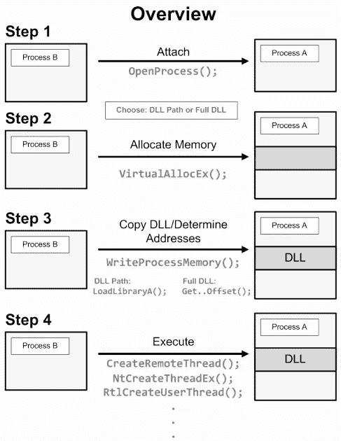
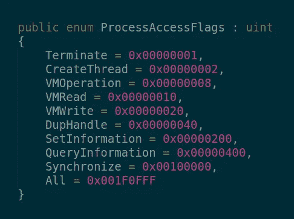
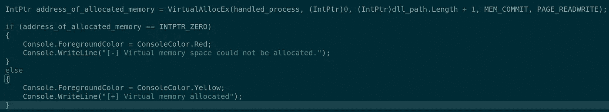
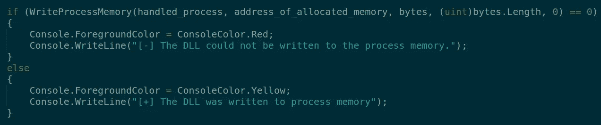
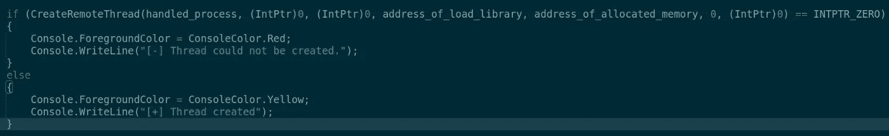

# DLL 注入和 DLL 注入器

> 原文：<https://infosecwriteups.com/dll-injection-dllinjector-d1b30c6760eb?source=collection_archive---------0----------------------->

# 什么是 DLL 注入？

**DLL 注入**是一种通过强制加载动态链接库，在另一个进程的地址空间内执行代码的技术。

**DLL 注入**经常被外部程序用来影响另一个程序的行为，其方式是它的作者没有预料到或打算的。比如注入的代码可以绑定系统函数调用，或者读取密文盒的内容，这些都是正常情况下做不到的。用于将任意代码注入任意进程的程序被称为 **DLL 注入器**。

# DLL 注入是如何工作的？

*   要注入进程的 DLL 文件放在目标系统上。
*   在目标进程的内存上保留空间，以指定 DLL 文件的路径。
*   将 DLL 文件所在的目录路径复制到进程内存中，并确定适当的内存地址。
*   DLL 文件运行并开始通过注入的进程执行其进程。

注射 0x00 —概述

# **将一个 DLL** 注入一个进程由以下步骤组成:

为了执行 DLL 注入，可以访问名为 [DLLInjector](https://github.com/raminkarimkhani1996/DLLInjector) 的工具，下面给出了 DLL 注入过程的技术细节。 ***(* 用 C#编程语言开发，使用 Windows Kernel32 库调用该工具中的函数。 *)*** :

OpenProcess()函数用于处理要用 DLL 注入的进程。通过该函数，确定要用 DLL 注入的进程，并通过该函数用必要的特权处理该进程，以便执行注入操作。图 1 包含进程访问标志。这些标志决定了应该用什么特权来处理一个进程。用 OpenProcess 函数给一个进程注入一个 DLL，我们选择；必须使用 CreateThread、QueryInformation、VMOperation、VMWrite 和 VMRead 标志。DLLInjector 工具中的 OpenProcess 函数被设置为处理具有所有特权的进程。

LoadLibraryA 函数用于将 DLL 文件加载到进程内存中。可以从 kernel32.dll 调用 LoadLibraryA。GetProcAddress()函数用于此目的。这个函数用于从指定的库中获取函数或变量的地址。

0x01 —进程访问授权

函数的作用是:从目标进程的虚拟内存中分配空间。使用该函数的参数；指定目标进程、要分配的内存区域的起始地址、内存区域长度、内存分配类型以及要分配的页面的内存权限。

0x02 —打开进程

0x 03—GetProcAddress-loadlibrary a

WriteProcessMemory()函数用于写入 DLL 文件的路径，该文件将被注入到所考虑进程的已分配内存区域中。

0x04 — WriteProcessMemory

CreateRemoteThread 函数在进程的虚拟内存空间中创建一个线程。使用这个函数，LoadLibraryA 函数作为线程在进程分配的虚拟内存空间中运行。这就完成了 DLL 注入过程。

0x 05–创建远程线程

**-知识就是力量-**