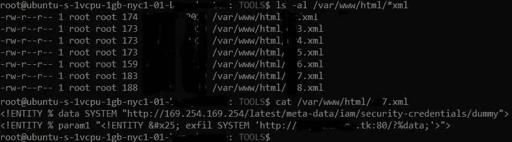

# 几乎毁了我的私人 bug 赏金程序概念验证的 DNS 缓存，以及避免同样情况的一些技巧

> 原文：<https://infosecwriteups.com/dns-cache-that-almost-ruined-my-poc-for-a-private-bug-bounty-program-and-a-few-tips-on-avoiding-dbc07f1d813b?source=collection_archive---------2----------------------->

作为一个 bug 赏金猎人，甚至作为一个想要节省时间的人类，你总是想要一种方法来简化某些任务，然后将那些简单且通常繁琐的活动自动化。这主要是出于把节省下来的时间花在可能从技术上来说是浪费时间的其他事情上的愿望(例如，视频游戏、狂看电影和电视剧等)。)，但那都是做人的一部分嗯？

当你自动化任何事情时会发生什么？最初，它以一场灾难告终，除非你设法考虑到每一种可能的情况。作为一个 bug 赏金猎人，自动化往往是一个复杂的 bash 脚本或等同物，实际上是一行接一行的简单任务，但是将它们串在一起通常是问题的根源。一旦你运行这个脚本，这个问题就会显现出来，如果它在一个很大的目标列表上…好吧，我希望你有一个大硬盘的 VPS。

但是，迟早，错误会被纠正，脚本会完成它的任务。你需要做的就是坐下来看一些网飞的节目，或者如果你没有通过亚马逊订购，但你有 prime 会员，你可以花时间挖掘看看有什么是免费观看的。最后，你检查结果。如果脚本是为一些 RCE 或 SSRF 测试的，你真的希望你的 burp 合作者或任何你监视 pingbacks 的地方向你显示 aws 拥有的 IP 或任何不是 google cache 或类似的 IP。

然后就发生了。根据经验，来自 IP 的 pingback 必须来自 aws。您执行通常的主机 x.x.x.x，在这里，您已经验证了 IP 地址来自 aws。您可能会因为这一点而激动得发抖，因为下一步是验证，最后是概念验证。

在这个真实的例子中，pingback 是通过上传文件中的 XXE 实现的。验证是通过获取具有 XXE 有效负载的文件并用我的 VPS IP 地址和当时不存在的 xxe.xml 文件编辑它来完成的，以便验证日志中的 GET /xxe.xml。在日志中是 404，但它做到了。现在，是时候编写 PoC 了。但是，当我开始挖掘 XXE 有效载荷时，我有一些时间来思考，处理正在发生的事情，以及可能发生的事情。然后，一个合理的担心是:如果其他人也收到了，并且提交了这个 bug，那该怎么办？当然，我提交最初的发现是为了争取一些时间，确保不会浪费在概念验证上，因为我可能已经太晚了。

一段时间后。我收到了这封电子邮件，兴奋之情溢于言表，因为它要么成功，要么失败。他们要求我提供一个概念验证，一个真正的概念验证，展示从他们的 aws 读取数据的能力。我准备好了。我有我的 VPS，我有一个 XML 文件，我之前用来测试 pingback，它在 nano 中是开放的，我正在输入 XXE 有效载荷，它将证明影响。一切都结束了。我准备好了包含 XXE 有效负载第 1 部分的文件，我仔细检查了我输入的 VPS IP 地址是否正确，以及 xxe.xml 是 xxe.xml 而不是 xxe.dtd，反之亦然(你们中的一些人可能知道我在说什么)。一切都很好。然后，我上传文件，并在 apache 日志中检查在特定 aws 文件中找到的字符串的 GET 请求。没什么。15 分钟了还是一无所获。我检查了之前的测试，当时我还没有准备好 xxe.xml，我算了一下，结果是:当时大概花了 5 分钟。发生了什么事？这是一个 P1 错误，这是我的第一个 XXE 类型，我搞砸了。

我做了很多测试:)私人程序因此被大量编辑

在思考了一会儿并试图排除它的原因后，我记得有一种东西叫做 DNS 缓存。但是，如果它不仅仅适用于 DNS 解析呢？我觉得值得一试，所以我把 xxe.xml 重命名为 xxe1.xml，我试了一下，它成功了。我又试了一次，还是不行，所以我把它重命名为 xxe1.xml，它又可以工作了。给你，伙计们。你会学到一些新的日常事物。

**温馨提示:**

*注意你的有效载荷不要都是同一个子域(即 randomstring . burpcollaborator . net)，而是在使用脚本等的时候尝试 n+1 . randomstring . burpcollaborator . net。*

*根据目标，您可能还需要更改基本域。这一点可能会很棘手，除非你使用 http://freenom.com 的***免费注册域名，然后把它们连接到你的 VPS。**

**另一个有趣的提示也取决于目标:如果你发送 http://有些地方不会执行任何 pingback，在这种情况下，在你的 VPS 上配置自签名 SSL 是一个好主意，额外的 burp collaborator 也支持 https。**

*关于 freenom 和 VPS combo，以后可能会多写一些。*