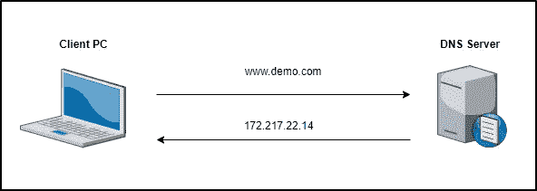
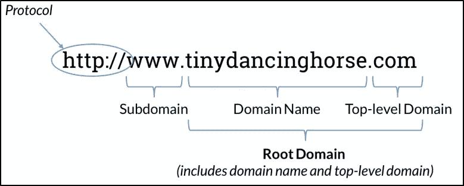
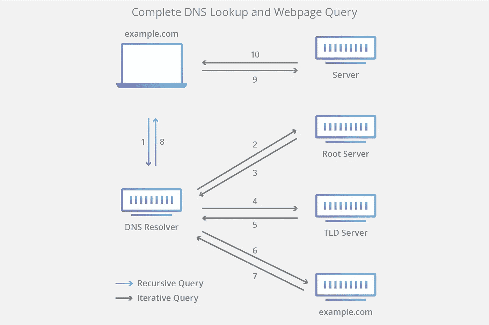
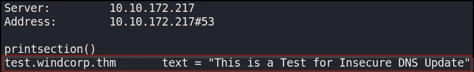

# Active Directory 中的 DNS

> 原文：<https://infosecwriteups.com/dns-in-active-directory-dcb93b10c3f3?source=collection_archive---------1----------------------->


本文提供了域名系统(DNS)协议工作原理的基本概述。在这篇文章中，我们将探索 DNS 的基本功能以及如何在 AD 环境中使用它。DNS 是一个很大的主题，本文将只涵盖基础知识，所以说，让我们深入！

# 什么是 DNS？

[微软](https://docs.microsoft.com/en-us/windows-server/networking/dns/dns-top)这样描述 DNS:

> 域名系统(DNS)是包含 TCP/IP 的行业标准协议套件之一，DNS 客户端和 DNS 服务器一起向计算机和用户提供计算机名称到 IP 地址的映射名称解析服务。

DNS 是一种命名系统，它为用户提供了一种简单的方式来与互联网上的设备进行通信，而无需记住 IP 地址。相反，用户通过提供一个**域名**(例如 demo.com)来发出请求，然后由 DNS 翻译成相应的 IP 地址。下图演示了一个基本的 **DNS 查找**，其中客户端连接到 DNS 服务器，将完全合格的域名(FQDN)解析为 IP 地址。



基本 DNS 查找示例。

# DNS 的核心组件是什么？

在讨论 DNS 的核心组件时，经常会用到以下术语，这些术语将在下面各自的小节中进一步阐述。

*   [**域名**](https://soundsupport.biz/2015/02/08/dns-for-small-business-owners/#:~:text=Real%20World%20Analogy&text=DNS%20is%20like%20a%20phone,get%20ahold%20of%20that%20person.) :企业或个人注册的便于人类记忆的名称(如 apple.com、youtube.com、ford.com 等)。).
*   [**域名服务器**](https://soundsupport.biz/2015/02/08/dns-for-small-business-owners/#:~:text=Real%20World%20Analogy&text=DNS%20is%20like%20a%20phone,get%20ahold%20of%20that%20person.) :存储某个域名的各个 DNS 记录的服务器。每个域名都分配有自己的名称服务器。
*   [**DNS 记录**](https://www.cloudflare.com/learning/dns/dns-records/) :列出存储企业网站或电子邮件账户的特定服务器的 IP 地址。

## 域层次结构

DNS 使用不同管理区域的层次结构进行管理，这些区域称为 [**区域**](https://www.cloudflare.com/learning/dns/glossary/dns-zone/) ，是授权给法人实体(即个人、组织或公司)的域名空间的独特部分。**域名空间**(即域名层次结构)是一个分层树，DNS 根域名位于顶部。[域层次结构](https://www.interserver.net/tips/kb/dns-dns-hierarchy/)由以下元素组成:

1.  [**根域**](https://moz.com/learn/seo/domain) :是层次结构中最高的域。它是域名和 TLD 的结合。
2.  [**【TLD】**](https://moz.com/learn/seo/domain):是出现在域名末尾的后缀。
3.  [**二级域名**](https://moz.com/learn/seo/domain) :域名是一个域层次结构中的第二级(在顶级域名之后)。
4.  [**子域**](https://moz.com/learn/seo/domain) :域层次结构的第三级，是更大的顶级域的一部分。

下图说明了这一点:



[域名结构示例。](https://moz.com/learn/seo/domain)

## DNS 服务器

DNS 服务器分为几类:

*   [**DNS Recursor**](https://www.cloudflare.com/learning/dns/dns-server-types#recursive-resolver) :作为客户端和 DNS 名称服务器之间的中间人，处理客户端查询和 DNS 服务器响应。
*   [**根域名服务器**](https://www.cloudflare.com/learning/dns/glossary/dns-root-server/) :接受包含域名的递归解析器的查询，根域名服务器根据该域名的扩展名(.com，。网，。org 等。).
*   [](https://www.cloudflare.com/learning/dns/dns-server-types#tld-nameserver)**:托管主机名的最后一部分(在 example.com，TLD 服务器是“com”)。**
*   **[**权威域名服务器**](https://www.cloudflare.com/learning/dns/dns-server-types#authoritative-nameserver) :如果服务器可以访问所请求的记录，它会将所请求主机名的 IP 地址返回给发出初始请求的 DNS 递归器。**

## **DNS 记录**

**[DNS 记录](https://www.cloudflare.com/learning/dns/dns-records/)(又名区域文件)是列出存储企业网站或电子邮件账户的特定服务器的 IP 地址的指令。一些最常见的 DNS 记录类型包括:**

*   **[**A 记录**](https://www.cloudflare.com/learning/dns/dns-records/dns-a-record/) :保存某个域的 IPv4 地址。**
*   **[**AAAA 记录**](https://www.cloudflare.com/learning/dns/dns-records/dns-aaaa-record/) :包含某个域的 IPv6 地址。**
*   **[**CNAME 记录**](https://www.cloudflare.com/learning/dns/dns-records/dns-cname-record/) : 将一个域或子域转发到另一个域，不提供 IP 地址。**
*   **[**MX 记录**](https://www.cloudflare.com/learning/dns/dns-records/dns-mx-record/) : 将邮件定向到邮件服务器。**
*   **[**TXT 记录**](https://www.cloudflare.com/learning/dns/dns-records/dns-txt-record/) : 让管理员在记录中存储文本笔记。这些记录通常用于电子邮件安全。**
*   **[**NS 记录**](https://www.cloudflare.com/learning/dns/dns-records/dns-ns-record/) : 存储 DNS 条目的名称服务器。**
*   **[**SOA 记录**](https://www.cloudflare.com/learning/dns/dns-records/dns-soa-record/) : 存储一个域的管理信息。**
*   **[**SRV 记录**](https://www.cloudflare.com/learning/dns/dns-records/dns-srv-record/) :指定特定服务的端口。**
*   **[**PTR 记录**](https://www.cloudflare.com/learning/dns/dns-records/dns-ptr-record/) :提供反向查找中的域名。**

# **DNS 查找是如何工作的？**

**在执行 [DNS 查找](https://www.cloudflare.com/learning/dns/what-is-dns/)时，会采取一系列步骤:**

1.  **用户在网络浏览器中键入“【example.com】T2，查询进入互联网并被 **DNS 递归解析器**接收。**
2.  **解析器然后查询一个 **DNS 根域名服务器**(。).**
3.  **然后根服务器用一个**顶级域名(TLD) DNS 服务器**的地址(比如。com 或者。net)，它存储其域的信息。在寻找 example.com 的时候，我们的要求是指向。com TLD。**
4.  **然后，解析程序向。com TLD。**
5.  **然后，example.com 的 TLD 服务器用域名服务器的 IP 地址做出响应。**
6.  **最后，递归解析器向域名服务器发送一个查询。**
7.  **然后，example.com 的 IP 地址从名称服务器返回给解析器。**
8.  **然后，DNS 解析器用最初请求的域的 IP 地址来响应 web 浏览器。**
9.  **浏览器向 IP 地址发出一个 [HTTP](https://www.cloudflare.com/learning/ddos/glossary/hypertext-transfer-protocol-http/) 请求。**
10.  **该 IP 的服务器返回要在浏览器中呈现的网页。**

**下图说明了这些步骤。**

****

**[DNS 查找和网页查询。](https://www.cloudflare.com/learning/dns/what-is-dns/)**

# **为什么在 AD 环境中使用 DNS？**

**在我以前的一篇题为“ [*活动目录概述*](/active-directory-overview-98692e1b0233) ”的文章中，我提到活动目录域服务(AD DS)在安装时需要 DNS 服务器角色。根据微软的说法，AD DS 使用 DNS 名称解析服务来使客户端定位域控制器和托管目录服务的域控制器相互通信成为可能。**

**当执行任何主要 AD 操作(如身份验证、更新或搜索)时，计算机使用 DNS 来定位 AD 域控制器。此外，域控制器使用 DNS 相互定位。**

**对于[示例](https://docs.microsoft.com/en-us/windows-server/networking/dns/dns-top)，当具有 AD 用户帐户的网络用户登录到 AD 域时，DNS 客户端服务查询 DNS 服务器以定位 AD 域的域控制器。当 DNS 服务器响应查询并向客户端提供域控制器的 IP 地址时，客户端会联系域控制器，身份验证过程可以开始。**

# **DNS 动手实验**

**为了演示 AD 中的 DNS 如何被枚举和潜在利用，我将使用名为“***【ra2】***的 TryHackMe 房间作为示例。你可以在这里找到完整的[文章](/thm-writeup-ra-2-ed3de7c719a8)。使用 NMAP，我找到域名" ***windcorp.thm"*** ，看到端口 53 是打开的(即 DNS):**

```
PORT      STATE SERVICE             VERSION
53/tcp    open  domain?
| fingerprint-strings: 
|   DNSVersionBindReqTCP: 
|     version
|_    bind
```

**我可以通过使用“ ***dig*** ”命令来执行 DNS 枚举以获取任何有用的信息。**

```
# Request any information
**dig any @10.10.151.112 windcorp.thm**;; ANSWER SECTION:
windcorp.thm.           600     IN      A       10.10.151.112
windcorp.thm.           600     IN      A       10.10.61.88
windcorp.thm.           3600    IN      NS      fire.windcorp.thm.
windcorp.thm.           3600    IN      SOA     fire.windcorp.thm. hostmaster.windcorp.thm. 291 900 600 86400 3600
windcorp.thm.           86400   IN      TXT     "THM{....}";; ADDITIONAL SECTION:
fire.windcorp.thm.      3600    IN      A       10.10.151.112
fire.windcorp.thm.      3600    IN      A       192.168.112.1
```

**查看输出，我可以看到:**

*   ****甲记载**为域。**
*   ****DNS 条目的名称服务器的 NS 记录**。**
*   ****SOA 记录**，其中存储了一个域的管理信息。**
*   ****TXT**记录其中包含管理文本注释。**

## **不安全的 DNS 更新**

**对于这种挑战，可以进行不安全的 DNS 更新。我可以通过使用[**n update**](https://linux.die.net/man/8/nsupdate)尝试添加一个 TXT 记录来测试这一点。**

```
$ nsupdate> server 10.10.172.217
> update add test.windcorp.thm 5 TXT "This is a Test for Insecure DNS Update"
> send
```

**接下来，我可以使用 **nslookup** 来确认 TXT 记录已经被添加。**

```
> server 10.10.172.217
Default server: 10.10.172.217
Address: 10.10.172.217#53
> set type=txt
> test.windcorp.thm
```

****

**添加了 DNS TXT 记录。**

**我看到 TXT 记录已经成功添加了！从这里，您可以利用此漏洞进行攻击，如 DNS 缓存中毒或执行进一步的枚举。**

# **结束语**

**希望这篇关于 DNS 的短文有助于提供它是什么以及它如何工作的基本概述。DNS 是一个庞大的话题，值得了解更多。谢谢你看完，继续黑！😄**