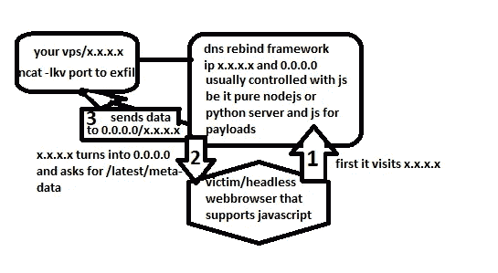
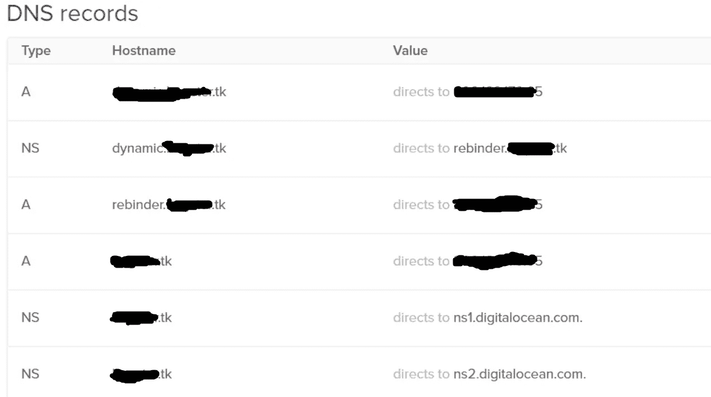
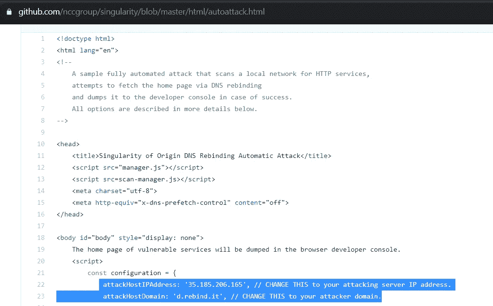
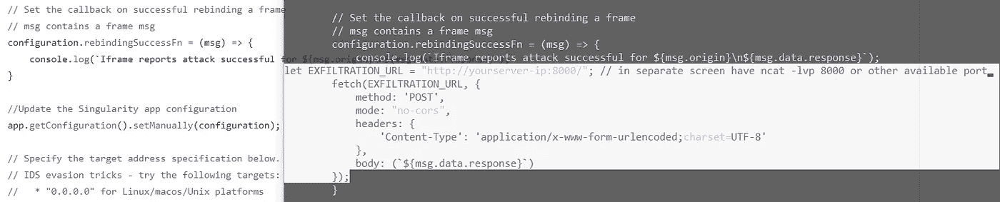
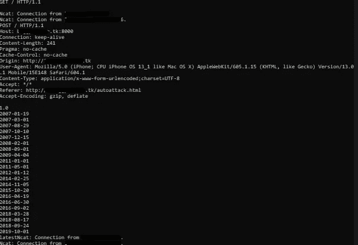

# DNS 重新绑定，这是一种危险的攻击

> 原文：<https://infosecwriteups.com/dns-rebinding-the-treacherous-attack-it-can-be-b367c61b4372?source=collection_archive---------0----------------------->

真的。一件非常非常糟糕的事情。幸运的是，大多数时候你都是偶然发现的，而不是你故意发现的。当然，也许它会找你麻烦，谁知道呢。不管怎样，到目前为止，我已经经历了大约四次了。四次中，只有一次我真的把它修好了。

这将不会是一个故事，它如何工作，直到它没有，或发生了一些事情，导致它停止正常工作，等等。这是关于我是如何让它工作的，我得到了结果，还有…有问题的 aws 实例不属于有问题的 bbp。去想想。

**它是什么，如何工作:**

首先，你为什么会陷入 DNS 重新绑定攻击，尤其是在做 bug 狩猎的时候？因为你得到了一个 HTTP pingback，加分 IP 地址解析为 aws。

但是，什么是 DNS 重新绑定攻击呢？最简单的解释是(几乎有更长更漂亮的关于这个主题的文章，但不是这个),这是一种欺骗受害者(或具有 javascript 支持的无头 web 浏览器，这是必不可少的)的方法，使攻击者的服务器连接到它，然后快速切换到本地 IP 地址。有了这个“掩护”，攻击者就能够提取通常阻止外部 IP 地址而不是本地 IP 地址的内部网络信息。在 aws 的情况下，这意味着如果你将自己伪装成本地主机 IP 地址，那么你将能够访问[http://169 . 254 . 169 . 254/latest/meta-data](http://169.254.169.254/latest/meta-data)并在它下面填充内容，就好像你是内部网络的一部分一样。

但是，如何让您的服务器欺骗受害者，使它看起来好像是本地 IP 地址？嗯，有很多很多工具/框架需要你做一些调整，比如输入你的 vps IP 地址和可用端口(通常是 8080 或 8000，你懂的)。据我所知，在所有情况下，最大的问题是，它还需要你将你的 vps 投入到这种攻击中，直到你要么完成它，要么放弃，无论哪种情况先发生，因为你需要停止你的 vps 上的 DNS 服务。当你这么做的时候会发生什么？如果你不知道，停止 DNS 服务，如命名和/或绑定，使你的 vps 仅限于与外界通信，只允许连接到它，这是非常多的。不能用 wget，不能 ping 任何东西(其实可以，但是 ping 会显示本地 IP 地址)之类的。您唯一可以主动使用它的是，一旦受害者(无头 web 浏览器)最终触发您的 DNS 重新绑定负载(无论是进行端口扫描、aws 数据提取、jenkins、IoT 等的负载),就提取远程 DNS 重新绑定易受攻击服务器的内部网络信息。)

下面是这个过程的图形简化(代码会及时出现):

由于空间原因，我使用了 0.0.0.0 而不是 169.254.169.254

**真实世界攻击—第 1 部分:准备**

受影响方的代码/PoC 被改变/隐藏。

我使用了奇点，你可以在这里阅读和下载整个东西:【https://github.com/nccgroup/singularity

这是我在数字海洋上的 DNS 配置，网址是通过 freenom 免费注册的:【https://www.freenom.com/[，其中域名服务器设置为指向数字海洋。](https://www.freenom.com/)

这是我为这次特殊攻击设置的数字海洋 DNS:

情节转折——是时候改变你对接下来发展的预期了，因为我无法让它按照指示工作(你可能会有更好的运气),但我仍然得到了结果。

由于无法在任何时候将我的东西解析到 127.0.0.1，因此无法欺骗受害者(无头网络浏览器)让我进入，我采用了 50-50 的解决方案。也许更像 30-70。因为在 30%中，我的修改是为了得到几乎想要的结果(我说几乎想要，是因为除了/latest/metadata 中的默认 aws 路径之外，我不能使用任何东西)到我可以读取它们的地方。70%是处于几乎默认模式的工具(默认模式是 aws 路径，按照[https://github . com/NCC group/singularity/blob/master/html/payloads/AWS-metadata-exfil . js](https://github.com/nccgroup/singularity/blob/master/html/payloads/aws-metadata-exfil.js)，而将输出发送给我的代码必须添加到我的服务器上的 autoattack.html 内部)。

先决条件:

1 —你需要副总裁

2-你需要一个付费的网络主机或免费域名(付费的网络主机可能比免费域名走得更远，但是对于这个概念验证，我使用了免费域名)

3 —关键要求—目标必须支持 JS

4 —(可选？)耐心

首先，您必须确定您得到的 HTTP pingback(顺便说一下，在我的例子中是通过 Referer header)支持 javascript。

您可以简单地添加如下内容:

你可以把这个文件命名为 index.html，这样你就可以处理 pingback 只针对根页面的情况。有时可以使用/autoattack.html(在这种情况下，我能够指定页面)，但在大多数情况下，最安全的做法是使用 index.html，然后您可以只使用

推荐人:[http://yourserver.com/](http://yourserver.com/)完事。

现在，等待。为了确保你不会等待永远不会到来的 js，你需要在你的服务器上监控 access.log 或者类似的东西，或者对 1.burpcollaborator.net、yourserver.com、2.burpcollaborator.net 发出一个请求。如果你在 burpcollaborator.net 的 1 号和 2 号网站上得到 http 回应，而在 jstest.burpcollaborator.net 却没有，这可能意味着 javascript 支持没有通过。这样你可能就避免了令人头疼的 DNS 重新绑定攻击，即使它成功了，也可能会超出 bug bounty 计划的范围。如果 jstest.burpcollaborator.net 能成功，那我祝你好运。

真实世界的攻击——第二部分:开始吧。概念验证

在我确定 js 是受支持的之后，是时候去争取了。我确实有一个 DNS 服务器缓存的问题，这导致我不得不改变我的 freenom 域名的名称，以绕过它，但这是一个快速修复。

我已经下载了奇点，并按照所有的指示让它运行起来。

然后，我按照说明编辑了/root/singularity/html 下的各种文件

然后我试了一下，然后…我特别是在 js 上发现了很多未发现的错误。这是因为*.myserver.tk 的解析不想切换到 127.0.0.1，因此它无法访问子文件夹中本地托管的 js 文件。但是，我就是我，这实质上意味着找到绕过事情的方法，那些不理想的方法，但是，嘿，它完成了工作，意味着我必须对代码做一些巧妙的编辑。我想，如果我可以保留 autoattack.html 内部的默认 IP 地址，同时添加一段代码来将输出发送到我的目的地，我就不必担心设置任何东西，除了让 singularity 在我的服务器上以几乎默认的模式运行之外，然后解析我的 freenom 域名就无关紧要了:

左:原始代码，右:突出显示添加的代码

然后我重复发送了这个请求:

如前所述，在这种情况下，我能够指定页面

*此外，回应并不重要。根据我的经验，您可能会得到 404，但几天后仍然会得到 HTTP 和/或 DNS pingback。*

然后我就等了。我等待着。我等待着。然后:

接下来的兴奋是我在公寓里走来走去，自鸣得意，自言自语“这个男人是谁？我是男人，是的，这就是我所说的“和这样的。这也与一个事实有关，那就是有问题的臭虫奖励计划是那些能为这类臭虫支付巨额奖金的计划之一。

喜悦过后,“我做到了”的感觉和其他刺痛的感觉平静下来，是时候写报告并提交了。

在几个来回的消息之后，有问题的 bbp 从 aws IP 地址确定这不是他们的 aws 实例。他们认为可能是一些分析 aws 简单地跟踪了他们(bbp)页面上的推荐网址，并触发了来自分析端的 HTTP pingback，因此浪费了我很多时间。嗯，也许这不是完全浪费时间，我学到了一两件事。

**参考文献:**

这些是我在工作中遇到困难的一些参考资料和其他工具，也许你会做得更好，对于那些敢于冒险的人，有时会紧张地追求这种可怕但仍然很酷的攻击:

https://github.com/FSecureLABS/dref——我要说的是，几年前，我设法让它正常工作，但最近我试用时遇到了问题。但是，我也对我的 vps 配置做了一些调整，尤其是在 DNS 和添加虚拟主机方面。不确定这是否与它的“崩溃”有关，但我认为最好提供免责声明，说明为什么我在这里建议它，但最近它没有工作。

[https://medium . com/@ brannon dorsey/attack-private-networks-from-the-internet-with-DNS-rebinding-ea 7098 a2 d 325](https://medium.com/@brannondorsey/attacking-private-networks-from-the-internet-with-dns-rebinding-ea7098a2d325)

[https://ports wigger . net/research/cracking-the-lens-targeting-https-hidden-attack-surface](https://portswigger.net/research/cracking-the-lens-targeting-https-hidden-attack-surface)—不得不加上这个，对吧:)