# 医生:黑客盒子演练

> 原文：<https://infosecwriteups.com/doctor-htb-walkthrough-70bcb9eedefd?source=collection_archive---------0----------------------->

## 描述

博士是 [**上一个不错的 VM 黑客盒子**](https://app.hackthebox.eu/machines/278) **。**我必须说 HTB 上的简单盒子比 TryHackMe 上的中等盒子更难懂。只需在/etc/hosts 文件中添加 doctors.htb，就可以了。

> 获得的知识

1.  列举
2.  服务器端模板注入
3.  在**中获得反向外壳的两种方式**
4.  枚举 adm 相关文件
5.  使用 SplunkWhisperer2 提升权限

> 端口扫描

像往常一样，首先用 Nmap 扫描网络，寻找开放的端口和服务。

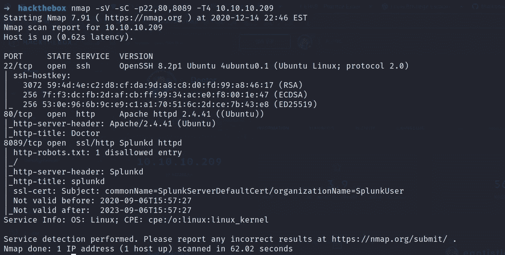

> 网络侦察

所以我们先列举一下 80 端口。我决定启动一个 gobuster 扫描，得到了一些有用的东西。

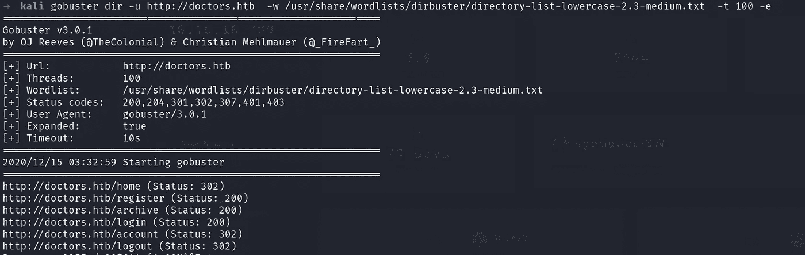

所以我们有一个登录门户。

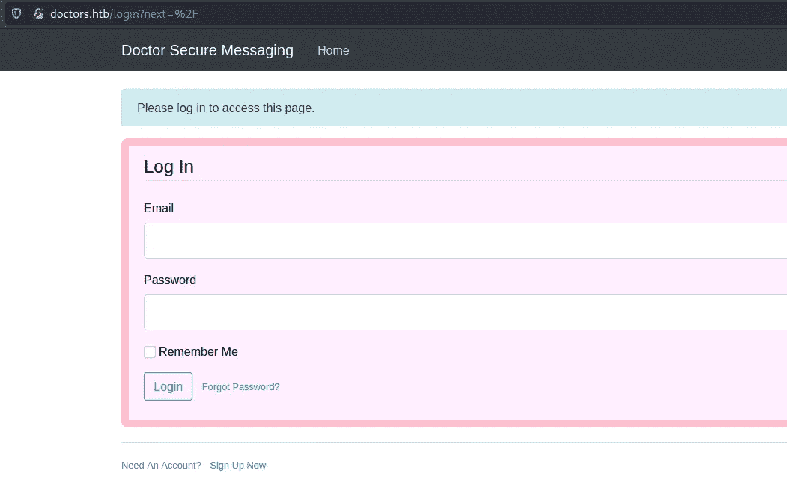

我先试着去了 SQL 注入，但是什么也没发生。然后我注册了一个新账号，这次我很幸运。

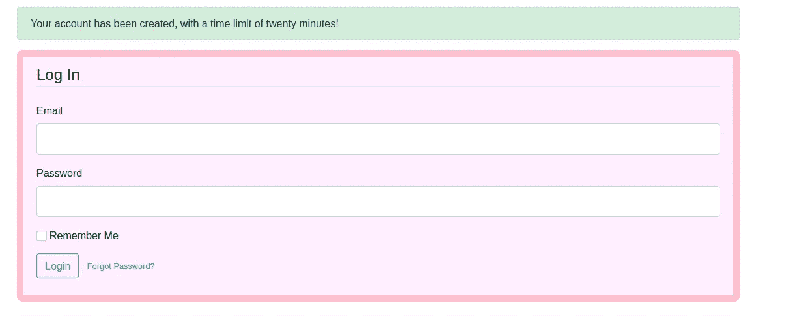

现在，如果你记得我们在目录扫描中得到 URI**/存档**。我打开了它，但什么也没有，但页面源有一些有用的东西。无论我在**“新消息”** - > **标题**字段中键入什么，都会在/archive 页面源中得到反映。

> 了解服务器端模板注入

Web 应用程序经常使用模板系统，如 [Twig](http://twig.sensiolabs.org/) 和 [FreeMarker](http://freemarker.org/) 在网页和电子邮件中嵌入动态内容。当用户输入以不安全的方式嵌入模板时，就会发生模板注入。在模板中不安全地嵌入用户输入使得 [**服务器端模板注入**](https://portswigger.net/web-security/server-side-template-injection) ，这是一个非常容易被误认为[跨站脚本](https://portswigger.net/web-security/cross-site-scripting) (XSS)或完全遗漏的致命漏洞。模板注入可能是由开发人员的错误引起的，也可能是为了提供丰富的功能而故意暴露模板引起的，就像维基、博客、营销应用程序和内容管理系统通常所做的那样。一些最常用的服务器端模板引擎有 **Smarty、樱井真子、Twig 和 Jinja2。**

到目前为止，我们知道它容易受到 SSTI 漏洞的攻击，但我们不知道这里使用的是哪种模板。

> **识别模板方法 1**

此图显示了如何识别模板类型的步骤。

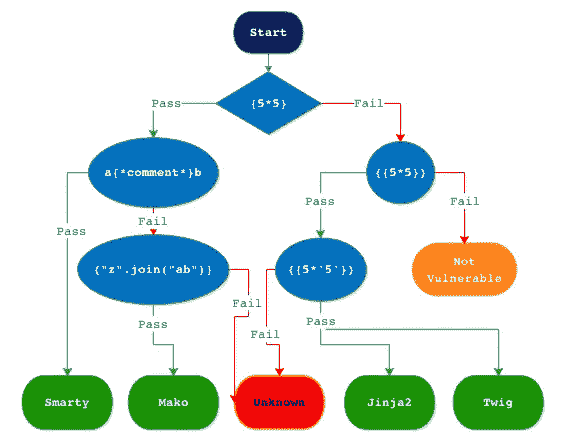

在标题字段{ 5 * 5 }--> { { 5 * 5 } }--> { { 5 * ' 5 ' } }-->结果 55555 中输入。这证明我们有 Jinja2。

> **识别模板方法 2**

这一次我们有了一个工具可以为我们做这件事，但我们也应该知道手动过程【https://github.com/epinna/tplmap

**只需输入命令**。/TPL map . py-u '**[**http://doctors.htb/home\?page\=1'**](http://doctors.htb/home\?page\=1')**你就能知道所用的模板名了。从这里我们可以得到**反壳**也但是我失败了。你可以试试这个。****

> ****获得反向外壳-方法 1****

****现在我们已经有了足够的反向外壳信息。使用[**python payload**](https://github.com/swisskyrepo/PayloadsAllTheThings/tree/master/Server%20Side%20Template%20Injection#methodology)，只修改 IP_address。发布消息…****

****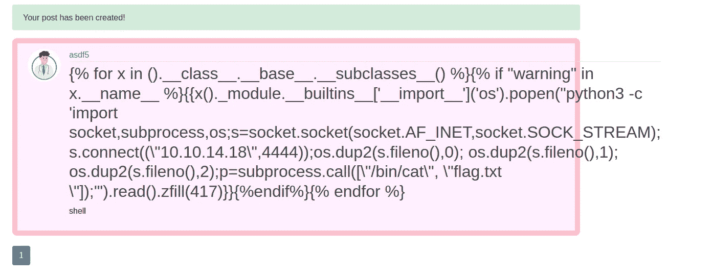****

****…并刷新**URI/档案库**，启动一个新的终端并监听连接。****

****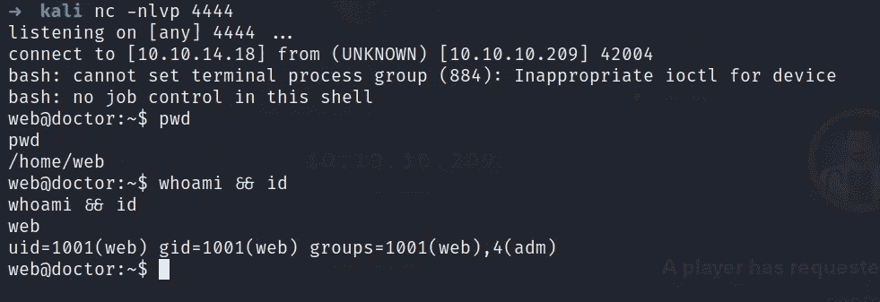****

> ****获得反向外壳-方法 2****

****在搜索这篇文章的时候，我在 youtube 上看到了一个视频，显示了利用**内容字段**来获得一个反向外壳。****

****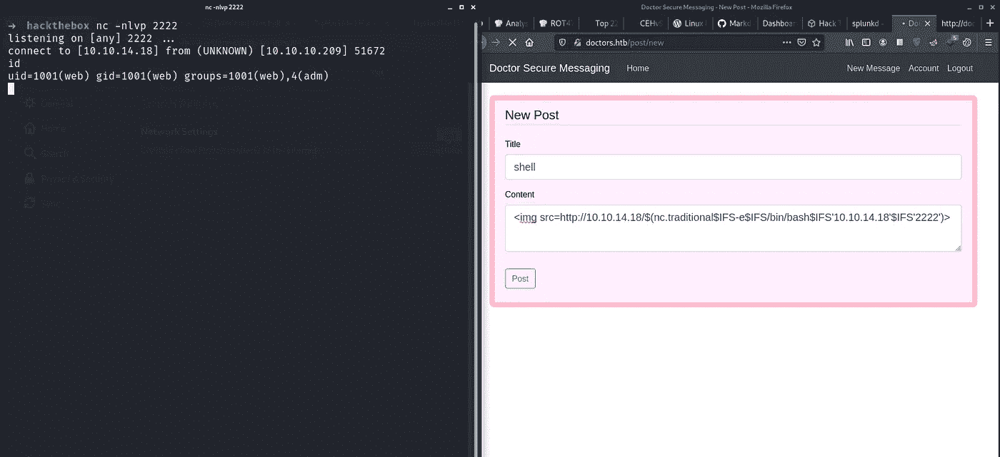****

****我不知道怎么做，但如果有人知道，请在评论区向我解释。****

****继续，我列举了机器，显示我们有一个用户名 shaun。有一点需要注意的是，我们在团体中有(adm)。****

****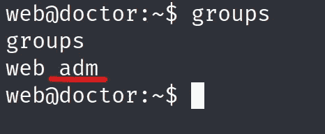****

****我在网上搜了一下，得知 [**adm**](https://superuser.com/questions/86347/whats-difference-between-group-admin-and-adm) 是 Ubuntu 上一个只对查看/var/log(历史上曾叫/var/adm)中所有日志文件有好处的组。****

****导航到/var/log/apache2 路径并获得文件**备份。******

****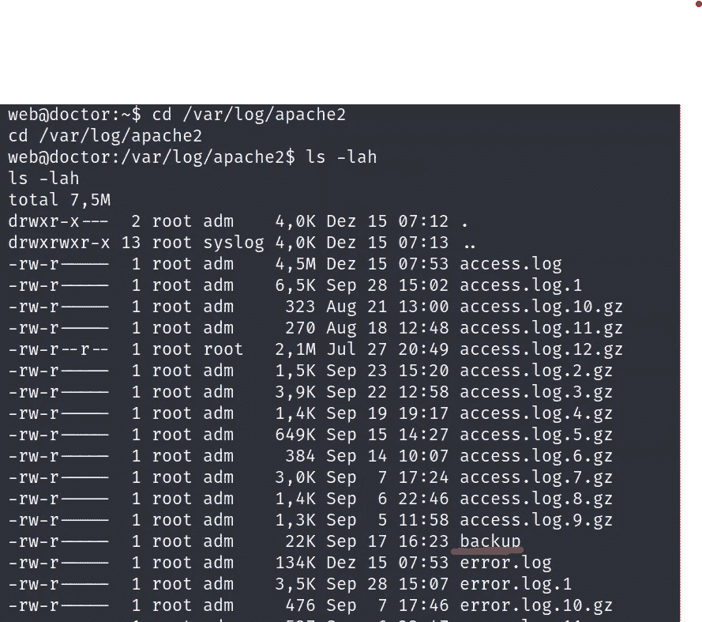****

****由于这是一个备份文件，我试图通过 **grep 获取用户 shaun 的凭证。******

****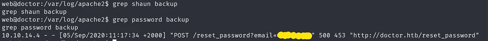****

> ****权限提升****

****切换到 shaun 帐户，并尝试他是否有 sudo 权限，但没有任何有用的东西，而是首先访问第一个 flag **/home/shaun** 路径。****

****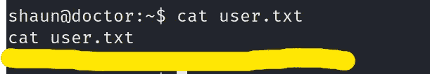****

****在互联网上搜索如何滥用 Splunk 来提升特权，我创建了一个不错的 [**博客**](https://eapolsniper.github.io/2020/08/14/Abusing-Splunk-Forwarders-For-RCE-And-Persistence/) ，它指引我使用**[**pysplunkwhisper 2**](https://github.com/cnotin/SplunkWhisperer2)**。********

****克隆该工具，像我一样指定有效负载，并在新的终端中监听传入的连接。****

****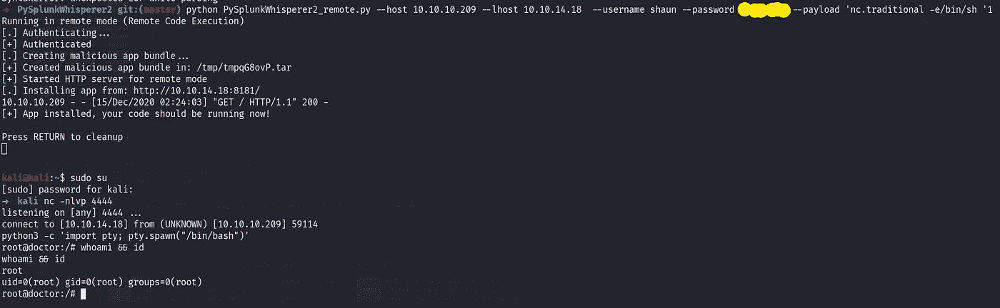****

****好了，我们现在有了根访问权限。导航到最后一个标志的/根目录。****

****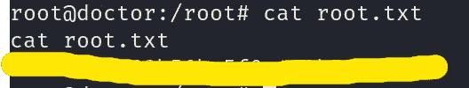****

****如需更多演练，请继续关注…****

# ****在你走之前****

****访问我的 Funbox 系列漫游的:-****

**** [## FUNBOX-7: EASYENUM 漫游(Vulnhub)

### 描述

shubham-singh.medium.com](https://shubham-singh.medium.com/funbox-7-easyenum-walkthrough-vulnhub-3c1ef0f1c2ef)  [## 懒虫先生/fun box-漫游-s

### 此时您不能执行该操作。您已使用另一个标签页或窗口登录。您已在另一个选项卡中注销，或者…

github.com](https://github.com/Mr-Lazzy/Funbox-Walkthrough-s)  [## 懒人先生/Vulnhub _ 演练

### GitHub 是超过 5000 万开发人员的家园，他们一起工作来托管和审查代码、管理项目和构建…

github.com](https://github.com/Mr-Lazzy/Vulnhub_Walkthrough) 

鼓掌👏如果你喜欢你所读的。欢迎反馈。****