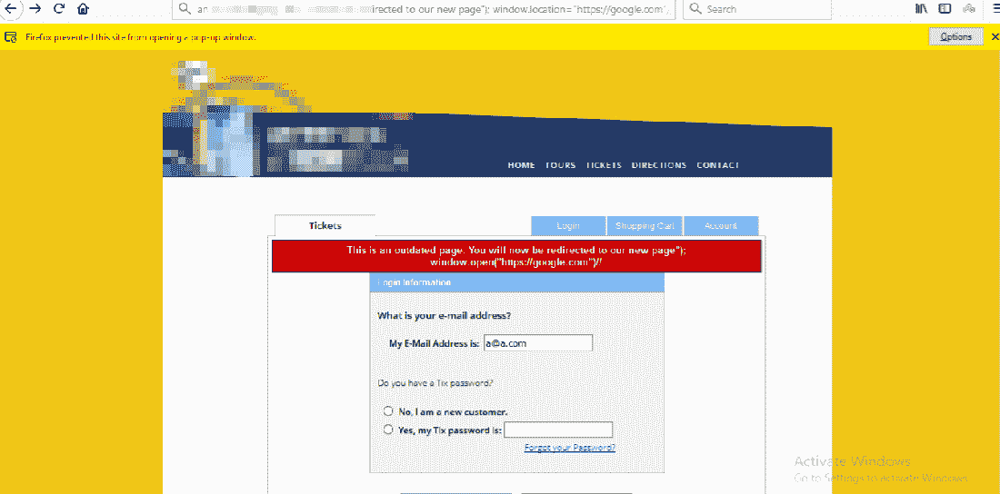
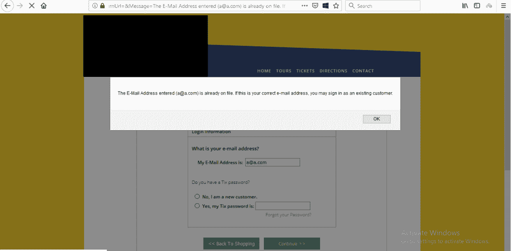
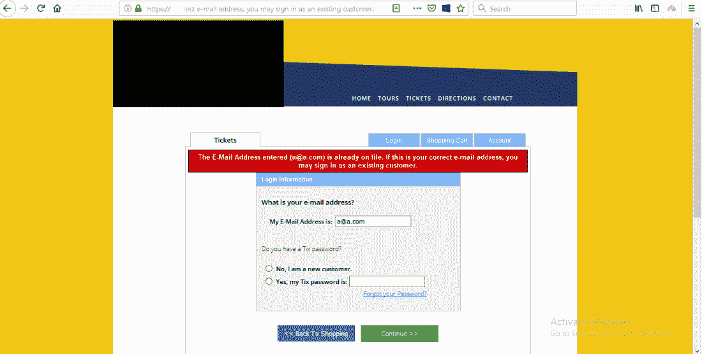
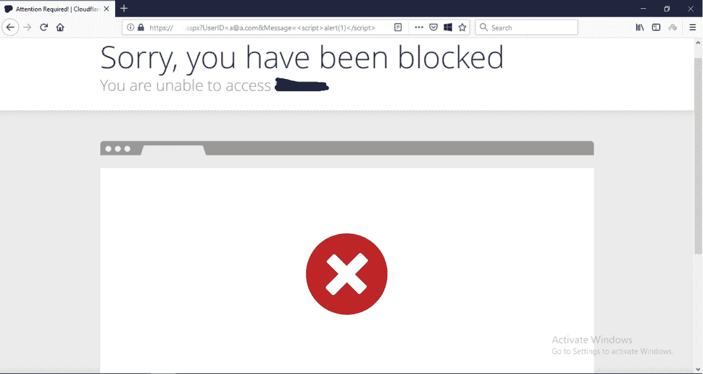
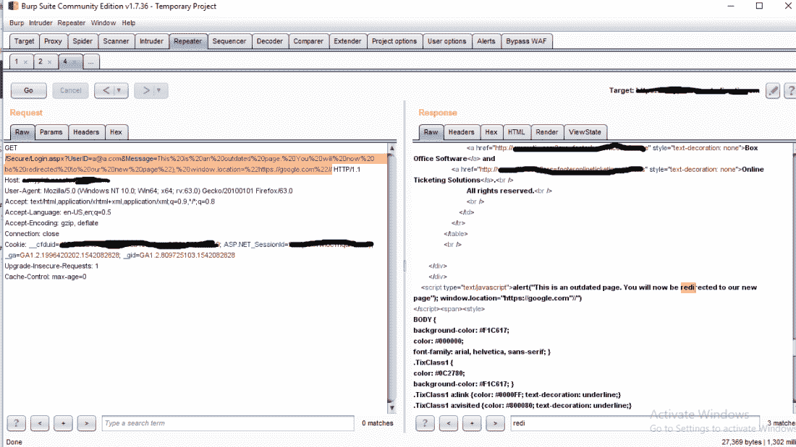

# [基于 DOM 的 XSS]或者为什么您不应该过于依赖 Cloudflare

> 原文：<https://infosecwriteups.com/dom-based-xss-or-why-you-should-not-rely-on-cloudflare-too-much-a1aa9f0ead7d?source=collection_archive---------0----------------------->

# 序

于是我又在一个虫子赏金项目里找到了另一个 XSS。网站*【redacted.com】*受 Cloudflare WAF 保护，因此许多有效载荷被过滤。但是网站实现方式极其糟糕，连 Cloudflare 都保护不了。

就在我发现这个漏洞的前几天，我在一次内部会议上告诉我的同事**“不要太依赖防火墙/安全产品”**。现在我有一个真实的例子要讲。LOL。

# 摘要

当我在登录页面上触发一个错误时，一个名为**的参数 Message** 被反映在 html 的主体和一个弹出框中(即“Message”的值被插入到 javascript 中，就在 alert(“[value _ here]”)中，没有经过过滤)。所以我可以在脚本中插入任何我喜欢的东西。

有效载荷:

```
This is an outdated page. You will now be redirected to our new page"); window.location="https://google.com"//
```



因此，我们可以欺骗用户，让他们进入更新后的网页并再次登录。(此处重定向至 google 进行演示)

# 我是怎么找到它的

事实上，我正在检查他们的注册和登录功能，并试图找到一些应用程序的缺陷。我在没有验证的情况下用电子邮件*a@a.com*注册了一个账户，并试图用同一个电子邮件再次注册。然后弹出一条错误消息:



我发现网址变成了

```
[https://redacted.com/Secure/Login.aspx?UserID=a@a.com&ReturnUrl=&Message=The](https://redacted.com/Secure/Login.aspx?UserID=a@a.com&ReturnUrl=&Message=The) E-Mail Address entered (a@a.com) is already on file. If this is your correct e-mail address, you may sign in as an existing customer.
```

与弹出框中的内容和顶部显示的文本完全相同:



因此，消息可能反映在 HTML 的主体中。我尝试了直接 有效载荷。

然后我得到了这个:



哎呀。云闪。但这在我的预料之中🙂。有效载荷是给假人的。

我注意到消息被直接插入到 javascript 中:



所以我们能做的是关闭双引号和括号，就像

```
alert("***something_here");evil_script_here//*** ")
```

然后我们可以做任何我们想做的事。

好的防火墙不能保存坏的代码。就是这样。感谢阅读。