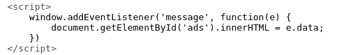
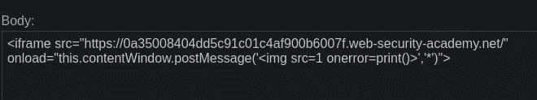
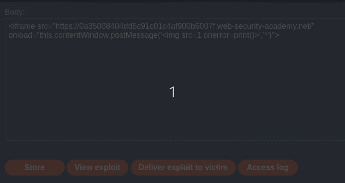

# 使用 Web 消息的 DOM XSS(实践者)— Portswigger 实验室 1 |解决方案和方法

> 原文：<https://infosecwriteups.com/dom-xss-using-web-messages-practioner-portswigger-lab-1-solution-and-approach-a9153ec6ac64?source=collection_archive---------2----------------------->

## Portswigger 基于 DOM 的漏洞实验室 1 方法和解释

[](https://portswigger.net/web-security/dom-based/controlling-the-web-message-source/lab-dom-xss-using-web-messages) [## 实验室:多姆 XSS 使用网络信息|网络安全学院

### 本实验演示了一个简单的 web 消息漏洞。要解决此实验，请使用漏洞服务器发布一条消息…

portswigger.net](https://portswigger.net/web-security/dom-based/controlling-the-web-message-source/lab-dom-xss-using-web-messages) 

> ***1。什么是 DOM？***
> 
> `The **Document Object Model** (DOM) is a web browser’s hierarchical representation of the elements on the page.`
> 
> `Websites can use JavaScript to manipulate the nodes and objects of the DOM, as well as their properties. DOM manipulation in itself is not a problem. In fact, it is an integral part of how modern websites work. However, JavaScript that handles data insecurely can enable various attacks.`
> 
> `DOM-based vulnerabilities arise` ***当一个网站包含 JavaScript*** `*that*`***取*** `*an*` ***攻击者可控值*** `, known as a` ***来源*** `, and` ***通行证***`*it*`*`*into*`*`*a*`****
> 
> ******2。什么是基于 DOM 的跨站点脚本(XSS)？******
> 
> **`DOM-based XSS vulnerabilities usually arise when JavaScript takes data from an attacker-controllable source, such as the URL, and passes it to a` ***汇*** `that supports` **动态代码执行**`, such as` ***eval()*** `or innerHTML`**
> 
> *****3。如何利用基于 DOM 的 XSS*****
> 
> **`The most common source for DOM XSS is the` ***网址*** `, which is typically accessed with the` ***窗口位置*** `object.`**
> 
> **`An attacker can construct a link to send a victim to a vulnerable page with a payload in the query string and fragment portions of the URL`。`*In* some cases targeting a` ***404 页面或网站运行 PHP*** `, the payload can also be placed in the path.`**

# **实验室:多姆·XSS 使用网络信息**

## **实验室描述:**

```
**This lab demonstrates a simple web message vulnerability.

To 'solve this lab, use the exploit server to post a message to 
the target site that causes the print() function to be called.**
```

1.  **注意实验室的源代码**

****

**我们发现了一个脚本，其中包含一个监听消息的`addEventListener()`调用**

**2.将下面的有效载荷存储在**漏洞服务器的主体**中，并点击将其发送给受害者。确保在下面的有效载荷中添加您的实验室 ID**

```
**<iframe src="https://YOUR-LAB-ID.web-security-academy.net/" 
onload="this.contentWindow.postMessage('','*')">**
```

*   **当`<iframe>`加载时，有效载荷中的`postMessage()`向主页中的`EventListener()`发送消息。**
*   **它将其插入到 ID 为`ads`的`div`中**
*   **这将插入我们的`img`标签，它包含一个无效的`src`属性。这将抛出一个错误，导致`onerror`事件处理程序执行我们的有效负载`print()`来解决 Lab。**

************

**感谢您的阅读！！**

**狩猎快乐~**

```
**Author : Karthikeyan nagaraj ~ Cyberw1ng**
```

**portswigger，lab，xss，bug bounty，dom xss，基于 dom 的 xss，**