# DomeCTF XII 撰写:矩阵

> 原文：<https://infosecwriteups.com/domectf-writeup-the-matrix-9f863a9fe6b4?source=collection_archive---------2----------------------->

阿杜队

# 它开始于…

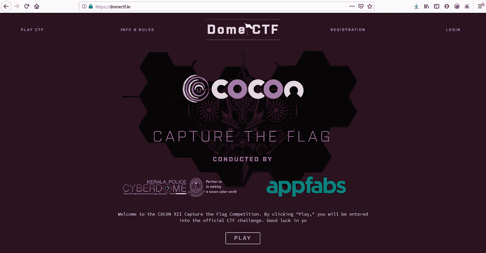

DOMECTF COCON XII

参加 DomeCTF 时，我从刚果开始。片名是“黑客帝国”，作为一个孩子，我喜欢这部电影，现在我有机会享受挑战。纯粹从它的名字来看，它成了我的首选。

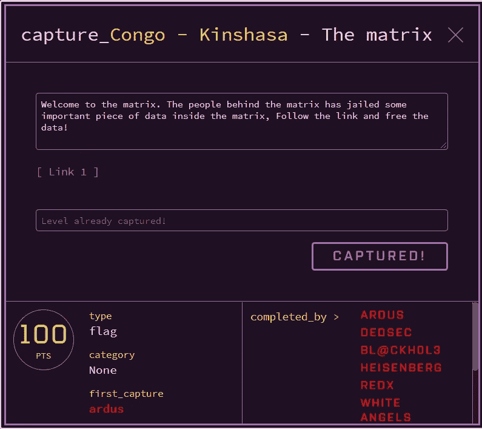

问题陈述

链接指向了中的

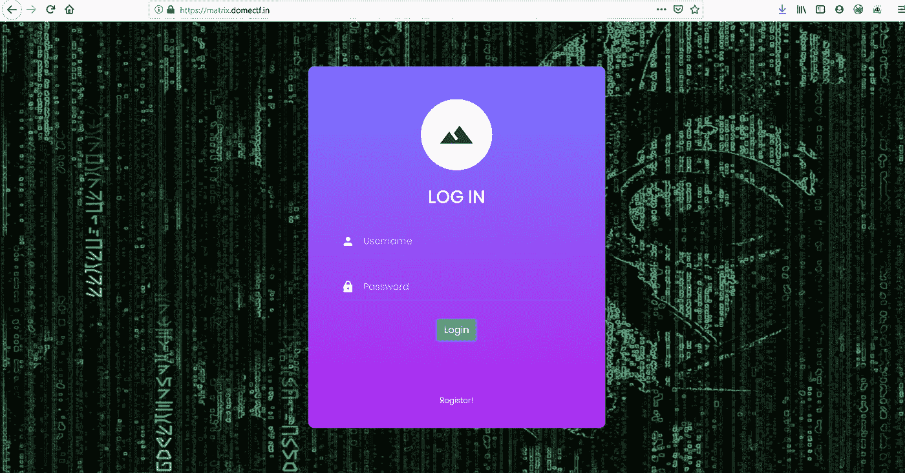

登录页面

看到一个网站，我采取了双管齐下的方法。

重新检查网站和服务器。

# 侦察

*   今天，许多网站隐藏在 Cloudflare 之后，pinging 服务器确认这也受到 cloudflare 的保护，嗯，这可能很难。在 cloudflare IP 上运行 nmap 毫无意义，因为它是共享的。那不会带我们去任何地方。

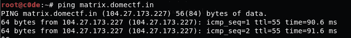

ping 到网站。Ip 属于 Cloudflare。

*   然后我做了一个 TXT 记录搜索，寻找任何泄漏

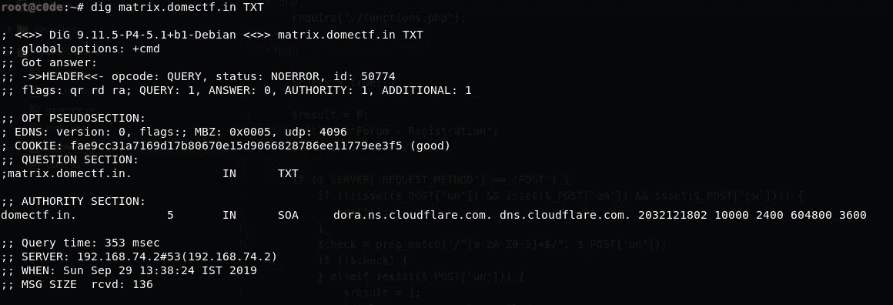

里面也什么都没有

*   所以基本上这必须是一个网络挑战，然后继续侦查，我启动了两个我最喜欢的程序，dirb 和 nikto。它们预装在任何 Kali 发行版上，非常棒。有些人会说有比 dirb 更好的程序，但当与 cloudflare 对抗时，其他程序往往会更快被阻止。所以迪布。

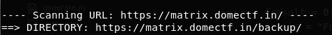

dirb 找到备份目录

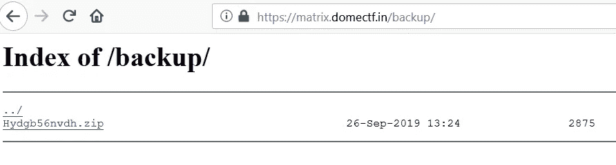

正如所料，备份有一个目录列表

*   同时，查看网站本身的链接也很重要，我们在主页上有 https://matrix.domectf.in/register.php[的链接，让我们也来看看](https://matrix.domectf.in/register.php)

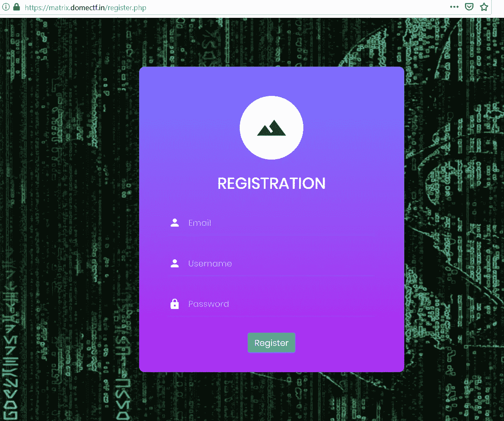

注册页面

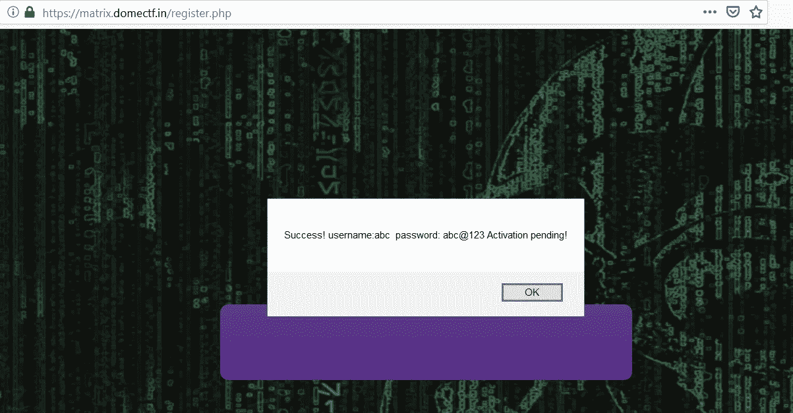

注册页面显示我的用户名和密码。会有 XSS 吗？

*   我试着看网站上的 JS，但是网站上的所有东西都是服务器端的，一点都不好玩。

# 备用拉链

*   让我们看看在网站上找到的备份文件。

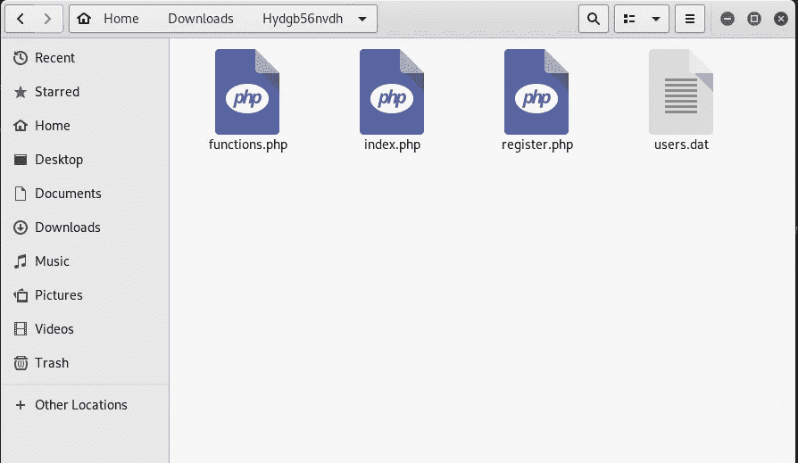

看起来我们找到了源代码

*   提供源代码，意味着我们需要找到一种方法来绕过登录查看源代码。好了，让我们开始吧

# 源代码

index.php

*   因此，如果我们提供正确的用户名和密码，我们将获得标志。
*   让我们进一步检查备份 Zip 中的其他文件
*   functions.php 定义了在 index.php 和 register.php 使用的各种功能

register.php

*   重要的部分在于第 43 +行。如果用户注册成功，我们将看到用户名和密码。让我们检查 functions.php，以了解注册函数返回代码和其他功能。

functions.php

用户. dat

*   乍一看，注册函数似乎有些不合适。该程序将用户名转换为 MD5，密码转换为 base64，然后将其保存到 pws.dat。我们只收到了 users.dat 的副本，这对于我们来说已经足够了。
*   users.dat 包含一个逗号分隔的列表。第一列是 base64 编码的用户名，第二列是 base64 编码的电子邮件地址，最后一列是布尔值 1/0，表明用户是否已经过验证。

这是我们的 pws.dat 在服务器上的样子

*   如果我们同时拥有 users.dat 和 pws.dat，我们将把 base64 编码的用户名转换为 clear，计算 md5 散列以在 pws.dat 中找到匹配项，转换相应的 base64 编码的密码并使用该密码登录。但是，唉，黑客的生活太简单了。

# PHP 类型杂耍

关于 PHP 魔术的 OWASP 日演示

*   PHP 支持类型杂耍，这就是漏洞所在。
*   当使用==运算符进行检查时，看起来像数字的字符串将产生 True。
*   这对我们来说也是正确的。因此，让我们计算检索到的用户名的 MD5 散列。
*   快速 Python 时间

convert.py

*   我们将用户名转换为它们对应的 md5 散列，并检查是否有以 0e 开头的，因为 0 的任何次方始终是 0

转换的用户. dat

*   我们创建一个 generate.py 来寻找一个 hash，这个 hash 将生成一个 try 杂耍字符串。我们将测试多达 10 个字符的字符串，超过它，不可行。

generate.py

*   程序继续运行，与此同时，我在谷歌上搜索了魔法哈希和 MD5(240610708)= > 0e 462097431906509019562988736854，这是一个数字[https://www.whitehatsec.com/blog/magic-hashes/](https://www.whitehatsec.com/blog/magic-hashes/)

# 标志时间

*   我们将尝试创建一个用户名为 **240610708** 和随机密码的用户，并尝试通过 GcY 获取用户**的密码**

我们有用户 **byGcY** 的密码

**让我们来测试一下我们是否正确**

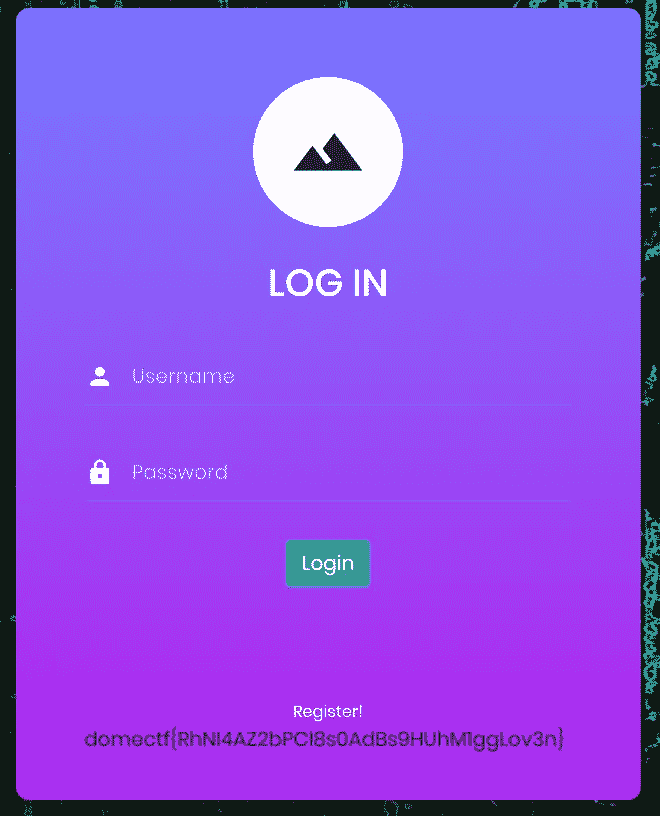

**发现标志**

# 快乐的黑客们……

*关注* [*Infosec 报道*](https://medium.com/bugbountywriteup) *获取更多此类精彩报道。*

 [## 信息安全报道

### 收集了世界上最好的黑客的文章，主题从 bug 奖金和 CTF 到 vulnhub…

medium.com](https://medium.com/bugbountywriteup)