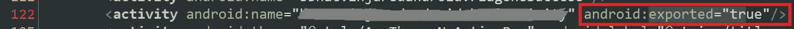
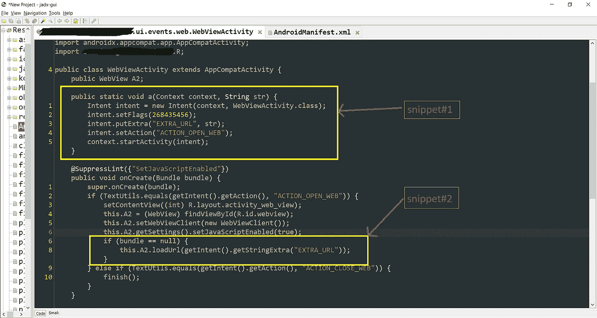
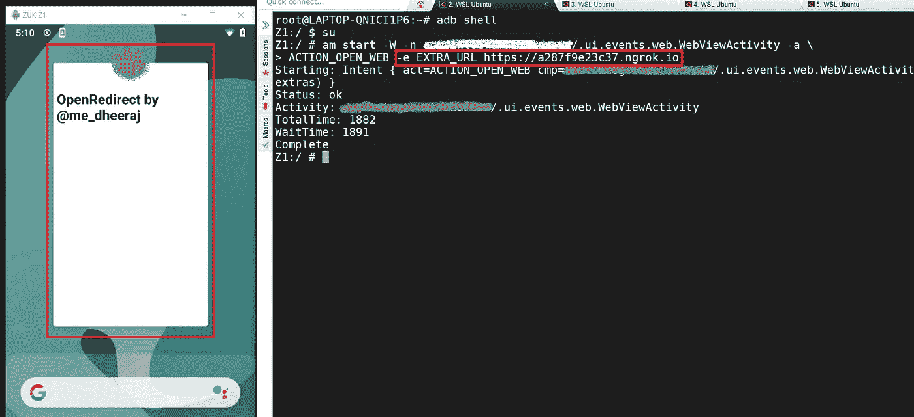
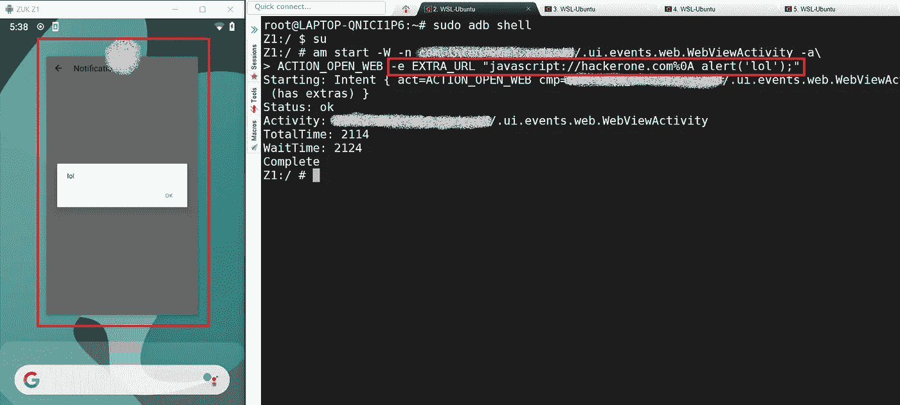
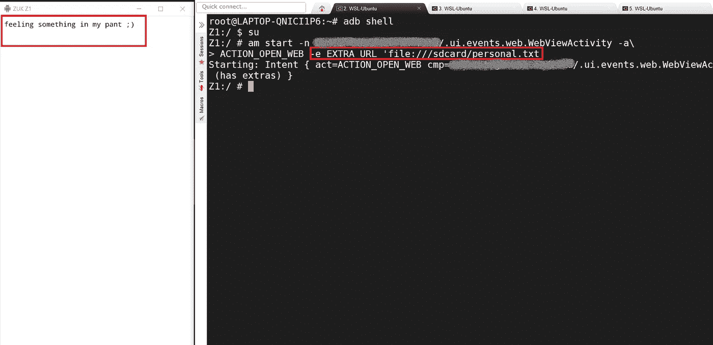

# 不要停留在一个错误上

> 原文：<https://infosecwriteups.com/dont-stop-at-one-bug-d3c56806b5?source=collection_archive---------2----------------------->

单个程序中的 3 个严重错误[本地文件窃取、Java Script 注入、打开重定向]

## 首先我要感谢所有支持我的读者:)

大家好，

今天我要谈谈我在一个私人项目上提交的东西，在这个项目上，我提交了三个关键的 bug，它是基于#Android 的。每当谈到 android bug 赏金，我更喜欢从反编译 APK 开始。不过这次我确实用了“[JADx-GUIT5”。](https://github.com/skylot/jadx/releases)

为了更好地理解，我将使用一个示例应用程序。

你只需要打开 JADx-GUI →文件→打开文件→company-app . apk & Open "*androidmanifest . XML*"

现在你需要搜索" *AndroidManifest.xml* "中的***Android:exported = " true "***活动，我找到了一个。

> 点击此链接了解更多关于***Android:exported = " true ":***[https://developer . Android . com/guide/topics/manifest/activity-element](https://developer.android.com/guide/topics/manifest/activity-element)

> **注意:**“导出”的活动、服务或内容可以被其他应用程序访问。这使得导出的组件易受攻击。；)

问题来了——我们可以如何利用什么样的漏洞？

让我们弄清楚:例如，考虑活动名称为**"*app . company . ui . events . web . webview activity*"**

在 JADx-GUI 中打开此活动→搜索“ *SetJavascriptEnable* ”

> 点击此链接了解关于“***setjavascript enable***”
> [https://developer . Android . com/reference/Android/WebKit/web settings # setjavascript enabled](https://developer.android.com/reference/android/webkit/WebSettings#setJavaScriptEnabled)

> 您可以看到该活动包含" *SetJavaScriptEnabled* "

现在关注两个方面:

**片段#1**

* * Code:→**"*intent . putextra(" EXTRA _ URL "，str)；"***

在 android 中"***【putExtra】****(String name，str)* "用于将扩展数据添加到 intent 中。它有两个参数，第一个指定了**名称**中的哪一个额外数据，第二个参数是**数据**本身。

**片段#2**

**代码:→ " ***loadUrl(getIntent()。getstring EXTRA(" EXTRA _ URL ")；"***

在这种情况下，***getIntent****()*返回开始这个活动的意图。如果你用一些数据开始一项活动。

> 让我们把它变得非常简单和简短，**"*intent . putextra(" EXTRA _ URL "，str)；"*** 的意思是，你可以把***【EXTRA _ URL】***看成一个变量&***getStringExtra(" EXTRA _ URL "))***这里用来从***【EXTRA _ URL】***变量中获取数据或值。

# **概念验证**

1.  再现 **OpenRedirect** :

*am start-W-n app . company/. ui . events . WEB . webview activity-a*ACTION _ OPEN _ WEB*-e EXTRA _ URL*[*https://evil.com*](https://evil.com)

2.再现 **Javascript 注入**:

***app . company . ui . events . web . webview activity***不验证传递给 intent 的数据，因此该活动也容易受到 Javascript 注入的攻击。

*am start-n app . company/. ui . events . WEB . webview activity-a ACTION _ OPEN _ we B- e EXTRA _ URL " JavaScript://Google . com % 0A alert(lol)；"*

3.再现**本地文件窃取**:

该错误可能:
→在应用程序沙箱中显示令牌、授权、配置等
→在应用程序沙箱中显示用户数据
→访问“/sdcard”数据，如果允许的话

am start-n*app . company*/. ui . events . WEB . webview activity-a ACTION _ OPEN _ we B- e EXTRA _ URL ' file:///SD card/personal . txt '

这就是我如何在一个私人程序中报告三个关键错误的。嘣！！！$$$$

我很高兴与你们所有人联系:)我希望你能得到一些动力去做 bug 赏金，并在下一篇文章中再次见到你。

*推特简介:@* [Dheerajmadhukar](https://twitter.com/Dheerajmadhukar)

*Linkedin 个人资料:@*[dheerajtechnolegends](https://www.linkedin.com/in/dheerajtechnolegends/)