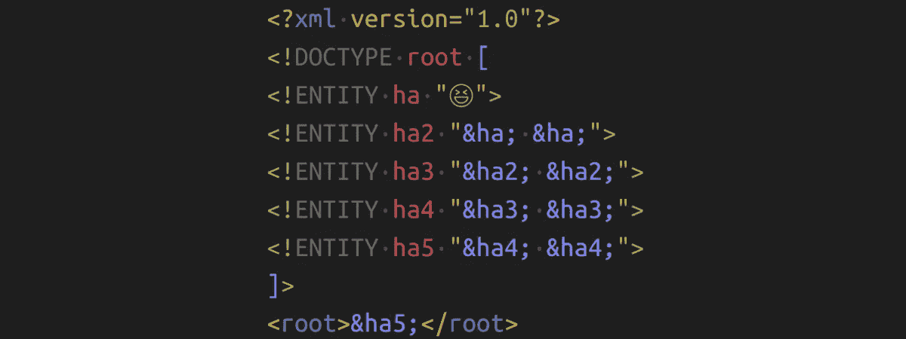

# 通过十亿次大笑😈

> 原文：<https://infosecwriteups.com/dos-via-a-billion-laughs-9a79be96e139?source=collection_archive---------1----------------------->

## 通过重复引用消耗任意多的 RAM



作者图片

T 何亿笑攻击从 2003 年开始为人所知([来源](https://cve.mitre.org/cgi-bin/cvename.cgi?name=CVE-2003-1564))。该攻击使用 XML 文件中的引用，如果所有引用都展开，就会使一个小的源文件在内存中变得很大。它也被称为 LOL 炸弹、XML 炸弹，或者是 YAML 炸弹和 git 炸弹的变体。这是一种拒绝服务(DOS)攻击，因为它可以关闭服务。

# 为什么你应该关心

这个有点太具体了，在很多新闻文章里看不出来。然而，有几个大型项目多年来都很脆弱:

*   2003 年:libxml2 易受攻击([CVE-2003–1564](https://cve.mitre.org/cgi-bin/cvename.cgi?name=CVE-2003-1564))
*   2015 年:MediaWiki 易受攻击([CVE-2015–2942](https://cve.mitre.org/cgi-bin/cvename.cgi?name=CVE-2015-2942))
*   2016: [libxml2](https://en.wikipedia.org/wiki/Libxml2) 易受攻击…再次([CVE-2016–3705](https://cve.mitre.org/cgi-bin/cvename.cgi?name=CVE-2016-3705))
*   2016: HTTP/2 头压缩被用来构建一个 HPACK 炸弹([CVE-2016–6581](https://nvd.nist.gov/vuln/detail/CVE-2016-6581))
*   2019: Kubernetes 易受攻击([来源](https://github.com/kubernetes/kubernetes/issues/83253)，[CVE-2019–11253](https://nvd.nist.gov/vuln/detail/CVE-2019-11253))
*   2019: [c3p0](https://www.mchange.com/projects/c3p0/) (JDBC 数据库驱动)易受攻击([CVE-2019–5427](https://nvd.nist.gov/vuln/detail/CVE-2019-5427))

# 它是如何工作的

下面的 XML 定义了一个实体`ha`，然后是一个实体`ha2`，它包含了两次`ha`。这种模式不断重复。这意味着`ha5`间接包含了`ha`的 16 倍。你可以看到指数增长，不是吗？

```
<?xml version="1.0"?><!DOCTYPE root [
<!ENTITY ha "😆">
<!ENTITY ha2 "&ha; &ha;">
<!ENTITY ha3 "&ha2; &ha2;">
<!ENTITY ha4 "&ha3; &ha3;">
<!ENTITY ha5 "&ha4; &ha4;">
]><root>&ha5;</root>
```

有了`ha31`，我们将有两个⁰时报😆。那是十亿次大笑。请注意这是多么的不对称:对于一个小于 1kB 的文档，攻击者可以让解析器消耗大约千兆字节的内存。这很容易耗尽机器的所有内存，从而使其不可用，直到解析器被终止或机器重新启动。

**亿笑攻击**的一个细微变化叫做**二次爆破**。

请注意，类似的攻击可能在其他文件格式，如 YAML。这里的关键点是那些格式有引用。

# 我如何抵御十亿次笑声？

假设您无法直接控制输入，并且根本无法阻止带有攻击的 XML 攻击您，我可以想到 4 种方法:

*   **对引用的惰性评估**:不是一次评估整个文档，而是仅在必要时解析引用。这可能会解决一些问题。
*   **不评估引用**:把危险的特性扔出窗外肯定意味着你不再容易受到攻击。但是，您需要确保它不会影响您的用户。沟通这一点可能很难。
*   **引用递归深度限制**:解析器本身可以意识到这个问题，并在停止评估引用时设置一个阈值。然而，这也可能导致误报——文档没有被解析，因为解析器认为这是一种攻击。
*   **RAM 限制**:您可以在资源限制下运行可能执行十亿次攻击的代码。这意味着执行线程/进程接收到一个(可捕获的)异常，并可以继续正常执行。这可能特别意味着，即使没有抛出异常，系统的其余部分也可能是正常的。只有那个线程/进程可能被杀死。

那么，如何用 Python 来做这件事呢？

对于 XML，最简单的解决方案是使用由 Diederik van der Boor 指出的 [defusedxml](https://pypi.org/project/defusedxml/) 包(谢谢！)

资源限制是最容易的:

限制解析器有时是可能的，有时是不可能的。这取决于您的解析器。有些有类似`resolve_entities` ( [lxml](https://lxml.de/api/lxml.etree.XMLParser-class.html) )的参数。

限制最大解压缩大小是针对 HTTP/2“HPACK”炸弹进行的([来源](https://python-hyper.org/projects/hpack/en/latest/security/CVE-2016-6581.html#the-solution))。

# 请参见

凯特·墨菲写了一篇关于 git 炸弹的很棒的文章，看看吧！

[](https://kate.io/blog/git-bomb/) [## 爆炸式的 Git 仓库

### 如果你是一个喜欢冒险的人(并且能够处理潜在的重启),我邀请你克隆这个小小的 repo: $ git 克隆…

kate.io](https://kate.io/blog/git-bomb/) 

# 下一步是什么？

在这个关于应用安全(AppSec)的系列文章中，我们已经解释了攻击者的一些技术😈以及防守队员的技术😇：

*   第 1 部分: [SQL 注入](https://medium.com/faun/sql-injections-e8bc9a14c95)😈
*   第二部:[不要泄露秘密](https://levelup.gitconnected.com/leaking-secrets-240a3484cb80)😇
*   第 3 部分:[跨站脚本(XSS)](https://levelup.gitconnected.com/cross-site-scripting-xss-fd374ce71b2f) 😈
*   第 4 部分:[密码哈希](https://levelup.gitconnected.com/password-hashing-eb3b97684636)😇
*   第五部分: [ZIP 炸弹](https://medium.com/bugbountywriteup/zip-bombs-30337a1b0112)😈
*   第六部分:[验证码](https://medium.com/plain-and-simple/captcha-500991bd90a3)😇
*   第 7 部分:[电子邮件欺骗](https://medium.com/bugbountywriteup/email-spoofing-9da8d33406bf)😈
*   第 8 部分:[软件组成分析](https://medium.com/python-in-plain-english/software-composition-analysis-sca-7e573214a98e) (SCA)😇
*   第九部分: [XXE 袭击事件](https://medium.com/faun/xxe-attacks-750e91448e8f)😈
*   第十部分:[有效的访问控制](https://levelup.gitconnected.com/effective-access-control-331f883cb0ff)😇
*   第十一部分: [DOS via 十亿次大笑](https://medium.com/bugbountywriteup/dos-via-a-billion-laughs-9a79be96e139)😈

这即将到来:

*   CSRF😈
*   磁盘操作系统😈
*   凭据填充😈
*   密码劫持😈
*   单点登录😇
*   双因素认证😇
*   备份😇
*   磁盘加密😇

如果您对更多关于 AppSec / InfoSec 的文章感兴趣，请告诉我！