# ARM 中的双自由()攻击(上)

> 原文：<https://infosecwriteups.com/double-free-attacks-in-arm-part-one-4519eee6770a?source=collection_archive---------1----------------------->

## 介绍

让我们继续我们在 ARM 中的堆利用系列。如果你是这方面的新手，请查看下面的文章来掌握一些基本知识。

[https://medium . com/@ ad 2001/list/arm-exploitation-b 558826 b 8 c 7e？source = my _ lists-1-b 558826 b8 c7e-](https://medium.com/@ad2001/list/arm-exploitation-b558826b8c7e?source=my_lists---------1-------b558826b8c7e---------------------)

在本文中，我们将深入研究**双自由**bug。那么什么是双免 bug 呢？

所以基本上这是一个漏洞，当一个变量被**释放两次**时就会出现。当我们多次尝试释放()一个资源时，就会破坏堆分配器的数据结构。

更多详情，你可以查看下面的链接。

 [## CWE - CWE-415:双倍免费(4.8 英镑)

### 常见弱点枚举(CWE)是软件弱点的列表。

cwe.mitre.org](https://cwe.mitre.org/data/definitions/415.html) 

## 双重免费介绍()

让我们来看一个例子。

> # include <stdio.h># include<malloc . h>int main(){
> 
> char * a =(char *)malloc(10)；
> char * b =(char *)malloc(10)；
> char * c =(char *)malloc(10)；
> 
> printf("a 在内存%p \n "，a)；
> printf("b 在内存%p \n "，b)；
> printf("c 在内存%p \n "，c)；
> 
> 自由(一)；
> printf("释放 a \ n ")；
> 
> 自由(b)；
> printf("释放 b \ n ")；
> 
> 游离(c)；
> printf("释放 c \ n ")；
> 游离(c)；
> printf("释放 c 两次\ n ")；
> 
> 返回 0；
> 
> }</stdio.h>

 [## 双人免费 Pastebin.com

### 自 2002 年以来，Pastebin.com 一直是头号粘贴工具。Pastebin 是一个网站，在那里你可以在线存储一组文本…

pastebin.com](https://pastebin.com/9iDpnJHV) 

在 GCC 中编译这个源代码。

> pi @ raspberrypi:~/ASM/tmp $ gcc double-free . c-o db

所以程序里有 3 个指针。

> char * a =(char *)malloc(10)；
> char * b =(char *)malloc(10)；
> char * c =(char *)malloc(10)；

所以程序中有 3 个指针，在堆中有三个内存位置。它们被逐个释放，但是在最后一种情况下，指针 c 被释放了()d 两次。

让我们运行一下，看看会发生什么。

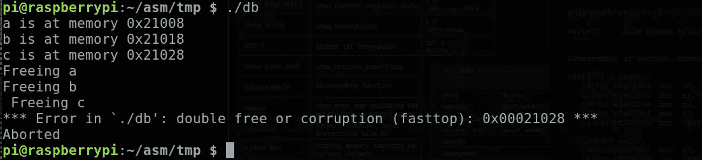

正如您在第三个案例中看到的，程序由于双释放损坏而中止。程序中的双重释放错误被发现，执行被中止。

所以问题来了，如果在程序中发现了这个错误，那么这个错误现在怎么还存在，或者我们如何利用它？

如果我们再看一下错误消息，它说:

> “***错误在`。/db': double free 或 corruption(fast top):0x 00021028 * * * "

那么什么是 fasttop 呢？

这是防止双免漏洞的简单检查。它检查容器的顶部是否不是我们要添加到容器中的记录。

例如，当我们释放一个块时，它将被添加到相应的 bin 中。如果要释放的块与相应库顶部的块相同，则不会添加该块。在快速箱的情况下，这种检查是快速的。所以我们知道我们不能连续两次释放一个块。

那么有没有办法绕过这个检查，两次释放一个块呢？

是的，因为检查只针对箱中最上面的记录。我们可以通过释放中间的另一个块来轻松地绕过它，并且我们可以再次释放被释放的块。例如，要双重释放指针 c(上例)，我们首先释放 c，然后**释放 a 或 b** ，这将绕过 fasttop 检查，最后我们可以再次释放指针 c。这将再次释放 c 中的内存位置，导致双重释放错误。

让我们来看看实际情况

首先让我们编辑代码并重新编译代码。

> # include <stdio.h># include<malloc . h>
> int main(){
> 
> char * a =(char *)malloc(10)；
> char * b =(char *)malloc(10)；
> char * c =(char *)malloc(10)；
> 
> printf("a 在内存%p \n "，a)；
> printf("b 在内存%p \n "，b)；
> printf("c 在内存%p \n "，c)；
> 
> 自由(一)；
> printf("释放 a \ n ")；
> 
> 自由(c)；
> printf("释放 c \ n ")；
> 免费(b)；printf("释放 b:绕过 fastbin 顶部检查\ n ")；
> 自由(c)；
> printf("再次释放 c \ n ")；</stdio.h>
> 
> 返回 0；
> 
> }

 [## 编辑双自由-Pastebin.com

### Pastebin.com 是自 2002 年以来排名第一的粘贴工具。Pastebin 是一个网站，在那里你可以在线存储一组文本…

pastebin.com](https://pastebin.com/WL09Yhk2) 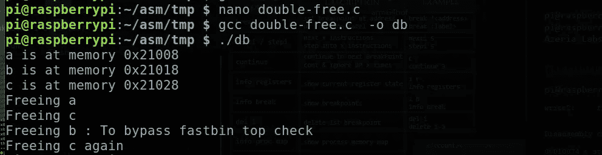

正如我们现在所看到的，我们已经成功绕过了 topcheck，触发了双重释放漏洞。

## 让我们看下一个例子。

> # include <stdio.h># include<malloc . h>
> struct s {
> int num；
> }；
> int main(){
> struct s * a，*b，*c，*d，*e，* f；</stdio.h>
> 
> a = malloc(sizeof(struct s))；
> printf(" a at % p \ n "，a)；
> T2 b = malloc(sizeof(struct s))；
> printf("b 在%p \n "，b)；
> c = malloc(sizeof(struct s))；
> printf(" c at % p \ n "，c)；
> 
> 自由(一)；
> printf("释放 a : %p \n "，a)；
> 
> 自由(c)；
> printf("释放 c : %p \n "，c)；
> 
> 自由(b)；
> printf("释放 b : %p \n "，b)；//绕过 top check
> 
> free(c)；
> printf("再次释放 c:% p \ n "，c)；//Double free
> 
> printf("被释放的 bin 将被添加到相应的 bin 中\ n ")；
> printf("现在我们再次使用 malloc 将内存分配到三个指针 d、e 和 f \ n ")；
> printf("由于指针 d、e 和 f 与先前分配的块具有相同的大小，所以它们将被分配刚刚被释放()d 并被添加到 fastbin 的块\ n ")；
> d = malloc(sizeof(struct s))；
> printf("d 在%p \n "，d)；
> e = malloc(sizeof(struct s))；
> printf(" e at % p \ n "，e)；
> 
> f = malloc(sizeof(struct s))；
> printf(" f at % p \ n "，f)；
> 
> d->num = 1111；
> printf("d- > num 被赋值给 1111 \ n ")；
> 
> f->num = 2222；
> printf("f- > num 被赋值给 2222 \ n ")；
> 
> printf("现在让我们打印 e- > num 和 d- > num \n 的值")；
> 
> printf(" d->num 是%d \n "，d->num)；
> printf("f- > num 是%d \n "，f->num)；
> 
> }

 [## 双人免费 2-Pastebin.com

### Pastebin.com 是自 2002 年以来排名第一的粘贴工具。Pastebin 是一个网站，在那里你可以在线存储一组文本…

pastebin.com](https://pastebin.com/QZasDRxd) 

编译并运行程序。

让我们检查输出。

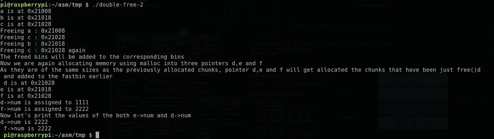

首先，我们为指针 a、b 和 c 分配三个内存位置，然后我们释放它们，这样它们将被添加到相同大小的 fastbin 中。然后我们为接下来的三个指针(d，e，f)分配内存。

正如我们在结果中看到的,“d”得到了“c”的位置:0x21028(因为 c 是最后一个被释放的块，它被添加到了 fastbin 的头部)。

' e '将获得' b '的内存位置，最后' f '将再次获得' c '的内存位置(0x21028)。

嗯……所以你们都会想这怎么可能呢？

我在这篇文章的开始已经说过了，以便熟悉快速垃圾箱以及它们是如何工作的。如果你对垃圾箱没有概念，请仔细阅读前面的文章。

## 故障

现在，让我们一步一步地完成这个过程。

当我们释放“a”时，它将被添加到大小为 0x10 (16)的 fastbin 中。让我们使用 gdb 来检查这一点。

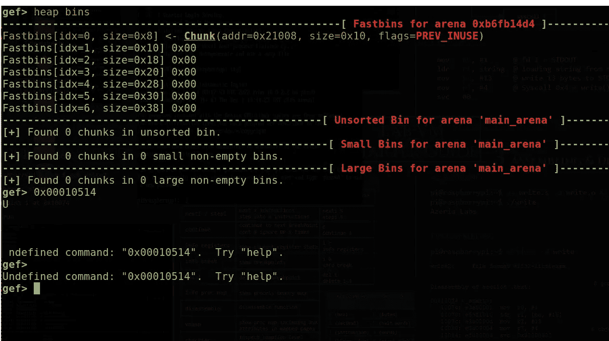

正如您现在看到的，块被添加到了 fastbin 中，但它被添加到了 0x8 fastbin 中，但块的实际大小是 0x10。不要搞混了，最小大小的 fastbin 是 0x10 (16)没有大小为 0x8 的 fastbin。这只是 gef 中的一个 bug。这通常添加在 0x10 fastbin 中，如块的大小所示。

让我们想象一下。

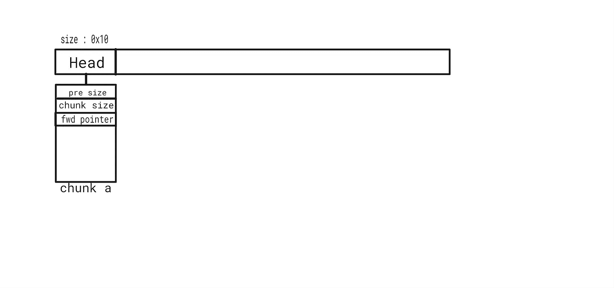

新添加的块将被添加到 bin 列表的头部。(后进先出方式)。此处 fwd 指针为空，因为 bin 中没有其他空闲块。

让我们释放 c，看看会发生什么。我们释放“c”而不是“b”的原因是为了绕过顶部检查。我们将在释放 c 之后释放 b。

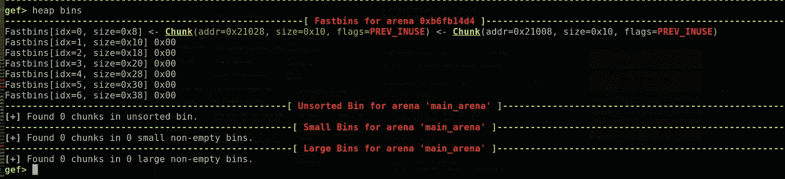

现在，c(地址:0x21028)被添加到 0x10 fastbin 的开头。

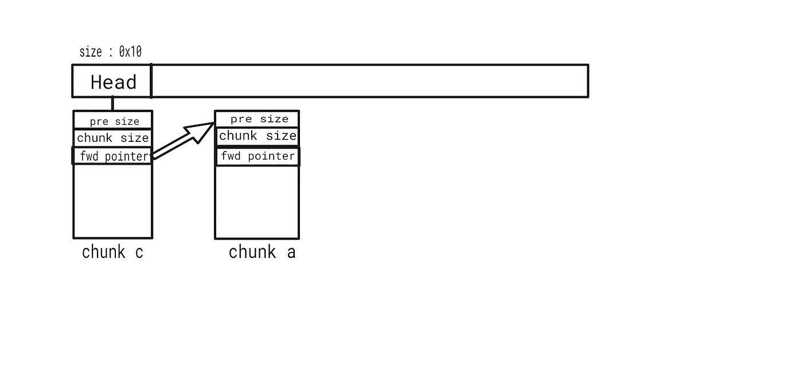

块‘a’先前在头部位置，现在头部指向块‘c’，并且块‘c’的正向指针被设置为指向块‘a’的地址。

那么正向指针是用来做什么的呢？

前向指针(fwd)是指向特定 fastbin 中的下一个块的指针。当 fwd 为 NULL 时，表示列表结束。它可用于链接容器中的块。这可以跟踪列表中可用的空闲块。

fwd 在双自由攻击中非常重要，我们稍后会看到这一点。

让我们检查组块 c 来验证这个理论。

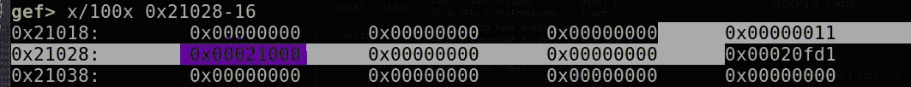

紫色标记的区域是前向指针，它指向块“a”。但是‘a’的地址是 0x21008，正向指针的地址是 0x21000。这是因为前向指针指向位于位置 0x21000 的块‘a’的‘prev size’报头部分。这也是被释放块的元数据的一部分。但是当我们使用 gef 检查数据块时，它显示数据块从 0x21008 开始，因为它没有考虑这个“prev size”元数据(在本例中没有设置)。

所以这验证了我们的理论。

让我们释放 b 并进行检查。

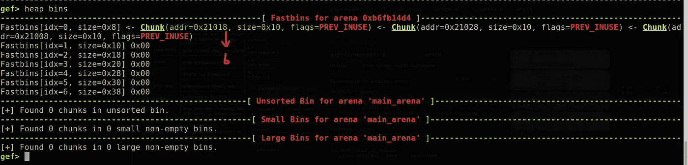

现在，头部指向 0x21018 处的块‘b’，块‘b’的正向指针被调整为指向块‘c’。

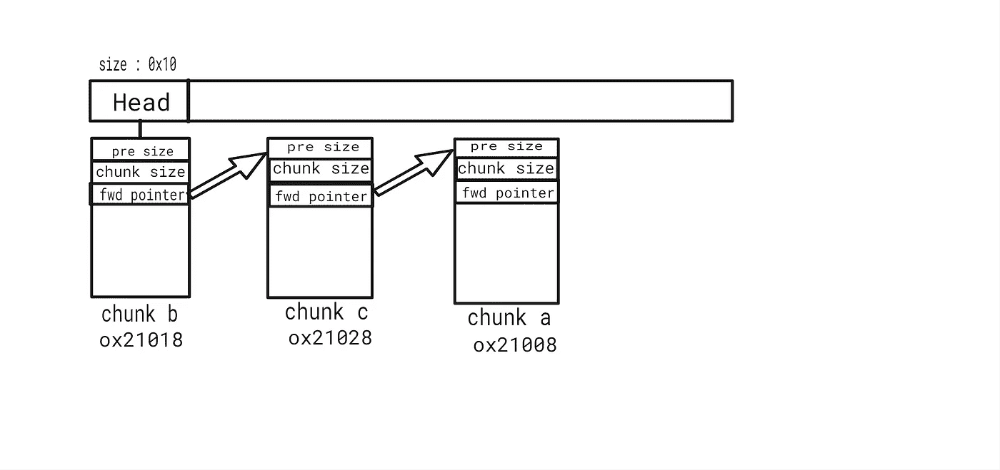

现在是最重要的部分。这就是双重自由发生的地方。我们将再次释放指针 c。

让我们在再次释放“c”后用 gef 检查。

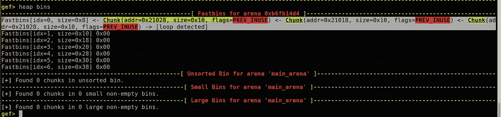

如果您使用“堆箱”命令检查 fastbin，您会看到一些奇怪的东西。如果您查看 fastbin 中的条目，我们释放以触发 double free 的块‘c’再次被添加到 0x10 fastbin 的头部。gef 已检测到这种情况，并说“检测到循环”。

让我们形象化地理解为什么这是一个循环。

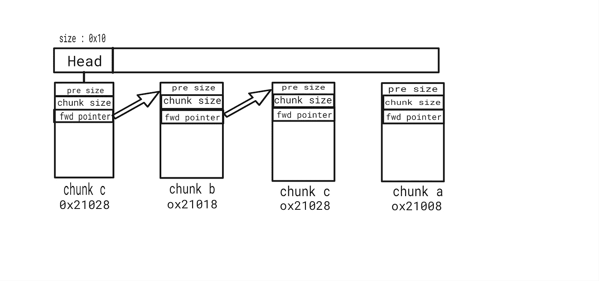

当块‘c’被释放时，它再次被添加到 fastbin 的头部，并且块‘c’的前向指针被重新调整以指向块‘b’。到块“a”的链接从块“c”中移除。所以在 fastbin 中没有到块“a”的链接。

让我们把这张图改成更准确的表示法。

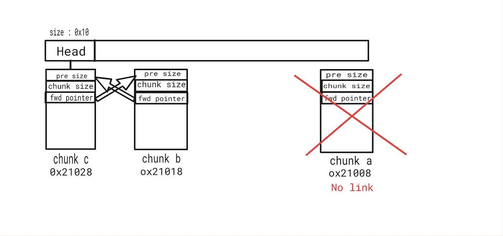

块 b 和块 c 像一个循环一样指向彼此。

现在让我们为指针 d、e 和 f 分配内存。

> d = malloc(sizeof(struct s))；
> printf(" d at % p \ n "，d)；
> 
> e = malloc(sizeof(struct s))；
> printf(" e at % p \ n "，e)；
> f = malloc(sizeof(struct s))；
> printf(" f at % p \ n "，f)；

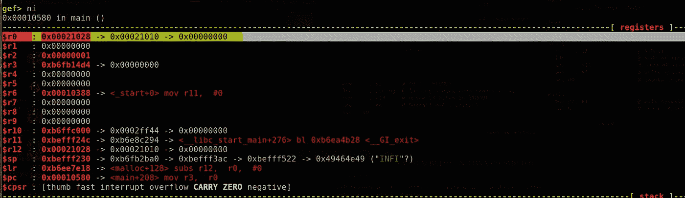

如您所知，fastbin 以 LIFO 方式工作，因此添加到 fastbin 中的最后一条记录将首先被删除，或者如果 malloc 请求相同的大小，则由 fastbin 中的头指向的块将被分配给下一个 malloc 请求。因此，指针“d”将获得块“c”(0x 021028)的内存空间，并且头将指向 fastbin 中的下一个被释放的块，即块“b”。这个位置使用 fwd 指针来标识。

如果我们现在使用“heap bins”命令检查 fastbin，我们可以看到位于 fastbin 头部的块“c”被删除，头部现在指向块“b”(0x 21018)。

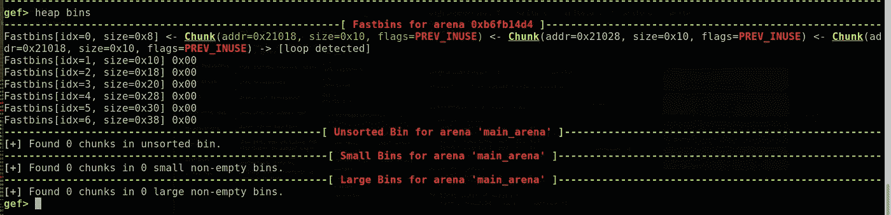

但是即使我说它被移走了，由于双自由引起的循环，它在技术上并没有被移走。这是因为块‘b’的 fwd 仍然指向块‘c ’,所以这会欺骗堆分配器，让它认为块‘c’在 fastbin 中仍然是空闲的和可用的，即使它正在被分配和使用。这是因为堆分配器使用 fwd 来跟踪 bin 中的可用空闲块。因此，块“c”仍被视为空闲块，并且在 fastbin 中可用。这将形成一个循环链，其中头指向块‘b’，块‘b’指向块‘c’，块‘c’也指向块‘b’。

现在让我们看看图表。

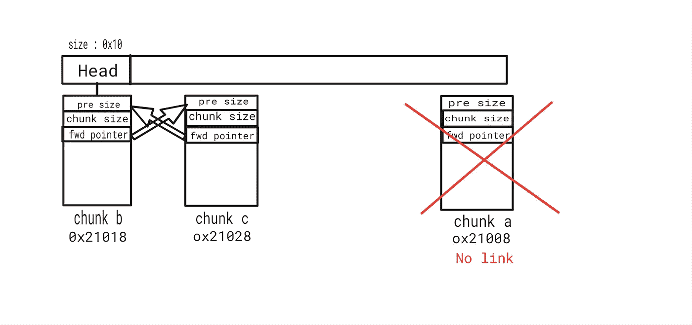

现在让我们为指针“e”分配空间。正如你已经猜到的，现在‘e’将获得块‘b’(0x 21018)的内存空间，它位于 fastbin 的头部。

如果您使用 gef 进行检查，您可以看到这一点。

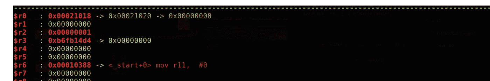

$r0 包含 malloc()为指针“e”返回的地址。这包含 0x21018，它是 fastbin 中被释放的块‘b’的地址。同样，fastbin 的头现在指向块‘c’，块‘b’的 fwd 指针指向块‘c’。

让我们看看 fastbin 中的块图以及 gef 中“堆箱”的输出。

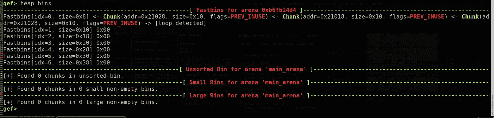

如果继续执行，指针“f”将被分配到位于列表头部的块“c”(0x 21028)的内存位置，并且头部被更新到块“b”(0x 21018)。

让我们最后一次检查这个。

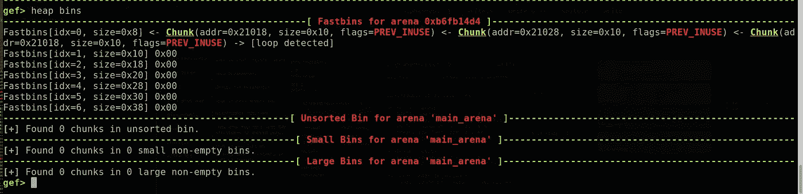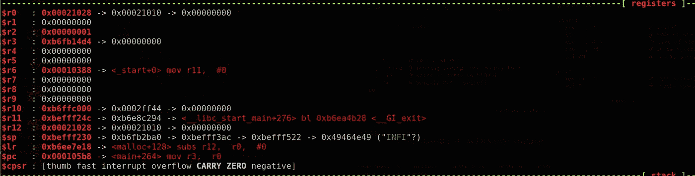

$ro 包含 malloc 返回的内存位置。

因此，我们可以得出结论，作为 double-free 错误的结果，它返回**块‘b’和块‘c’可互换**。这是因为它形成了一个**环。**如果我们继续分配新的内存，我们只会交替分配 **0x21028 和 0x 21018**。

我们可以通过修改这个程序来验证这一点。

> int num
> 
> }；
> 
> int main(){
> 
> struct s * a、*b、*c、*d、*e、*f、*g、* h；
> 
> a = malloc(sizeof(struct s))；
> printf(" a at % p \ n "，a)；
> 
> b = malloc(sizeof(struct s))；
> printf("b 在%p \n "，b)；
> c = malloc(sizeof(struct s))；
> printf("c 在%p \n "，c)；
> 
> 自由(一)；
> printf("释放 a : %p \n "，a)；
> 
> 自由(c)；
> printf("释放 c : %p \n "，c)；
> 
> 自由(b)；
> printf("释放 b : %p \n "，b)；//绕过 top check
> 
> free(c)；
> printf("释放 c : %p 再次\n "，c)；//Double free
> 
> printf("释放的 bin 将被添加到相应的 bin 中\ n ")；
> printf("现在我们再次使用 malloc 将内存分配到三个指针 d、e 和 f \ n ")；
> printf("由于指针 d、e 和 f 与先前分配的块具有相同的大小，所以它们将被分配刚刚被释放()d 并被添加到 fastbin 的块\ n ")；
> d = malloc(sizeof(struct s))；
> printf("d 在%p \n "，d)；
> e = malloc(sizeof(struct s))；
> printf(" e at % p \ n "，e)；
> f = malloc(sizeof(struct s))；
> printf(" f at % p \ n "，f)；
> T42【g = malloc(sizeof(struct s))；
> printf("g 在%p \n "，g)；
> h = malloc(sizeof(struct s))；
> printf("h 在%p \n "，h)；
> 
> d->num = 1111；
> printf("d- > num 被赋值给 1111 \ n ")；
> 
> f->num = 2222；
> printf("f- > num 被赋给 2222 \ n ")；
> 
> printf("现在让我们打印 e- > num 和 d- > num \n 的值")；
> 
> printf(" d->num 是%d \n "，d->num)；
> printf("f- > num 是%d \n "，f->num)；
> 
> }

 [## 编辑双自由-Pastebin.com

### Pastebin.com 是自 2002 年以来排名第一的粘贴工具。Pastebin 是一个网站，在那里你可以在线存储一组文本…

pastebin.com](https://pastebin.com/DkPse2iT) 

在这个程序中，有额外的指针分配更多的内存。让我们检查输出。

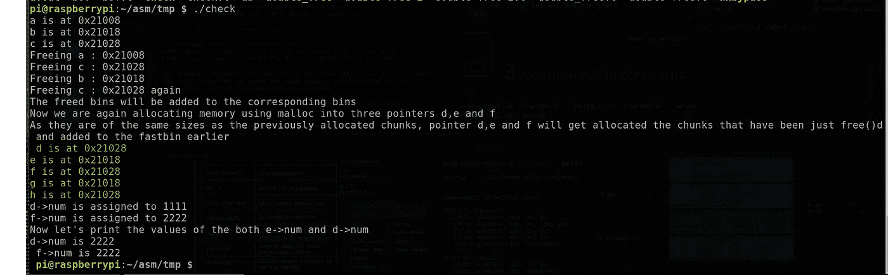

正如您现在看到的，它只交替返回 0x21018 和 0x21028。不管我们尝试 malloc()多少次，堆分配器只会返回这两个内存位置。

现在让我们来探索程序的最后一部分。

> d-> num = 1111；
> printf("d- > num 被赋值给 1111 \ n ")；
> 
> f->num = 2222；printf("f- > num 被赋值给 2222 \ n ")；
> 
> printf("现在让我们打印 e- > num 和 d- > num \n 的值")；
> printf("d- > num 是%d \n "，d->num)；
> printf("f- > num 是%d \n "，f->num)；
> 
> }

如果我们看看这个程序的输出，它将 d->num 和 f->num 的输出打印为 2222，即使两者被赋予不同的值。d->num 被指定为 1111，f->num 被指定为 2222。那么这是什么原因呢？

你们中的一些人现在可能已经明白了。

原因是 d 和 f 都指向**同一个内存位置**。

由于 double free()，e 和 f 都指向 0x021028。

当 d->num 被赋值为‘1111’时，它实际上是将数据写入内存位置‘0x 021028’。稍后，当 f->num 被赋值为“2222”时，它也写入位置 0x021028，该位置与“d”使用的块相同。所以它将值改写为 2222。这就是为什么 d->num 的输出变成了‘2222’。

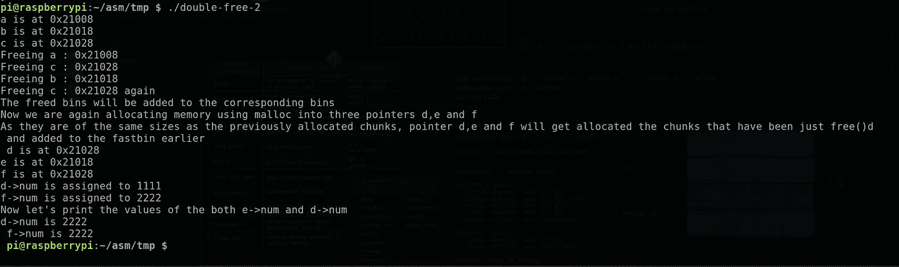

输出

这基本上总结了**双免漏洞**的演示。

在下一篇文章中，我们将对双重释放漏洞进行二进制挑战。

那么，再见

如果有任何疑问，请留言或联系我。

https://www.facebook.com/i.am.ultralegend[脸书](https://www.facebook.com/i.am.ultralegend)

如果你想支持我或者学习 **ARM 开发**请查看我的课程:[https://www . udemy . com/course/reverse-engineering-and-binary-exploitation-in-ARM/？referral code = 8c 725d 513 e 77420 a0cb](https://www.udemy.com/course/reverse-engineering-and-binary-exploitation-in-arm/?referralCode=8C725D513E77420A0CBF)

*参考文献*

[https://azeria-labs . com/heap-exploitation-part-2-glibc-heap-free-bins/](https://azeria-labs.com/heap-exploitation-part-2-glibc-heap-free-bins/)[https://heap-exploitation . dhavalkapil . com/attacks/double _ free](https://heap-exploitation.dhavalkapil.com/attacks/double_free)

*来自 Infosec 的报道:Infosec 上每天都会出现很多难以跟上的内容。* [***加入我们的每周简讯***](https://weekly.infosecwriteups.com/) *以 5 篇文章、4 个线程、3 个视频、2 个 Github Repos 和工具以及 1 个工作提醒的形式免费获取所有最新的 Infosec 趋势！*