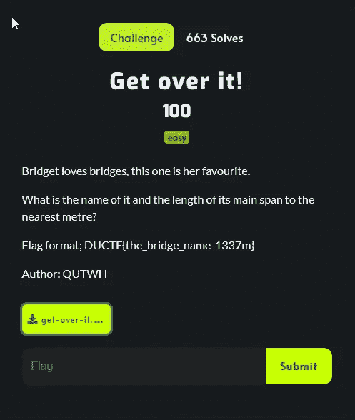
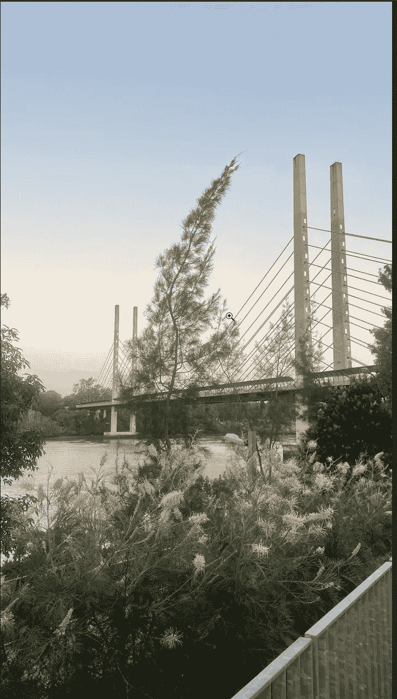
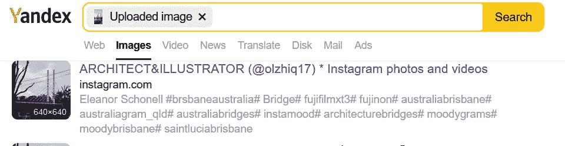
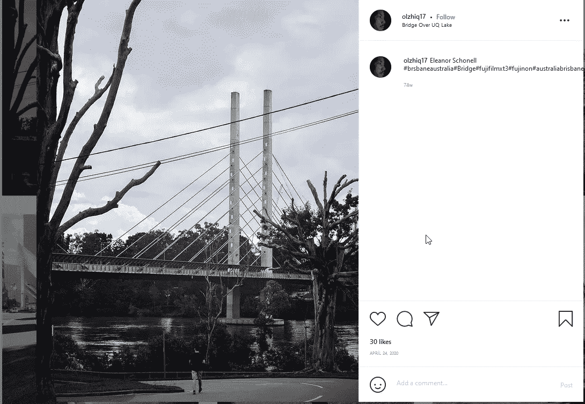

# DownUnderCTF 2021 —克服它！

> 原文：<https://infosecwriteups.com/downunderctf-2021-get-over-it-78a3e02eb2e?source=collection_archive---------1----------------------->

这个挑战是一个新的挑战。

在给定的文件中有一座桥的图像。

在 Yandex 和 Google 中执行图片搜索。我在 Yandex 找到了一条线索。

一位建筑师贴出了这座桥的图片，并分享了“UQ 湖上的桥”的位置。

在谷歌上搜索了这座桥之后，是埃莉诺·肖内尔桥。

同样是用下划线代替空格的标志。