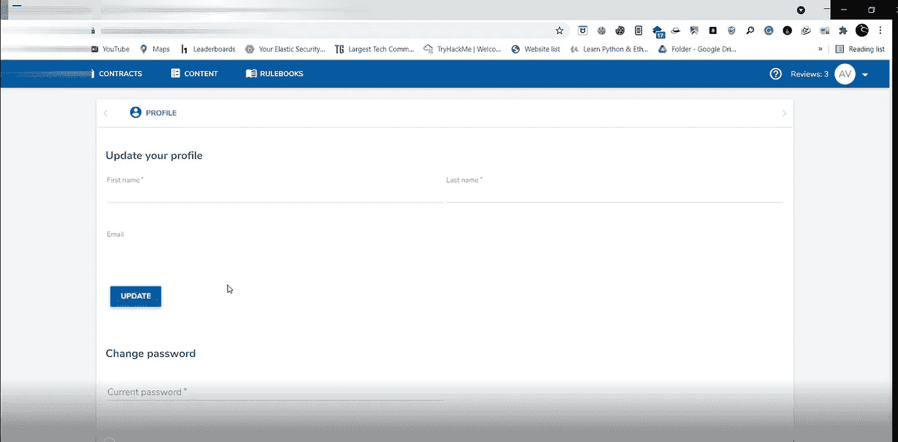
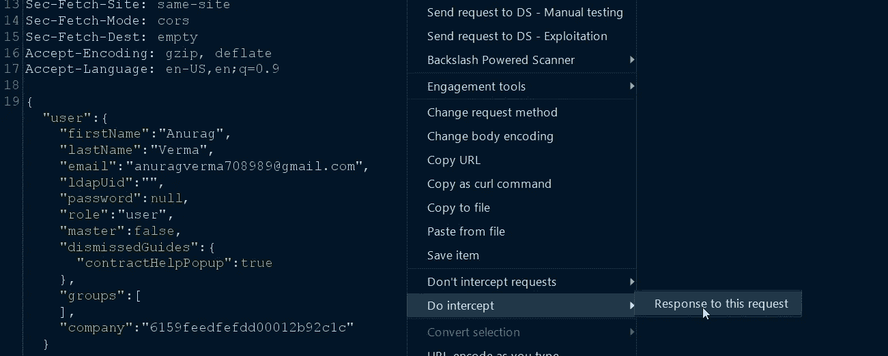
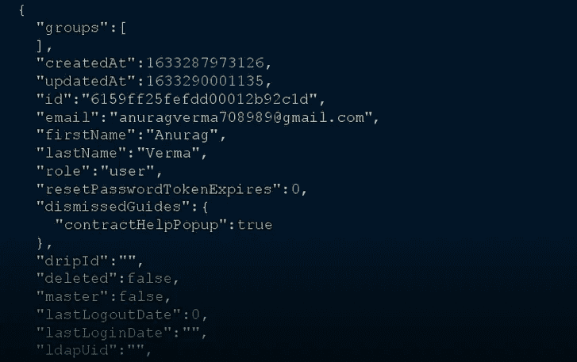
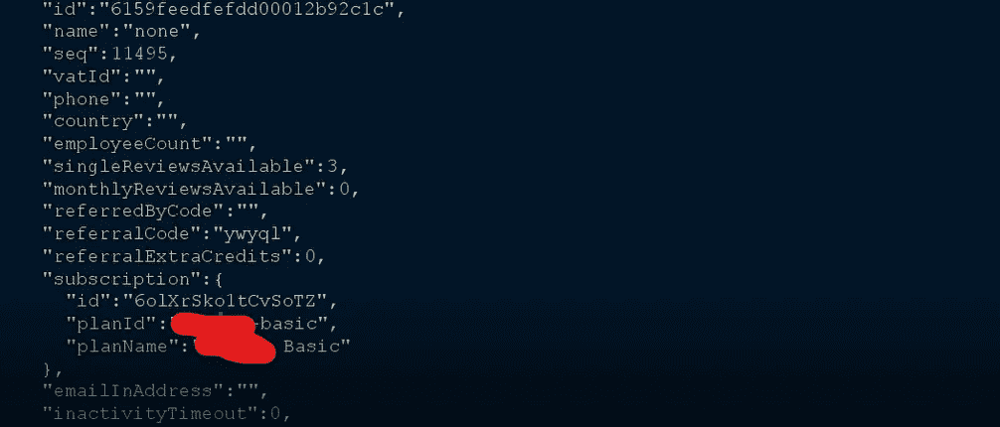
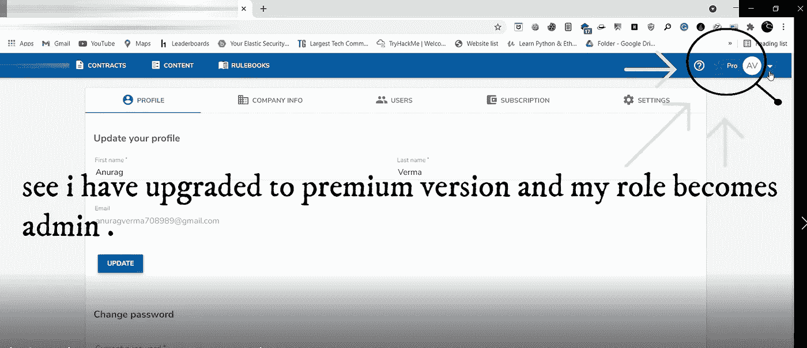

# 通过服务器响应中的对象操作，轻松实现高级帐户访问和管理员角色升级

> 原文：<https://infosecwriteups.com/easy-premium-account-access-and-admin-role-escalation-via-object-manipulation-in-the-server-619d325ab66?source=collection_archive---------0----------------------->

嘿，信息安全极客✌，

希望你们一切都好，下面是我的第**5**篇文章，展示了我如何能够 **将我的帐户升级为高级，并将我的角色升级为管理员**。

我们开始吧，

让我们把目标定为**redacted.com、**

首先，我正常注册并登录到我的帐户，捕获简单的更新配置文件请求并截取对请求的响应，分析来自 API/服务器端的响应对象，

**对服务器的请求**是这样的:

而**的反应**就有些:

一些参数如 ***【角色】:“用户”*** 和另一个带有 ***“计划 Id”:“修订的基本”*** 和 ***“计划名称”:“修订的基本”*** 引起了我的注意。

先把参数改成 ***“角色”:“admin”***就工作了！！但是我想在这个角色中我还能做些什么:这里的管理员不是站点管理员，它只是与特定组/组织相关的管理员或特定帐户的管理员，这使得更多的功能可以与其他员工协作，在这一点上，我已经发现了一个漏洞。但我想到的更多，

然后我又把参数值改成了 ***“角色”:“admin”、“planId”:“redated-Pro”和“planName”:“redated Pro”。***

并提交了响应，然后我就可以以管理员的身份访问高级版本了。

如果你想看这个漏洞的视频概念验证，请查看我的 youtube 频道🎞:[见 _ poc _ 此处](https://youtu.be/OYoGzZ_QajM)

在这里订阅我的频道👩‍💻:[订阅 _ _ 此处](https://www.youtube.com/channel/UCq7-Qf45etdk0qc35I_n7PQ?sub_confirmation=1)

通过 LinkedIn 联系我:[https://www.linkedin.com/in/anurag-verma-650b771a2](https://www.linkedin.com/in/anurag-verma-650b771a2)

在 Instagram 上连接我:varmaanu001