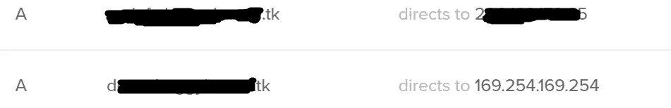
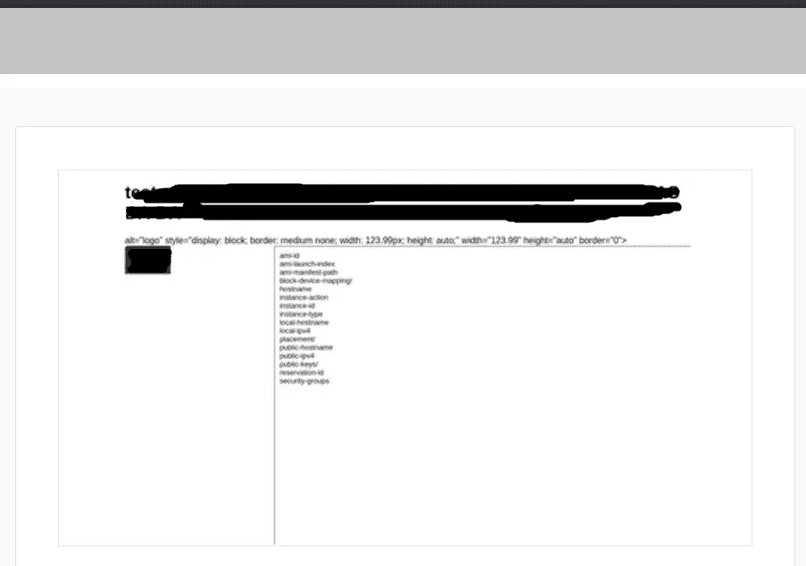

# 使用匹配和替换的简单 SSRF，以及如何让你的打嗝合作者/服务器发疯的奖励

> 原文：<https://infosecwriteups.com/easy-ssrf-using-match-and-replace-and-a-bonus-on-how-to-have-your-burp-collaborator-server-go-b5210037a101?source=collection_archive---------1----------------------->

匹配和替换部分在 burp 的付费和免费版本中都存在，结合下面的链接，这对每个人都有用。

以下是 burp collaborator 的免费替代品之一:

 [## 一个简单的 DNS OOB 出口解决方案，或 pingb.in (life)hack

### 有些时候你想从生活中得到更多的东西，我帮不了你，但是有些时候…

infosecwriteups.com](/a-simple-dns-oob-exfil-solution-or-pingb-in-life-hack-45e6aa44fc49) 

现在，有两种方法可以实现它，其中一种非常愚蠢，但它可能仍然有效:)

**聪明的方法——第一部分**
所以，我在目标网站上注册，它有一个模板区。你可以上传你自己的标志或者使用目标网站提供的标志。现在，我通常不太关心这些，主要是因为它只是图像，并且通常是硬编码在 img src 中的，所以即使得到一个有趣的文本文件，也不会产生可读的结果。但是，我想挑战自己，看看我是否可以获得类似 gopher ssrf 的东西，即使只控制 img src 而不做其他事情(根据 h1 报告[])。但是，我首先必须确定是否有通过 img src 的“常规”pingback 来自内部 ip 或与目标相关的任何 ip，而不是来自我自己的 ip。
为了确定匹配和替换网站到底使用什么，我选择了一个网站提供的徽标，并点击保存以提交更改。我做了所有这些，同时让 burp 捕获目标域的所有流量(它是 widescope，所以我不必担心意外排除相关/重要的子域)。下一步是在请求正文中找到对相关徽标的引用。

从截图中你可以看到这是一个可编辑的 html 代码。这立即表明，没有必要弄清楚如何从受损的 img src 中获取任何东西，特别是当结果表明 iframe 没有被过滤/阻止时(不过它的来源被过滤/阻止了，我稍后将回到这一点)。
重要的是——我收到了一个并非来自我自己的 ip 地址的回应。这意味着是时候弄清楚如何真正得到有用的东西了。

**聪明的方法——第 2 部分**
我使用 iframe src 获得输出，它工作了……某种程度上，我获得了 http pingback，但这并不 100%表明它将获得完整的 ssrf。
然后我试了各种内部 ip 地址，子域，我能想到的任何东西……除了一件事。因为 pingback ip 不属于通常的 aws 解析的 ip，所以我没有尝试，直到花了太多的时间试图找出哪个内部 ip 地址可以给我一些信息(即各种范围 192.168.0.1，192.168.1.1，10.0.0.1，172.x.x.x，127.x.x)。结果发现这些也被屏蔽了。
不过，127.0.0.1 使用 0 的旁路确实有效，但只是显示:
欢迎使用 nginx。这并不是什么需要报告的 bug(我从过去报告过几次的个人经验中知道这一点(:)。
所以，我准备认输，但我想还是用 aws 吧(尽管我完全预料到它会失败):169.254.169.254，但那也是被屏蔽的。但是，如果他们不使用 aws，为什么要屏蔽 aws ip 呢？
这引起了我的好奇，我过去使用的旁路也适用于这种情况:

我得到了:

**哑道**
嗯……这个多半是为了娱乐的目的:)而且以前也提过。只要匹配和替换任何和每个网站参考。如果你真的想找些无聊的事情，也可以在回复体上做，谁知道呢，这可能会有用，如果有用的话，请在评论中告诉我。但是，请准备好让您的 burp 合作者或您的服务器收到一堆 pingbacks。

它只是向您展示，了解 aws 的 ip 地址应该是什么样子并根据它采取行动可能会导致完全错过适当的 ssrf。有时候，无知也可能是一种福气:)