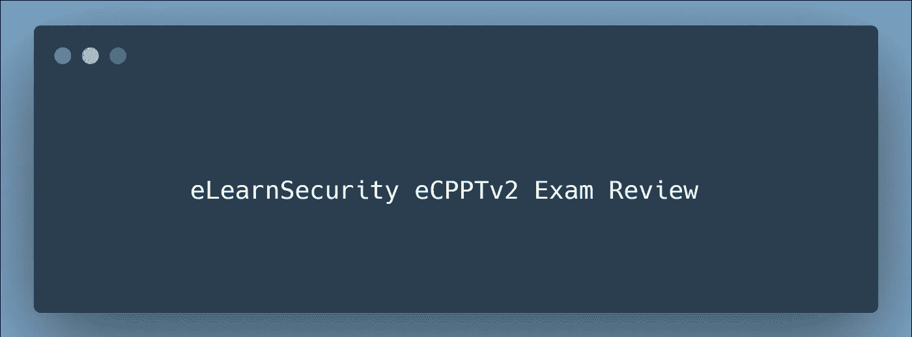

# 电子安全 eCPPTv2 考试复习

> 原文：<https://infosecwriteups.com/ecpptv2-exam-review-f7c4efb6f9aa?source=collection_archive---------0----------------------->

渗透测试领域在过去几年呈指数级增长，竞争也是如此。在一个简短的面试电话中验证和证明你的技能对雇员和雇主来说并不总是一个双赢的局面，这就是各种安全认证发挥作用的地方。各种众所周知的安全认证让组织对他们正在雇用的人充满信心，因为他们已经通过认证考试验证了他们的技能。

eLearnSecurity 提供了一项名为 **eLearnSecurity 认证职业渗透测试员(eCPPT) v2** 的认证，这是一项基于真实生活实践场景的考试。最近给了这个认证，获得了。在发布了这个认证后，很多人在 Twitter 和 LinkedIn 上问我对这个认证的看法和反馈。

在这篇文章中，我将给出一个考试的详细概述和一些第一次尝试的技巧。**请注意，这不是一个赞助的审查/反馈。这是完全诚实和公正的反馈。**

请注意，我没有选择该课程，因为我已经有了考试中要求的先决条件的经验。

# **考试概述**

**考试费用:** $400(含税)——这不包括课件和练习实验室，只包括考试。

**优惠券有效期:**自购买之日起 6 个月

**预调度:**不需要。准备好了就开始

**考试时长:** 7 天考试+ 7 天报到。(如果您在此期限内提交但未通过，您将在 7 天后再次尝试提交)。

**考试时支撑线:**可用&真快。

# **考试门户概述**

1.  您需要使用电子安全门户网站开始考试。
2.  在开始考试之前，请确保您的测试环境设置正确。
3.  一旦你将开始考试，你将有所有需要的测试范围，你可以连接到提供的 VPN，并开始黑客攻击。
4.  7 天之后，您将无法访问考试环境。
5.  你也可以在考试的 7 天内提交一份报告。您将看到一个上传报告的选项。

# **考试总结**

1.  这个考试不是 CTF 式的考试，而是一个基于真实生活场景的考试。
2.  您需要在目标机器上获得一个根级别的 shell，如您的作用域中所定义的那样。
3.  考试环境非常稳定，你可以每天进行有限次数的重置，以防你搞砸了。
4.  由于这是一个基于真实场景的考试，请确保尽可能多地发现和利用漏洞。
5.  请记住，本次考试是模拟渗透测试。
6.  考试有点挑战性，如果你的基本概念薄弱，你会在旋转时看到挑战。

**第一天:塔被征服**

我在上午 11 点左右开始考试，并开始列举东西。从入口点开始，我拍摄了详细的截图，并开始制作粗略的步骤来重现每个确定的问题。我使用 **Joplin** 来管理考试步骤，并以结构化的方式保存截图 target_ip wise。

在最初的几个小时里，我能够在第一台机器上以多种方式获得 root shell，并在范围上做了进一步的扩展。如果你对旋转的基础很清楚，用下一台机器实现 root 是非常容易的。到下午 4 点，我有了 3 个根 shells，下一个目标是缓冲区溢出。

我休息了一会儿，然后在下午 6 点开始黑缓冲区，这是我个人的恐惧。令我惊讶的是，我能够在晚上 7 点在本地复制缓冲区溢出，但当它涉及到利用远程目标时，我不得不挣扎一下。

到晚上 10 点，我能够找到一种方法来实现远程目标中的缓冲区溢出，现在我距离完成考试只有 1 根之遥。我已经检查了 4 个箱子，还有很长的时间，所以我暂停了一下我的考试环境来放松一下。

**第二天:根，根，到处都是！**

第二天，我开始重新开始计数，经过两个小时的争论，我也能够获得最后一个盒子的 root 权限。从技术上来说，在 24 小时内，我在所有 5 个目标上拥有 root 权限，我有粗略的步骤和适当的截图。我很快核实了我是否在报告中遗漏了什么，并记下了所有遗漏的项目。

我开始写报告，第二天就写完了，改天再看。离考试时间还有 3 天。(还有 7 天的报告时间😛。)

我终于在考试结束的第七天提交了我的报告，两天后，我收到了一封漂亮的电子邮件，上面写着**“你现在是 eCPPTv2 了！”**

# **考试提示**

1.  这是一个渗透测试风格，真实的考试，所以要确保写一份高质量的报告，并在需要的地方截取适当的截图。
2.  **练习旋转。我再说一遍旋转很重要。**
3.  了解基于 Windows 和 Linux 的系统的权限提升技术。网络导师有一些非常酷的内容。
4.  学习和练习缓冲区溢出。([https://www.youtube.com/watch?v=qSnPayW6F7U](https://www.youtube.com/watch?v=qSnPayW6F7U))
5.  不要只依赖 Metasploit。这是不受限制的，但是，请确保总是准备好其他选项。
6.  枚举是关键。如果你不擅长列举东西，确保你在考试前学好了。
7.  在 HTB 上练习一些盒子，只是为了更好地了解这些机器是如何制造的，你总是有多种选择来侵入。
8.  这是一个开卷考试，你可以使用谷歌和你的笔记。这个总会派上用场。
9.  不要紧张，你有足够的时间。休息一下，享受你黑盒子的过程。

# **总体反馈**

我真的很喜欢考试的组织方式，它给人一种真实世界渗透测试场景的感觉。然而，我觉得可以减少为这次考试提供的时间，使其更具竞争力。我真的很喜欢我的考试，通过解决一些情况，从一种非常规的方式到最终获得我的第一个实践考试认证，我学到了很多东西，这是一个伟大的旅程。我将向任何想挑战他们的渗透测试技能的人强烈推荐这个认证。

我期待着参加 eLearnSecurity Web 应用程序渗透测试 Extreme (eWAPTX) v2 考试，我希望这将是一次像这样有趣的考试。我再次感谢 eLearnSecurity 团队设计并组织了这次考试。

如果你喜欢阅读**这篇文章，请鼓掌并跟随*媒体。***

***碎碎念:***[***https://www.twitter.com/harshbothra_***](https://www.twitter.com/harshbothra_)

***领英:***[***https://www.linkedin.com/in/harshbothra***](https://www.linkedin.com/in/harshbothra)

***网址:***[***https://harshbothra . tech***](https://harshbothra.tech/)

***会谈:***[**【https://www.youtube.com/playlist?】T42list = plyn 5 _ MxRvV-fxpl 90 I-uebxqzqbxfiay 0**](https://www.youtube.com/playlist?list=PLYn5_MxRvV-fxPL90I-uebXQzQBXfIaY0)

***幻灯片:***[***https://speakerdeck.com/harshbothra***](https://speakerdeck.com/harshbothra)