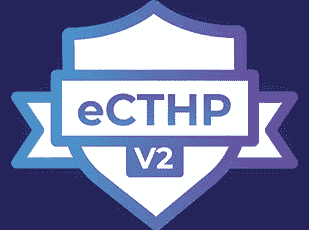

# eCTHPv2 认证经验

> 原文：<https://infosecwriteups.com/ecthpv2-certification-experience-b577db021ef5?source=collection_archive---------0----------------------->

我最近参加了 eLearnSecurity 的认证威胁追踪专业版 2 (eCTHPv2)认证，在第一次尝试通过考试后，我决定分享我的经验。对于那些不知道 eCTHPv2 的人来说，这是一个针对 it 专业人员的关于威胁搜寻和威胁识别的实用认证。我在下面提供了 eLearnSecurity 网站的链接，您可以在那里了解更多关于 eCTHPv2 认证的信息。

 [## eCTHPv2 认证

### eLearnSecurity 的认证威胁搜寻专家是威胁搜寻和威胁…

elearnsecurity.com](https://elearnsecurity.com/product/ecthpv2-certification/) 

# INE 培训材料

eCTHPv2 的培训材料由 INE 提供，包括视频、讲座幻灯片和实验练习(实验需要高级订阅)。培训材料主要关注 Windows 操作系统环境中的搜索，但我发现培训材料和实验室练习都很扎实，只有一些关于过时链接的小问题。实验室练习对我来说是培训中最有价值的部分，帮助我在整个课程中更加熟悉这些工具。

培训材料分为三个模块:

*   威胁追踪简介
*   威胁搜寻:搜寻网络和网络分析
*   威胁搜寻:搜寻端点和端点分析

## 威胁追踪简介

本模块简要概述了什么是威胁搜寻，并向学生介绍了业内使用的不同威胁搜寻术语。该模块还涵盖了猎人的心态，概述了如何进行威胁狩猎演习，以及猎人的心态是否会倾向于威胁情报或 DFIR。

## 威胁搜寻:搜寻网络和网络分析

本课程的下一个模块向学生讲授网络和网络流量分析的基础知识。本模块将逐步介绍使用 NetworkMiner 和 Wireshark 等工具识别正常或恶意网络流量的过程。该模块还教授学生如何对 web shells 执行威胁搜索。

## 威胁搜寻:搜寻端点和端点分析

这是三个模块中最大的一个，也是课程的主干。学生将了解 Windows 操作系统，并学习如何识别 Windows 终端上的正常或恶意活动。该模块向学生讲授恶意软件如何运行，如何使用易失性检测内存中的恶意软件，以及如何利用 ELK/Splunk SIEM 在终端上搜寻恶意活动。

## 额外资源

我发现 INE 的培训材料和实验练习涵盖了我准备考试所需要知道的一切。然而，我发现以下资源对于使用课程中涵盖的工具和概念进行练习非常有用。

**CyberDefenders** 是一个专注于网络安全防御方面的培训平台。我发现这是练习恶意网络流量分析、内存分析、恶意软件分析等的绝佳资源。

 [## 网络卫士:蓝队 CTF 挑战

### CyberDefenders 是#BlueTeams 测试和提升其#网络防御技能的培训平台。

cyberdefenders.org](https://cyberdefenders.org/) 

**Blue Team Labs Online (BTLO)** 是 SBT 发布的一个平台，旨在帮助防御人员练习他们在安全调查和挑战方面的技能，包括网络钓鱼、事件响应、数字取证、安全运营、逆向工程和威胁追踪。有免费和付费两种等级可供选择:

 [## 蓝队实验室在线

### 一个游戏化的平台，供维权者练习他们在安全调查和挑战报道方面的技能；事件…

blueteamlabs.online](https://blueteamlabs.online/) 

**TryHackMe** 是一个网络安全培训平台，提供涵盖工具(如 Splunk、尸检、Wireshark、Volatility、Yara)、取证挑战和面向网络防御的整个学习路径的房间。该平台还提供免费和付费等级:

 [## 网络安全培训

### TryHackMe 是一个免费的学习网络安全的在线平台，使用动手练习和实验室，通过您的…

tryhackme.com](https://tryhackme.com/) 

# 我的考试经历

完成 INE 培训后，我购买了我的 eCTHPv2 考试券。一旦我开始考试，我就通过电子邮件获得了参与范围，其中概述了报告要求，并包含了参加考试所需的一切信息。

在考试中，我得到了一系列真实的威胁搜寻场景，我需要使用 INE 培训材料中展示的工具和技术来调查这些场景。考试总共持续四天。学生可以访问考试实验室环境，在那里他们可以进行调查。考试开始两天后，您将失去对考试实验室环境的访问权限，将有两天时间完成并提交考试报告。

我发现考试很有挑战性，但并不令人难以招架。我认为进入考试实验室环境的两天时间足以执行所有必要的活动，并且我与实验室环境的连接是稳定的。我花了整整两天时间在考试实验室环境中工作，记录了完成报告所需的一切，还休息了一会儿吃饭和睡觉。

我花了接下来的两天时间，根据项目范围中提供的模板完成了检查报告。一旦我对我的报告准备好了感到满意，我就上传了它，一封电子邮件发送给我，确认它已被收到。考试报告评分需要大约 30 个工作日，21 个工作日之后，我收到了一封电子邮件，内容是一份闪亮的新证书在会员区等着我😄！

# eCTHPv2 考试建议

对于任何可能准备 eCTHPv2 考试的人，我在下面列出了一些可能会被认为有帮助的建议。

## 培训材料

*   在阅读培训材料时做笔记，尤其是在实验中，以便在考试时快速查阅。
*   至少完成一次每个实验练习，并理解所演示的概念。
*   我发现 **CyberDefenders** 培训平台是练习课程中介绍的工具和概念的绝佳资源。
*   识别测试活动或恶意软件行为的知识非常重要。我发现 Splunk/ELK SIEM 实验室对于学习如何搜寻恶意活动非常重要，所以花一些额外的时间浏览它们并理解所展示的概念。

## 参加考试

*   仔细阅读业务约定书，并注意信中提供的说明。
*   在我开始准备考试之前，我浏览了每一个寻找威胁的场景，确保我理解了被问到的问题。
*   记录你在考试中采取的每一步，并拍摄大量的截图，以便你以后完成报告时使用。
*   耐心点，慢慢来。快速完成考试没有额外加分，所以请充分利用这四天时间，彻底完成您的威胁搜寻调查。

# 最后的想法

总的来说，我在参加 eCTHPv2 考试时获得了很多乐趣，我建议任何想从威胁追踪开始的人尝试一下 eLearnSecurity Certified Threat Hunting Professional(ect HPV 2)。我发现 INE 教授的课程内容非常好，而且实验室特别有助于我掌握培训材料中展示的工具和技术。谢谢你一直读到最后，祝你考试顺利！