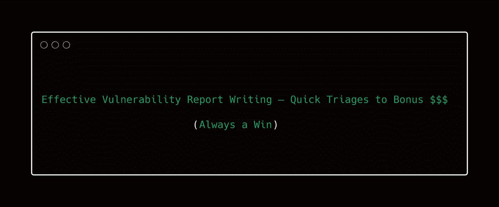
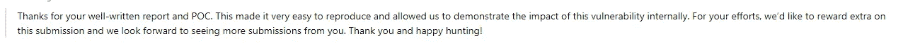
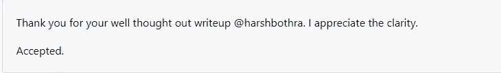
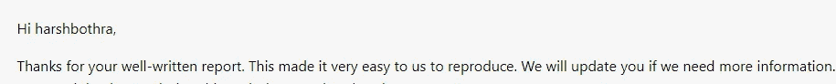
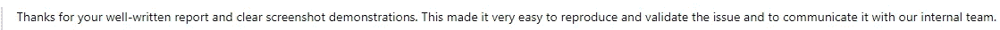

# 有效的漏洞报告撰写—快速分类获得奖金$$$(总是成功)

> 原文：<https://infosecwriteups.com/effective-vulnerability-report-writing-quick-triages-to-bonus-always-a-win-41b37188c63f?source=collection_archive---------1----------------------->

漏洞研究总是有两面性。一个是发现和利用安全漏洞，另一个重要方面是 ***【报告】*** 。从我自己写报告和看别人报告的经验中，我观察到**“写一份有效的报告会导致快速的分类、良好的印象和很多时候的额外收入”。**

嘿，各位黑客，今天，我将写关于“如何写一份有效的漏洞报告”。

**简单地说，我们将讨论:**

*   撰写有效报告的重要性
*   人们经常犯的常见错误
*   报告写作 101
*   了解安全漏洞
*   确定影响
*   正确参考和计算 CVSS 分数
*   重现和概念验证的步骤
*   补救—这很重要
*   报告模板
*   报告样本
*   外卖食品

撰写报告是一个至关重要的过程，它定义了 triager 和客户如何理解您的 bug。你写得越清晰、有效、准确，而不试图虚张声势，双方就越容易快速处理。

作为一名安全人员，当你发现一个看起来有效的漏洞时，你的责任并没有结束。一旦您知道了漏洞，您就必须根据业务及其风险来定义影响。由于安全团队将进行分类，而开发团队将进行修复，如果您能为他们提供一个有效的解决方案，让他们能够快速应用该解决方案来修补问题，那么您会给他们留下良好的印象，并可能获得额外的收入。

**我的想法:**如果我发现了一个 bug，而且几年都没有修复，除了你赚了一些钱之外，没有必要让公司注意这个 bug，但是唯一的目的“数据安全”仍然是一样的。

# **一些常见错误**

(附:无意冒犯)

1.  **使用不专业的语言:**我经常看到少数人写报告非常不专业，看起来真的很糟糕。例如:
    >嘿，我发现了一个 XSS 对 XYZ 参数与此有效载荷。如果你不修理它，它会做 ABC，就是这样！(只是一个例子)
2.  **在有效载荷中使用辱骂性内容:**通常新手听起来很酷，但有效载荷中包含辱骂性内容(如 F*** Security)。现在，假设在社区论坛中有一个存储的 XSS，你正在发射一个滥用的有效载荷。这会影响公司的声誉。你在双赢的情况下保护他们的应用。
3.  **在报告中虚张声势以增加严重性:**如果无法升级，不要试图不必要地增加报告的影响**。**假设一个理论场景来虚张声势是没有用的。**例:**解释剥削自我 XSS 的理论情景。你试过吗？
4.  **格式化差&样张不足:**格式化重要**。突出显示适当的部分和区域。使用适当的排列和代码块，所有这些都是使你的报告有影响力所必需的。大多数人不注意格式。我们发现错误，我们写一段复制粘贴和**报告。****
5.  ****再次跟进&再次(不耐烦):**每个平台和节目都有自己的**先回复政策。**例如:如果 Bugcrowd Triage 在第一次回复策略的 7 天后没有回复**，那么**您可以请求**支持**创建一个拦截器并处理事情。不要不耐烦，第二天就跳起来要求**更新。**这不仅仅是你在讲台上的报告。:)**

**规则:永远不要在你的报告中虚张声势。请记住，triager 和客户代表都有**安全背景&更多经验。****

**可能出错的地方很多。虚张声势可能会导致**负面声誉，暂时或永久地被节目屏蔽&最终你的印象会下降。****

# ****报告写作 101****

**你知道吗，如果你的“报告很有趣&很好”，许多项目会支付“副本”或“奖金”？如果你还没有写一份令人惊叹的报告，现在真的是该集中精力写一份了，你肯定会为此感谢我的。**

**注意:在这篇博客中，我不仅仅是要写 XYZ 模板。相反，我将带你通过每个组成部分，以及你如何能写一个好看的报告。**

****101 规则:****

1.  **确保使用**专业语言。****
2.  **包括所有相关细节，但**不要让它变得沉重。****
3.  ****明确定义影响。****
4.  **复制的步骤应该非常精确。(我重复的很精确)**
5.  **如果你认为攻击载体**复杂，**包括一个视频概念证明。**
6.  **记住，大多数公司更喜欢有详细步骤和截图的文字报告。他们将它用于合规目的。记住这一点。**
7.  **补救很重要。**

**为了避免重复，我们将在下一节中详细讨论这些问题。**

# ****了解安全漏洞****

**安全漏洞可以是从简单的业务逻辑滥用到复杂的远程代码执行。对你来说，确定**你到底发现了什么问题是至关重要的。**大多数时候，这就像“存储跨站点脚本”一样简单明了。但是，这里的**点是:****

**它是一个**“自我存储的跨站点脚本”吗？**或者你可以让任何用户成为这个**存储的跨站脚本的受害者(好的一个)？在报告任何事情之前，你应该清楚到底是什么问题，这样你才能回答 triager 和客户的问题。****

**由此，你可以很容易地导出**你的报告的第一部分【描述】****

**我通常写如下描述**

****描述****

**“https://target.com”上的应用程序提供了创建“内容”的功能，这些“内容”可供“公众查看”。在渗透测试期间，观察到该应用程序没有净化用户提供的输入，这使得攻击者能够注入恶意的 javascript 代码，从而导致“存储的跨站点脚本”攻击。攻击者将能够执行恶意操作，例如窃取用户会话 cookies 或将用户重定向到攻击者控制的页面。**

****有意义吗？你们中有多少人这样写？你愿意在你的报告中使用这种描述吗？(分享评论)****

# ****确定影响****

**这是**最关键也是最重要的。你必须确保恰当地定义影响。在确定影响时，我总是寻找三个因素:****

1.  ****保密性:**用户敏感数据是否会被未授权人员获取/读取。**
2.  ****完整性:**未经授权的人能否创建/删除/更新数据。**
3.  ****可用性:**未经授权的人是否有可能导致合法用户拒绝服务或锁定或可用性问题？**

**一旦你知道了所有的三个因素，确定确切的影响真的超级容易。**

**规则:它们应该是特定于应用的。不要写一般性的影响。每个攻击媒介对不同的应用程序都有不同的影响。**

**根据中情局的影响，XSS 对一个应用程序可能是中等的，但对另一个应用程序可能是关键的。**

# **CVSS 评分和参考**

**CVSS(通用漏洞评分系统)分数帮助组织在 0 到 10(无到严重)的范围内定义问题的严重性。**

**你可以在这里阅读高层次的概述[。](https://nvd.nist.gov/vuln-metrics/cvss)**

**在 CVSS 3.0 中，有几个组件是用来计算 CVSS 分数的，我会简单地解释它们，这样你就可以很容易地计算 CVSS 分数。有两个指标:**

1.  **可利用性度量:基于几个因素确定总体可利用性分数。**
2.  **影响度量:根据几个因素确定总体影响分数。**

****可开发性指标****

1.  ****攻击向量—** 网络/邻网/本地/物理
    攻击者准备如何攻击。例如，如果您正在远程访问一个 web 应用程序，那么您的攻击载体就是 ***网络。*****
2.  ****攻击复杂性—** 低/高
    *重现和执行相同攻击的复杂程度。***
3.  ****所需权限—** 无/低/高
    *执行攻击需要什么级别的权限？如果是未经验证的攻击，则需要的权限中会有* ***无*** *。***
4.  ****用户交互—** 无/需要
    *执行攻击是否需要用户交互？例如:自我 XSS 需要用户交互。***
5.  ****范围—** 不变/变
    *范围有变化吗？例如:在利用之后/期间从目标 A 移动到目标 B？***

****影响指标****

1.  **保密性影响—无/低/高**
2.  **完整性影响—无/低/高**
3.  **可用性影响—无/低/高**

**我们已经在上面的**影响部分讨论了这些。****

**基于这些分数，计算总体 CVSS 分数。你可以使用下面的 [CVSS 计算器](https://nvd.nist.gov/vuln-metrics/cvss/v3-calculator)。**

# ****重现&概念验证的步骤****

****规则:写清楚&精确的步骤，并根据需要附上每个步骤的相关截图。****

**规则:提供清晰的导航和尽可能多的详细步骤。**

*   **如果攻击媒介很复杂，请附上视频概念证明。**

**我使用的重现步骤示例如下:**

****重现步骤****

1.  **导航到“https://target.com”并以有效用户身份登录。**
2.  **现在，导航到“内容”>“创建新内容”**
3.  **在“内容名称”中提供以下 XSS 有效载荷:**
4.  **填写所有其他必需的详细信息，然后“保存”**
5.  **观察来自步骤 3 的 XSS 有效负载被执行。
    **<截图此处>****
6.  **现在以另一个有效用户的身份登录，浏览在步骤 4 中创建的内容。**
7.  **观察 XSS 有效载荷被执行。
    **<截图此处>****

# ****补救****

**补救很重要。不要只包括一般性的补救。尝试查看应用程序已经提供了哪些补救措施，以及它们如何修复问题，使其永远不会发生。**

**例如:如果你通过绕过基于黑名单的过滤发现了一个 XSS，不要只是建议“执行输入过滤”，而是说“实施基于白名单的方法，并确保所有输入都得到相应的净化。”**

*   **如果你发现了一个基于 CVE 的漏洞，提供链接到**官方补丁公告。****
*   **如果有代码级的补救措施，请尝试为特定的开发人员文档提供参考。**

# ****报表模板—报表样本****

****漏洞报告—存储的跨站点脚本****

****问题描述****

**“https://target.com”上的应用程序提供了创建“内容”的功能，这些“内容”可供“公众查看”。在渗透测试期间，观察到该应用程序没有净化用户提供的输入，这使得攻击者能够注入恶意的 javascript 代码，从而导致“存储的跨站点脚本”攻击。攻击者将能够执行恶意操作，例如窃取用户会话 cookies 或将用户重定向到攻击者控制的页面。**

****受影响区域****

*   **创建内容上的内容名称—[https://target.com/create/c/1231](https://target.com/create/c/1231)**

****影响****

*   ****保密:<视情况而定>****
*   ****完整性:<视情况而定>****
*   ****可用性:<视情况而定>****

****CVSS 得分— < CVSS 得分此处>****

****重现步骤****

1.  **导航到“https://target.com”并以有效用户身份登录。**
2.  **现在，导航到“内容”>“创建新内容”**
3.  **在“内容名称”中提供以下 XSS 有效载荷:**
4.  **填写所有其他必需的详细信息，然后“保存”**
5.  **观察来自步骤 3 的 XSS 有效负载被执行。
    **<截图此处>****
6.  **现在以另一个有效用户的身份登录，浏览在步骤 4 中创建的内容。**
7.  **观察 XSS 有效载荷被执行。
    **<截图此处>****

****补救****

****<提供合适的补救&此处引用>****

****写好报告的一些心得体会:****

****************

# ****外卖****

*   **写报告时要避免什么**
*   **利用中情局来确定确切的影响**
*   **使用 CVSS 来确定影响**
*   **写报告时的待办事项**
*   **写一份好看的报告**
*   **获得快速分类、赞赏和额外的$$$好报告。**

****在** [**Twitter**](https://www.twitter.com/harshbothra_) **上关注我，并在此分享您的评论。与你的黑客伙伴分享，他们可能会觉得有帮助。****

**推特—[https://www.twitter.com/harshbothra_](https://www.twitter.com/harshbothra_)**

**LinkedIn—[https://www.linkedin.com/in/harshbothra](https://www.linkedin.com/in/harshbothra)**

**Web — https://harshbothra.tech**