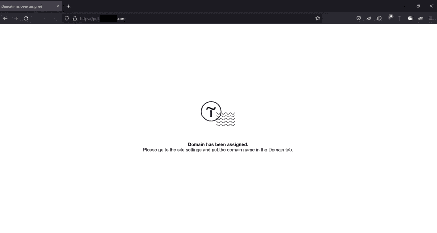
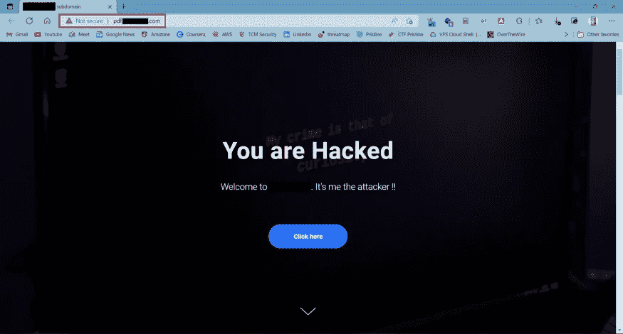

# 获取 P2 级子域接管漏洞的有效方法

> 原文：<https://infosecwriteups.com/efficient-methodology-to-get-p2-level-subdomain-takeover-vulnerability-3a68b883b150?source=collection_archive---------1----------------------->

大家好，我是一名网络安全爱好者和研究者。这是我的第一个博客，我将解释我是如何用我的**简单**和**高效方法**黑进一个组织的子域的。


你好，联邦调查局！！

在过去的几个月里，我一直在寻找并从一个节目切换到另一个节目。在我旅程的开始阶段，我得到了 20 多个重复的 bug，感到疲惫和沮丧&有很多精疲力竭。即使在那之后，我决定继续前进…
有一天，我正在寻找一个负责任的漏洞披露项目(不能透露项目名称)，并对我的目标进行了彻底的侦察。
现在，在跳转到该方法之前，我们将学习一点关于子域和漏洞存在的地方！！

**什么是子域？** 子域是加在域名上的前缀，用来区分你网站的不同部分。网站所有者通常使用子域来管理需要自己的内容层次结构的大型部分，如在线商店、博客或支持平台。

**什么是子域接管？**
子域接管是一种漏洞类型，攻击者可以通过这种漏洞获得公司子域的控制权。这是由于 DNS 配置不正确造成的。
换句话说，假设你是一名公司开发人员，负责为即将到来的活动创建一个网站(这里是一个子域)。您设计了网站，使用适当的 DNS 配置托管了网站，现在网站可以运行了。
活动结束后，公司指示您删除该网站，因为活动页面不再有用。开发者可以简单地删除子域并报告“是的，网站现在关闭了。”但是，DNS 仍然没有关闭，所以它现在指向一个不存在的子域。我们，攻击者，将会攻击这里。我们将简单地创建一个相同名称的子域，在许多情况下，CNAME 作为 DNS 记录指向的网站。
**轰！你控制了一个子域。**


> *我个人的侦察方法论和工作流程。*

我想简单介绍一下我的侦察工作流程。我经常使用 *amass* 、 *subfinder* 、 *assetfinder* 和 *chaos discovery 数据集*、**、**进行子域枚举，我的下一步是解析发现的子域以检查是否有存活的主机，然后进行漏洞分析，最后进行手动测试。那天，我教使用 *crt.sh* 作为*an*addon*step，因为我很好奇去探索它，并且正在学习这个工具是如何工作的，幕后是什么？这个工具列举了一些额外的子域，这些子域不是我在常规侦察阶段收集到的。好吧！！现在我把我列举的所有子域分解并分类到一个. txt 文件中&保存它。现在，我试图检查子域接管，因为这是我侦察阶段必须做的一部分。我使用 subzy，subjack 和 nucleus/take over 模板进行子域接管，因为这只是我的漏洞分析的一部分，它可能会给出假阳性。我尝试了 subzy 和 subjack，但是没有成功。然后我用 nucleus 和 nucleus-template/take over 在几分钟内我得到了一个 *high* 标题为 *tilda 接管的警告。****

```
**nuclie -l subdomain.txt -t $path/nuclei-templates/takeovers/**
```

**然后我手动访问该页面，它显示“域名已被分配”，这意味着该子域没有运行任何服务，但它是活跃的，我们也可以选择*404-未找到*，并开始知道该子域属于**蒂尔达**服务。由于我不能公开透露程序名，让我们假设**example.com**根域名*和易受攻击的子域看起来像；**pdf.example.com**。***

****

**图一**

**正如我们看到的**图 1** 网页窗口，我意识到有些不同，因为它的根域持有 pdf 作为后缀。一般来说，pdf 必须是在网络服务器上列出的目录。https://example.com/pdf 在这里我们可以做一些恶意的事情。所以，我去了 tilda.com，创建了一个账户，创建了我的网页，并把它链接到我之前发现的子域名。**

****

**图二**

****又轰！！组织成功黑掉&被伦理举报。****

**你也可以查看下面的 EdOverflow 的 GitHub 库作为参考。**

**[GitHub—EdOverflow/Can-I-take-over-xyz:“我能接管 XYZ 吗？”—服务列表以及如何使用悬空 DNS 记录声明(子)域。](https://github.com/edoverflow/can-i-take-over-xyz)**

> **希望你喜欢。感谢阅读:)**

## **来自 Infosec 的报道:Infosec 每天都有很多内容，很难跟上。[加入我们的每周简讯](https://weekly.infosecwriteups.com/)以 5 篇文章、4 条线索、3 个视频、2 个 GitHub Repos 和工具以及 1 个工作提醒的形式免费获取所有最新的 Infosec 趋势！**