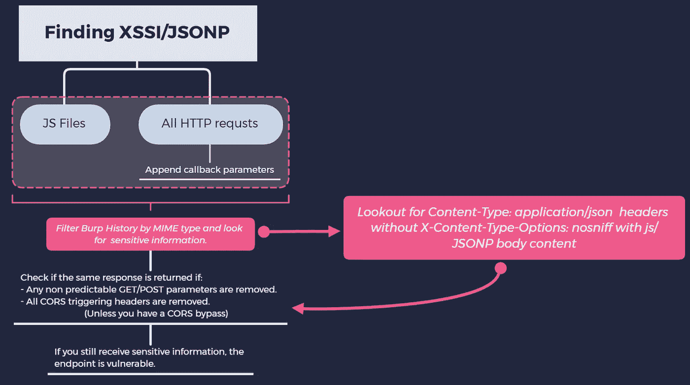
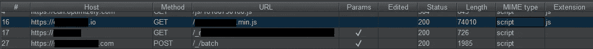

# 轻松找到跨站点脚本包含(XSSI)和 JSONP 以获取 bug 赏金

> 原文：<https://infosecwriteups.com/effortlessly-finding-cross-site-script-inclusion-xssi-jsonp-for-bug-bounty-38ae0b9e5c8a?source=collection_archive---------1----------------------->

嘿，大家好，我最近报告了一个私人程序的 XSSI 错误，该程序向最初的报告者支付了$̶3̶0̶0̶(800 美元，2020 年 2 月 13 日更新)。我 b̶e̶l̶i̶e̶v̶e̶̶t̶h̶e̶̶r̶e̶p̶o̶r̶t̶e̶r̶̶i̶s̶̶u̶n̶d̶e̶r̶p̶a̶i̶d̶̶s̶i̶n̶c̶e̶̶s̶e̶r̶i̶o̶u̶s̶̶i̶n̶f̶o̶r̶m̶a̶t̶i̶o̶n̶̶w̶a̶s̶̶l̶e̶a̶k̶e̶d̶̶̶\̶_̶(̶ツ̶)̶_̶/̶̶,̶̶&̶决定分享我遵循的方法。

**TL；博士(同时阅读底部的重要注释)**

**小抄什么的 idk lol**

很好的读物，以防你是 XSSI/JSONP 的新手:
**XSSI:**`[**https://www.scip.ch/en/?labs.20160414**](https://www.scip.ch/en/?labs.20160414)`**JSONP:**`[**https://www.sjoerdlangkemper.nl/2019/01/02/jsonp**](https://www.sjoerdlangkemper.nl/2019/01/02/jsonp/)`

**我的方法论**:

*   在搜索了网站(手动和自动)后，我通过 **MIME** 类型过滤了 *Burp suite* 中的结果，然后浏览了“ **script** 类型的响应以获取敏感信息。

**按 MIME 类型过滤**

*   我找到了一个 JS 文件，其中包含了我在签署保险单时填写的所有信息。这包括 SSN，有限的病史，签证信息，姓名，电话号码，出生日期，地址等。 ***Yikes*** 。
*   我查看了 JS 文件的 HTTP GET 请求，以确保它**不需要 **CORS 触发**头，比如:
    授权、X-API-KEY、X-CSRF-令牌、X-等等**
*   在这个阶段，如果**没有**的 CORS 头球，那么**的攻击就会失败**，**除非**我也发现了一个 CORS 问题。

在这种情况下，不需要特殊的头，所以我可以用脚本标记将 JS 文件包含在 web 页面上，并将其发送到任何泄漏一些严重 PII 的服务器，POC 类似于:

`**
**`

通过在所有返回敏感信息的路径上附加 callback=some_function，jsonp=blah 这样的参数，可以使用相同的方法来查找 JSONP 回调。

**重要提示:**

*   有时您需要多个参数来触发 JSONP 响应。比如:【http://target.com】T2？回调=测试→ **无 JSONP
    http://target.com？ **type=jsonp &回调=测试** **→返回 JSONP****
*   如果响应有**Content-Type:application/JSON**但是主体有 JSONP/javascript，并且响应中的**X-Content-Type-Options:nosniff**头是**而不是**，那么漏洞利用仍然**起作用**。
*   对于 **JSONP，不同的**回调参数可能在**不同的端点上工作，甚至在同一个网站上。
    举例:** https://target.com/profile_info?**回调**=测试→ **无 JSONP**
    https://target.com/profile_info?**JSONP =**测试→ **返回 JSONP**
    **但是，在同一站点的不同路径上:** https://target.com/**account _ info**？**JSONP**= test→**no JSONP**https://target.com/**account _ info**？**jsoncallback**= test→**returns****JSONP**

感谢反馈和建设性的批评，感谢阅读！

*关注* [*Infosec 报道*](https://medium.com/bugbountywriteup) *获取更多此类精彩报道。*

 [## 信息安全报道

### 收集了世界上最好的黑客的文章，主题从 bug 奖金和 CTF 到 vulnhub…

medium.com](https://medium.com/bugbountywriteup)