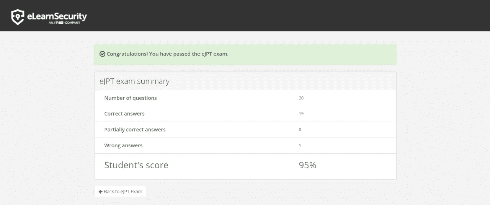
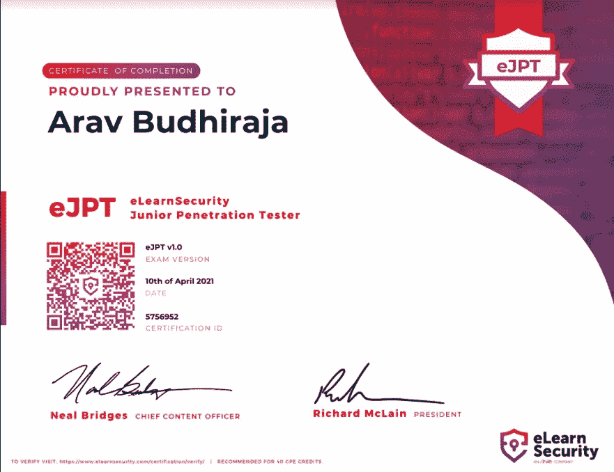

# 14 岁的时候

> 原文：<https://infosecwriteups.com/ejpt-as-a-15-year-old-2419aa241c98?source=collection_archive---------0----------------------->

你好！我叫 Arav Budhiraja，15 岁，来自印度。自从新冠肺炎·疫情开始，我对它产生了兴趣。2020 年 5 月，我在 youtube 上看了一个 12 岁道德黑客的视频。这有点鼓舞人心和酷，所以决定尝试黑客。在说服父母“我不会黑邻居的 wifi”也不会“做违法的事情”之后。于是我开始学习基本的五旬节，我的旅程就这样开始了！

2020 年 9 月至 2021 年 2 月左右，开始学习 Linux、网络、Python、Web 开发等其他技术。在 2021 年 3 月我的九年级期末考试后，我一直在寻找一个入门级的认证。几个小时后，我遇到了 ElearnSecurity 和 eJPT。

请注意:我在 2021 年 4 月 10 日参加考试时是 14 岁，当我 15 岁时写下这篇文章。

# **球场**

eJPT 的课程是渗透测试学生(PTS ),由 INE 免费提供。PTS 课程包含幻灯片、视频和实验，分为 3 个模块:前提条件、编程和测试。请确保您创建了自己的笔记，以便在考试时参考。

**先决条件**

注册后，我直接进入了先决条件模块。本节教你网络的基础知识(协议、路由、交换、防火墙和 IDS、OSI 模型等。)以及 HTTP 和 HTTPS 的基础知识(请求和响应、HTTP 方法、同源策略、会话、Cookies、Burp Suite 等。)在课程的这一单元，你可能会感到无聊，但这完全没关系。我建议你学习 1-2 节，休息一下，然后回来再试。请注意，如果你想在考试中取得好成绩，网络视频/幻灯片非常重要。

**编程**

通过 eJPT 不需要这个模块。您将学习 C++、Python、Bash 和 windows 命令行的基础知识。我们建议您完成本模块，因为它对将来的认证(如 eCPPT 或 OSCP)很有用。

**Pentesting**

现在我们到了有趣的部分！pentesing 模块教你渗透测试的基础知识。您将学习发现服务器，列举它们并利用它们。本模块将向您介绍 Nmap、SQLmap、Nessus、Metasploit、Netcat、John the Ripper 等工具。作为初学者，这一部分不会太难也不会太容易。在本模块中，不会对缓冲区溢出、ARP 欺骗和 XSS 进行测试。在你学习完一个工具后，你可以在 INE 提供的易受攻击的机器上练习你的技能。

**实验室**

实验是课程中最精彩的部分。你可以在有意攻击的服务器上练习你的黑客技术，你必须利用/收集信息。如果你是一个初学者，看一看实验室的解答是完全可以的，只要你确定你已经学会了如何解决实验室的问题。课程结束时，您将有 3 个黑盒实验。这些实验室包含多个比其他实验室更难利用的服务器。不要求为 eJPT 解答这些实验，但您可能希望为 OSCP 或 eCPPT 等证书解答这些实验。

# 考试

eJPT 是一个开卷考试，完全是动手操作。您可以从 ElearnSecurity 的网站上购买考试，并且可以随时参加考试。考试优惠券将在您购买之日起 6 个月后过期。考试时长 3 天，完成绰绰有余。类似于实验室，你会得到机器来利用。通过列举/利用，你将回答 20 个 mcq，如果你答对 15 个或更多，你通过考试。在考试期间，你可以使用你的笔记、INE 资料、谷歌等。他们想让你认为这是一次真实的人生测试。

# **我的经历**

一个月后，我完成了 PTS 课程和实验，准备参加考试。我在 4 月 8 日购买了优惠券，并决定在 4 月 9 日上午 9 点开始使用。考试那天，我在早上 8 点左右醒来，洗了个澡，然后坐在书桌前。在我启动我的 Kali 虚拟机后，我点击按钮开始考试。ElearnSecurity 为您提供了一个用于连接网络的. ovpn 文件，以及一份约定书，告诉您网络的范围和其他详细信息。我不像其他人那样认为这“极其重要”。一旦我连接到网络，我就开始扫描。大约 3 个小时后，我回答了 13 个问题，还有 7 个问题要回答。我决定休息一下，吃早餐。早餐后，我继续考试，到下午 2 点时，我非常确定我已经回答了 15+个正确答案，但我不想冒险。于是，我暂停了一下我的考试环境，决定第二天再来。那天，我浏览了我的笔记和 INE 的材料。第二天，我成功地回答了剩余的问题，在 4 月 10 日下午 2 点左右，我点击了提交考试按钮。几秒钟之内，我收到了我的结果。**我的分数是 19/20，获得了 eJPT 认证！！！**

# 通过 eJPT 的技巧

1.  你需要知道的一切都在课程材料中
2.  我见过很多人谈论旋转非常重要。这不是真的。旋转是指你通过一台被入侵的机器从一个网络转移到另一个网络。人们与旋转混淆的是路由。路由是指您通过连接到 2 个子网(不同的子网和您所连接的子网)的路由器连接到不同的网络。
3.  练习所有的实验两次
4.  记笔记。我用了一个叫黑曜石的工具，因为我在 Markdown 中写起来很舒服，但你也可以用 MS Word 或 OneNote
5.  如果你陷入了兔子洞，后退一步，列举一下
6.  使用谷歌查找漏洞
7.  逐字读问题
8.  浏览两遍网络部分，因为它非常重要

现在，我正在参加一系列的 CTF，然后准备我的 eCPPT

如果你有任何问题，点击[这里](https://arav06.github.io/contact.html)

要验证证书，点击[这里](https://elearnsecurity.com/verify-certificate/)