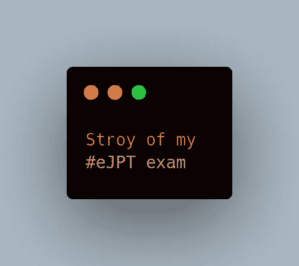

# eJPT 旅程

> 原文：<https://infosecwriteups.com/ejpt-journey-16304d9b9eaa?source=collection_archive---------3----------------------->

## 我的经历

# 介绍

嗨，伙计们，这边请！！又名 namx05。我是一名四年级学生，每天都在学习新的东西(可能是 XD)。

二月，我完成了我的 **eJPT** ( **电子安全初级渗透测试员**)考试。最后，我说服自己写一篇关于这次旅程的博客。

**免责声明** :-请忽略我的英语语法和拼写错误(必须)XD。

(我会把每个资源的链接放在博客的最后)

# 旅程:

## 怎么开始的

所以要从 2021 年 9 月说起。当我作为一名应用安全工程师(远程)加入一家公司时，他们让我做一些机器黑客方面的练习。由于当时我对黑客一无所知，所以我向他们请教应该从哪里开始获取更多的知识。他们推荐从 [**TryHackMe**](https://tryhackme.com) 开始。

这是我第一次用 TryHackMe。我花了一些时间来适应它，但后来我设法适应了。我做了很多免费的房间，一个月后我完全理解了基本的东西。因为我在 Flipkart(现场)做系统工程师。在公司内部，不允许我将笔记本电脑带到办公室，许多网站因为被屏蔽而无法访问:/幸运的是，TryHackMe 没有被屏蔽。所以我用 TryHackMe 攻击箱来解决房间问题。

在基础知识之后，是一些高级房间的时候了，所以我购买了高级订阅并在 TryHackMe Kali 机器上练习。过了一段时间，我通过学习之路了解了 **Pentest+** 。我对此进行了研究，发现它会在一定时间内过期(虽然可以更新)，还发现了与之类似的 eJPT。当时，我忽略了这两个证书。

几天后，我在 discord VC & Twitter 空间讨论 certs。许多人都获得了 eJPT 认证，当时我也决定参加那个考试。

## 关于

根据**电子安全**

**eLearnSecurity 初级渗透测试员(eJPT)是渗透测试和信息安全基础知识的 100%实践认证。**

我查看了考试大纲，得知 INE 提供的考试课程是免费的。我花了 2-3 个月完成了整个课程。我知道我花了很长时间，但由于我的工作，我无法管理我的时间，我也拖延了很多 XD。

2022 年 1 月下旬，我终于完成了 INE 的课程，但我不确定自己是否还有能力参加考试。只是为了让自己舒服，我在 THM 上做了一些框，很自信。为了让自己更加自信，我阅读了许多关于 eJPT 的文章，阅读了不同的 eJPT 笔记/备忘单，找到了一个适合我的，等等。

和很多在我之前通过 eJPT 的人( [**hellfire0x01**](https://twitter.com/Hellfire0x01) 又名 [Akshat Gupta](https://medium.com/u/5981899dab28) 、 [**xplo1t**](https://twitter.com/manash036) 又名 [Manash](https://medium.com/u/588d9cd469e8) 、MingruiCRH、&更多)聊了聊，获得了一些知识。

由于考试费用为 200 美元，我决定等我的工资存入我的账户，但出于好奇，我用信用卡买了一张 eJPT 考试券(不要在家里尝试 xD，说真的，如果你没有资金，永远不要使用 CC)

我在接近中午的时候购买了考试，并决定在周末后开始，即周二，出于好奇，我在购买 XD 的 1 小时后开始考试，花了我 1 天 12 小时。这很容易，我太笨了，一部分都不懂。因为上班时间耽误了 12 个小时。

## 考试详情

一旦您开始考试，您将获得合约范围，它会告诉您有关范围的信息。你必须回答 20 个问题。你可以慢慢来。当你提交考试的时候，你会马上得到结果。

当我提交考试时，结果来了，我通过了。耶！！

# 时间线:

1.  2022 年 2 月 20 日 13:45 →购买的优惠券
2.  2022 年 2 月 20 日@ 14:40 →开始考试
3.  2022 年 2 月 21 日@ 18:31 →收到最期待的邮件，YUPP 说“我是 eJPT”XD(邮件图片如下)

最期待的邮件

# 技巧

1.  你需要的只是 PTS。
2.  不要以为这它一个 CTF，“它就不是一个 **CTF** ”。
3.  在你练习的过程中做笔记(最重要的)
4.  如果你在考试中遇到困难，笔记会帮助你。
5.  务必理解路由部分。
6.  完成课程后，包括黑盒测试，再次做所有的实验，以便再次回忆(包括 BBT)。
7.  如果你被困在一台机器上，试着换到另一台机器上。
8.  或者最好的休息方式，散步，喝水，睡觉，如果你需要的话。没有必要紧张，因为你还有很多时间

# 参考

1.  棒极了的小抄帮助了我[AK shat Gupta](https://medium.com/u/5981899dab28):[https://github.com/Hellfire0x01/eJPT-Cheatsheet](https://github.com/Hellfire0x01/eJPT-Cheatsheet)
2.  INE 课程:[https://my . ine . com/cyber security/learning-paths/a 223968 e-3a 74-45ed-884d-2d 16760 b8 bbd/渗透测试-学生](https://my.ine.com/CyberSecurity/learning-paths/a223968e-3a74-45ed-884d-2d16760b8bbd/penetration-testing-student)
3.  https://elearnsecurity.com/product/ejpt-certification/

# 我

|| [推特](https://twitter.com/namx05) | [网站](https://namx05.github.io) | [LinkedIn](https://linkedin.com/in/namx05) ||