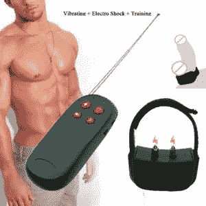
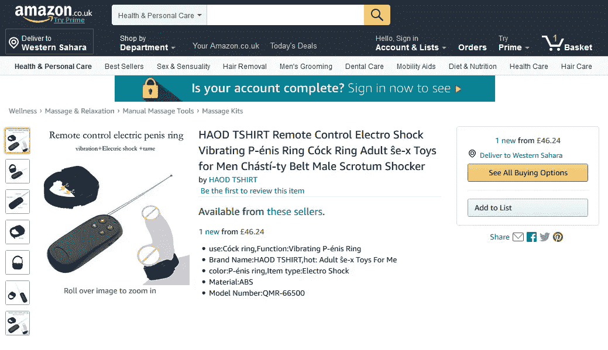
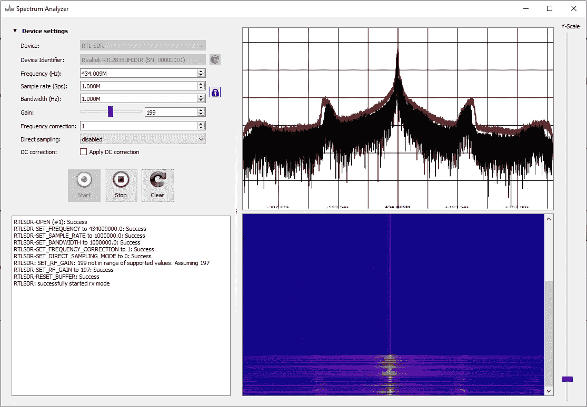
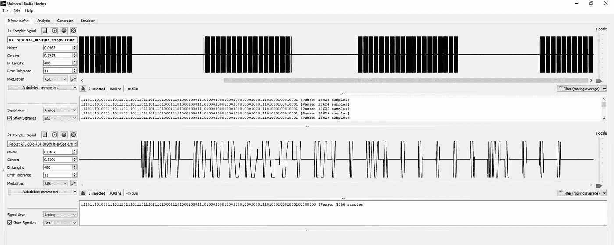
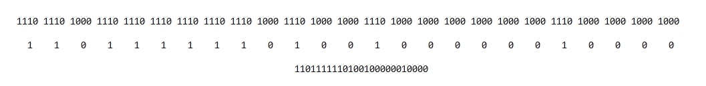
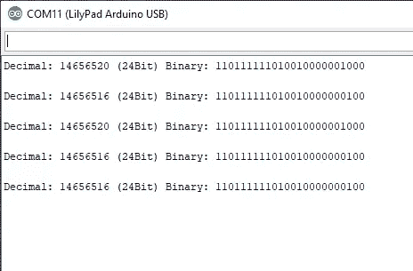
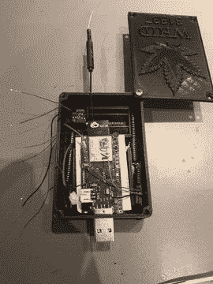
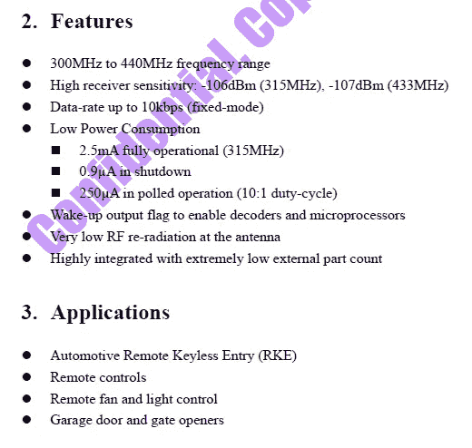

# 如何逆向工程，嗅嗅和模糊易受攻击的射频成人玩具与 WHID 精英

> 原文：<https://infosecwriteups.com/electrocuting-testicles-with-whid-elite-6f52b7fb84bf?source=collection_archive---------0----------------------->

如你所知，我很快就要发布《WHID Elite》了。作为一个迂腐的硬件开发人员，我想确保一切正常，即使是最小的细节。

上周我在寻找新的目标来测试 **WHID Elite 的无线电窃听能力**，突然我发现了一个有趣的目标:一个**电击鸡鸡环**。是的，你没看错(亚马逊上找不到的……)。

长话短说…昨天新玩具到家了，你猜怎么着？没有滚动码，没有 MSK/FSK/GMSK 或其他奇怪的调制…只是一个经典的 433MHZ 的振幅转换键调制与开关键。这是为非射频人员翻译的…很容易:

*   嗅
*   重播
*   当然，还有……绒毛。

首先，我采用了研究新 RF 器件时常用的逆向工程方法，并启用了成功的 LimeSDR/RTL-SDR + URH 组合。(声明:由于我专注于 RF 方面，所以我从 RF 分析开始。如果它不会导致任何低挂水果的结果，我会开始硬件逆向工程的方法:拆除，BoM 枚举和指纹，FCC ID 狩猎，等等。幸运的是，对于我稀缺的业余时间，我不需要它。)

可以看到，中心频率约为 433MHz，这是商用消费级 RF 设备的标准频率。

从**频谱图**中，我们可以清楚地看到**调制是 ASK** ，尽管边上有一些谐波(很可能是由制造商使用的低成本发射机引起的)。

现在我们需要解码数据包，看看我们是否真的在处理 ASK，并最终确认子调制类型(即 **OOK** ，在我的假设中)。

如你所见，URH 成功地解码了数据包(对*容错*和*位长*参数进行了微调)。

现在我们有了二进制序列，我们可以清楚地看到这个射频器件的**占空比**，其中 a:

*   **1 编码为 1110**
*   **0 编码为 1000**

没有序言。没有来自接收单元的 ACK 包。只是一个简单的广播包。总是不断重复。这使得我们可以消除滚动码假设。

有了所有这些数据，我们最终可以组成数据包，发送该数据包以触发振动模式:

现在我们准备用 WHID Elite 的独立固件试一试，看看它是否也能解码。

正如假设的那样，WHID Elite 可以完美地嗅探和解码数据包。在上图中，您可以看到两种类型的数据包:

*   146565 **16 振动模式**
*   146565 **20 电击模式**

正如你可以很容易地发现两种类型的数据包之间的小数距离只是几个整数的问题。这意味着，我们可以**轻松模糊，从而耗尽它们之间的空间**与主要 WHID 精英固件。

因此**没有更多的文字阅读，享受音频/视频:)**

请关注我的推特【https://twitter.com/WHID_Injector 很快我将为一整套 WHID 精英做赠品！

为了方便起见，内部 TX 是一个 **SYN470R。**根据其数据表:*是单芯片 ASK/OOK(开关键控)射频接收 IC* 。这再次证实了整个射频分析。

