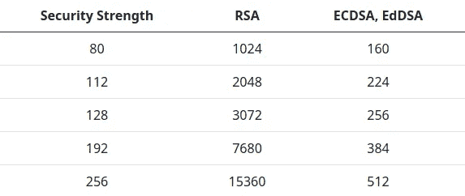
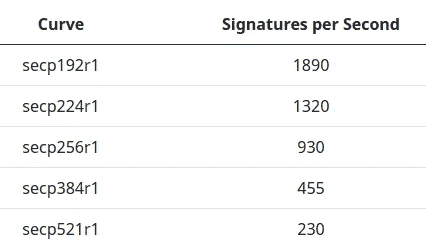

# 椭圆曲线签名以及如何在 Java 应用程序中使用它们

> 原文：<https://infosecwriteups.com/elliptic-curve-signatures-and-how-to-use-them-in-your-java-application-b88825f8e926?source=collection_archive---------0----------------------->


假设您想要发送一条消息，并且您想要确保 a)接收者能够检测到该消息是否被修改(**完整性**)以及 b)接收者能够验证您是这条消息的作者(**消息认证**)。在这种情况下，通常使用数字签名对邮件进行数字签名。

*实际上，数字签名还提供了***的不可否认性，即发送方不能否认对消息的签名。然而，提供完整性和消息认证是签名的两个最常见的用例。**

***初始步骤***

*最初，您创建一个**公钥**和一个**私钥**。你只能做一次。当你想要签署一个信息，你使用私人钥匙。要验证签名，可以使用公钥。私钥是一个秘密密钥，不得与其他人共享，因为拥有该密钥的每个人都能够计算出有效的签名，并可以欺骗消息的接收者，使其相信该消息是由您发出的。另一方面，公钥需要分发给应该能够验证签名的每个人，即公钥是公开的。*

***签名和验证消息的步骤***

*如果您已经创建了公钥和私钥，通常会对消息进行如下签名:*

1.  *使用诸如 SHA-256 的加密散列函数计算消息 *m* 的散列 *h* 。*
2.  *使用私钥计算散列的签名 *s* 。*
3.  *将消息 *m* 和签名 *s* 发送给接收者。*
4.  *接收者用发送者的公钥验证签名 *s* 。*

***算法***

*最常用的签名算法是由国家标准与技术研究所(NIST)在[FIPS 186–4](https://nvlpubs.nist.gov/nistpubs/FIPS/NIST.FIPS.186-4.pdf)中标准化的算法。它们是 RSA 数字签名算法，2)数字签名算法(DSA)和 3)椭圆曲线数字签名算法(ECDSA)。*

*从这三种算法来看，DSA 不应再用于生成数字签名，因为该算法将不再被 NIST 的[FIPS 186–5](https://nvlpubs.nist.gov/nistpubs/FIPS/NIST.FIPS.186-5-draft.pdf)(FIPS-186–4 的继任者)批准。相反，FIPS-186–5 将只批准 DSA 签名的验证。但是，RSA 和 ECDSA 签名的生成仍然被批准，此外，使用 EdDSA 数字签名算法(edd sa)生成签名也被批准。*

*ECDSA 和 EdDSA 都基于椭圆曲线，DSA 基于[离散对数问题](https://en.wikipedia.org/wiki/Discrete_logarithm)，RSA 的安全性基于[分解大数](https://en.wikipedia.org/wiki/Integer_factorization)(将一个合数分解成更小的整数)的问题和 [RSA 问题](https://en.wikipedia.org/wiki/RSA_problem)(取 *e* 次根模一个合数 n)，对于这些问题没有有效的算法存在。*

***安全级别和密钥大小***

*基于椭圆曲线的签名算法的巨大优势在于，与 RSA 相比，它们需要更小的密钥来实现相同的安全级别，从而导致更小的签名和降低的计算要求。因此，这些算法特别适合嵌入式和物联网设备，也适合需要计算或验证大量签名的应用。*

*安全级别通常以位数来衡量。例如，如果一个系统提供 5 位的安全性，攻击者需要执行 2 ^ 2 ^ 2 ^ 2 = 32(2 的 5 次方)次运算才能破解它。对于 AES 等对称密码，安全级别通常等于所用密钥的大小。对于诸如 RSA、ECDSA 和 EdDSA 之类的非对称算法，密钥大小的安全级别是根据基础数学问题的难度来估计的。每次发现新攻击时都会调整级别，这减少了解决数学问题的工作量。NIST 已在 [NIST 特别出版物 800–57 第 1 部分第 5 版](https://nvlpubs.nist.gov/nistpubs/SpecialPublications/NIST.SP.800-57pt1r5.pdf)中公布了他们对关键尺寸的建议。下表显示了不对称算法的摘要。*

**

*此外，在出版物 800–57 第 1 部分修订版 5 中，NIST 不再批准安全级别低于 112 位的密钥大小，至少在使用加密技术保护联邦政府信息时是如此。*

*不同组织对密钥大小的建议可能略有不同。还可以在[这里](https://www.keylength.com/)找到建议的概述。*

***签名大小***

*签名的大小取决于算法和密钥大小。RSA 签名的大小等于密钥的大小。例如，如果您使用 3072 位密钥对消息进行签名，签名的大小就是 3072 位(384 字节)。ECDSA 和 EdDSA 签名的大小是所用密钥的两倍。例如，如果您使用 256 位密钥来实现 128 位安全性，签名将是 512 位(64 字节)。*

# *用 Java 计算 ECDSA 签名*

***选择一条曲线***

*从版本 7 开始 Java 支持各种椭圆曲线。如果您的机器上安装了 jshell，那么通过在 jshell 中执行以下 Java 代码，您可以很容易地获得所有受支持曲线的列表:*

```
*jshell> import java.security.*;
jshell> Security.getProvider("SunEC").getService(
   ...>   "AlgorithmParameters", "EC").getAttribute(
   ...>   "SupportedCurves")*
```

*该列表应至少包含以下曲线:*

```
*secp192r1 (NIST P-192)
secp224r1 (NIST P-224)
secp256r1 (NIST P-256)
secp384r1 (NIST P-384)
secp521r1 (NIST P-521)*
```

*这些曲线已经被 NIST 在[FIPS 186–4](https://nvlpubs.nist.gov/nistpubs/FIPS/NIST.FIPS.186-4.pdf)标准化了。前缀“sec”代表“有效加密标准”，字母“p”表示该曲线在素数域上，“p”后面的数字表示密钥大小，最后，字母“r”表示曲线的参数是可验证地随机选择的。有关命名约定、曲线及其参数的更多详细信息，也可以在“[第 2 节:推荐的椭圆曲线域参数](https://perso.univ-rennes1.fr/sylvain.duquesne/master/standards/sec2_final.pdf)”中找到。*

*在下面的例子中，我们使用曲线 secp224r1，它提供 112 位的安全级别，产生小签名，并且不需要太多资源来计算签名。这条曲线非常适合大多数具有高安全性和高性能要求的应用。*

***创建公钥和私钥***

*在签署消息之前，我们必须创建一个公钥和私钥。我们的做法如下:*

```
*import java.security.*;
import java.security.spec.*;KeyPairGenerator g = KeyPairGenerator.getInstance("EC","SunEC");
ECGenParameterSpec ecsp = new ECGenParameterSpec("secp224r1");
g.initialize(ecsp);KeyPair kp = g.genKeyPair();
PrivateKey privKey = kp.getPrivate();
PublicKey pubKey = kp.getPublic();*
```

*现在，我们选择签名算法。这里，我们使用 ECDSA 对消息的 SHA-256 哈希进行签名。*

```
*Signature s = Signature.getInstance("SHA256withECDSA","SunEC");
s.initSign(privKey);*
```

*接下来，我们计算消息的签名。首先，我们调用*签名*实例的*更新*函数，并提供消息作为输入。然后我们调用计算并返回签名的 *sign* 方法。*

```
*byte[] msg = "Hello, World!".getBytes("UTF-8");
byte[] sig;
s.update(msg);
sig = s.sign();*
```

*现在，签名存储在字节数组“sig”中。*

*消息的接收者现在可以验证签名，如下所示:接收者创建一个*签名*的实例，并用公钥初始化这个实例。然后用消息更新这个实例，最后接收者可以通过用要验证的签名调用*验证*方法来验证签名。*

```
*Signature sg = Signature.getInstance("SHA256withECDSA", "SunEC");
sg.initVerify(pubKey);
sg.update(msg);
boolean validSignature = sg.verify(sig);*
```

*如果提供的消息与计算签名的消息相同，那么*验证*方法将返回 true，否则返回 false。*

*完整的源代码也可以在 GitHub [这里](https://gist.github.com/daniel-e/f7bae1f16ba7132c435a6d7b4a573280)获得。*

***性能***

*为了了解我们每秒可以计算多少个签名，我写下了“你好，世界！”消息，并测量了在一个 CPU 内核上运行 2.3GHz 的 i5–5300 u 所花费的时间。我重用了 signature 实例，即在每次迭代中，我只调用了 *update* 和 *sign* 方法。*

*下表总结了结果。*

**

***结论***

*由于存在许多不同的曲线，并且一条曲线有时以不同的名称为人所知，椭圆曲线加密可能会令人困惑。通常，由 NIST 标准化的曲线(即 P-192 aka secp192r1、P-224 aka secp224r1 等)对于大多数具有高安全性要求的应用应该是足够的。*

*从 Java 7 开始，计算椭圆曲线签名变得非常容易，因为从那时起，Java 支持最常用的曲线。不再需要外部依赖。此外，计算或验证签名所需的行数非常少，因此代码简单明了。*

*键尺寸较小的曲线非常适合高性能应用。在具有四个核心的现代 CPU 上，您应该能够每秒计算超过 10，000 个签名。*