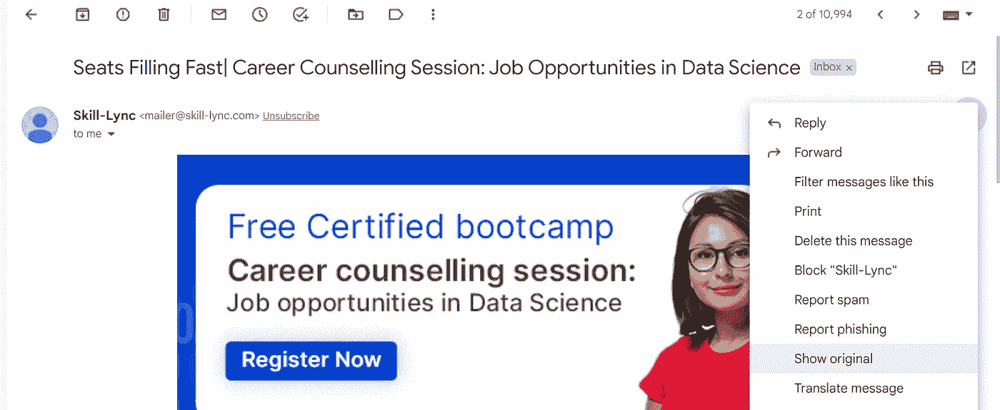
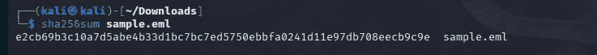
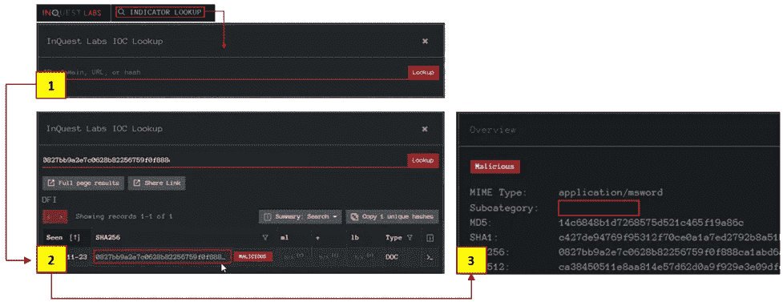

# 电子邮件分析:避免网络钓鱼攻击

> 原文：<https://infosecwriteups.com/email-analysis-avoid-phishing-attacks-360a81e1ebf8?source=collection_archive---------4----------------------->

## 网络时代的到来结束了👽

在这篇文章中，我们将了解如何分析电子邮件，以及电子邮件的各个组成部分。

**邮件分析**是提取邮件头信息暴露邮件文件细节的过程。电子邮件标题是这里的主角，它提供了足够的信息来决定过滤/隔离/发送特定的电子邮件。

电子邮件分析中有两个主要概念:

1.  **安全问题:**邮件中的可疑/异常/恶意模式。
2.  **性能问题:**交货和延期问题。

在本文中，我们将重点关注安全性问题。

网络钓鱼和社会工程帮助恶意用户在受害者的机器上注入不良代码，或者从受害者那里提取个人信息/凭证。

尽管有各种工具和技术，但大多数公司在没有自动化解决方案预算的情况下更喜欢手动分析，而且深入分析电子邮件需要隔离的环境。

让我们了解一下电子邮件标题的结构:

1.  发件人:发件人地址
2.  收件人:收件人地址(包括抄送和密件抄送)
3.  日期:时间戳，发送电子邮件的时间
4.  科目
5.  返回路径:回复至
6.  域密钥和 DKIM 签名
7.  SPF:用来发送邮件的服务器。将服务器与实际域进行比较。
8.  邮件 ID:电子邮件的唯一 ID
9.  MIME 版本:“非文本”内容和附件
10.  x 形标题
11.  X-received:邮件经过的邮件服务器
12.  X-span 状态:电子邮件的垃圾邮件分数
13.  X-mailer:电子邮件客户端名称

一个简单的分析必须包含以下问题的答案

问:“发件人”、“收件人”和“抄送”字段包含有效地址吗？无效地址是一个危险信号。

问-“从”和“到”字段是否相同？如果相同，则显示红旗。

问-“从”和“返回路径”字段是否相同？不同的价值观是一个危险信号

问:电子邮件是从正确的(官方)服务器发送的吗？

问——“消息 ID”字段是否存在，是否有效？空值和格式错误的值是危险信号。

问:超链接会重定向到可疑/异常的网站吗？可疑链接和重定向是危险信号。

问:附件是否包含恶意软件？使用沙盒。

现在，**什么是沙盒？**沙箱是**一个独立的测试环境，使用户能够运行程序或打开文件，而不会影响他们运行的应用程序、系统或平台**。软件开发人员使用沙箱来测试新的编程代码。

酷毙了。然后我们需要一个邮件头解析工具或者配置一个文本编辑器来突出显示邮件头的细节。

你也可以在 gmail 上这样做。只需打开您想要分析的电子邮件，然后点击显示原件:

将此下载为。eml，然后使用文本编辑器。

让我们用 VS 代码来做这件事。从下面的链接获取扩展:

 [## SMTP 头- Visual Studio 市场

### SMTP 头的 Visual Studio 代码突出显示扩展。

marketplace.visualstudio.com](https://marketplace.visualstudio.com/items?itemName=DylanJacob.smtp-headers) 

然后打开。VSCODE 中的 eml 文件。然后，您可以在电子邮件的标题部分看到所有可能的字段。

现在，让我们来看看一些工具，以便清楚地了解这里发生了什么。

emlAnalyzer 就是这样一种工具。emlAnalyzer 是一个工具，旨在解析电子邮件标题，以便更好地查看和分析流程。

你可以从这里得到:[https://github.com/wahlflo/eml_analyzer](https://github.com/wahlflo/eml_analyzer)。

除此之外，你可以使用一些新的工具来检查电子邮件的信誉。

**参观地点:**T5【https://emailrep.io/】同。

电子邮件分析师工具箱:

1.  基于云的沙盒环境。
2.  审讯:网络和文件分析
3.  IPinfo.io
4.  塔罗斯的声誉
5.  Urlscan.io
6.  浏览器链接:浏览器沙盒
7.  Wannabrowser:浏览器沙箱

**对于基于文件的信誉检查，**应该使用 sha256sum 工具计算文件的哈希值来计算文件的值。

> 基于哈希的文件信誉分析:转到[*https://www.virustotal.com/gui/home/upload*](https://www.virustotal.com/gui/home/upload)

单击搜索图标并粘贴哈希值，然后分析详细信息。

在此之后，继续在**审讯中进行信誉检查。**

> [*https://labs.inquest.net/*](https://labs.inquest.net/)

现在访问工具网站，使用`INDICATOR LOOKUP`选项进行基于散列的分析。

img src:[https://tryhackme.com/room/adventofcyber4](https://tryhackme.com/room/adventofcyber4)

这就完成了基本的电子邮件分析程序。你现在要做的就是创建一份调查结果报告，并告知你的经理出了什么问题。

## 来自 Infosec 的报道:Infosec 每天都有很多内容，很难跟上。[加入我们的每周简讯](https://weekly.infosecwriteups.com/)以 5 篇文章、4 个线程、3 个视频、2 个 GitHub Repos 和工具以及 1 个工作提醒的形式免费获取所有最新的 Infosec 趋势！