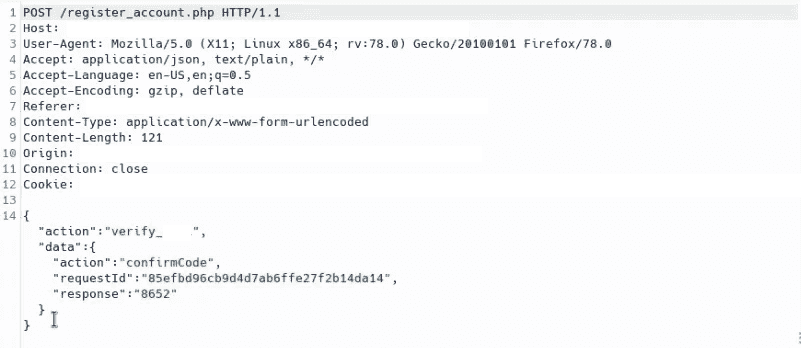
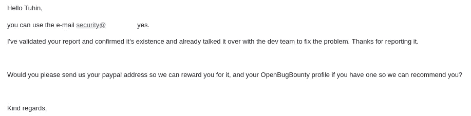

# 价值$$$的电子邮件和电话号码验证绕过

> 原文：<https://infosecwriteups.com/email-and-phone-number-verification-bypass-worth-85dbaa794b28?source=collection_archive---------2----------------------->

大家好。我叫图欣·博斯( [@tuhin1729](https://instagram.com/tuhin1729) )。我目前在[虚拟网络实验室](https://virtualcyberlabs.com)担任首席技术官。在这篇文章中，我将分享我的一个发现，它帮助我赚到了$$$。

所以不浪费时间，让我们开始吧:

# 简介:

基本上，目标是一个电子邮件营销网站，让我们称之为 redacted.com。我很快试图在那里创建一个账户。创建帐户时，我注意到他们使用 OTP 验证用户的电子邮件和电话号码。所以我决定尝试 OTP 旁路。我提交了 OTP 并使用 burp 捕获了请求。在这两种情况下(电子邮件和电话号码)，请求如下所示:

tuhin1729

# 我的假设是:

OTP 与 requestId 相关联。当我们转发请求时，服务器将验证“response”的值是否与相应的“requestId”相同，如果匹配，它将重定向到电话号码验证。因此，如果我们复制请求主体并删除请求，然后尝试使用主体，同时使用受害者的电子邮件地址生成帐户，我们可能会成功。

# 复制步骤:

我执行了以下步骤，然后嘣！成功绕过电子邮件验证！我用受害者的电子邮件地址创建了一个账户。

I .尝试使用攻击者的电子邮件地址创建一个帐户。

二。提交 OTP(在攻击者的帐户中接收)，复制请求主体并丢弃它。

三。现在尝试使用受害者的电子邮件地址创建一个帐户。

四。输入任意随机的 OTP 并使用 Burp 捕获请求。

动词 （verb 的缩写）用您在步骤 ii 中复制的请求体替换请求体。

不及物动词转发请求。

由于在验证电话号码时实现了相同的机制，所以我也能够成功地绕过电话号码验证。

# 影响:

通过利用此漏洞，攻击者可以使用受害者的电子邮件地址和电话号码创建一个帐户。

# 回应:

我很快做了一个 POC 发给他们。24 小时内他们回复我:

tuhin1729

**时间线**:

2011 年 4 月 5 日—报告的漏洞

2011 年 5 月 5 日—回复了赏金邮件

等待赏金！！！

在 Twitter 上关注我:@ [tuhin1729](https://twitter.com/tuhin1729_) _

感谢阅读。我希望你喜欢这个博客。