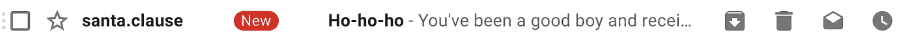
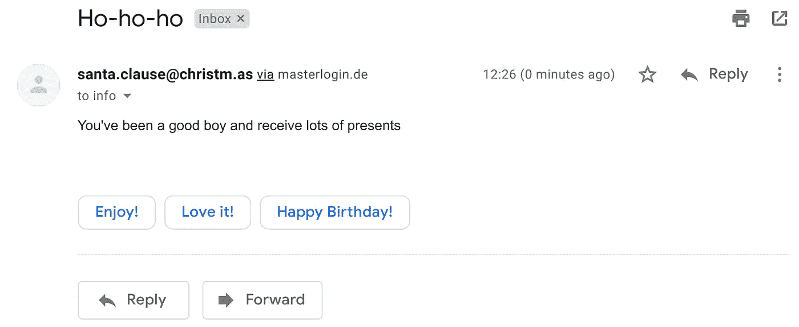
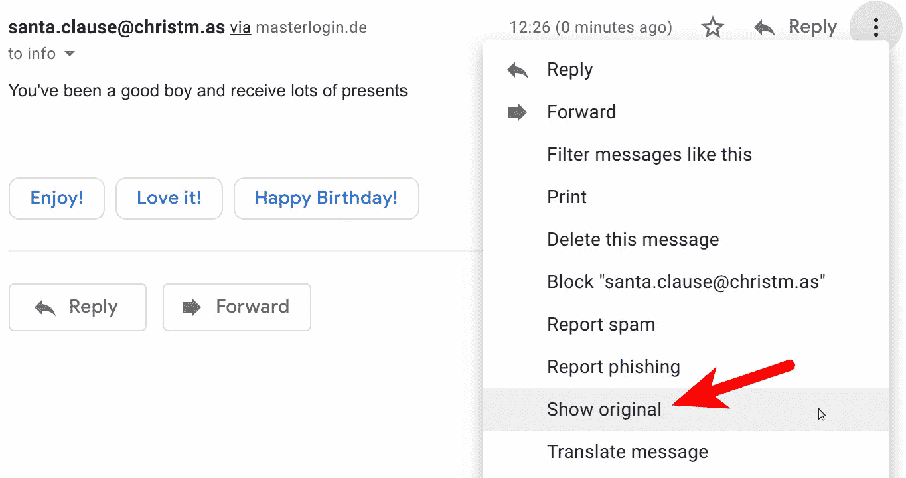
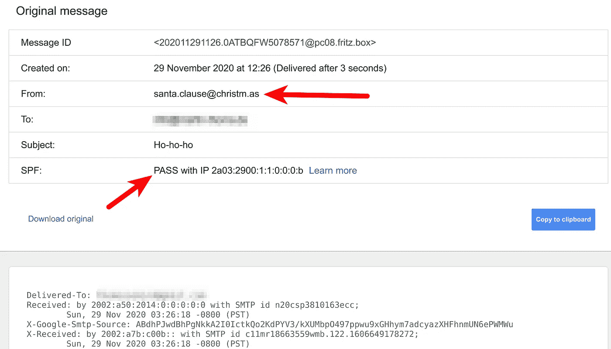
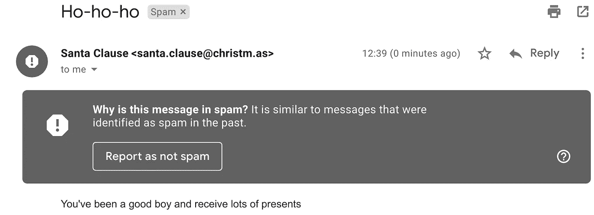

# 电子邮件欺骗😈

> 原文：<https://infosecwriteups.com/email-spoofing-9da8d33406bf?source=collection_archive---------0----------------------->

## 了解它是什么，它是如何工作的，以及如何用 SPF，DKIM，DMARC 来防御它


照片由 [Rinck 内容工作室](https://unsplash.com/@rinckad?utm_source=medium&utm_medium=referral)在 [Unsplash](https://unsplash.com?utm_source=medium&utm_medium=referral) 拍摄

电子邮件欺骗是用伪造的发件人地址创建电子邮件。伪造发件人的地址通常是网络钓鱼攻击的一部分。有不同的方法来欺骗网络钓鱼攻击的受害者谁是真正的发件人:使用略有不同的发件人域名，如`security@paypal.co`而不是`security@paypal.com`，隐藏发件人地址，如`Paypal Security <something@phishy.com>`，或者假冒电子邮件地址。

# 为什么它很重要

商务电子邮件泄露(BEC)是一种使用商务电子邮件地址的欺诈形式。这样的例子有很多，但是没有很好的记录。至少不会公开。我发现的一些较大的例子有:

*   **2014** :制药公司 Upsher-Smith Laboratories 因 CEO 欺诈损失了**5000 万美元**([来源](https://www.fox9.com/news/ceo-spoofing-costs-drug-company-50-million))
*   **2015** :网络公司 Ubiquiti Networks 损失了**4670 万美元**给一个冒充员工的骗子([来源](https://www.nbcnews.com/tech/security/ubiquiti-networks-says-it-was-victim-47-million-cyber-scam-n406201))
*   “在 **2018** 年，IC3 收到 20373 起 BEC/电子邮件账户泄露(EAC)投诉，调整后损失超过**12 亿美元**”([来源](https://www.ic3.gov/Media/PDF/AnnualReport/2018_IC3Report.pdf))

# 电子邮件是如何被欺骗的？

电子邮件通过 [SMTP](https://de.wikipedia.org/wiki/Simple_Mail_Transfer_Protocol) 协议传输。该协议有一个信封，其中包含发送方(**来自**的邮件)和接收方( **RCPT 到**)。发送者通常不被验证并且不被显示。相反，邮件内容包含额外的元数据。其中一项是**回复**和**发送方**。有趣的是，回复者和发送者是不同的。

作为攻击者，一个人可以操纵一切。就像普通邮件一样:

*   写错了一封邮件
*   在邮件中声称你是另一个人(发件人)

这里的一个关键区别是，通常很多都是在后台处理的。

为了说明这非常简单，攻击者也不是在搞火箭科学，下面是如何用 Python 发送电子邮件的方法:

```
import smtplib
from email.message import EmailMessagemsg = EmailMessage()
msg.set_content("You've been a good boy")msg["Subject"] = "Ho-ho-ho"
msg["From"] = "[santa.clause@christm.as](mailto:santa.clause@christm.as)"  # The fake sender
msg["To"] = "victim@example.com"  # The actual receiver
# msg.add_header("reply-to", "[phishy@phising.com](mailto:phishy@phising.com)")  # The attackers address# Send the message via our own SMTP server.
# On Ubuntu, you need to install sendmail:
#     $ apt-get install sendmail
s = smtplib.SMTP("localhost")
s.send_message(msg)
s.quit()
```

在 Gmail 中是这样的:



当我点击它时，我看到这个:



甚至当我谈到细节时，我看到:



攻击者还可能在邮件中回复:

```
msg.add_header("reply-to", "phishy@phising.com")
```

攻击者还可以向电子邮件地址添加一个名称:

```
from email.utils import formataddrfake_address = "santa.clause@christm.as"
msg["From"] = formataddr(("Santa Clause", fake_address))
```

有趣的是，这触发了 Gmails 垃圾邮件检测:



马丁·托马斯截图

# 如何防止电子邮件欺骗？

*   [**SPF**](https://en.wikipedia.org/wiki/Sender_Policy_Framework) (发件人策略框架)，是一种电子邮件认证方法，旨在检测电子邮件中伪造的发件人地址。【martin-thoma.com】域名所有者(如 me 代表 T4)可以向 DNS 发布 SPF 记录。在该记录中，他们**将可以为其域名发送电子邮件的 IP 地址**列入白名单。然后，当电子邮件服务器收到(声称的)发件人的域的电子邮件时，它们可以执行 SPF 查找。这可以防止垃圾邮件发送者在电子邮件信封中使用你的域名**。当垃圾邮件发送者这样做时，接收邮件的服务器**可以**检查 SPF 记录，要么完全拒绝该邮件，要么将其标记为垃圾邮件。
    更多信息可在[open-spf.org](http://www.open-spf.org/SPF_Record_Syntax/)找到。**
*   [**DKIM**](https://en.wikipedia.org/wiki/DomainKeys_Identified_Mail) (域名密钥识别邮件)，是一种电子邮件认证方法，旨在检测电子邮件中伪造的发件人地址。它的工作原理是**对来自给定域的发送电子邮件**进行加密签名。这不是每个人的签名，而是你的组织的签名。相应的公钥被发布到 DNS 记录中，接收这些邮件的电子邮件服务器可以获得并验证它。DKIM 确保邮件发出后没有人篡改。把 DKIM 想象成一只海豹。SPF 是应该使用哪种密封的知识。
*   [**DMARC**](https://en.wikipedia.org/wiki/DMARC) (基于域的消息认证、报告和一致性)，是一种电子邮件认证协议。DMARC 使用 SPF 和 DKIM，并给出关于如何处理错误情况的**策略**。域所有者创建一个 DMARC DNS 记录，其中包含如何处理未通过 SPF / DKIM 测试的邮件的说明。接收失败的电子邮件可以在接收方被拒绝或隔离。如果发生这种情况，DMARC 可以配置为发回报告。DMARC 强制执行邮件发件人和发件人的对齐。这对于时事通讯来说可能是个问题，但也代表了用户的期望。

作为域名所有者，您可以像这样验证您的 SPF 记录:

```
$ dig google.com txt | grep spf
google.com.  3600 IN TXT "v=spf1 include:_spf.google.com ~all"
```

要验证 DKIM，请查看您收到的电子邮件:

```
DKIM-Signature: v=1; a=rsa-sha256; c=relaxed/relaxed; d=medium.com; h=content-type:from:mime-version:reply-to:to:subject:list-unsubscribe; s=m1; bh=NY62YFtbfuXkL/SNoiClZV8gaZxkiYhFD4J77gUHGEY=; b=EL3HbaL iSgAJsE6LO8L10T52+rYyump4R1aMAV9nCwyXLENaxbS0xgZvksgoplu8Rjo/wWV J0jDEFRe+UsOnIhaCTBXa1H7LVdjkRyOu9+9Qwd7hlWY5fx/mtRQXvWRDfe9KEsS 9WH8o0lRbOAq7AJXPLID/tZokm+KIMmMc/H0=
```

记录由由`;`分隔的`tag=version`对构成:

*   `v` : DKIM **版本**
*   `a`:签名**算法**，典型为`rsa-sha256`
*   `c`:**规范化**算法。第一个值用于邮件头，第二个值用于邮件正文。
*   `d`:使用的**域**。
*   `h`:头部**。**
*   **`s`:DKIM**选择器**记录名称。**
*   **`b`:头的 base64 编码哈希值`h`。**
*   **`bh`:邮件正文的哈希。**

**您可以像这样查找您的 DMARC 记录:**

```
$ dig _dmarc.google.com txt | grep DMARC
_dmarc.google.com. 290 IN TXT "v=DMARC1; p=reject; rua=[mailauth-reports@google.com](mailto:mailauth-reports@google.com)"
```

**记录由由`;` ( [来源](https://dmarc.org/overview/))分隔的`tag=value`对构成:**

*   **`v`:协议**版本。****
*   **`p`:策略**。通常应该是`reject`，但也可以是`quarantine`****
*   ****`rua`:汇总报表**的报表 URI**(如何使用域)****
*   ****`ruf`:用于**法医报告**的报告 URI(显示验证失败的时间)****
*   ****DMARC 处理了多少百分比的邮件。您可以将其设置为 0 到 100 之间的整数。刚开始的时候，你可以把它设置的低一点来测试。久而久之应该会变成 100。如果你根本不使用标签，默认是 100%。****

# ****摘要****

****欺骗电子邮件很容易。****

****作为系统管理员，您可以通过在 Office 365 中设置[反网络钓鱼策略来保护您的公司，或者查看 G Suite](https://docs.microsoft.com/en-us/microsoft-365/security/office-365-security/set-up-anti-phishing-policies?view=o365-worldwide) 中的[高级网络钓鱼和恶意软件设置。](https://support.google.com/a/answer/9157861?hl=en)****

****作为域所有者，请确保您正确配置了 SPF、DKIM 和 DMARC，以保护您的客户或客户端。****

# ****下一步是什么？****

****在这个关于应用安全(AppSec)的系列文章中，我们已经解释了攻击者的一些技术😈以及防守队员的技术😇：****

*   ****第 1 部分: [SQL 注入](https://medium.com/faun/sql-injections-e8bc9a14c95)😈****
*   ****第二部:[不要泄密](https://levelup.gitconnected.com/leaking-secrets-240a3484cb80)😇****
*   ****第 3 部分:[跨站点脚本(XSS)](https://levelup.gitconnected.com/cross-site-scripting-xss-fd374ce71b2f) 😈****
*   ****第 4 部分:[密码哈希](https://levelup.gitconnected.com/password-hashing-eb3b97684636)😇****
*   ****第五部分:[拉链炸弹](https://medium.com/bugbountywriteup/zip-bombs-30337a1b0112)😈****
*   ****第六部分:[验证码](https://medium.com/plain-and-simple/captcha-500991bd90a3)😇****
*   ****第 7 部分:[电子邮件欺骗](https://medium.com/bugbountywriteup/email-spoofing-9da8d33406bf)😈****
*   ****第 8 部分:[软件组成分析](https://medium.com/python-in-plain-english/software-composition-analysis-sca-7e573214a98e) (SCA)😇****

****这即将到来:****

*   ****CSRF😈****
*   ****磁盘操作系统😈****
*   ****凭据填充😈****
*   ****密码劫持😈****
*   ****单点登录😇****
*   ****双因素认证😇****
*   ****备份😇****
*   ****磁盘加密😇****

****如果您对更多关于 AppSec / InfoSec 的文章感兴趣，请告诉我！****