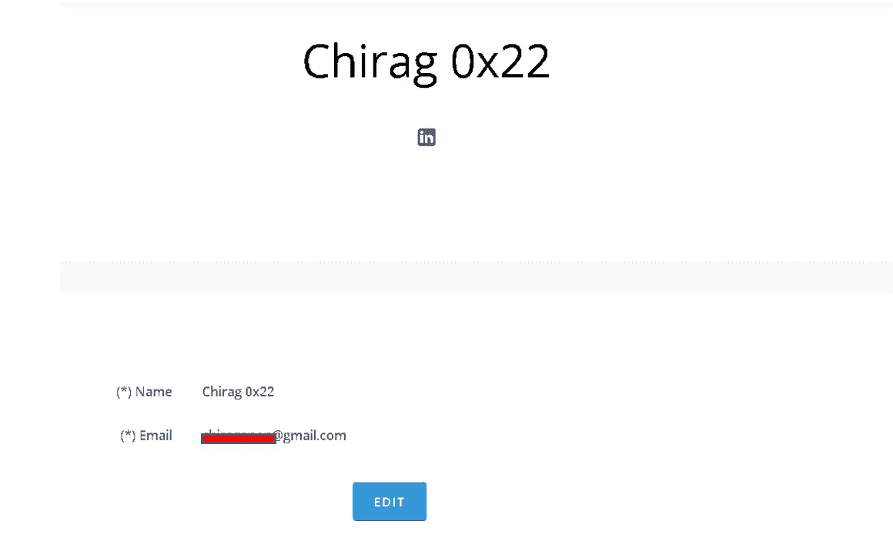
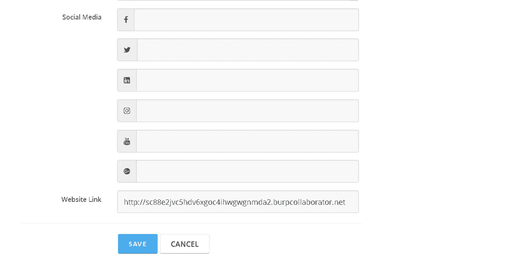
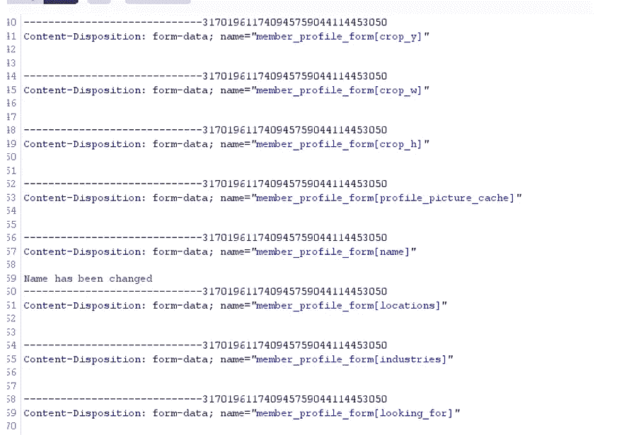
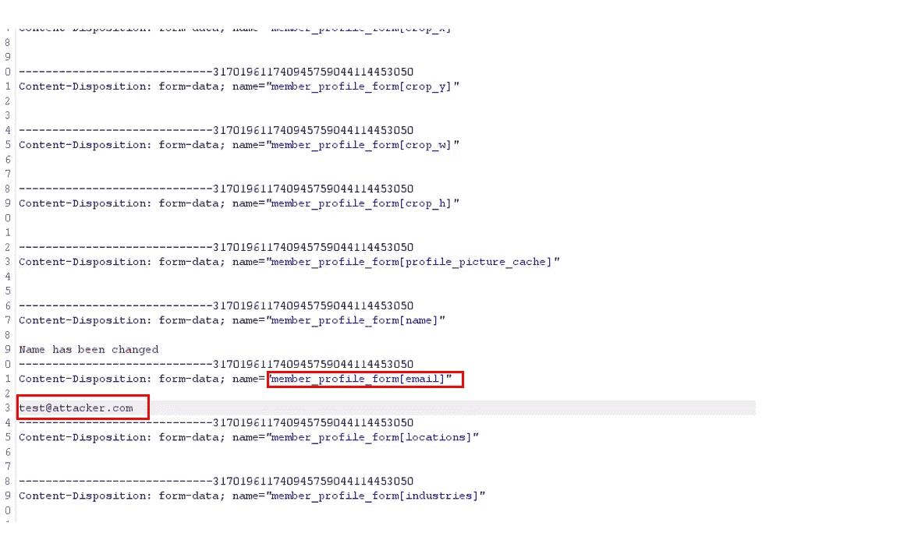
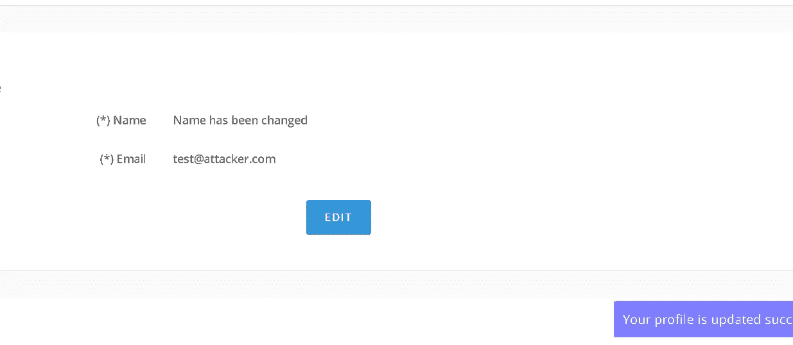
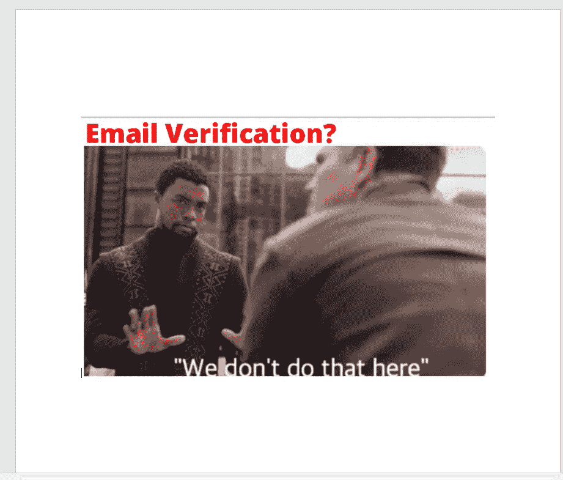

# 电子邮件验证旁路-一个奇怪的情况！

> 原文：<https://infosecwriteups.com/email-verification-bypass-a-strange-case-f38291866126?source=collection_archive---------1----------------------->

嘿，你好啊，黑客朋友们，希望你们安全，并利用这段时间(WFH 或在线课程)增长知识。所以今天我要分享另一个有趣的发现，我能够绕过电子邮件验证。目标是一个基于大众融资的项目，但没有 bug 奖金项目，但我还是选择了它来练习和测试我的技能。所以我们假设它是 redacted.com。你准备好了吗？我们开始吧。

所以目标只有一个域，没有子域，所以我选择只测试主域的所有功能。它有一个正常的注册，电子邮件验证和登录系统，像往常一样，我玩了所有这些，但没有什么有趣的发现。过了一会儿发现一些开放的重定向，存储 XSS 通过个人资料图片上传，EXIF 的事情和其他一些低挂水果。

但电子邮件验证是我想玩的东西，我想无论如何绕过它。因此，在测试时，我导航到仪表板，然后编辑个人资料部分，并检查是否有任何选项来更改电子邮件。不幸的是，没有选择这样做，我只能改变姓名，地址，网站链接等细节...

所以我决定测试一下这个流程，所以在更改我的名字后，在打嗝中捕获了这个请求，它看起来如下

你和我想的一样吗？为了保存我的名字，它被存储在名称参数和电子邮件是什么？它被藏起来了…没问题！！

我注意到 317096…这是在每个参数都在请求中添加了一些内容以将电子邮件(隐藏参数)更改为 test@attacker.com 后使用的真实性令牌，该请求如下所示

转发了请求然后嘣嘣！！！

然后，为了验证它是否成功，我注销并用新的 test@attacker.com 邮件 id 和相同的密码登录，我成功登录。

我知道你会说，我可以通过将邮件更改为已经注册的受害者的邮件来尝试帐户接管，但这在这个目标上不起作用。但是我建议你做两个测试账户，做同样的事情，如果是的话，也许你的目标会成功

这就是今天的全部内容，我希望你能学到一些有用的知识。如果是的话，别忘了鼓掌并在 [**Twitter**](https://twitter.com/ChiragSoni404) 上与我联系(Dm 永远开放)。

结束！！！和平