# 企业:来自 TryHackMe 的活动目录室

> 原文：<https://infosecwriteups.com/enterprise-active-directory-room-from-tryhackme-87f8738efc96?source=collection_archive---------3----------------------->

你刚刚登陆了一个内部网络。你扫描网络，只有域控制器…

从标语来看，我们知道将会有一些我们必须处理的活动目录。

初始枚举:

让我们从 OG nmap 扫描开始，你可以使用任何你喜欢的东西。

命令:

```
sudo nmap -sC -sV -p- --min-rate 2000 <IP-ADRESS> | tee nmap.md
```

解释:

*   -sC:在所有打开的端口上执行默认脚本扫描。
*   -sV:在所有打开的端口上执行版本扫描。
*   -p-:扫描 1- 65535 范围内的所有端口
*   —最小速率:增加速率


NMAP 扫描

哇哦。信息太多了，让我们一条一条地分解。

ladp 给了我们“企业”这个域名。THM”。让我们将它添加到/etc/hosts 文件中。

我们在端口 80 有一个网络服务器。让我们参观它。

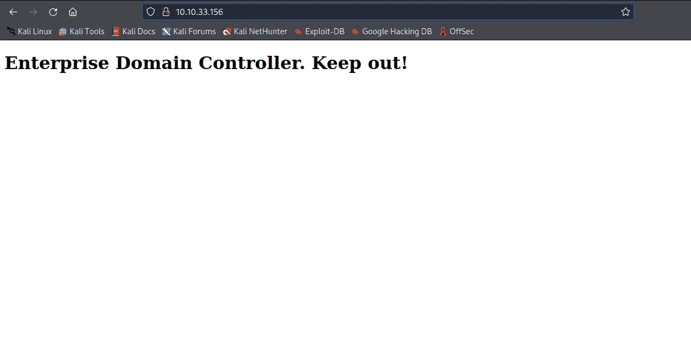

登录页面。

我们可以尝试找到隐藏的目录。

目录扫描:

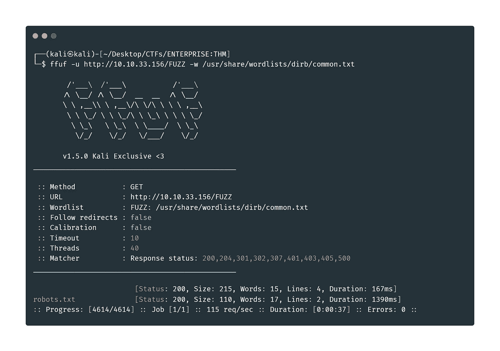

FFUF

我们去看看，也许能找到些什么。

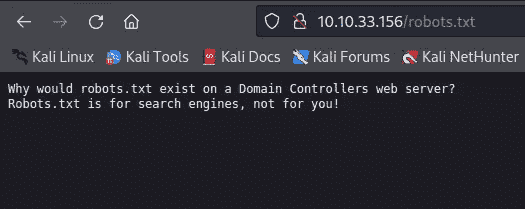

Robots.txt

嗯，我没想到。

至此，我知道 web 服务器不是正确的路径。让我们列举更多的服务。

我们在目标上打开了 Smb 端口。让我们试着列举一下，也许我们能找到一些份额。

**SMB 枚举:**

我们可以尝试许多工具，例如

*   SMB 客户端
*   Smbmap
*   Enum4linux
*   Crackmapexec

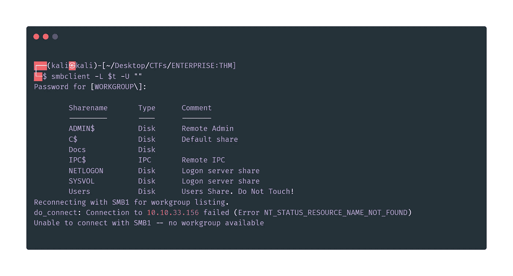

分享

有一个有趣的共享名为用户让我们连接到它。

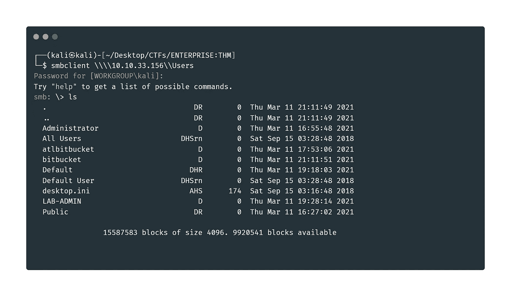

分享

任何目录中都没有什么有用的东西。


Enum4linux

Enum4linux 也没有给我们任何其他有用的信息。

让我们试试 crackmapexec

我们得到了目标的域名、名称和操作系统版本。

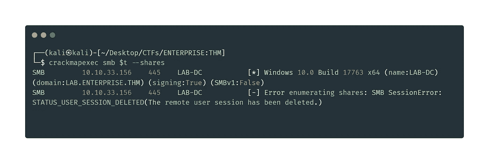

再次拒绝访问

我们没有获得对可写共享的任何访问权限，让我们尝试列举其他服务

让我们试着用 kerbrute 获得有效的用户名:

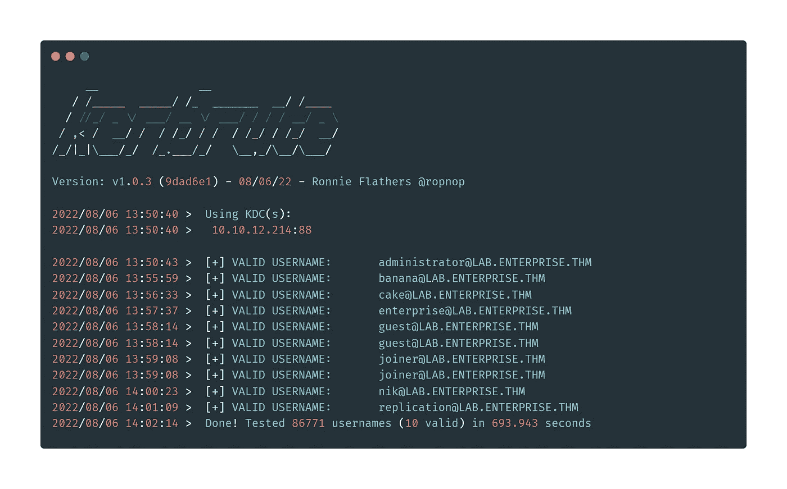

克尔布鲁特

回头看看 nmap，我们看到 LDAP 是开放的，我们可以。

**LDAP 枚举:**

我们可以针对端口 389 运行一些 nmap 脚本来获得更多信息。

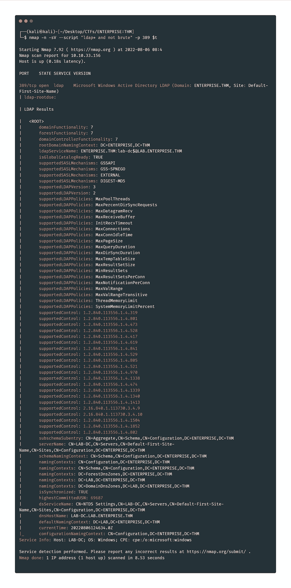

Nmap 脚本扫描

将找到的域添加到/etc/hosts 文件中。

此时，我跌到了谷底。但是让我们试着看看我们错过了什么。

回头看 nmap 扫描，我看到另一个端口运行 web 服务器。


端口 7990 上的 HTTP:

让我们通过端口 7990 访问网络:


ATLASSIAN 登录页面

它需要一封电子邮件才能继续。有一个提醒 Enterprise-THM 的员工，他们正在转移到 Github。这可能是一个提示。让我们在 Github 上搜索 Enterprise-THM。

老实说，一开始我并没有注意这张纸条。但迟做总比不做好。

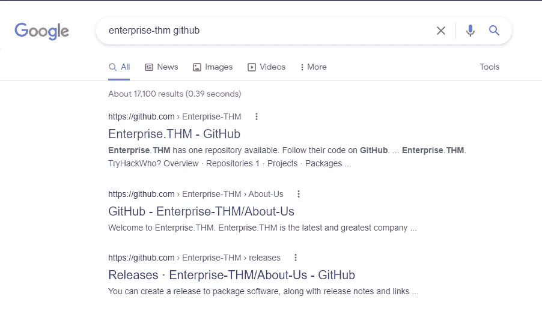

OSINT

有趣的是，Github 上有一个 Enterprise-THM 知识库。我们可以在这个仓库里找到一些秘密。

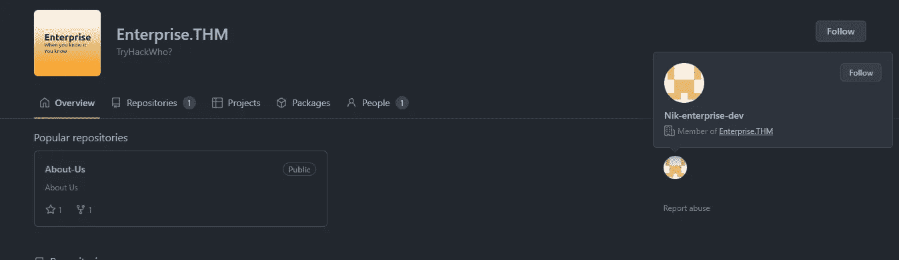

Github 回购

我们可以在这个回购里看到一个员工。

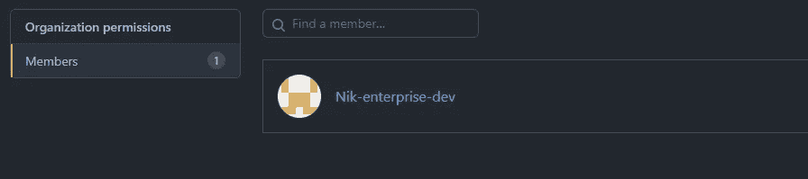

员工帐户

进一步查看后，我发现了一个 PowerShell 脚本。在之前的脚本历史中，我找到了一些凭据。

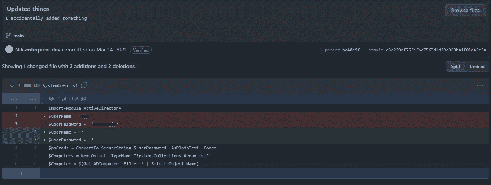

Creds

让我们把那记下来。

我们现在有了用户 Nik 的凭据，让我们看看该用户是否有任何关联的 SPN 票证。

# Kerberoasting 认证:

Kerberoasting 认证是一种利用后攻击技术，它试图泄露 Active Directory 服务帐户(AD)的密码。在这种攻击中，攻击者伪装成具有服务主体名称(SPN)的帐户用户，请求具有加密密码或 Kerberos 的票据。

**Impacket GetUserSPN.py:**

我们可以使用 impcket 的 GetUserSPN.py 来 kerbroast 用户 Nik。

语法:

```
GetUserSPNs.py <domain_name>/<domain_user>:<domain_user_password>   -request -outputfile <output_TGSs_file>
```

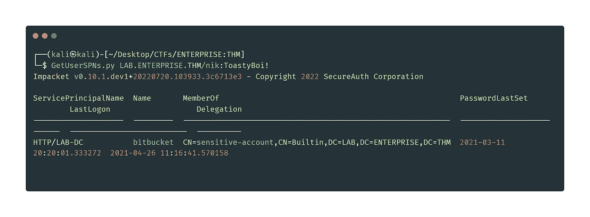

我们可以看到 Nik 有一个名为 bitbucket 的服务主体集，我们在共享中也看到了它。所以让我们请求它。

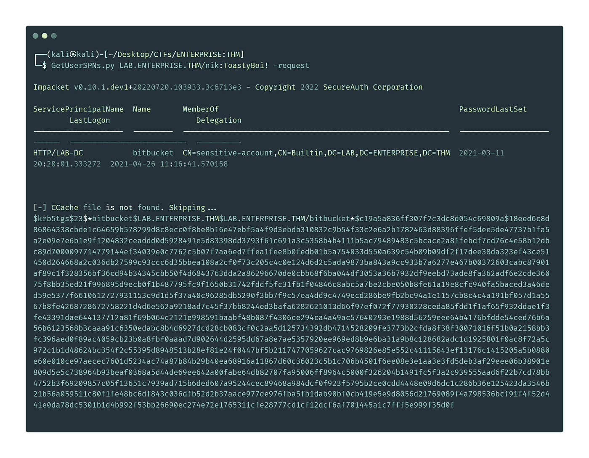

让我们使用 hashcat 或 john 来破解 hash。

语法:

```
hashcat -m 13100 --force <TGSs_file><passwords_file>john --format=krb5tgs --wordlist=<passwords_file><AS_REP_responses_file>
```

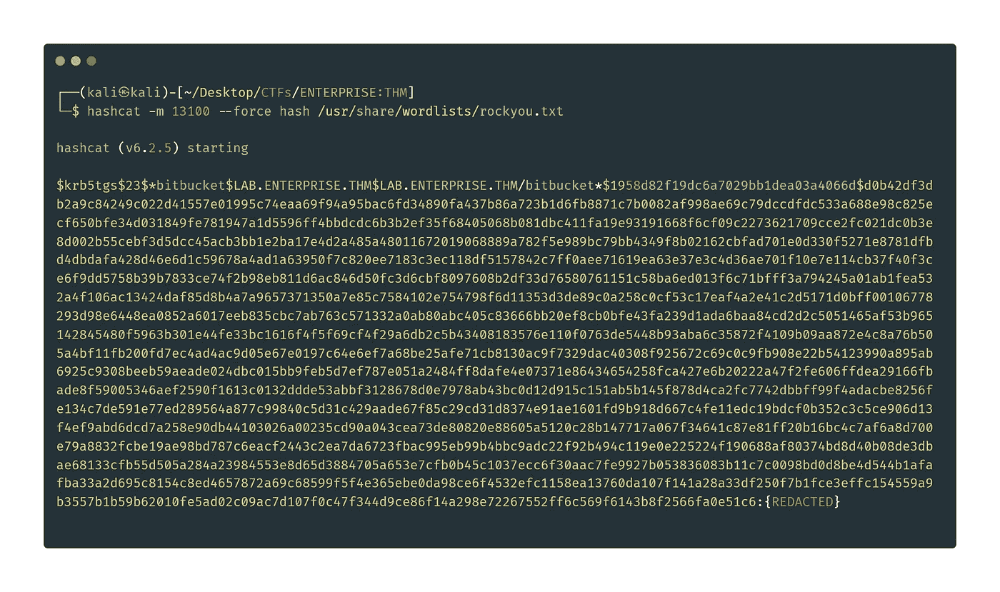

哈希卡特

现在我们得到了密码，让我们尝试通过 Evil 登录-winrm == >失败

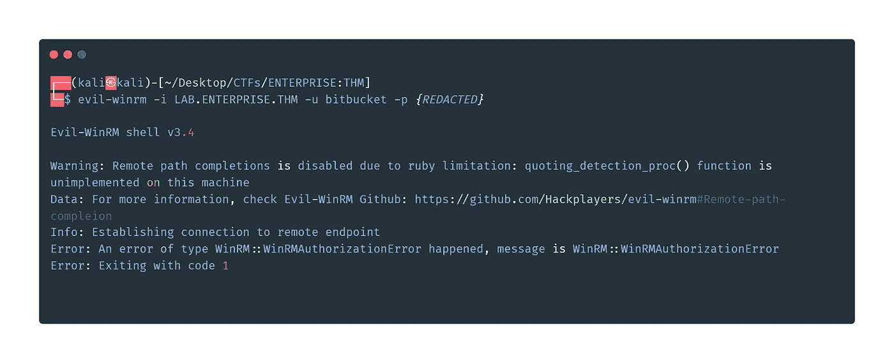

邪恶-winrm

让我们试试 RDP。

我们可以使用 xfreerdp 来获得远程访问:

```
xfreerdp /v:LAB.ENTERPRISE.THM /u:bitbucket /p:{PASSWORD}
```

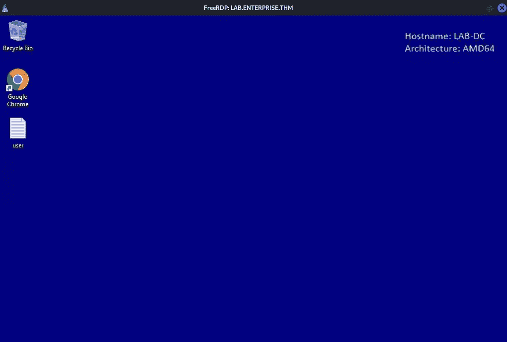

RDP

我们可以在桌面上得到 user.txt。

**权限提升:**

让我们看看盒子上的 winPEAS.bat。

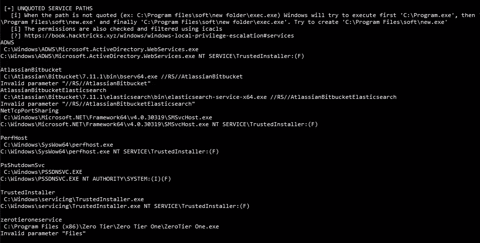

winPEAS.bat

我们可以看到 zerotireoneservice 容易受到**未引用路径服务的攻击。**

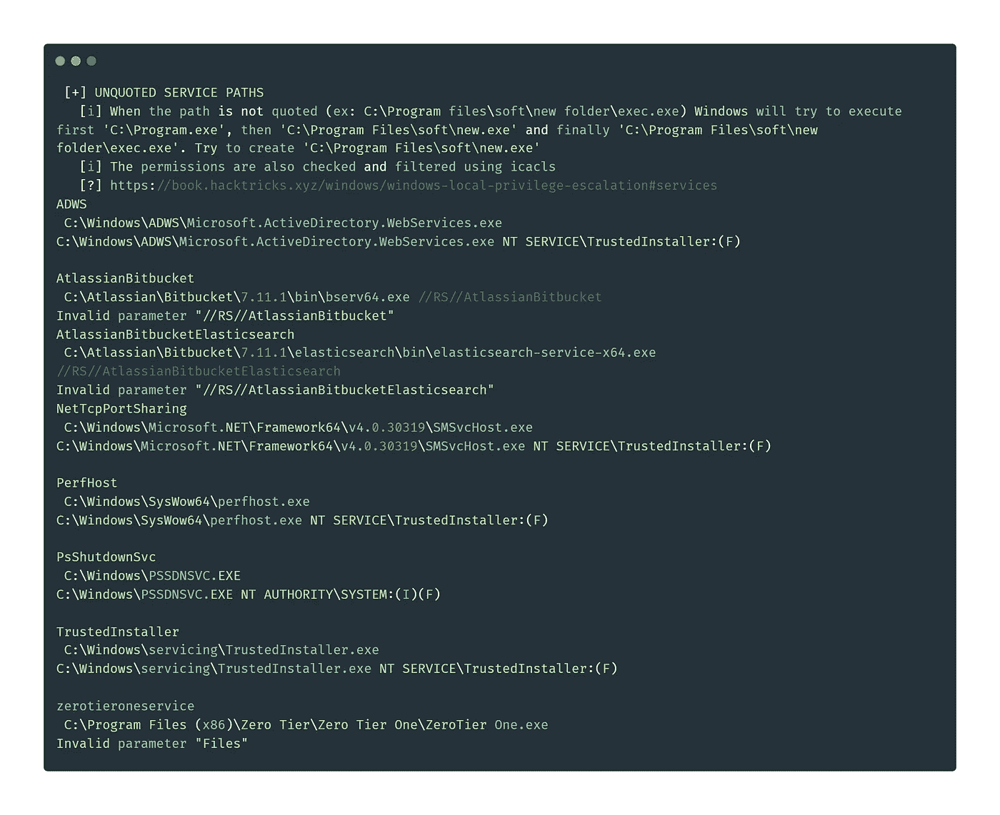

Winpeas 结果

让我们生成 msfvenom 有效载荷。我们将使用的有效载荷是

```
windows/meterpreter/reverse_tcp
```

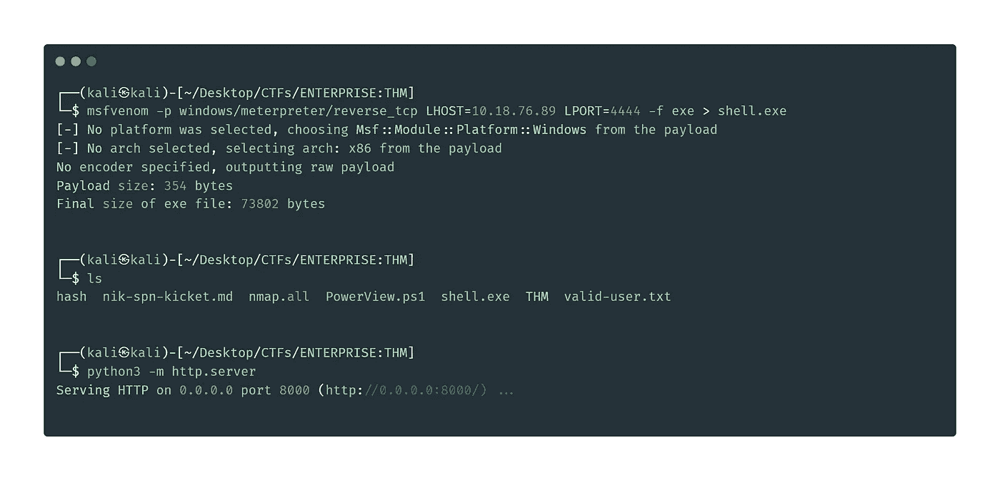

有效载荷

将您的目录更改为“C:\Program Files (x86)\Zero Tier”并传输您的有效负载。

确保您的 shell 名称为 Zero.exe。

另一方面，也要设置好你的听众。

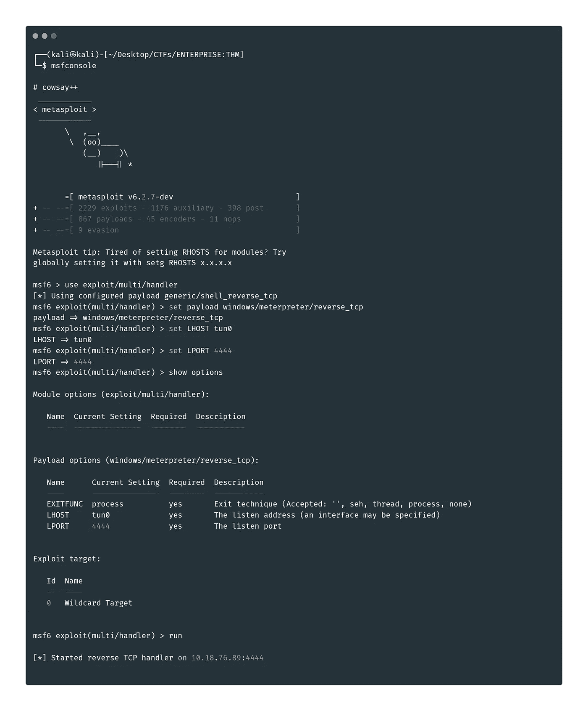

现在只需停止并启动服务。

```
Stop-Service -Name "zerotieroneservice"To start The Service Start-Service -Name "zerotieroneservice"
```

我们会得到这个内脏的外壳，它会在几秒钟内死去。

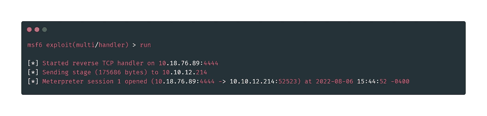

壳

为了防止这种情况，我们需要迁移流程。

试了几次后，winlogon.exe 的效果最好。


根深蒂固的

这是一个很棒的盒子。希望你们都喜欢。

我将发布更多与活动目录相关的房间。

所以在那之前。

*来自 Infosec 的报道:Infosec 上每天都会出现很多难以跟上的内容。* [***加入我们的每周简讯***](https://weekly.infosecwriteups.com/) *以 5 篇文章、4 个线程、3 个视频、2 个 Github Repos 和工具以及 1 个工作提醒的形式免费获取所有最新的 Infosec 趋势！*