# GCP 环境中的计数和横向运动

> 原文：<https://infosecwriteups.com/enumeration-and-lateral-movement-in-gcp-environments-c3b82d342794?source=collection_archive---------0----------------------->

这篇文章是关于我们做的一个 pentest，在这个测试中，我们使用 GCP 本地工具来实现情景感知和横向移动，成功地折衷了混合 GCP 托管的基础架构。

在我们继续之前，我想声明我们没有想到很多我将要解释的东西，它们可以在两篇优秀的文章中找到。一篇来自 [Gitlab 的红队](https://about.gitlab.com/blog/2020/02/12/plundering-gcp-escalating-privileges-in-google-cloud-platform/)，另一篇来自[媒体博客](https://medium.com/@tomaszwybraniec/google-cloud-platform-pentest-notes-service-accounts-b960dc59d93a)作者[托马斯 W.](https://medium.com/u/37464751a36c?source=post_page-----c3b82d342794--------------------------------) 我推荐在继续之前阅读这两篇文章！

# 最初的妥协

我将简要介绍我们是如何在公司网络中立足的。在进行了初步的侦察，并在范围内收集了感兴趣的 ip 后，对相邻 IP 地址空间的激烈扫描返回了一个 [scriptcase 服务器](https://www.scriptcase.net/)(我们后来确认这是有人在测试后忘记删除的阴影云)。

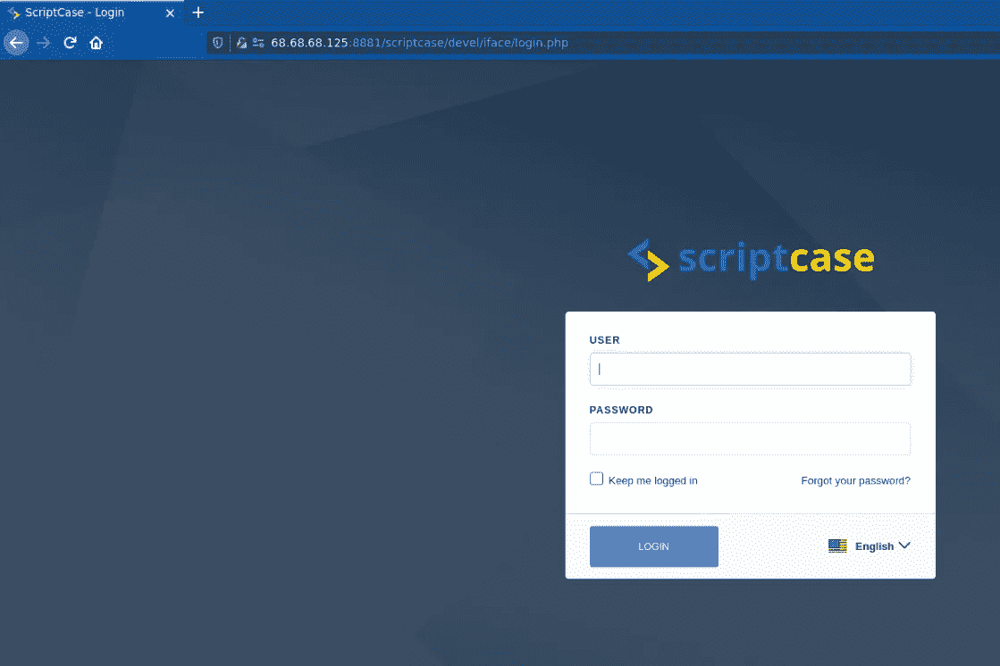

(在任何人试图访问之前，出于隐私原因，ip 地址和端口已被更改)

在强制服务一段时间后，我们发现了 admin 帐户的琐碎凭证，并能够从实例内部运行回调脚本。

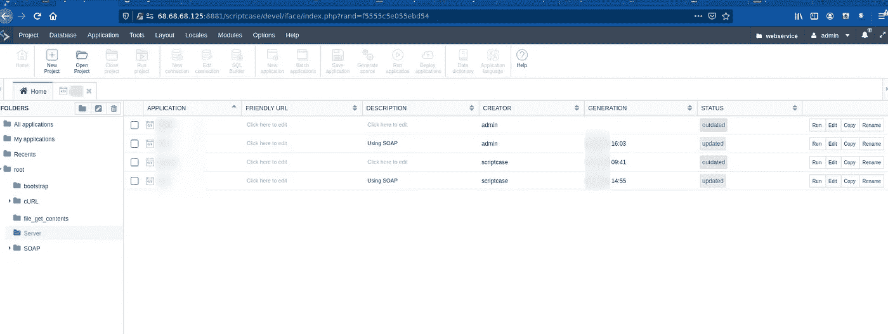

我不打算详细说明，因为 pentest 的这一部分对客户来说是独一无二的，对读者来说可能没什么用处。

# 枚举和权限提升

我们使用运行 scriptcase 服务的守护程序帐户登录到该实例。每当您在特定的云环境中着陆时，使用环境提供的本机工具来执行初始枚举总是一个好主意(例如 aws 中的 aws-cli 提供的 aws 二进制文件，或者 GCP 的 gcloud/gutils)。这是我们首先尝试的事情之一。

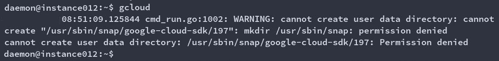

哼。首要问题。似乎守护程序帐户没有权限创建运行 gcloud 二进制文件所需的大量文件夹。也许我们应该尝试手动下载二进制文件，并从 tmp 文件夹中运行它。让我们检查一下我们的帐户是如何在/etc/passwd(默认 shell、主目录等)上配置的..).

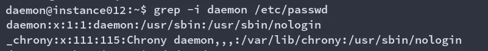

这是需要解决的问题。我们的缺省 shell 是 nologin(这是大多数服务帐户的标准，因为它们不打算交互使用)，我们的主目录是/usr/sbin，我们不能访问它(否则提升我们的特权是微不足道的)。gcloud 二进制文件需要一个主文件夹来创建我们的配置文件，所以让我们给它一个主文件夹并手动运行独立的安装程序。

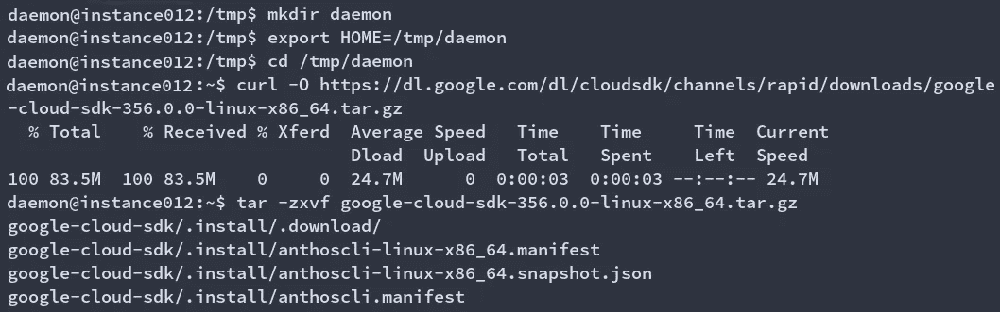

设置我们的家和下载 gcloud。

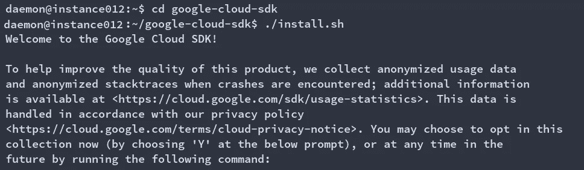

正在安装二进制文件。

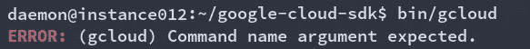

Gcloud 已成功安装。

成功！这涉及到几个步骤，但我们设法让 GCP 的本地工具在一个有点受限的环境中工作。

现在我们已经可以访问二进制文件了，让我们尝试枚举我们的服务帐户角色。重要的是要记住，无论何时在 GCP 创建一个实例，它都需要有一个关联的服务帐户，因此默认情况下会为您创建一个。我们可以列举我们的角色:

```
PROJECT=$(curl http://metadata.google.internal/computeMetadata/v1/project/project-id -H “Metadata-Flavor: Google” -s)
ACCOUNT=$(curl http://metadata.google.internal/computeMetadata/v1/instance/service-accounts/default/email -H “Metadata-Flavor: Google” -s)
gcloud projects get-iam-policy $PROJECT --flatten=”bindings[].members” --format=’table(bindings.role)’ --filter=”bindings.members:$ACCOUNT”
```

(如果您使用的是本地安装的二进制文件，记得替换您的 gcloud 路径:例如/tmp/Google-cloud-SDK/bin/g cloud)

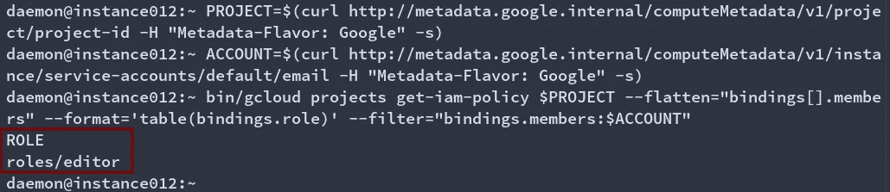

编辑者角色是与服务帐户相关联的默认角色，它允许拥有特权。让我们尝试修改实例元数据来注入 ssh 密钥(这种方法默认在我在开头链接的 gitlab 文章中解释)。首先，让我们检查一下是否已经有一些我们可以替换的用户密钥。让我们用

```
INSTANCEID=$(curl http://metadata.google.internal/computeMetadata/v1/instance/id -H “Metadata-Flavor:Google” -s)
FULLZONE=$(curl http://metadata.google.internal/computeMetadata/v1/instance/zone -H “Metadata-Flavor: Google” -s)
gcloud compute instances describe $INSTANCEID --zone $FULLZONE
```

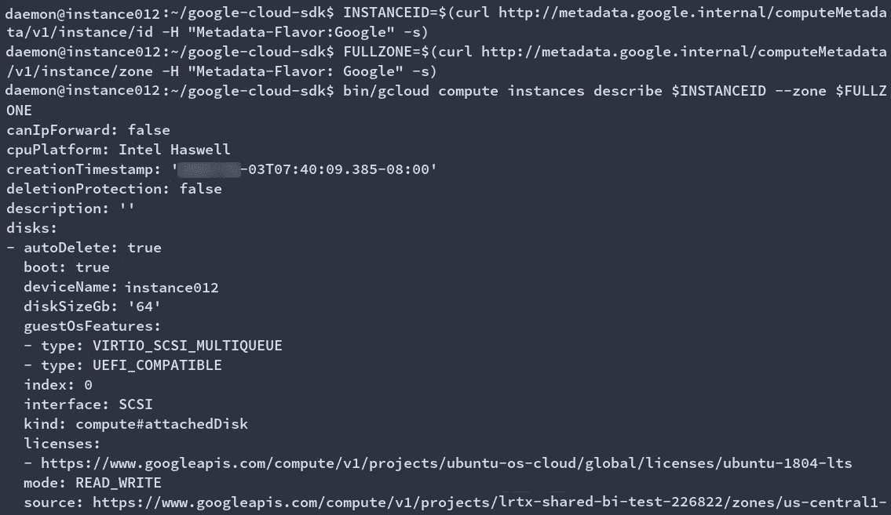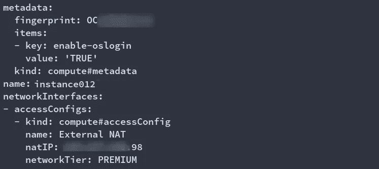

这个实例元数据中似乎没有任何 ssh 密钥。仅供参考，这是取自项目中另一个实例的外观:

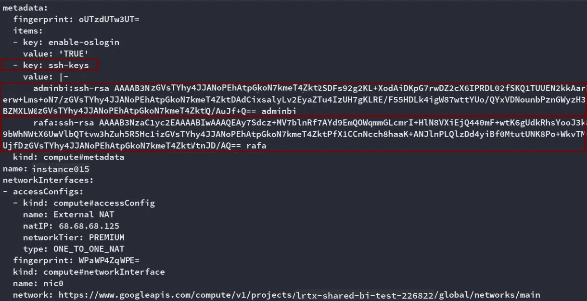

(钥匙也换了，别激动)

在两个图像中，我们都有一点重要的信息:下面一行指定正在使用 oslogin:

```
-key: enable-oslogin 
```

我们稍后将回到这一点。现在，让我们尝试将我们的键注入实例元数据:

```
ssh-keygen -t rsa -C “shenanigans” -f ./key -P “” && cat ./key.pub
gcloud compute instances add-metadata instance012 --metadata-from-file ssh-keys=meta.txt
```

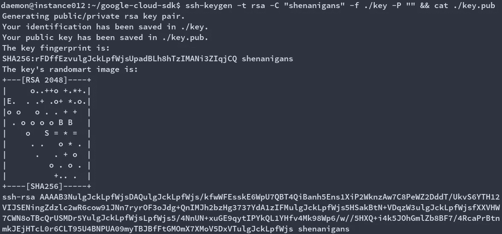

创造我们的钥匙。

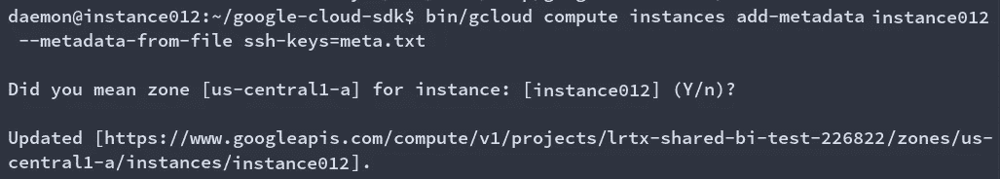

将它们注入到我们的元数据中。


尝试一下。

我们发现的第二个问题是。我们的 ssh 密钥似乎不起作用。让我们验证它们是否存在:

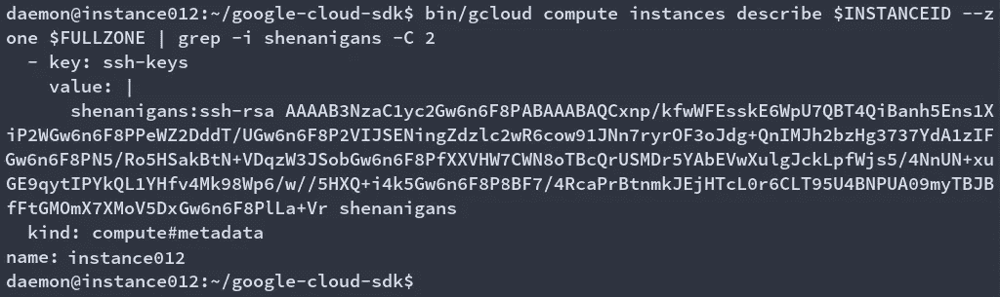

是的，都在那里。一定还有别的东西阻止我们登录。还记得我们说过操作系统登录很重要吗？嗯，这家公司为 ssh 登录配置了强制的 2FA，我们没有为我们的帐户创建第二个因子。我们需要找到绕过它的方法。如果你关注过 Gitlab 的文章，他们解释说 2FA 的要求对于服务账户是不强制的。请记住，我们是作为 gcloud compute instance 服务帐户运行的(您可以使用 auth 命令查看是哪个帐户):

```
gcloud auth list
```

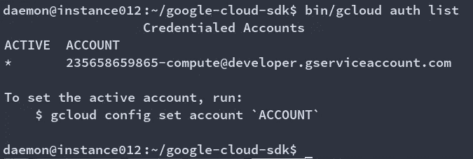

GCP 的另一个很酷的特性是，从 compute API 运行 ssh 命令将为您的服务帐户创建密钥，将它们注入目标实例(在本例中是 localhost ),并允许您加入 sudoers 组，所有这些都是默认的。让我们试一试:

```
gcloud compute ssh $INSTANCENAME
```

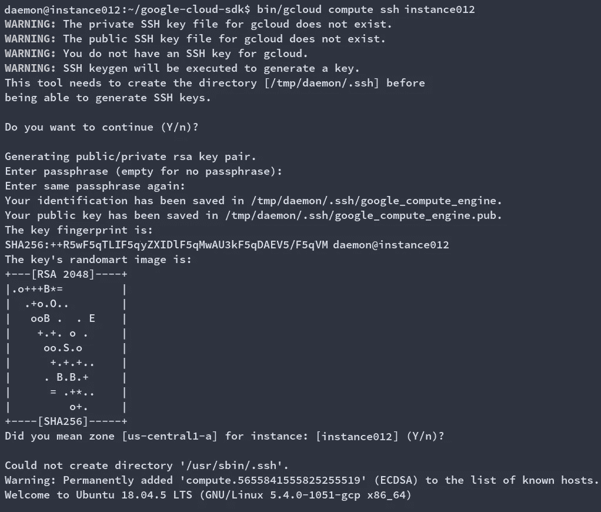

创造我们的钥匙并注入它们

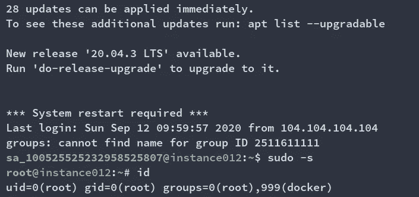

我们成功地提升了我们的特权。现在，让我们横向移动。

# 横向运动

我们可以从列举项目中的实例开始:

> *gcloud 计算实例列表*


ssh 命令应该也适用于其他实例。

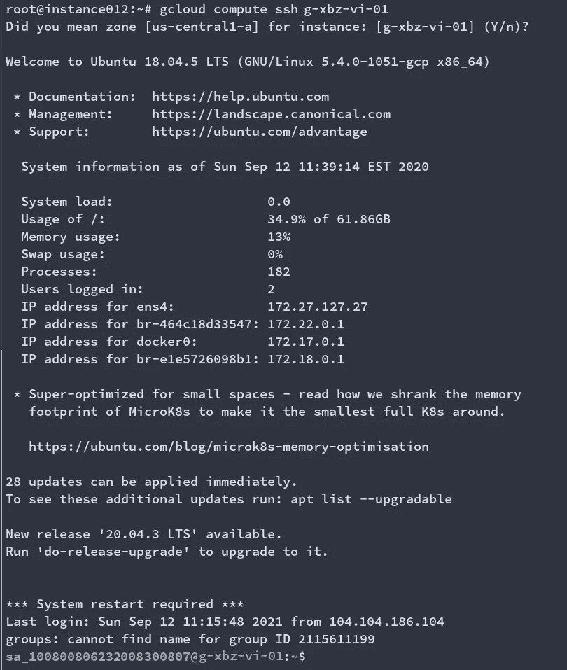

一个实例完成了，还有三个

但是由于某种原因，部分实例没有响应我们的 ssh 命令:

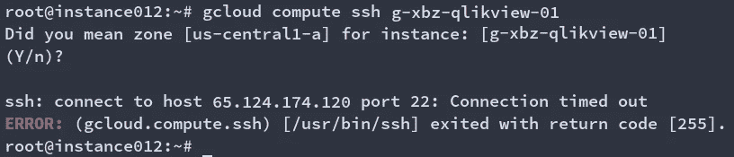

在做了一个快速的端口扫描后，我们发现这个项目既有 Linux 机器也有 Windows 机器。

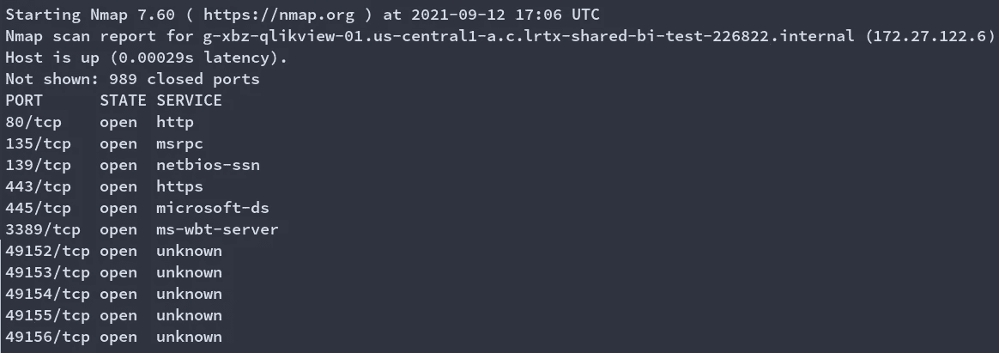

这是一个简单的故障诊断，但是扫描实例并不总是确定其操作系统的最佳方式。你可能正在执行一个红队任务，并且可能有一个 IDS 监视扫描。您可能手头没有 nmap(您可能只需要 telneting 连接端口或使用 socat 或类似工具，但这很不方便)。或者您可能希望自动化该过程的某个部分。无论哪种方式，我们试图通过谷歌的 API 找到查询的方法，没有简单的方法可以做到这一点，除非你非常幸运地为你启用了 alpha compute API(我们从未见过 IRL)。

幸运的是，有一个变通办法:当您查询实例信息时，您可以从 JSON 结果中获得的参数之一是许可信息。这应该允许您推断出实例 OS。我们可以使用以下内容对此进行查询:

```
INSTANCES=$(gcloud compute instances list — format=json | jq -r .[].name)
ZONE=$(curl http://metadata.google.internal/computeMetadata/v1/instance/zone -H “Metadata-Flavor: Google” -s | cut -d/ -f4)
for i in $(echo $INSTANCES); do echo “$i:” && gcloud compute instances describe g-shr-scriptcase-01 --zone $ZONE --format=json | jq -r .disks[].licenses[] | rev | cut -d / -f 1 | rev && echo; done
```

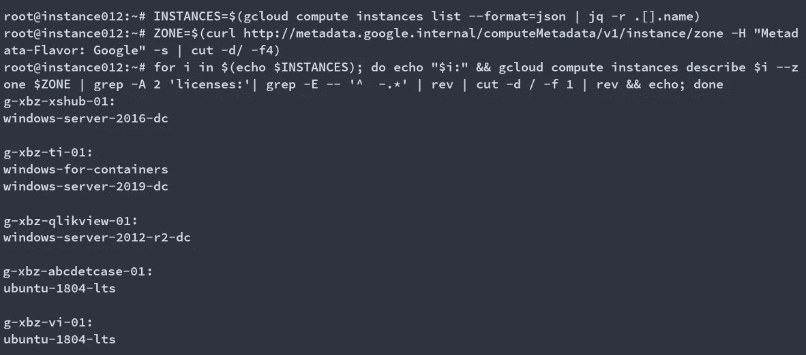

基于许可记录枚举操作系统信息

了解一个实例的操作系统是很重要的，但是我们如何真正转向 Windows 主机呢？我们有一个类似于“计算 ssh”的命令，但是是针对 windows 的。这在[托马什](https://medium.com/u/37464751a36c?source=post_page-----c3b82d342794--------------------------------) [篇](https://medium.com/@tomaszwybraniec/google-cloud-platform-pentest-notes-service-accounts-b960dc59d93a)上有解释。你能做到

```
gcloud compute reset-windows-password g-xbz-qlikview-01 --user=shenanigans
```

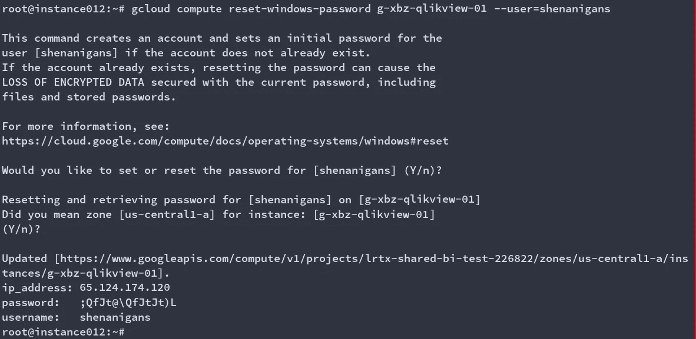

在 proxychains 上快速定义代理之后，我们应该能够使用新创建的用户 rdp 到实例中:

```
proxychains4 xfreerdp /u:shenanigans /p:’;QfJt@fJt\fJtHfJt4)L’ /v:172.21.31.8
```

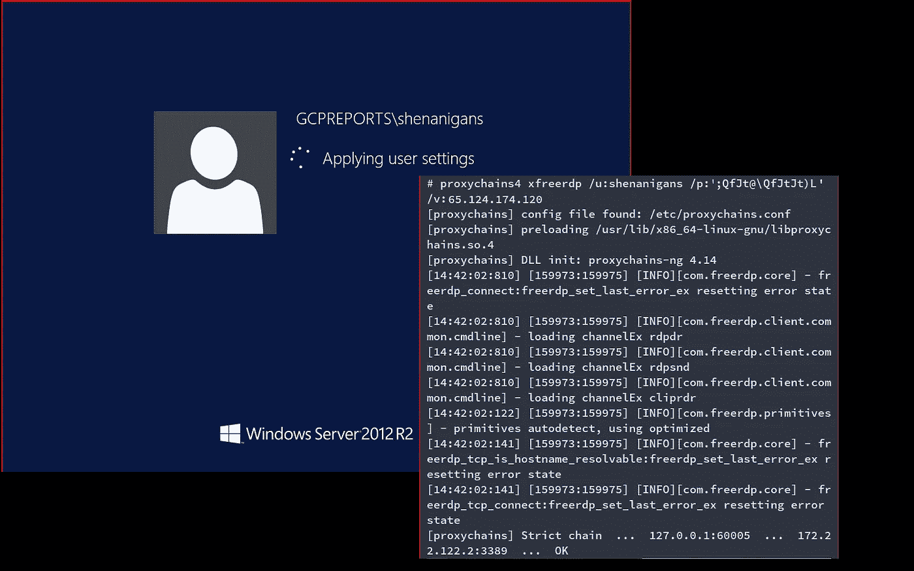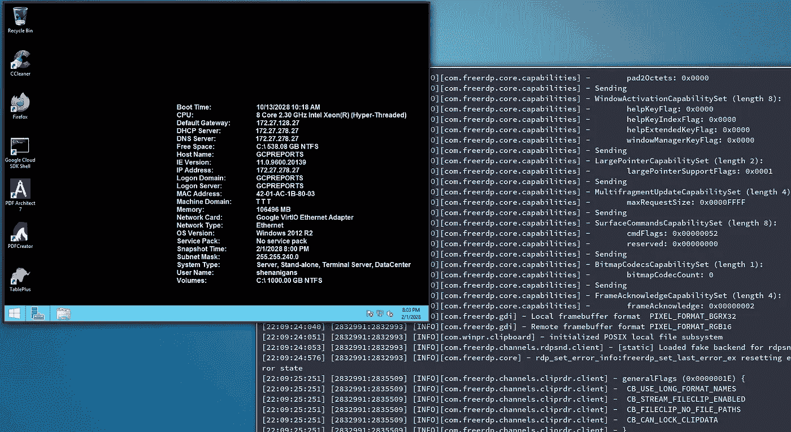

*黑客声音*“我们进来了”

# 结论

在设置您的云基础架构时，重要的是要意识到这样一个事实，即一些配置在默认情况下可能不是 100%安全的。在安全性和可用性之间总是有一场持续的斗争，有时天平倾向于后者。尤其是当默认情况下您有单个命令来执行以下操作时:

*   为您创建 ssh 密钥
*   将它们注入到目标实例中
*   将您的密钥添加到该实例
*   将您添加到 sudoers 组

(对于那些没有注意的人，这里是我所说的命令)

```
gcloud compute ssh $INSTANCENAME
```

我之前也提到过，但我想重申一下，我的这篇文章有很多参考资料，但其中两个最有用的是:

- [托马斯·w 的这些五旬节笔记](https://medium.com/@tomaszwybraniec/google-cloud-platform-pentest-notes-service-accounts-b960dc59d93a)
- [本文由克里斯·莫伯利](https://about.gitlab.com/blog/2020/02/12/plundering-gcp-escalating-privileges-in-google-cloud-platform/)撰写

去读读吧，它们很棒。