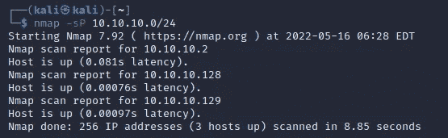
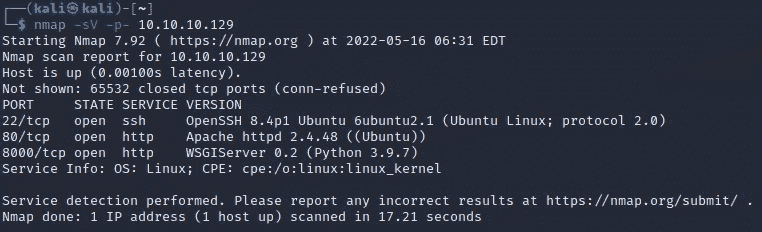
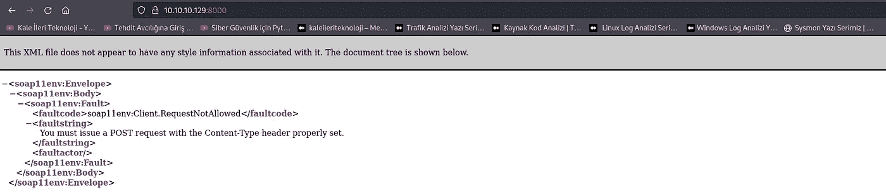
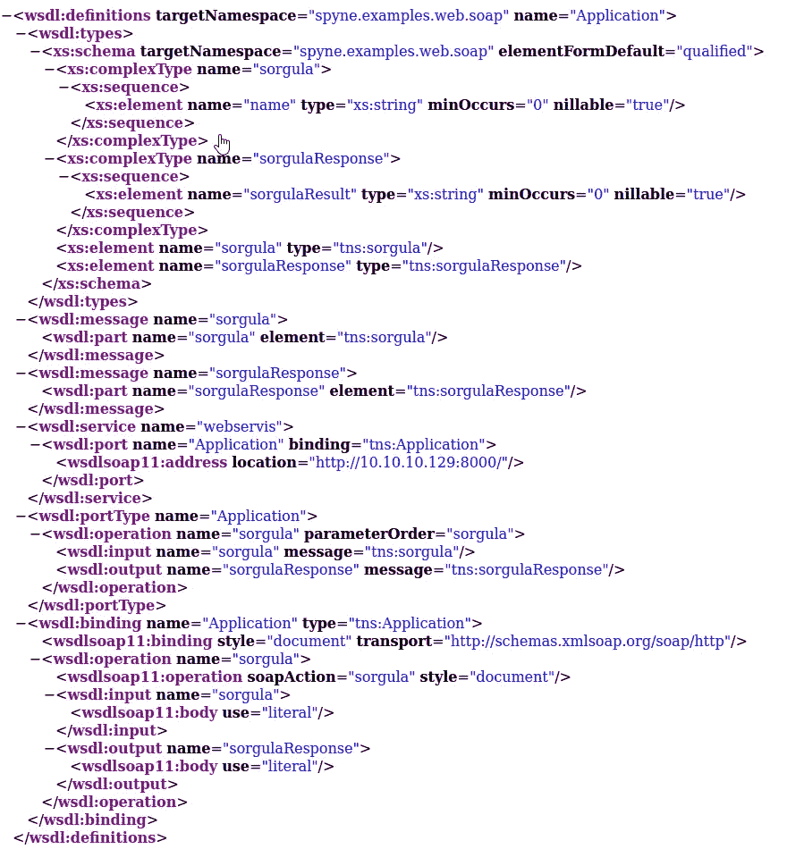
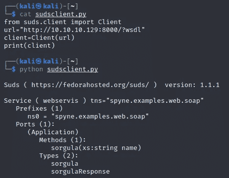
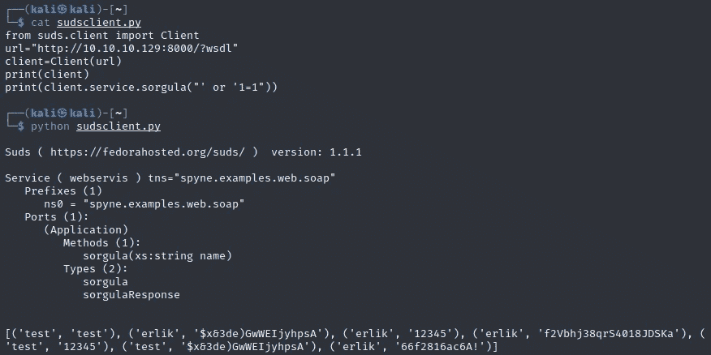
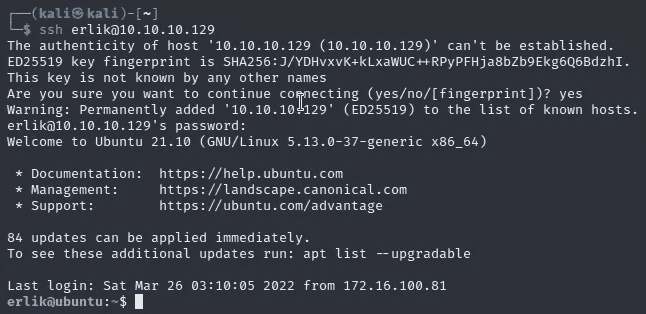
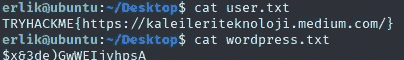
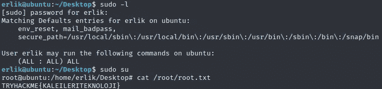

# Tryhackme Erlik 机器记录

> 原文：<https://infosecwriteups.com/erlik-machine-writeup-4565f27a5695?source=collection_archive---------2----------------------->

 [## 网络安全培训

### TryHackMe 是一个免费的学习网络安全的在线平台，使用动手练习和实验室，通过您的…

tryhackme.com](https://tryhackme.com/jr/erlikmachine) 

[https://tryhackme.com/jr/erlikmachine](https://tryhackme.com/jr/erlikmachine)

首先，让我们做一个 ping 扫描。

我们自己找 IP 地址来确定我们受害机的 IP 地址。

受害者 IP 地址:10.10.10.129

版本扫描是通过 Nmap 完成的。

我们看到的是 8000 端口。我们看到有一个 soap 服务。

我们正在查看 wsdl 链接。

同时，我们可以通过 python 使用 suds 模块来查看我们可以使用的方法。

我们为“sorgula”方法提供 sql 注入控制。

我们在列表中显示用户名和密码对。我们尝试用这个用户名和密码对登录系统。

让我们来查看 user.txt 文件。

我们使用“sudo -l”来列出用户权限或检查特定的命令。在我们使用“须藤素”之后。比我们查看 root.txt

