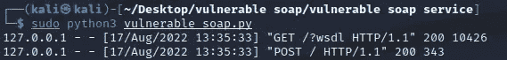
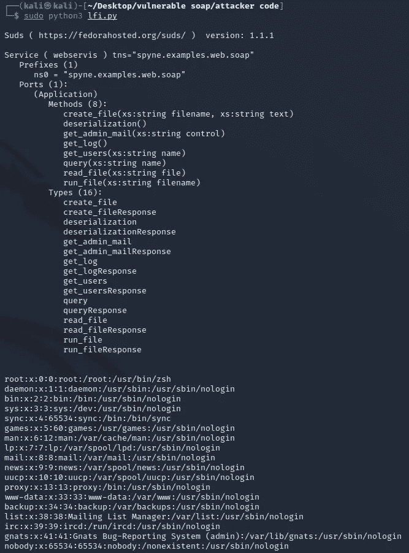
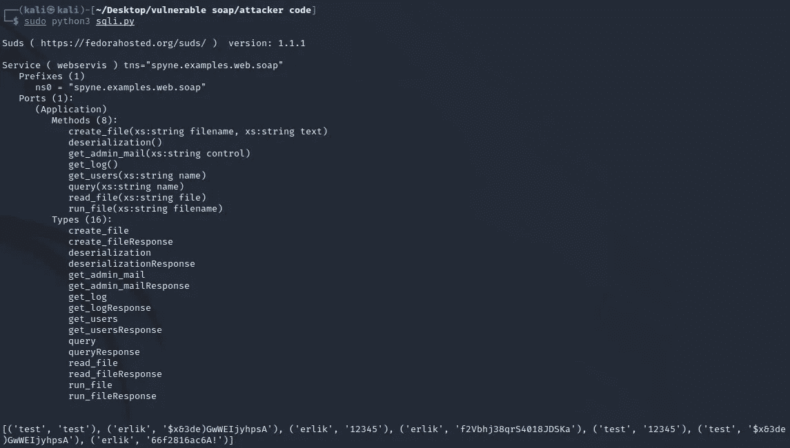
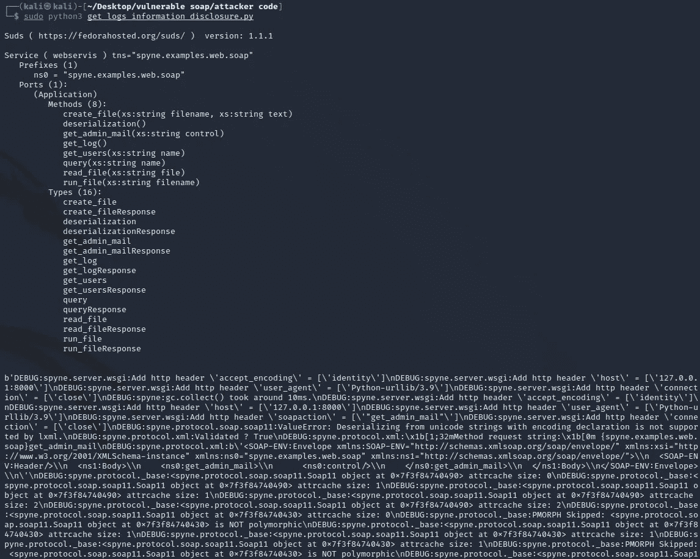
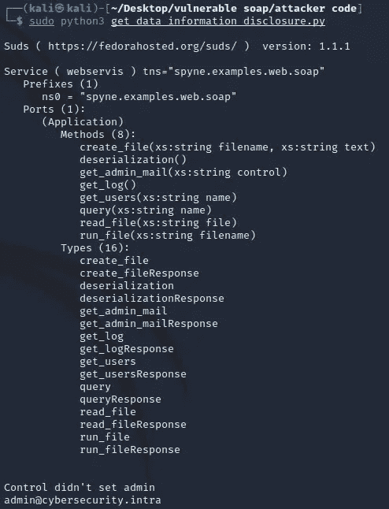
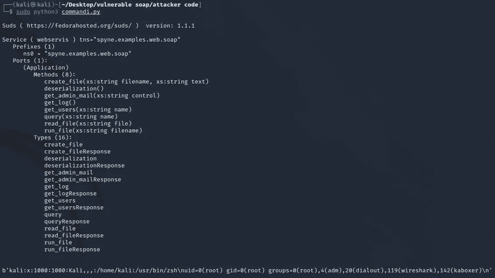
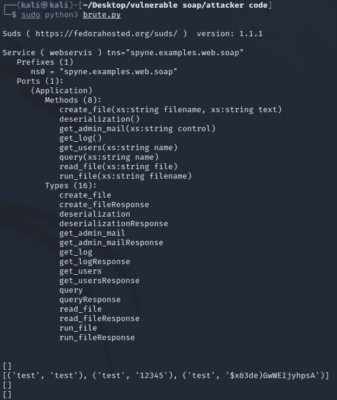
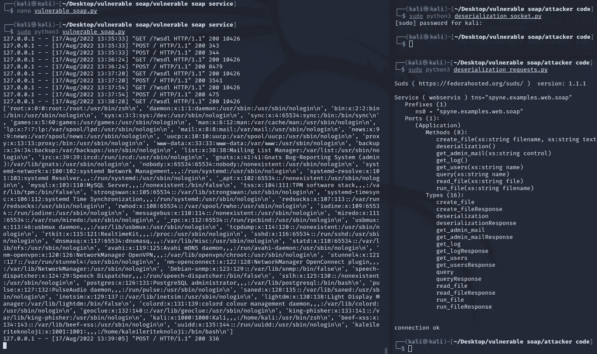

# Erlik —易受攻击的 SOAP 服务

> 原文：<https://infosecwriteups.com/erlik-vulnerable-soap-service-d0a71355058e?source=collection_archive---------3----------------------->

亚历克斯·丘马克在 [Unsplash](https://unsplash.com?utm_source=medium&utm_medium=referral) 上的照片

您可以通过下面的链接访问我写的易受攻击的 SOAP 服务。

 [## GitHub-Anil-yelken/Vulnerable-Soap-Service:Erlik-Vulnerable Soap Service

### Erlik —易受攻击的 Soap 服务测试— Kali 2022.1 sudo pip3 安装要求. txt sudo python 3 Vulnerable _ Soap . py…

github.com](https://github.com/anil-yelken/Vulnerable-Soap-Service) 

# 装置

sudo pip3 安装要求. txt

sudo python3 vulnerable_soap.py

# 脆弱点

# LFI

[https://github . com/Anil-yelken/Vulnerable-Soap-Service/blob/main/lfi . py](https://github.com/anil-yelken/Vulnerable-Soap-Service/blob/main/lfi.py)

# SQL 注入

[https://github . com/Anil-yelken/Vulnerable-Soap-Service/blob/main/sqli . py](https://github.com/anil-yelken/Vulnerable-Soap-Service/blob/main/sqli.py)

# 信息披露

[https://github . com/Anil-yelken/Vulnerable-Soap-Service/blob/main/get _ logs _ information _ disclosure . py](https://github.com/anil-yelken/Vulnerable-Soap-Service/blob/main/get_logs_information_disclosure.py)

[https://github . com/Anil-yelken/Vulnerable-Soap-Service/blob/main/get _ data _ information _ disclosure . py](https://github.com/anil-yelken/Vulnerable-Soap-Service/blob/main/get_data_information_disclosure.py)

# 命令注入

[https://github . com/Anil-yelken/Vulnerable-Soap-Service/blob/main/commandi . py](https://github.com/anil-yelken/Vulnerable-Soap-Service/blob/main/commandi.py)

# 蛮力

[https://github . com/Anil-yelken/Vulnerable-Soap-Service/blob/main/brute . py](https://github.com/anil-yelken/Vulnerable-Soap-Service/blob/main/brute.py)

# 反序列化

[https://github . com/Anil-yelken/Vulnerable-Soap-Service/blob/main/deserialization _ socket . py](https://github.com/anil-yelken/Vulnerable-Soap-Service/blob/main/deserialization_socket.py)

[https://github . com/Anil-yelken/Vulnerable-Soap-Service/blob/main/deserialization _ requests . py](https://github.com/anil-yelken/Vulnerable-Soap-Service/blob/main/deserialization_requests.py)

来自 Infosec 的报道:Infosec 上每天都会出现很多难以跟上的内容。 [***加入我们的每周简讯***](https://weekly.infosecwriteups.com/) *以 5 篇文章、4 个线程、3 个视频、2 个 Github Repos 和工具以及 1 个工作提醒的形式免费获取所有最新的 Infosec 趋势！*